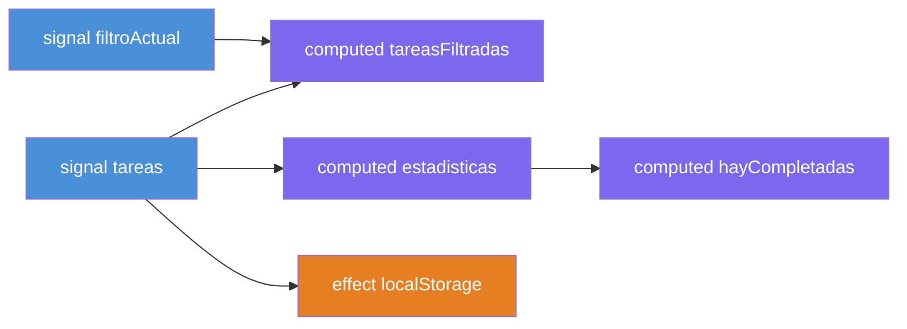

# Capítulo 20 - Parte 1: Gestión de estado local con Signals en componentes

> **Parte 1 de 4** · Capítulo 20 · PARTE X - Angular Signals: Reactividad Moderna

Llega el momento de aplicar todo lo aprendido a un problema concreto y cotidiano: gestionar el estado interno de un componente. Durante años, el patrón dominante fue el `BehaviorSubject` privado: creamos un subject, exponemos un observable derivado de él y lo consumimos con `async pipe`. Funciona, pero arrastra complejidad accidental. Veamos cómo Signals simplifica este escenario de forma drástica, sin perder expresividad ni capacidad.

## El problema con BehaviorSubject para estado local

Antes de mostrar la solución, es justo entender por qué el patrón anterior tiene fricción. Tomemos un componente de lista de tareas con filtro:

```typescript
// ANTES: patrón con BehaviorSubject (solo para referencia)
import { Component, OnDestroy } from '@angular/core';
import { BehaviorSubject, combineLatest, map, Subject, takeUntil } from 'rxjs';
import { AsyncPipe, NgFor, NgIf } from '@angular/common';
import { Tarea } from './tarea.model';

@Component({ selector: 'app-tareas-old', standalone: true, imports: [AsyncPipe, NgFor, NgIf], template: '' })
export class TareasOldComponent implements OnDestroy {
  private readonly destruir$ = new Subject<void>();
  private readonly _tareas$ = new BehaviorSubject<Tarea[]>([]);
  private readonly _filtro$ = new BehaviorSubject<'todas' | 'activas' | 'completadas'>('todas');

  readonly tareasFiltradas$ = combineLatest([this._tareas$, this._filtro$]).pipe(
    map(([tareas, filtro]) => filtro === 'todas'
      ? tareas
      : tareas.filter(t => filtro === 'completadas' ? t.completada : !t.completada)
    ),
    takeUntil(this.destruir$)
  );

  ngOnDestroy(): void {
    this.destruir$.next();
    this.destruir$.complete();
  }
}
```

Contamos el ruido: dos subjects, un `combineLatest`, un `Subject` para limpieza, `takeUntil`, `ngOnDestroy`. Para lógica que en esencia es "filtra este arreglo según este criterio". Con Signals, reducimos todo eso a unas pocas líneas declarativas.

## Reemplazar BehaviorSubject con signal()

El mismo estado con Signals es directo. Un Signal reemplaza al `BehaviorSubject` y su observable derivado al mismo tiempo: lo leemos como función y lo actualizamos con `.set()` o `.update()`.

```typescript
// tareas.component.ts
import { Component, signal, computed, effect } from '@angular/core';
import { FormsModule } from '@angular/forms';
import { Tarea } from './tarea.model';

type FiltroTarea = 'todas' | 'activas' | 'completadas';

@Component({
  selector: 'app-tareas',
  standalone: true,
  imports: [FormsModule],
  template: `
    <h2>Mis Tareas ({{ conteoActivas() }} activas)</h2>

    <div>
      <input [(ngModel)]="nuevaTarea" placeholder="Nueva tarea..." />
      <button (click)="agregarTarea()">Agregar</button>
    </div>

    <div>
      @for (opcion of opciones; track opcion) {
        <button (click)="filtroActual.set(opcion)">{{ opcion }}</button>
      }
    </div>

    <ul>
      @for (tarea of tareasFiltradas(); track tarea.id) {
        <li>
          <input type="checkbox"
                 [checked]="tarea.completada"
                 (change)="toggleTarea(tarea.id)" />
          {{ tarea.texto }}
        </li>
      }
    </ul>
    <p>Mostrando: {{ etiquetaFiltro() }}</p>
  `,
})
export class TareasComponent {
  readonly opciones: FiltroTarea[] = ['todas', 'activas', 'completadas'];

  // Estado primitivo
  readonly tareas = signal<Tarea[]>([]);
  readonly filtroActual = signal<FiltroTarea>('todas');
  nuevaTarea = '';

  // Estado derivado - se recalcula solo cuando cambia tareas o filtroActual
  readonly tareasFiltradas = computed(() => {
    const filtro = this.filtroActual();
    return filtro === 'todas'
      ? this.tareas()
      : this.tareas().filter(t =>
          filtro === 'completadas' ? t.completada : !t.completada
        );
  });

  readonly conteoActivas = computed(
    () => this.tareas().filter(t => !t.completada).length
  );

  readonly etiquetaFiltro = computed(() => {
    const mapa: Record<FiltroTarea, string> = {
      todas: 'todas las tareas',
      activas: 'tareas pendientes',
      completadas: 'tareas terminadas',
    };
    return mapa[this.filtroActual()];
  });
}
```

Desaparecieron el `BehaviorSubject`, el `combineLatest`, el `takeUntil` y el `ngOnDestroy`. El estado derivado con `computed()` es equivalente funcional del `pipe(map(...))`, pero sin la sobrecarga de suscripciones. Angular sabe exactamente cuándo recalcular cada `computed` porque rastrea las dependencias automáticamente.

## Completando el componente: mutaciones de estado

Agreguemos las acciones que modifican el estado. Notemos cómo `.update()` es perfecto para transformaciones basadas en el valor anterior:

```typescript
  agregarTarea(): void {
    const texto = this.nuevaTarea.trim();
    if (!texto) return;

    this.tareas.update(lista => [
      ...lista,
      { id: Date.now(), texto, completada: false } satisfies Tarea,
    ]);
    this.nuevaTarea = '';
  }

  toggleTarea(id: number): void {
    this.tareas.update(lista =>
      lista.map(t => t.id === id ? { ...t, completada: !t.completada } : t)
    );
  }

  eliminarCompletadas(): void {
    this.tareas.update(lista => lista.filter(t => !t.completada));
  }
```

El patrón `.update(fn)` con funciones puras es ideal aquí: recibimos el valor actual, devolvemos el nuevo. Inmutabilidad garantizada, Angular detecta el cambio.

## Efectos secundarios con effect()

Los efectos secundarios típicos del estado de un componente son: sincronizar con `localStorage`, emitir analíticas, hacer scroll, etc. Para eso existe `effect()`. No usemos `effect()` para derivar estado (para eso está `computed()`); solo para "hacer algo" cuando el estado cambia.

```typescript
import { Component, signal, computed, effect } from '@angular/core';

export class TareasComponent {
  // ... (señales anteriores)

  constructor() {
    // Persistir en localStorage cada vez que cambie la lista
    effect(() => {
      const listado = this.tareas();
      localStorage.setItem('mis-tareas', JSON.stringify(listado));
    });

    // Log de analítica cuando cambia el filtro
    effect(() => {
      const filtro = this.filtroActual();
      console.log(`[Analytics] Vista de tareas cambiada a: ${filtro}`);
    });
  }
}
```

Inicializamos el estado restaurando desde `localStorage` en el momento de crear las señales:

```typescript
  readonly tareas = signal<Tarea[]>(
    JSON.parse(localStorage.getItem('mis-tareas') ?? '[]') as Tarea[]
  );
```

## El patrón de "local store" completo

Reunamos todo en un componente realista. Este es el patrón que recomendamos para componentes con estado no trivial:

```typescript
// gestor-tareas.component.ts
import { Component, signal, computed, effect } from '@angular/core';
import { FormsModule } from '@angular/forms';
import { Tarea } from './tarea.model';

type FiltroTarea = 'todas' | 'activas' | 'completadas';

@Component({
  selector: 'app-gestor-tareas',
  standalone: true,
  imports: [FormsModule],
  templateUrl: './gestor-tareas.component.html',
})
export class GestorTareasComponent {
  // ── Estado primitivo ────────────────────────────────────────
  readonly tareas = signal<Tarea[]>(this.cargarDesdeStorage());
  readonly filtroActual = signal<FiltroTarea>('todas');
  textoCampo = '';

  // ── Estado derivado ─────────────────────────────────────────
  readonly tareasFiltradas = computed(() => {
    const f = this.filtroActual();
    const t = this.tareas();
    if (f === 'todas') return t;
    return t.filter(tarea => f === 'completadas' ? tarea.completada : !tarea.completada);
  });

  readonly estadisticas = computed(() => {
    const t = this.tareas();
    return {
      total: t.length,
      activas: t.filter(x => !x.completada).length,
      completadas: t.filter(x => x.completada).length,
    };
  });

  readonly hayCompletadas = computed(
    () => this.estadisticas().completadas > 0
  );

  // ── Efectos secundarios ─────────────────────────────────────
  constructor() {
    effect(() => {
      localStorage.setItem('mis-tareas', JSON.stringify(this.tareas()));
    });
  }

  // ── Acciones ────────────────────────────────────────────────
  agregar(): void {
    const texto = this.textoCampo.trim();
    if (!texto) return;
    this.tareas.update(l => [...l, { id: Date.now(), texto, completada: false }]);
    this.textoCampo = '';
  }

  toggle(id: number): void {
    this.tareas.update(l => l.map(t => t.id === id ? { ...t, completada: !t.completada } : t));
  }

  eliminarCompletadas(): void {
    this.tareas.update(l => l.filter(t => !t.completada));
  }

  // ── Helpers privados ────────────────────────────────────────
  private cargarDesdeStorage(): Tarea[] {
    try {
      return JSON.parse(localStorage.getItem('mis-tareas') ?? '[]') as Tarea[];
    } catch {
      return [];
    }
  }
}
```

## Por qué Signals simplifica el código vs RxJS para estado local

La ventaja no es solo menor cantidad de código. Es que el modelo mental es más simple: un Signal es un valor que cambia; un `computed` es una función del estado; un `effect` es una reacción a cambios. No hay que razonar sobre suscripciones, marble diagrams, backpressure ni completions. El ciclo de vida lo maneja Angular.

RxJS brilla cuando necesitamos transformaciones asíncronas complejas, combinación de múltiples fuentes, cancelación automática con `switchMap`, o retry con backoff. Para estado local sincrónico, Signals es la herramienta correcta.



## Puntos clave

- `signal<T>()` reemplaza al `BehaviorSubject` privado con menos código y sin necesidad de gestionar suscripciones ni `ngOnDestroy`.
- `computed()` reemplaza a `pipe(map(...))` y al `combineLatest`: deriva estado de forma declarativa y Angular lo recalcula solo cuando sus dependencias cambian.
- `effect()` es exclusivamente para efectos secundarios (localStorage, logs, DOM); nunca para derivar estado, para eso usamos `computed()`.
- El patrón "local store" organiza el componente en tres secciones: estado primitivo, estado derivado y acciones; esta separación hace el código fácil de leer y mantener.
- Para estado local sincrónico, Signals supera a RxJS en simplicidad de modelo mental y cantidad de código; RxJS sigue siendo la herramienta correcta para flujos asíncronos complejos.

## ¿Qué sigue?

En la Parte 2 exploramos `linkedSignal()` para estado bidireccional y `resource()` junto con `httpResource()` para datos asíncronos declarativos, APIs que llegaron a su forma estable en Angular 20 y 21.
