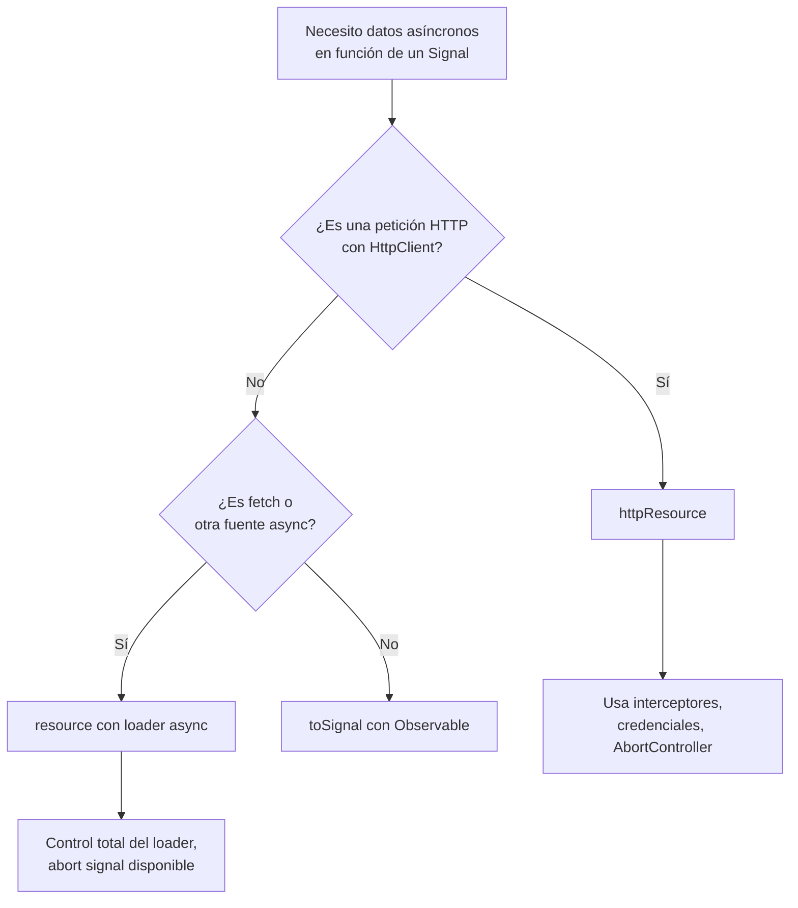

# Capítulo 20 - Parte 2: Signals en formularios reactivos e HTTP

> **Parte 2 de 4** · Capítulo 20 · PARTE X - Angular Signals: Reactividad Moderna

Angular 20 y 21 consolidaron dos incorporaciones que cambian la forma en que manejamos datos asíncronos y estado vinculado: `linkedSignal()` y `resource()`. Si la parte anterior nos mostró cómo Signals domina el estado local sincrónico, esta parte demuestra que el equipo de Angular no dejó el mundo asíncrono sin respuesta. Veamos cómo estas dos API eliminan boilerplate que antes requería RxJS para tareas cotidianas como cargar datos según un parámetro dinámico.

## linkedSignal(): estado derivado pero editable

`computed()` nos da estado derivado de solo lectura: no podemos asignarle un valor manualmente porque siempre se recalcula desde sus dependencias. `linkedSignal()` resuelve un caso diferente: queremos un Signal cuyo valor inicial (o de reinicio) depende de otro Signal, pero que también puede ser modificado independientemente por el usuario.

El caso clásico es un formulario donde el valor por defecto viene del servidor pero el usuario puede editarlo:

```typescript
// editor-perfil.component.ts
import { Component, signal, linkedSignal, inject } from '@angular/core';
import { toSignal } from '@angular/core/rxjs-interop';
import { FormsModule } from '@angular/forms';
import { UsuarioService } from './usuario.service';
import { Usuario } from './usuario.model';

@Component({
  selector: 'app-editor-perfil',
  standalone: true,
  imports: [FormsModule],
  template: `
    <div>
      <label>Nombre</label>
      <input [(ngModel)]="nombreEditable" />
    </div>
    <div>
      <label>Email</label>
      <input [(ngModel)]="emailEditable" />
    </div>
    <button (click)="reiniciar()">Reiniciar cambios</button>
    <button (click)="guardar()">Guardar</button>
    <p>Cambios pendientes: {{ hayCambios() }}</p>
  `,
})
export class EditorPerfilComponent {
  private readonly usuarioService = inject(UsuarioService);

  // Datos del servidor como Signal
  readonly usuarioServidor = toSignal(
    this.usuarioService.obtenerPerfil(),
    { initialValue: null as Usuario | null }
  );

  // linkedSignal: se inicializa desde usuarioServidor,
  // pero el usuario puede editarlo libremente
  readonly nombreEditable = linkedSignal(
    () => this.usuarioServidor()?.nombre ?? ''
  );

  readonly emailEditable = linkedSignal(
    () => this.usuarioServidor()?.email ?? ''
  );

  readonly hayCambios = () =>
    this.nombreEditable() !== (this.usuarioServidor()?.nombre ?? '') ||
    this.emailEditable() !== (this.usuarioServidor()?.email ?? '');

  reiniciar(): void {
    // Volvemos al valor del servidor manualmente
    this.nombreEditable.set(this.usuarioServidor()?.nombre ?? '');
    this.emailEditable.set(this.usuarioServidor()?.email ?? '');
  }

  guardar(): void {
    this.usuarioService.actualizarPerfil({
      nombre: this.nombreEditable(),
      email: this.emailEditable(),
    });
  }
}
```

Lo clave: cuando `usuarioServidor` cambia (por ejemplo, si el usuario navega a otro perfil), `linkedSignal` reinicia automáticamente su valor al nuevo valor derivado. Pero entre medias, el usuario puede editar libremente con `.set()`. Es una combinación de lo mejor de `computed` (se actualiza con la fuente) y `signal` (es mutable).

## resource(): datos asíncronos declarativos

`resource()` es la respuesta de Angular al patrón `Observable + switchMap + loading state`. En lugar de orquestar manualmente el ciclo de vida de una petición, declaramos qué datos queremos y en función de qué Signal:

```typescript
// detalle-producto.component.ts
import { Component, signal, resource } from '@angular/core';

interface Producto {
  id: number;
  nombre: string;
  precio: number;
  descripcion: string;
}

@Component({
  selector: 'app-detalle-producto',
  standalone: true,
  template: `
    <div>
      <select (change)="cambiarId($event)">
        @for (id of ids; track id) {
          <option [value]="id">Producto {{ id }}</option>
        }
      </select>
    </div>

    @if (productoResource.isLoading()) {
      <div class="spinner">Cargando...</div>
    } @else if (productoResource.error()) {
      <div class="error">Error: {{ productoResource.error() }}</div>
    } @else if (productoResource.value(); as producto) {
      <article>
        <h2>{{ producto.nombre }}</h2>
        <p>{{ producto.descripcion }}</p>
        <strong>{{ producto.precio | currency }}</strong>
      </article>
    }

    <button (click)="productoResource.reload()">Recargar</button>
  `,
})
export class DetalleProductoComponent {
  readonly ids = [1, 2, 3, 4, 5];
  readonly idSeleccionado = signal<number>(1);

  readonly productoResource = resource<Producto, number>({
    request: () => this.idSeleccionado(),
    loader: async ({ request: id }) => {
      const respuesta = await fetch(`/api/productos/${id}`);
      if (!respuesta.ok) throw new Error(`HTTP ${respuesta.status}`);
      return respuesta.json() as Promise<Producto>;
    },
  });

  cambiarId(event: Event): void {
    const id = Number((event.target as HTMLSelectElement).value);
    this.idSeleccionado.set(id);
  }
}
```

Analicemos la API de `resource()`:

- **`request`**: una función que devuelve el parámetro de la petición. Se comporta como una función de Signal: Angular rastrea sus dependencias. Cuando `idSeleccionado()` cambia, `resource` cancela la petición anterior y lanza una nueva.
- **`loader`**: función asíncrona que recibe `{ request }` con el valor actual del parámetro. Debe devolver una `Promise<T>`.
- El objeto resultante expone Signals: `value()`, `isLoading()`, `error()`, `status()`.
- `reload()` fuerza una nueva ejecución del `loader` con el mismo parámetro.

## Los estados de resource

```typescript
import { resource, signal, ResourceStatus } from '@angular/core';

@Component({ selector: 'app-estados', standalone: true, template: `
  <p>Estado actual: {{ etiquetaEstado() }}</p>
  <p>¿Cargando?: {{ datos.isLoading() }}</p>
  <p>Valor: {{ datos.value() | json }}</p>
  <p>Error: {{ datos.error() }}</p>
` })
export class EstadosComponent {
  readonly parametro = signal('angular');

  readonly datos = resource({
    request: () => this.parametro(),
    loader: async ({ request: q }) => {
      const r = await fetch(`/api/buscar?q=${q}`);
      return r.json();
    },
  });

  readonly etiquetaEstado = () => {
    const mapa: Record<number, string> = {
      [ResourceStatus.Idle]: 'Inactivo',
      [ResourceStatus.Loading]: 'Cargando',
      [ResourceStatus.Reloading]: 'Recargando',
      [ResourceStatus.Resolved]: 'Resuelto',
      [ResourceStatus.Error]: 'Error',
      [ResourceStatus.Local]: 'Local',
    };
    return mapa[this.datos.status()] ?? 'Desconocido';
  };
}
```

Los estados posibles son:
- **Idle**: `request()` devolvió `undefined` (indicador para no cargar nada)
- **Loading**: petición en curso, primer load
- **Reloading**: petición en curso, recarga (ya había valor previo)
- **Resolved**: petición exitosa
- **Error**: petición falló
- **Local**: el valor fue modificado manualmente con `.set()`

## httpResource(): la versión Angular HTTP de resource()

Para el caso específico de peticiones HTTP con `HttpClient`, Angular 21 ofrece `httpResource()` que integra directamente con el sistema de interceptores, credenciales y el cliente HTTP configurado:

```typescript
// catalogo-http.component.ts
import { Component, signal, inject } from '@angular/core';
import { httpResource } from '@angular/common/http';
import { Producto } from './producto.model';

@Component({
  selector: 'app-catalogo-http',
  standalone: true,
  template: `
    @if (productosResource.isLoading()) {
      <p>Cargando catálogo...</p>
    }
    <ul>
      @for (p of productosResource.value() ?? []; track p.id) {
        <li>{{ p.nombre }} - {{ p.precio | currency }}</li>
      }
    </ul>
  `,
})
export class CatalogoHttpComponent {
  readonly categoriaActual = signal<string>('electronica');

  readonly productosResource = httpResource<Producto[]>(
    () => `/api/productos?categoria=${this.categoriaActual()}`
  );
}
```

`httpResource()` acepta como primer argumento una función que devuelve la URL (o un objeto `HttpRequest`). Angular rastrea las dependencias de esa función: si `categoriaActual()` cambia, cancela la petición anterior y lanza una nueva. Automáticamente usa los interceptores configurados, lo que es fundamental para autenticación y logging.

## Comparación: cuándo usar resource vs httpResource



## Puntos clave

- `linkedSignal()` crea un Signal editable cuyo valor se reinicia cuando cambia su fuente; es ideal para formularios donde el valor inicial viene del servidor pero el usuario puede modificarlo.
- `resource()` declara datos asíncronos en función de un Signal: cuando el parámetro cambia, cancela la petición anterior y lanza una nueva automáticamente.
- Los estados de `resource`: `isLoading()`, `error()`, `value()`, `status()` y `reload()` eliminan todo el boilerplate de gestión de estados de carga.
- `httpResource()` es la versión especializada de `resource()` para `HttpClient`: integra interceptores, credenciales y cancelación automática.
- Cuando `request()` devuelve `undefined`, `resource()` entra en estado `Idle` y no lanza ninguna petición; úsalo para peticiones condicionales.

## ¿Qué sigue?

En la parte 3 exploramos el impacto más profundo de Signals: cómo hacen posible prescindir de Zone.js y qué significa eso para el rendimiento de aplicaciones Angular a gran escala.
