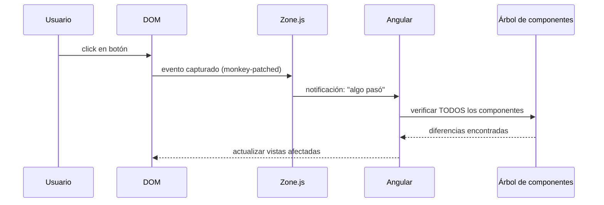
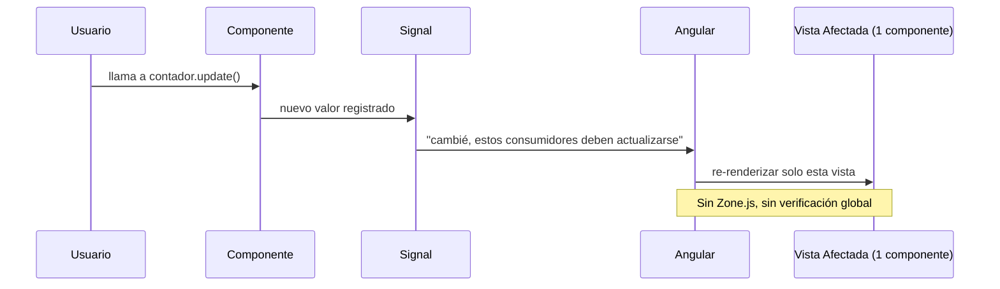
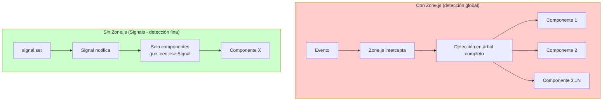

# Capítulo 20 - Parte 3: Signals y Change Detection: el camino a Zoneless Angular

> **Parte 3 de 4** · Capítulo 20 · PARTE X - Angular Signals: Reactividad Moderna

Esta parte aborda el tema más arquitectónico del capítulo: por qué Signals no son solo una comodidad de API, sino un prerequisito técnico para el futuro de Angular. Para entenderlo, necesitamos hablar primero de Zone.js, el mecanismo que Angular ha usado durante años para detectar cambios, y por qué ese mecanismo tiene un techo de rendimiento que Signals nos ayuda a superar.

## ¿Qué hace Zone.js y por qué existe?

Zone.js es una biblioteca que "envuelve" (monkey-patches) las APIs asíncronas del navegador: `setTimeout`, `setInterval`, `Promise.then`, `addEventListener`, `XMLHttpRequest`, `fetch`, entre otras. Cuando ejecutamos código dentro de una zona de Angular, cada vez que termina una operación asíncrona, Zone.js notifica a Angular para que ejecute la detección de cambios en toda la aplicación.



El problema es la flecha "verificar TODOS los componentes". En una app grande con cientos de componentes, esa verificación ocurre en cada evento, cada `setTimeout`, cada respuesta HTTP. Angular usa `ChangeDetectionStrategy.OnPush` para optimizarlo, pero sigue siendo una estrategia de "empujar desde arriba hacia abajo" que puede ser costosa.

Además, Zone.js introduce problemas secundarios:
- Aumenta el tamaño del bundle en ~13KB (minificado + gzip).
- Hace difícil depurar código asíncrono porque los stack traces están "envueltos".
- Puede causar ciclos de detección inesperados cuando librerías de terceros usan async de formas particulares.
- No funciona bien en ciertos entornos (Web Workers, Server-Side Rendering sin cuidado adicional).

## Cómo Signals cambian el modelo de detección

Cuando un componente usa Signals, Angular conoce exactamente qué Signals están siendo leídos en cada plantilla. En lugar de preguntar "¿cambió algo en algún lugar?", Angular ahora sabe con precisión "el Signal `contadorUsuarios` cambió, y solo los componentes que leen ese Signal en su plantilla necesitan re-renderizarse".



Este es el modelo "push" fino: en lugar de recorrer el árbol, Angular va directamente al nodo afectado. Esto escala perfectamente: 1000 componentes o 100, el trabajo es proporcional al número de Signals que cambiaron, no al tamaño del árbol.

## Habilitando Zoneless en Angular

Activar el modo sin Zone.js requiere dos cambios. Primero, en el bootstrap de la aplicación:

```typescript
// main.ts
import { bootstrapApplication } from '@angular/platform-browser';
import { provideExperimentalZonelessChangeDetection } from '@angular/core';
import { AppComponent } from './app/app.component';
import { appConfig } from './app/app.config';

bootstrapApplication(AppComponent, {
  ...appConfig,
  providers: [
    ...appConfig.providers,
    provideExperimentalZonelessChangeDetection(),
  ],
}).catch(console.error);
```

Segundo, quitamos Zone.js de los polyfills en `angular.json`. Buscamos la sección `polyfills` del proyecto y eliminamos la referencia:

```json
{
  "projects": {
    "mi-app": {
      "architect": {
        "build": {
          "options": {
            "polyfills": []
          }
        }
      }
    }
  }
}
```

Antes de Angular 18, `polyfills` tenía el valor `["zone.js"]`. Lo dejamos como arreglo vacío o lo eliminamos completamente.

## Qué deja de funcionar sin Zone.js

No todo código Angular es compatible automáticamente con el modo zoneless. Estos son los casos que requieren atención:

```typescript
// PROBLEMA 1: setTimeout sin Signal no dispara detección
@Component({
  selector: 'app-temporizador',
  standalone: true,
  template: '<p>Contador: {{ contadorHtml }}</p>',
})
export class TemporizadorComponent {
  contadorHtml = 0;

  constructor() {
    // Sin Zone.js, esto NO actualizará la vista
    setTimeout(() => {
      this.contadorHtml = 1; // Angular no sabe que cambió
    }, 1000);
  }
}

// SOLUCIÓN: usar Signal
@Component({
  selector: 'app-temporizador-ok',
  standalone: true,
  template: '<p>Contador: {{ contador() }}</p>',
})
export class TemporizadorOkComponent {
  readonly contador = signal(0);

  constructor() {
    // Angular sabe que contador cambió gracias al Signal
    setTimeout(() => this.contador.set(1), 1000);
  }
}
```

```typescript
// PROBLEMA 2: Mutación directa de propiedades del componente
@Component({ selector: 'app-lista', standalone: true, template: '...' })
export class ListaComponent {
  items: string[] = [];

  cargarItems(): void {
    fetch('/api/items')
      .then(r => r.json())
      .then((datos: string[]) => {
        this.items = datos; // Sin Zone.js, la vista no se actualiza
      });
  }
}

// SOLUCIÓN: usar Signal o ChangeDetectorRef.markForCheck()
import { Component, signal, inject, ChangeDetectorRef } from '@angular/core';

@Component({ selector: 'app-lista-ok', standalone: true, template: '...' })
export class ListaOkComponent {
  readonly items = signal<string[]>([]);

  cargarItems(): void {
    fetch('/api/items')
      .then(r => r.json())
      .then((datos: string[]) => this.items.set(datos));
  }
}
```

## Checklist de migración a Zoneless

Antes de activar `provideExperimentalZonelessChangeDetection()`, conviene auditar el proyecto:

```typescript
// checklist-verificacion.ts - no es código de producción, es una guía
/*
  □ 1. Todos los estados de componentes están en Signals o son inmutables
  □ 2. No hay asignaciones directas a propiedades de componente
        en callbacks de setTimeout/Promise/fetch
  □ 3. Los Output() EventEmitter siguen funcionando (Zone.js no es necesario)
  □ 4. Las librerías de terceros no dependen de Zone.js
        (usar ChangeDetectorRef.detectChanges() como puente si es necesario)
  □ 5. Los tests usan ComponentFixture.whenStable() o señales para assertions
  □ 6. Los formularios reactivos (ReactiveFormsModule) no tienen problemas;
        valueChanges es un Observable y funciona sin Zone.js
  □ 7. El router de Angular funciona correctamente (compatible con zoneless)
  □ 8. Las animaciones de Angular (@angular/animations) son compatibles
*/
```

Si encontramos componentes que usan estado mutable sin Signals, podemos usar `ChangeDetectorRef.markForCheck()` como medida temporal mientras migramos:

```typescript
import { Component, inject, ChangeDetectorRef } from '@angular/core';

@Component({ selector: 'app-legado', standalone: true, template: '<p>{{ valor }}</p>' })
export class LegadoComponent {
  private readonly cdr = inject(ChangeDetectorRef);
  valor = '';

  actualizar(): void {
    setTimeout(() => {
      this.valor = 'actualizado';
      this.cdr.markForCheck(); // Avisa a Angular manualmente
    }, 500);
  }
}
```

## La diferencia en rendimiento: con y sin Zone.js



En aplicaciones con 200+ componentes, la diferencia puede ser de varios milisegundos por interacción del usuario. Multiplicado por 60 frames por segundo en animaciones intensas, esto marca la diferencia entre una app que se siente fluida y una que se siente lenta.

## Estado actual y roadmap

En Angular 21, `provideExperimentalZonelessChangeDetection()` fue reemplazado por `provideZonelessChangeDetection()` —sin el prefijo `Experimental`— y promovido a API estable. La recomendación es:

- **Proyectos nuevos**: activar zoneless desde el inicio si el equipo está dispuesto a usar Signals de forma consistente.
- **Proyectos existentes**: migrar incrementalmente: activar `OnPush` en todos los componentes primero, luego migrar estado a Signals, y finalmente activar zoneless.

## Puntos clave

- Zone.js detecta cambios "monkey-patcheando" las APIs asíncronas del navegador y notificando a Angular para verificar todo el árbol de componentes en cada evento.
- Signals permiten a Angular conocer exactamente qué vistas deben actualizarse, sin necesidad de recorrer el árbol completo.
- `provideExperimentalZonelessChangeDetection()` en `bootstrapApplication` y eliminar `zone.js` de `polyfills` en `angular.json` activan el modo sin Zone.
- Sin Zone.js, las asignaciones directas a propiedades de componente no disparan detección de cambios; hay que usar Signals o `ChangeDetectorRef.markForCheck()`.
- La migración debe ser incremental: primero `OnPush` en todos los componentes, luego Signals en el estado, finalmente activar zoneless.

## ¿Qué sigue?

Cerramos el capítulo 20 con la pregunta que toda migración genera: ¿cuándo debo usar Signals y cuándo RxJS? La parte 4 da respuestas concretas con tabla comparativa, reglas prácticas y antipatrones que debemos evitar.
