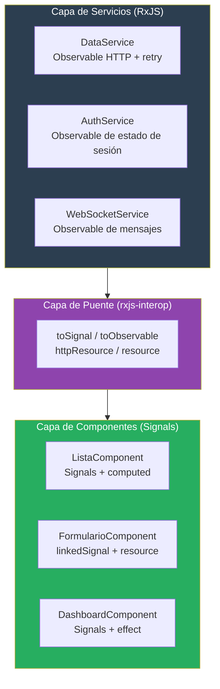

# Capítulo 20 - Parte 4: Signals vs RxJS: cuándo usar cada paradigma

> **Parte 4 de 4** · Capítulo 20 · PARTE X - Angular Signals: Reactividad Moderna

Llegamos al cierre del capítulo y, en muchos sentidos, al punto que más debate genera en equipos Angular hoy: ¿Signals reemplaza a RxJS? ¿Debo migrar todo? ¿O sigo usando RxJS para todo como siempre? La respuesta honesta es ninguna de las dos posturas extremas. Veamos las reglas prácticas que emergen de trabajar con ambas tecnologías en proyectos reales.

## Tabla comparativa: Signals vs RxJS

| Criterio | Signals | RxJS |
|---|---|---|
| **Modelo mental** | Valor que cambia en el tiempo | Stream de eventos/valores |
| **Lectura del valor actual** | `miSignal()` - directo, síncrono | `.getValue()` solo en BehaviorSubject |
| **Estado inicial** | Siempre tiene un valor inicial | Puede no tener valor inicial |
| **Composición** | `computed(() => a() + b())` | `combineLatest([a$, b$])` |
| **Efectos secundarios** | `effect(() => { ... })` | `.subscribe(fn)` |
| **Operadores de tiempo** | No tiene nativamente | `debounceTime`, `throttleTime`, `delay` |
| **Cancelación** | Automática con el contexto | Requiere `takeUntil` / `unsubscribe` |
| **Retry / backoff** | No tiene nativamente | `retry`, `retryWhen` |
| **Combinación de fuentes** | `computed` para sincrono | `merge`, `combineLatest`, `zip`, `race` |
| **Lazy evaluation** | No (siempre activo) | Sí (hasta que alguien suscribe) |
| **Backpressure** | No aplica | Operadores `bufferTime`, `throttle` |
| **Integración con plantilla** | Lectura directa `{{ miSignal() }}` | Requiere `async pipe` |
| **Debugging** | Valores inspeccionables en DevTools | Requiere herramientas específicas (RxJS DevTools) |
| **Curva de aprendizaje** | Baja | Alta |

## Cuándo brilla cada uno

Construyamos la guía de decisión con ejemplos concretos para cada caso:

### Signals para estado local de componente

```typescript
// BIEN: estado de UI en componente
@Component({ selector: 'app-modal', standalone: true, template: '' })
export class ModalComponent {
  readonly abierto = signal(false);
  readonly titulo = signal('');
  readonly cargando = signal(false);

  abrir(tituloModal: string): void {
    this.titulo.set(tituloModal);
    this.abierto.set(true);
  }

  cerrar(): void {
    this.abierto.set(false);
  }
}
```

Estado de UI sincrónico, sin eventos de DOM complejos, sin cancelación: Signal es la elección obvia.

### Signals para estado derivado e inputs reactivos

```typescript
// BIEN: Input como Signal, estado derivado
import { Component, input, computed } from '@angular/core';

@Component({
  selector: 'app-precio',
  standalone: true,
  template: `
    <p>Precio: {{ precioFormateado() }}</p>
    <p class="{{ claseDescuento() }}">{{ etiqueta() }}</p>
  `,
})
export class PrecioComponent {
  readonly precio = input.required<number>();
  readonly descuento = input<number>(0);

  readonly precioFinal = computed(() =>
    this.precio() * (1 - this.descuento() / 100)
  );

  readonly precioFormateado = computed(() =>
    new Intl.NumberFormat('es-MX', { style: 'currency', currency: 'MXN' })
      .format(this.precioFinal())
  );

  readonly claseDescuento = computed(() =>
    this.descuento() > 0 ? 'precio-oferta' : 'precio-normal'
  );

  readonly etiqueta = computed(() =>
    this.descuento() > 0 ? `${this.descuento()}% de descuento` : 'Precio regular'
  );
}
```

### RxJS para streams de eventos del DOM con tiempo

```typescript
// BIEN: búsqueda con debounce - RxJS es ideal aquí
import { Component, ElementRef, OnInit, viewChild } from '@angular/core';
import { fromEvent } from 'rxjs';
import { debounceTime, distinctUntilChanged, map, switchMap } from 'rxjs/operators';
import { toSignal } from '@angular/core/rxjs-interop';
import { BuscadorService } from './buscador.service';
import { Resultado } from './resultado.model';

@Component({
  selector: 'app-buscador-avanzado',
  standalone: true,
  template: `
    <input #campoBusqueda placeholder="Buscar..." />
    @for (r of resultados(); track r.id) {
      <p>{{ r.titulo }}</p>
    }
  `,
})
export class BuscadorAvanzadoComponent implements OnInit {
  private readonly buscadorService = inject(BuscadorService);
  readonly campoBusqueda = viewChild.required<ElementRef>('campoBusqueda');

  resultados = signal<Resultado[]>([]);

  ngOnInit(): void {
    const busqueda$ = fromEvent<InputEvent>(
      this.campoBusqueda().nativeElement, 'input'
    ).pipe(
      map(e => (e.target as HTMLInputElement).value),
      debounceTime(400),
      distinctUntilChanged(),
      switchMap(texto => this.buscadorService.buscar(texto))
    );

    // Convertimos al final para consumir en plantilla
    this.resultados = toSignal(busqueda$, { initialValue: [] as Resultado[] });
  }
}
```

### RxJS para peticiones HTTP con retry y timeout

```typescript
// BIEN: lógica de resiliencia - RxJS operadores no tienen equivalente en Signals
import { inject, Injectable } from '@angular/core';
import { HttpClient } from '@angular/common/http';
import { Observable } from 'rxjs';
import { retry, timeout, catchError, of } from 'rxjs';
import { Pedido } from './pedido.model';

@Injectable({ providedIn: 'root' })
export class PedidoService {
  private readonly http = inject(HttpClient);

  obtenerPedido(id: number): Observable<Pedido | null> {
    return this.http.get<Pedido>(`/api/pedidos/${id}`).pipe(
      timeout(5000),
      retry({ count: 3, delay: 1000 }),
      catchError(() => of(null))
    );
  }
}
```

Este tipo de lógica vive correctamente en el servicio como Observable. El componente la consume con `toSignal()` o `resource()`.

## Antipatrones que debemos evitar

### Antipatrón 1: convertir todo a Signals perdiendo el poder de RxJS

```typescript
// MAL: reemplazando switchMap con Signals de forma manual y frágil
@Component({ selector: 'app-mal', standalone: true, template: '' })
export class MalComponent {
  readonly idBusqueda = signal('');

  constructor() {
    effect(() => {
      const id = this.idBusqueda();
      // ¿Qué pasa con la petición anterior? ¿Cómo la cancelamos?
      // Este código tiene race conditions
      fetch(`/api/datos/${id}`)
        .then(r => r.json())
        .then(datos => this.datos.set(datos));
    });
  }

  readonly datos = signal<unknown>(null);
}

// BIEN: usar resource() para este caso
@Component({ selector: 'app-bien', standalone: true, template: '' })
export class BienComponent {
  readonly idBusqueda = signal('');

  readonly datos = resource({
    request: () => this.idBusqueda(),
    loader: async ({ request: id }) => {
      const r = await fetch(`/api/datos/${id}`);
      return r.json();
    },
  });
}
```

### Antipatrón 2: convertir todo a Observables perdiendo la simplicidad

```typescript
// MAL: Observable para estado simple de UI
@Component({ selector: 'app-menu', standalone: true, template: '' })
export class MenuMalComponent {
  private readonly _menuAbierto$ = new BehaviorSubject(false);
  readonly menuAbierto$ = this._menuAbierto$.asObservable();

  toggleMenu(): void {
    this._menuAbierto$.next(!this._menuAbierto$.getValue());
  }
}

// BIEN: Signal para esto
@Component({ selector: 'app-menu-bien', standalone: true, template: '' })
export class MenuBienComponent {
  readonly menuAbierto = signal(false);
  toggleMenu(): void { this.menuAbierto.update(v => !v); }
}
```

### Antipatrón 3: toSignal(toObservable(signal)) sin razón

```typescript
// MAL: conversión innecesaria de Signal a Observable y de vuelta a Signal
@Component({ selector: 'app-redundante', standalone: true, template: '' })
export class RedundanteComponent {
  readonly nombre = signal('Angular');

  // ¿Por qué hacer esto? nombre ya ES un Signal
  readonly nombreSignalRedundante = toSignal(
    toObservable(this.nombre),
    { requireSync: true }
  );
}

// La única razón válida para toSignal(toObservable(s).pipe(...)) es
// aplicar operadores RxJS en el medio:
readonly nombreConDebounce = toSignal(
  toObservable(this.nombre).pipe(debounceTime(300)),
  { initialValue: '' }
);
```

## La estrategia de coexistencia: Signals en componentes, RxJS en servicios

La arquitectura que mejor funciona en proyectos reales es una separación clara de responsabilidades:



Los servicios siguen usando RxJS: tienen toda la lógica de resiliencia, combinación y streams del dominio. Los componentes usan Signals: el estado de UI es simple, legible y no requiere gestión de suscripciones. La capa de puente es delgada: `toSignal()` en los componentes que necesitan datos del servicio, o `resource()` / `httpResource()` para los casos declarativos.

```typescript
// Servicio: RxJS puro
@Injectable({ providedIn: 'root' })
export class InventarioService {
  private readonly http = inject(HttpClient);

  readonly actualizaciones$ = webSocket<ActualizacionStock>('/ws/inventario');

  obtenerStock(productoId: number): Observable<Stock> {
    return this.http.get<Stock>(`/api/stock/${productoId}`).pipe(
      retry(2),
      shareReplay(1)
    );
  }
}

// Componente: Signals que consume el servicio
@Component({ selector: 'app-stock', standalone: true, template: `
  <p>Stock: {{ stockActual()?.cantidad ?? 'Cargando...' }}</p>
  <p>Última actualización: {{ ultimaActualizacion() | date:'short' }}</p>
` })
export class StockComponent {
  private readonly inventarioService = inject(InventarioService);
  readonly productoId = input.required<number>();

  readonly stockActual = toSignal(
    toObservable(this.productoId).pipe(
      switchMap(id => this.inventarioService.obtenerStock(id))
    ),
    { initialValue: null }
  );

  readonly ultimaActualizacion = toSignal(
    this.inventarioService.actualizaciones$.pipe(
      map(() => new Date())
    ),
    { initialValue: null }
  );
}
```

## Reglas prácticas de decisión rápida

Cuando dudemos, estas preguntas guían la decisión en segundos:

1. **¿Es estado de UI (abierto/cerrado, seleccionado, tab activo)?** → Signal.
2. **¿Es un valor derivado de otros valores?** → `computed()`.
3. **¿Necesito `debounceTime`, `throttleTime`, `delay`?** → `toObservable` + RxJS.
4. **¿Necesito `retry`, `timeout`, `catchError`?** → Observable en el servicio.
5. **¿Es una petición HTTP que depende de un Signal?** → `httpResource()` o `resource()`.
6. **¿Es un stream de eventos WebSocket o SSE?** → Observable en el servicio, `toSignal` en el componente si necesito el último valor.
7. **¿Es estado que necesito en la plantilla sin `async pipe`?** → Signal.

## Puntos clave

- Signals y RxJS no son rivales; son herramientas complementarias con dominios de aplicación distintos: Signals para estado de componente y valores derivados, RxJS para streams de eventos y operaciones asíncronas complejas.
- Los antipatrones más dañinos son los extremos: migrar todo a Signals (perdiendo `retry`, `debounce`, etc.) o mantener todo en RxJS (perdiendo la simplicidad del estado local).
- `toSignal(toObservable(signal).pipe(...))` es el patrón correcto solo cuando hay operadores RxJS de por medio; hacerlo sin razón es ruido innecesario.
- La arquitectura recomendada es: servicios con RxJS, componentes con Signals, y una delgada capa de puente con `toSignal` / `resource` / `httpResource`.
- El criterio final es la legibilidad del código para el equipo: si un Signal hace el código más claro y seguro para ese caso, úsalo; si un Observable hace el código más expresivo y resiliente, úsalo.

## ¿Qué sigue?

Con este capítulo completamos la sección de Angular Signals. En el capítulo 21 exploramos el nuevo sistema de control de flujo de plantillas (`@if`, `@for`, `@switch`, `@defer`) y cómo se integra con Signals para crear UIs reactivas declarativas de nueva generación.
