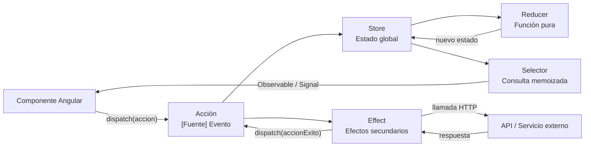

# Capítulo 21 - Parte 1: El problema del estado y el patrón Redux

> **Parte 1 de 4** · Capítulo 21 · PARTE XI - Gestión de Estado con NgRx

Toda aplicación Angular de cierta envergadura enfrenta antes o después el mismo desafío: el estado crece, se dispersa y se vuelve difícil de razonar. Un componente necesita datos que viven en otro componente distante en el árbol. Una pantalla muestra información desactualizada porque dos servicios mantienen copias distintas del mismo dato. Un bug aparece en producción y nadie puede reproducirlo porque el estado que lo provocó ya no existe. Estos no son problemas de mala codificación: son problemas inherentes a la gestión de estado sin una arquitectura clara.

## El prop drilling y sus consecuencias

El primer patrón que adoptan los desarrolladores cuando los componentes necesitan compartir datos es pasar información a través de `@Input` y `@Output`. Un componente padre obtiene los datos y los distribuye hacia sus hijos, que a su vez los pasan a sus propios hijos. A este patrón se le llama *prop drilling*[^1].

[^1]: Prop drilling: pasar propiedades a través de múltiples niveles del árbol de componentes solo para hacer llegar datos a un componente profundo, aunque los componentes intermedios no usen esos datos.

El problema aparece cuando la jerarquía tiene tres o más niveles. El componente intermedio recibe datos únicamente para pasarlos hacia abajo, sin usarlos. Cualquier cambio en la forma del dato obliga a modificar todos los componentes intermedios. El código se vuelve frágil y difícil de mantener.

```typescript
// Ejemplo de prop drilling - el componente intermedio solo "transmite" datos
// app.component.ts → lista.component.ts → item.component.ts → detalle.component.ts

@Component({
  selector: 'app-lista',
  standalone: true,
  imports: [ItemComponent],
  template: `
    @for (item of items; track item.id) {
      <!-- lista no usa usuarioActual, solo lo pasa hacia abajo -->
      <app-item [item]="item" [usuarioActual]="usuarioActual" />
    }
  `
})
export class ListaComponent {
  @Input() items: Producto[] = [];
  @Input() usuarioActual!: Usuario; // Solo se pasa, nunca se usa aquí
}
```

Este código no hace nada malo desde el punto de vista de TypeScript, pero establece un acoplamiento innecesario entre `ListaComponent` y la forma de `Usuario`.

## Servicios con BehaviorSubject: una mejora incompleta

La solución habitual al prop drilling es crear un servicio que actúe como fuente de datos compartida, usando `BehaviorSubject` para mantener el estado y exponer un `Observable` para que los componentes se suscriban. → Ver Capítulo 18, Parte 1 para la implementación de este patrón.

```typescript
// productos.service.ts - estado compartido con BehaviorSubject
import { Injectable } from '@angular/core';
import { BehaviorSubject, Observable } from 'rxjs';

export interface Producto {
  id: number;
  nombre: string;
  precio: number;
}

@Injectable({ providedIn: 'root' })
export class ProductosService {
  // Estado privado mutable
  private _productos = new BehaviorSubject<Producto[]>([]);

  // Observable público de solo lectura
  readonly productos$: Observable<Producto[]> = this._productos.asObservable();

  agregar(producto: Producto): void {
    const actuales = this._productos.getValue();
    this._productos.next([...actuales, producto]); // Inmutabilidad manual
  }
}
```

Este patrón funciona correctamente para aplicaciones de tamaño pequeño a mediano. Sin embargo, escala con problemas. Cuando la aplicación crece, aparecen múltiples servicios con sus propios `BehaviorSubject`, cada uno manteniendo su trozo de estado de forma aislada. Surgen preguntas difíciles de responder: ¿quién modificó este valor? ¿En qué orden ocurrieron las actualizaciones? ¿Por qué el componente A muestra algo diferente al componente B si ambos usan el mismo servicio?

El problema fundamental es que las mutaciones de estado están dispersas. Cualquier parte del código puede llamar a un método del servicio y cambiar el estado sin dejar rastro auditable. Debuggear se convierte en una búsqueda de dónde ocurrió la llamada que produjo el estado incorrecto.

## El patrón Redux: una sola fuente de verdad

Redux es un patrón de gestión de estado creado por Dan Abramov en 2015, inspirado en la arquitectura Elm. Su premisa central es radical en su simplicidad: todo el estado de la aplicación vive en un único objeto JavaScript llamado **store**[^2]. Este estado nunca se muta directamente. Para modificarlo, se despacha una **acción** que describe qué evento ocurrió. Una función pura llamada **reducer** toma el estado actual y la acción, y retorna un nuevo estado.

[^2]: Store: el contenedor centralizado que almacena el estado completo de la aplicación en Redux/NgRx.

El flujo es estrictamente unidireccional y se puede resumir en tres principios:

**Única fuente de verdad.** Todo el estado de la aplicación vive en un solo árbol de objetos dentro del store. No hay estado duplicado, no hay múltiples servicios con copias divergentes del mismo dato.

**El estado es de solo lectura.** La única manera de cambiar el estado es emitir una acción, un objeto plano que describe qué ocurrió. Los componentes y servicios no pueden modificar el estado directamente.

**Los cambios se realizan con funciones puras.** Los reducers son funciones que reciben el estado anterior y una acción, y retornan el siguiente estado. Son predecibles, testeables y sin efectos secundarios.

```typescript
// Ejemplo conceptual del ciclo Redux
// (No es código NgRx, es para ilustrar el patrón)

// Acción: describe qué ocurrió
const accion = {
  type: '[Productos] Agregar Producto',
  payload: { id: 1, nombre: 'Laptop', precio: 1200 }
};

// Estado inicial
const estadoInicial = { productos: [] };

// Reducer: función pura que transforma el estado
function reducer(estado = estadoInicial, accion: any) {
  switch (accion.type) {
    case '[Productos] Agregar Producto':
      return {
        ...estado, // Nunca mutar, siempre retornar nuevo objeto
        productos: [...estado.productos, accion.payload]
      };
    default:
      return estado; // Estado sin cambios para acciones desconocidas
  }
}
```

## El ciclo Redux completo

La magia del patrón Redux está en que el flujo de datos es completamente predecible. Un componente despacha una acción. El store la procesa a través del reducer y actualiza el estado. Los selectores notifican a los componentes suscritos. El componente actualiza su vista. En ese ciclo, en ningún momento existe ambigüedad sobre qué causó un cambio de estado.



Este diagrama muestra por qué Redux es tan valioso para el debugging. Cada flecha representa una transformación explícita y registrable. Las herramientas de desarrollo (como Redux DevTools) interceptan cada acción y guardan una instantánea del estado antes y después. Esto permite revisar la historia completa de cambios y saltar a cualquier punto anterior, lo que se conoce como *time-travel debugging*.

NgRx es la implementación de Redux para Angular. No es una traducción literal sino una adaptación que integra RxJS, Signals y los patrones idiomáticos de Angular. En las siguientes partes construiremos una aplicación completa usando todas sus piezas.

## Puntos clave

- El prop drilling acopla componentes innecesariamente y escala muy mal con la profundidad del árbol
- Los servicios con `BehaviorSubject` resuelven el prop drilling pero crean múltiples fuentes de verdad dispersas y difíciles de auditar
- Redux propone: un store único, estado de solo lectura, y reducers como funciones puras para los cambios
- El flujo unidireccional hace que el estado de la aplicación sea completamente predecible y auditable
- NgRx es la implementación de Redux para Angular, integrada con RxJS y el sistema de Signals

## ¿Qué sigue?

En la Parte 2 instalamos NgRx en un proyecto Angular standalone, configuramos el store inicial y establecemos la estructura de carpetas recomendada por feature.
