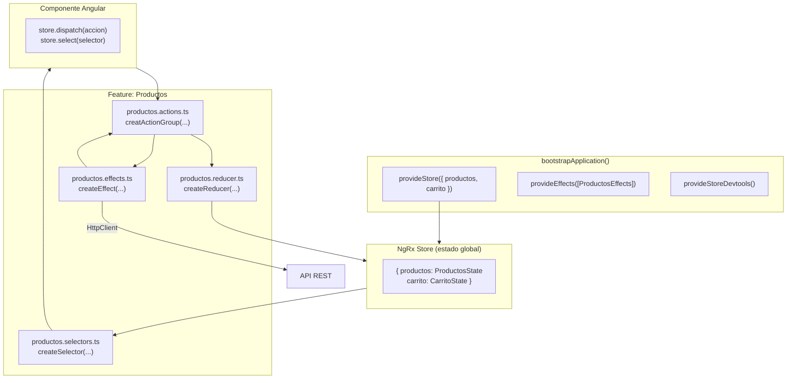

# Capítulo 21 - Parte 2: Instalación, configuración y arquitectura NgRx

> **Parte 2 de 4** · Capítulo 21 · PARTE XI - Gestión de Estado con NgRx

Con el patrón Redux claro en mente, es momento de instalar NgRx y configurarlo en un proyecto Angular standalone. NgRx no es una sola librería sino un ecosistema de paquetes que se instalan según las necesidades de la aplicación. En esta parte instalamos los cuatro paquetes fundamentales y configuramos la aplicación para que el store esté disponible globalmente.

## Instalando los paquetes NgRx

NgRx 17+ es compatible con Angular 17+ y funciona exclusivamente con el enfoque standalone. La instalación se realiza en dos grupos: los paquetes de runtime y las herramientas de desarrollo.

```bash
# Paquetes de runtime - necesarios en producción
npm install @ngrx/store @ngrx/effects @ngrx/entity @ngrx/signals

# Herramientas de desarrollo - solo en desarrollo
npm install @ngrx/store-devtools --save-dev

# También se puede instalar usando el schematic de NgRx CLI
# que configura automáticamente el bootstrapApplication:
ng add @ngrx/store@latest
```

Cada paquete tiene una responsabilidad bien delimitada. `@ngrx/store` es el núcleo: el store, las acciones, los reducers y los selectores. `@ngrx/effects` maneja los efectos secundarios asincrónicos como llamadas HTTP. `@ngrx/entity` provee utilidades para gestionar colecciones de entidades de manera normalizada. `@ngrx/signals` es el Signal Store, la API moderna que exploraremos en el Capítulo 24. `@ngrx/store-devtools` conecta el store con las herramientas de desarrollo del navegador.

## Configurando el bootstrapApplication

En una aplicación standalone, NgRx se configura mediante funciones `provide*` dentro del array `providers` del `bootstrapApplication`. No hay módulos que importar, no hay `StoreModule.forRoot()`: la configuración es funcional y explícita.

```typescript
// main.ts
import { bootstrapApplication } from '@angular/platform-browser';
import { provideRouter } from '@angular/router';
import { provideHttpClient } from '@angular/common/http';
import { provideStore } from '@ngrx/store';
import { provideEffects } from '@ngrx/effects';
import { provideStoreDevtools } from '@ngrx/store-devtools';
import { AppComponent } from './app/app.component';
import { productosReducer } from './app/productos/state/productos.reducer';
import { ProductosEffects } from './app/productos/state/productos.effects';
import { isDevMode } from '@angular/core';

bootstrapApplication(AppComponent, {
  providers: [
    provideRouter([/* rutas */]),
    provideHttpClient(),

    // Store raíz con los reducers de cada feature
    provideStore({ productos: productosReducer }),

    // Efectos registrados globalmente
    provideEffects([ProductosEffects]),

    // DevTools solo en desarrollo
    provideStoreDevtools({
      maxAge: 25,             // Número de acciones a recordar
      logOnly: !isDevMode()  // Solo lectura en producción
    }),
  ]
});
```

La función `provideStore({})` acepta un objeto donde cada clave es el nombre del slice de estado y el valor es el reducer que lo gestiona. Este objeto se llama `ActionReducerMap` y define la forma del estado global. Si el objeto está vacío `provideStore({})`, el store existe pero sin ningún slice registrado, lo cual es válido cuando se usan feature stores cargados con lazy loading.

## Estructura de carpetas recomendada por feature

NgRx no impone una estructura de carpetas, pero la comunidad ha convergido en una organización por feature que escala bien. Cada feature tiene su propio subdirectorio `state/` que contiene todos los artefactos NgRx relacionados.

```
src/
└── app/
    ├── app.component.ts
    ├── productos/
    │   ├── productos.component.ts
    │   ├── productos.routes.ts
    │   └── state/
    │       ├── productos.actions.ts      ← Definición de acciones
    │       ├── productos.reducer.ts      ← Estado inicial y reducer
    │       ├── productos.effects.ts      ← Efectos secundarios (HTTP)
    │       └── productos.selectors.ts   ← Selectores memoizados
    ├── carrito/
    │   ├── carrito.component.ts
    │   └── state/
    │       ├── carrito.actions.ts
    │       ├── carrito.reducer.ts
    │       ├── carrito.effects.ts
    │       └── carrito.selectors.ts
    └── core/
        └── state/
            └── app.state.ts             ← Interfaz del estado global
```

Esta organización tiene ventajas claras. Todos los artefactos de una feature están juntos, lo que facilita encontrar y modificar el código relacionado. Cuando se elimina una feature, se eliminan sus archivos de estado sin afectar a otras features. Cuando se agrega una nueva feature, se sigue el mismo patrón sin necesidad de decisiones arquitectónicas nuevas.

```typescript
// core/state/app.state.ts - interfaz del estado global
import { ProductosState } from '../productos/state/productos.reducer';
import { CarritoState } from '../carrito/state/carrito.reducer';

// Describe la forma completa del árbol de estado
export interface AppState {
  productos: ProductosState;
  carrito: CarritoState;
}
```

## Feature stores con lazy loading

Para aplicaciones grandes, registrar todos los reducers en el `bootstrapApplication` significaría cargar todo el código de estado al inicio, incluso para features que el usuario quizás nunca visite. NgRx soporta el registro de features en rutas con lazy loading mediante `provideState`.

```typescript
// productos.routes.ts - feature con estado cargado bajo demanda
import { Routes } from '@angular/router';
import { provideState } from '@ngrx/store';
import { provideEffects } from '@ngrx/effects';
import { productosReducer } from './state/productos.reducer';
import { ProductosEffects } from './state/productos.effects';

export const productosRoutes: Routes = [
  {
    path: '',
    providers: [
      // El reducer y los effects se registran solo cuando esta ruta se carga
      provideState({ name: 'productos', reducer: productosReducer }),
      provideEffects([ProductosEffects]),
    ],
    loadComponent: () =>
      import('./productos.component').then(m => m.ProductosComponent),
  }
];
```

Con esta configuración, el código del store de productos solo se descarga cuando el usuario navega a la ruta de productos, reduciendo el bundle inicial de la aplicación.

## Diagrama de la arquitectura NgRx



## Puntos clave

- NgRx se instala como cuatro paquetes separados: `@ngrx/store`, `@ngrx/effects`, `@ngrx/entity` y `@ngrx/signals`
- En aplicaciones standalone se configura con `provideStore()`, `provideEffects()` y `provideStoreDevtools()` en `bootstrapApplication`
- La estructura de carpetas recomendada agrupa todos los artefactos NgRx de una feature en un subdirectorio `state/`
- `provideState()` permite registrar feature stores de forma lazy junto con rutas de carga diferida
- `AppState` es la interfaz que describe la forma completa del árbol de estado global

## ¿Qué sigue?

En la Parte 3 aprendemos a definir acciones con `createAction` y `createActionGroup`, la forma de describir todos los eventos que pueden ocurrir en la aplicación.
