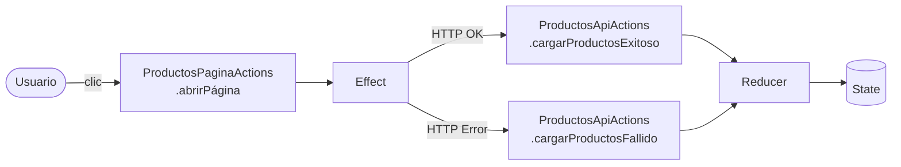

# Capítulo 21 - Parte 3: Actions: definiendo los eventos de la aplicación

> **Parte 3 de 4** · Capítulo 21 · PARTE XI - Gestión de Estado con NgRx

Las acciones son el corazón de NgRx. Cada vez que algo sucede en nuestra aplicación -el usuario hace clic, una petición HTTP termina, un temporizador expira- lo expresamos como una acción. Veamos cómo definirlas correctamente y por qué la forma en que las nombramos importa tanto como lo que hacen.

## El concepto fundamental: acciones como eventos

Antes de escribir código, aclaremos algo crucial: **las acciones son eventos, no comandos**. Esta distinción cambia la forma en que las nombramos y las pensamos.

Un comando dice "haz esto": `CargarProductos`. Un evento dice "esto ocurrió": `[Productos API] Productos Cargados`. La diferencia parece sutil, pero tiene consecuencias profundas. Cuando modelamos acciones como eventos, múltiples partes del sistema (reducers, effects, incluso otros effects) pueden reaccionar al mismo evento sin acoplarse entre sí.

La convención de nombres que adopta la comunidad NgRx sigue el patrón `[Fuente] Verbo Sustantivo`:

- `[Productos Página] Cargar Productos` - el usuario navegó a la página
- `[Productos API] Cargar Productos Exitoso` - la API respondió bien
- `[Productos API] Cargar Productos Fallido` - la API respondió con error
- `[Productos Página] Seleccionar Producto` - el usuario eligió un producto

La fuente entre corchetes identifica *de dónde* viene la acción, lo que facilita enormemente la depuración con Redux DevTools.

## Acciones simples con `createAction`

Para acciones sin payload, `createAction` recibe únicamente el string del tipo:

```typescript
// src/app/productos/store/productos.actions.ts
import { createAction } from '@ngrx/store';

export const cargarProductos = createAction(
  '[Productos Página] Cargar Productos'
);

export const limpiarSeleccion = createAction(
  '[Productos Página] Limpiar Selección'
);
```

Cuando necesitamos datos adicionales, usamos `props<T>()` para tipar el payload:

```typescript
import { createAction, props } from '@ngrx/store';

export const seleccionarProducto = createAction(
  '[Productos Página] Seleccionar Producto',
  props<{ id: number }>()
);

export const cargarProductosExitoso = createAction(
  '[Productos API] Cargar Productos Exitoso',
  props<{ productos: Producto[] }>()
);

export const cargarProductosFallido = createAction(
  '[Productos API] Cargar Productos Fallido',
  props<{ error: string }>()
);
```

Al despachar estas acciones, TypeScript nos garantiza que pasamos los datos correctos:

```typescript
// En un componente o effect
this.store.dispatch(seleccionarProducto({ id: 42 }));
this.store.dispatch(cargarProductosExitoso({ productos: listaDeProductos }));
```

## Agrupando acciones con `createActionGroup`

Cuando tenemos un conjunto de acciones relacionadas -como el ciclo load/success/failure que se repite en casi cada feature- `createActionGroup` nos ahorra código repetitivo y garantiza consistencia:

```typescript
// src/app/productos/store/productos.actions.ts
import { createActionGroup, emptyProps, props } from '@ngrx/store';
import { Producto } from '../models/producto.model';

export const ProductosApiActions = createActionGroup({
  source: 'Productos API',
  events: {
    'Cargar Productos': emptyProps(),
    'Cargar Productos Exitoso': props<{ productos: Producto[] }>(),
    'Cargar Productos Fallido': props<{ error: string }>(),
    'Guardar Producto': props<{ producto: Producto }>(),
    'Guardar Producto Exitoso': props<{ producto: Producto }>(),
    'Guardar Producto Fallido': props<{ error: string }>(),
  },
});
```

NgRx convierte automáticamente las claves en camelCase para generar los creadores de acción. El grupo anterior produce:

```typescript
ProductosApiActions.cargarProductos()
ProductosApiActions.cargarProductosExitoso({ productos: [...] })
ProductosApiActions.cargarProductosFallido({ error: 'Not found' })
ProductosApiActions.guardarProducto({ producto: nuevoProducto })
ProductosApiActions.guardarProductoExitoso({ producto: productoGuardado })
ProductosApiActions.guardarProductoFallido({ error: 'Server error' })
```

También podemos tener un grupo para las acciones que vienen de la página:

```typescript
export const ProductosPaginaActions = createActionGroup({
  source: 'Productos Página',
  events: {
    'Abrir Página': emptyProps(),
    'Seleccionar Producto': props<{ id: number }>(),
    'Limpiar Selección': emptyProps(),
    'Actualizar Filtro': props<{ filtro: string }>(),
  },
});
```

## Ejemplo completo: feature de productos

Veamos cómo quedaría el archivo de acciones de un feature real, con sus modelos bien tipados:

```typescript
// src/app/productos/models/producto.model.ts
export interface Producto {
  readonly id: number;
  readonly nombre: string;
  readonly precio: number;
  readonly categoria: string;
  readonly activo: boolean;
}
```

```typescript
// src/app/productos/store/productos.actions.ts
import { createActionGroup, emptyProps, props } from '@ngrx/store';
import { Producto } from '../models/producto.model';

export const ProductosPaginaActions = createActionGroup({
  source: 'Productos Página',
  events: {
    'Abrir Página': emptyProps(),
    'Seleccionar Producto': props<{ id: number }>(),
    'Eliminar Producto Solicitado': props<{ id: number }>(),
    'Actualizar Filtro': props<{ filtro: string }>(),
    'Limpiar Filtro': emptyProps(),
  },
});

export const ProductosApiActions = createActionGroup({
  source: 'Productos API',
  events: {
    'Cargar Productos Exitoso': props<{ productos: Producto[] }>(),
    'Cargar Productos Fallido': props<{ error: string }>(),
    'Eliminar Producto Exitoso': props<{ id: number }>(),
    'Eliminar Producto Fallido': props<{ error: string }>(),
  },
});
```

Nótese que las acciones de "API" no tienen la acción de inicio (ej: "Cargar Productos") porque esa acción la dispara la página, no la API. Separar los grupos por *fuente* nos da trazabilidad inmediata en las DevTools.

## Por qué este diseño importa



Al separar acciones por fuente y modelarlas como eventos pasados, logramos:

1. **Trazabilidad**: en DevTools vemos exactamente qué pasó, cuándo y desde dónde.
2. **Desacoplamiento**: la página no sabe si hay un effect, un reducer o ambos escuchando su acción.
3. **Seguridad de tipos**: TypeScript rechaza cualquier payload incorrecto en tiempo de compilación.
4. **Testabilidad**: podemos testear reducers y effects de forma aislada usando solo los objetos de acción.

## Puntos clave

- Las acciones son **eventos** (algo ocurrió), no comandos (haz algo); este cambio mental es el más importante de NgRx.
- El patrón de nombres `[Fuente] Verbo Sustantivo` facilita la depuración y hace el historial de DevTools legible.
- `createAction` con `props<T>()` garantiza tipado estricto; nunca necesitamos `any`.
- `createActionGroup` elimina repetición para conjuntos de acciones relacionadas y genera automáticamente los creadores en camelCase.
- Separar grupos por fuente (`Página` vs `API`) hace explícito el origen de cada evento.

## ¿Qué sigue?

En la siguiente parte aprenderemos cómo los reducers escuchan estas acciones y transforman el estado de forma pura e inmutable.
