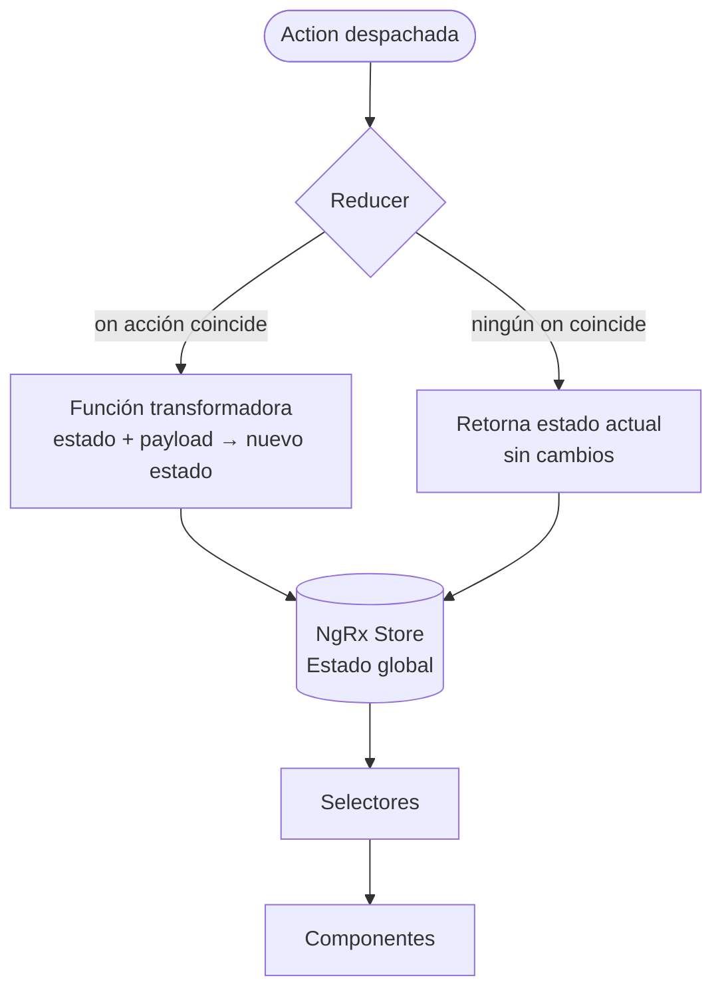

# Capítulo 21 - Parte 4: Reducers: transformando el estado de forma pura

> **Parte 4 de 4** · Capítulo 21 · PARTE XI - Gestión de Estado con NgRx

Si las acciones son los eventos de nuestra aplicación, los reducers son quienes deciden cómo esos eventos transforman el estado. Veamos por qué la pureza de estas funciones no es un capricho sino una necesidad, y cómo `createReducer` y `createFeature` nos hacen la vida mucho más simple.

## La regla de oro: los reducers deben ser funciones puras

Una función pura tiene dos características inseparables:

1. **Mismo input → mismo output**: dados los mismos argumentos, siempre retorna el mismo resultado.
2. **Sin efectos secundarios**: no llama a APIs, no modifica variables externas, no accede a `Date.now()`, no hace nada que no sea calcular y retornar.

¿Por qué importa tanto? Porque NgRx depende de la comparación por referencia para detectar cambios. Si mutamos el estado en lugar de retornar uno nuevo, Angular y el selector de memoización no detectarán el cambio, y la UI no se actualizará.

```typescript
// MAL: mutación del estado - NUNCA hagas esto
on(ProductosPaginaActions.actualizarFiltro, (estado, { filtro }) => {
  estado.filtro = filtro; // mutación directa
  return estado;          // misma referencia → NgRx no detecta cambio
}),

// BIEN: retornar un nuevo objeto
on(ProductosPaginaActions.actualizarFiltro, (estado, { filtro }) => ({
  ...estado,
  filtro,
})),
```

## El estado inicial bien tipado

Todo reducer comienza con un estado inicial. Definirlo con una interfaz estricta nos da autocompletado y seguridad en todos los `on()`:

```typescript
// src/app/productos/store/productos.reducer.ts
import { createReducer, on } from '@ngrx/store';
import { Producto } from '../models/producto.model';
import { ProductosApiActions, ProductosPaginaActions } from './productos.actions';

export interface ProductosState {
  readonly productos: Producto[];
  readonly productoSeleccionadoId: number | null;
  readonly filtro: string;
  readonly cargando: boolean;
  readonly error: string | null;
}

const estadoInicial: ProductosState = {
  productos: [],
  productoSeleccionadoId: null,
  filtro: '',
  cargando: false,
  error: null,
};
```

## Construyendo el reducer con `createReducer`

`createReducer` recibe el estado inicial y una lista de manejadores `on()`. Cada `on()` asocia una o más acciones con una función transformadora:

```typescript
export const productosReducer = createReducer(
  estadoInicial,

  on(ProductosPaginaActions.abrirPágina, (estado) => ({
    ...estado,
    cargando: true,
    error: null,
  })),

  on(ProductosApiActions.cargarProductosExitoso, (estado, { productos }) => ({
    ...estado,
    productos,
    cargando: false,
    error: null,
  })),

  on(ProductosApiActions.cargarProductosFallido, (estado, { error }) => ({
    ...estado,
    cargando: false,
    error,
  })),

  on(ProductosPaginaActions.seleccionarProducto, (estado, { id }) => ({
    ...estado,
    productoSeleccionadoId: id,
  })),

  on(ProductosPaginaActions.limpiarFiltro, (estado) => ({
    ...estado,
    filtro: '',
  })),
);
```

Un solo `on()` puede manejar múltiples acciones si todas producen la misma transformación:

```typescript
on(
  ProductosApiActions.cargarProductosFallido,
  ProductosApiActions.eliminarProductoFallido,
  (estado, { error }) => ({
    ...estado,
    cargando: false,
    error,
  })
),
```

## Operaciones CRUD sin Entity

Antes de introducir `@ngrx/entity`, veamos cómo implementamos las operaciones básicas manualmente. Esto nos ayuda a entender qué automatizará Entity por nosotros más adelante:

```typescript
// Agregar un producto
on(ProductosApiActions.guardarProductoExitoso, (estado, { producto }) => ({
  ...estado,
  productos: [...estado.productos, producto],
  cargando: false,
})),

// Actualizar un producto (sin mutar el array original)
on(ProductosApiActions.actualizarProductoExitoso, (estado, { producto }) => ({
  ...estado,
  productos: estado.productos.map((p) =>
    p.id === producto.id ? producto : p
  ),
  cargando: false,
})),

// Eliminar un producto
on(ProductosApiActions.eliminarProductoExitoso, (estado, { id }) => ({
  ...estado,
  productos: estado.productos.filter((p) => p.id !== id),
  productoSeleccionadoId:
    estado.productoSeleccionadoId === id
      ? null
      : estado.productoSeleccionadoId,
})),
```

## `createFeature`: selectores automáticos incluidos

`createFeature` es el paso que transforma nuestro reducer en un feature completo. Recibe un nombre (la clave en el estado global) y el reducer, y devuelve automáticamente el selector raíz más un selector por cada propiedad del estado:

```typescript
// src/app/productos/store/productos.feature.ts
import { createFeature } from '@ngrx/store';
import { productosReducer } from './productos.reducer';

export const productosFeature = createFeature({
  name: 'productos',
  reducer: productosReducer,
});

// Los siguientes selectores se generan automáticamente:
// productosFeature.selectProductosState    → el estado completo
// productosFeature.selectProductos         → state.productos
// productosFeature.selectProductoSeleccionadoId
// productosFeature.selectFiltro
// productosFeature.selectCargando
// productosFeature.selectError
```

Para registrar el feature en el módulo (o configuración standalone):

```typescript
// app.config.ts
import { provideStore } from '@ngrx/store';
import { provideEffects } from '@ngrx/effects';
import { productosFeature } from './productos/store/productos.feature';

export const appConfig: ApplicationConfig = {
  providers: [
    provideStore(),
    provideState(productosFeature),
    // provideEffects(ProductosEffects),
  ],
};
```

## Diagrama del flujo reducer



## Por qué los reducers puros habilitan el time-travel

Dado que cada reducer es una función pura, NgRx puede reconstruir cualquier estado pasado simplemente reproduciendo la secuencia de acciones desde el inicio. Esto es lo que hace posible el "time-travel debugging" en Redux DevTools: retroceder en el tiempo no es magia, es aplicar reducers hacia atrás.

También permite rehidratar el estado desde `localStorage` con total seguridad: guardamos las acciones (o el estado serializado), y al recargar la aplicación sabemos exactamente qué obtendremos.

## Puntos clave

- Los reducers **deben ser funciones puras**: mismo input produce siempre el mismo output, y nunca hay efectos secundarios.
- Siempre retornar un **nuevo objeto** de estado con spread `{...estado, cambio}`, jamás mutar el estado existente.
- `createReducer` con múltiples `on()` es legible y escalable; un `on()` puede manejar varias acciones si la transformación es idéntica.
- `createFeature` genera automáticamente el selector raíz y un selector por cada propiedad del estado, eliminando código boilerplate.
- El estado inicial bien tipado con una interfaz nos protege contra errores sutiles desde el primer momento.

## ¿Qué sigue?

En el capítulo 22 aprenderemos a consultar el estado de forma eficiente con selectores, incluyendo la memoización que hace que la UI no recalcule nada innecesariamente.
