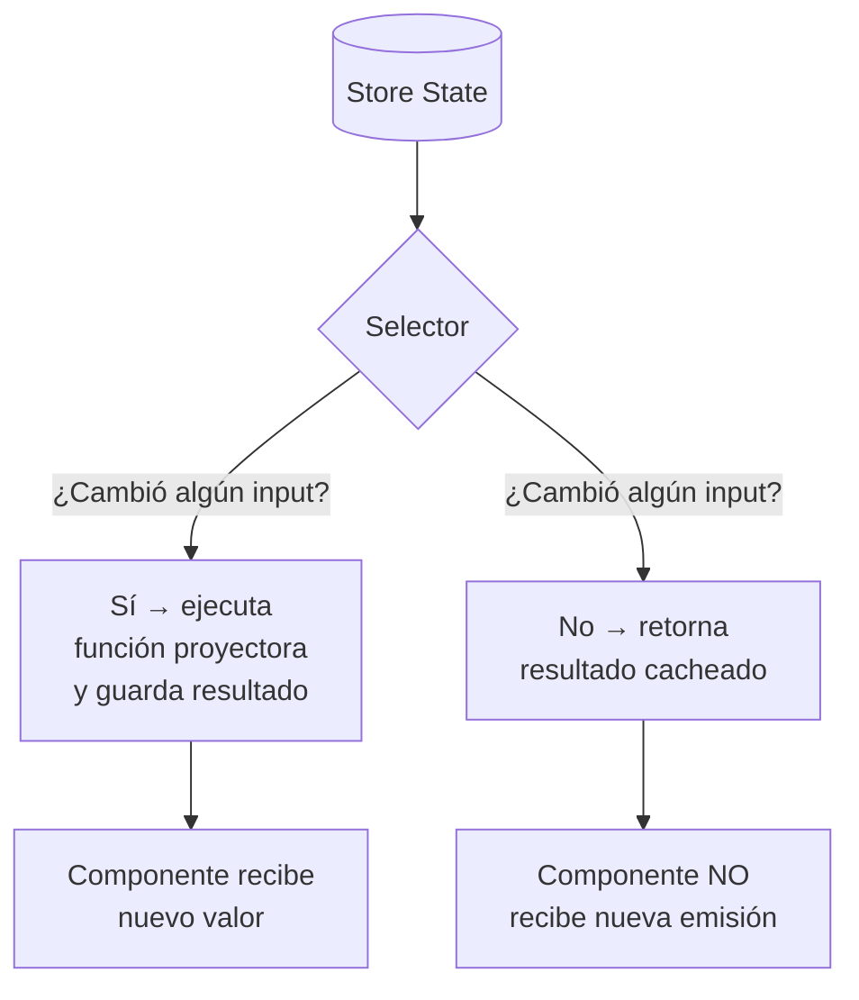

# Capítulo 22 - Parte 1: Selectors: consultando el estado de forma eficiente

> **Parte 1 de 4** · Capítulo 22 · PARTE XI - Gestión de Estado con NgRx

El estado vive en el store, pero los componentes rara vez lo necesitan tal como está almacenado. Necesitamos transformarlo, filtrarlo, combinarlo. Los selectores son la capa que hace esa traducción de forma eficiente y reutilizable. Veamos por qué son mucho más que simples "getters".

## El problema que resuelven los selectores

Imaginemos que accedemos al estado directamente desde el componente:

```typescript
// Esto parece conveniente, pero tiene varios problemas
this.productos$ = this.store.select(
  (state) => state['productos'].items.filter((p) => p.activo)
);
```

¿Cuáles son los problemas? Primero, TypeScript no puede inferir el tipo de `state['productos']` sin ayuda, forzándonos a castear. Segundo, esta función anónima se crea cada vez que el componente evalúa la expresión, por lo que la memoización nunca funciona. Tercero, si la forma del estado cambia, debemos buscar y actualizar cada acceso disperso en los componentes.

Los selectores resuelven los tres problemas: son reutilizables, están tipados, y son memoizados.

## `createFeatureSelector`: la puerta de entrada al feature

El selector de feature es el punto de partida. Apunta a la clave raíz que registramos con `createFeature` o `provideState`:

```typescript
// src/app/productos/store/productos.selectors.ts
import { createFeatureSelector, createSelector } from '@ngrx/store';
import { ProductosState } from './productos.reducer';

export const selectProductosState =
  createFeatureSelector<ProductosState>('productos');
```

Con `createFeature` este selector ya se genera automáticamente (lo vimos en la parte anterior), pero crearlo manualmente nos da más control sobre el nombre y permite combinarlo libremente.

## `createSelector`: del feature a los datos concretos

A partir del selector de feature, construimos selectores más específicos:

```typescript
export const selectTodosLosProductos = createSelector(
  selectProductosState,
  (estado) => estado.productos
);

export const selectFiltroActivo = createSelector(
  selectProductosState,
  (estado) => estado.filtro
);

export const selectCargando = createSelector(
  selectProductosState,
  (estado) => estado.cargando
);

export const selectError = createSelector(
  selectProductosState,
  (estado) => estado.error
);

export const selectProductoSeleccionadoId = createSelector(
  selectProductosState,
  (estado) => estado.productoSeleccionadoId
);
```

Cada uno de estos selectores es memoizado: si `estado.productos` no cambió de referencia, `selectTodosLosProductos` retorna exactamente el mismo array de la última vez, sin recalcular nada.

## Composición de selectores

La verdadera potencia emerge cuando un selector usa otros selectores como inputs. Construyamos un selector que devuelva el producto actualmente seleccionado:

```typescript
export const selectProductoActivo = createSelector(
  selectTodosLosProductos,
  selectProductoSeleccionadoId,
  (productos, idSeleccionado) => {
    if (idSeleccionado === null) return null;
    return productos.find((p) => p.id === idSeleccionado) ?? null;
  }
);
```

`createSelector` acepta hasta 8 selectores de entrada (proyectores) más la función resultante. La función resultante solo se ejecuta si al menos uno de los inputs cambió de valor.

Otro ejemplo: productos filtrados por el filtro activo:

```typescript
export const selectProductosFiltrados = createSelector(
  selectTodosLosProductos,
  selectFiltroActivo,
  (productos, filtro) => {
    if (!filtro.trim()) return productos;
    const filtroNormalizado = filtro.toLowerCase();
    return productos.filter((p) =>
      p.nombre.toLowerCase().includes(filtroNormalizado)
    );
  }
);
```

Este selector solo recalcula la lista filtrada cuando cambia la lista de productos **o** cuando cambia el filtro. Si el usuario escribe en un campo de búsqueda que no afecta al filtro del store, no hay recálculo.

## Memoización: por qué los selectores son eficientes

La memoización significa que el selector guarda en caché el último resultado y lo compara con los inputs actuales antes de recalcular:



La comparación de inputs usa igualdad por referencia (`===`). Por eso es fundamental que los reducers retornen nuevos objetos cuando cambian: si mutáramos el estado, el selector pensaría que nada cambió aunque los datos sean distintos.

## Usar selectores en componentes

En un componente standalone con signals o con observables:

```typescript
// src/app/productos/productos.component.ts
import { Component, inject } from '@angular/core';
import { AsyncPipe } from '@angular/common';
import { Store } from '@ngrx/store';
import {
  selectProductosFiltrados,
  selectCargando,
  selectError,
} from './store/productos.selectors';
import { ProductosPaginaActions } from './store/productos.actions';

@Component({
  selector: 'app-productos',
  standalone: true,
  imports: [AsyncPipe],
  template: `
    @if (cargando$ | async) {
      <p>Cargando productos...</p>
    }
    @if (error$ | async; as error) {
      <p class="error">{{ error }}</p>
    }
    @for (producto of productos$ | async ?? []; track producto.id) {
      <div (click)="seleccionar(producto.id)">{{ producto.nombre }}</div>
    }
  `,
})
export class ProductosComponent {
  private readonly store = inject(Store);

  readonly productos$ = this.store.select(selectProductosFiltrados);
  readonly cargando$ = this.store.select(selectCargando);
  readonly error$ = this.store.select(selectError);

  seleccionar(id: number): void {
    this.store.dispatch(
      ProductosPaginaActions.seleccionarProducto({ id })
    );
  }
}
```

Cada `store.select(selector)` retorna un `Observable<T>` que emite solo cuando el valor del selector cambia. El `AsyncPipe` se encarga de la suscripción y la desuscripción automática.

## Por qué no acceder al store sin selectores nombrados

Acceder con una función anónima `store.select(state => state.productos.items)` tiene estos inconvenientes:

- **No hay memoización**: la función anónima es una nueva referencia en cada render, por lo que NgRx no puede cachear nada.
- **Acoplamiento**: el componente conoce la estructura interna del estado global.
- **No reutilizable**: si tres componentes necesitan la misma derivación, la duplicamos tres veces.
- **Sin tipado garantizado**: TypeScript puede inferir el tipo en algunos casos, pero la cadena de acceso no está validada por ningún tipo explícito.

Los selectores nombrados son contratos: si la forma del estado cambia, actualizamos el selector y todos sus consumidores se benefician automáticamente.

## Puntos clave

- `createFeatureSelector<T>('clave')` es la puerta de entrada tipada al estado de un feature.
- `createSelector` acepta selectores como inputs y una función proyectora; la función solo se ejecuta si algún input cambió.
- La memoización funciona por comparación de referencia (`===`), lo que exige que los reducers sean inmutables.
- Los selectores se componen libremente: un selector puede usar otros selectores como base, creando una jerarquía de derivaciones eficientes.
- Siempre usar selectores nombrados en los componentes, nunca funciones anónimas en `store.select()`.

## ¿Qué sigue?

En la siguiente parte profundizaremos en la memoización avanzada, los selectores con parámetros y cómo personalizar el mecanismo de caché con `createSelectorFactory`.
