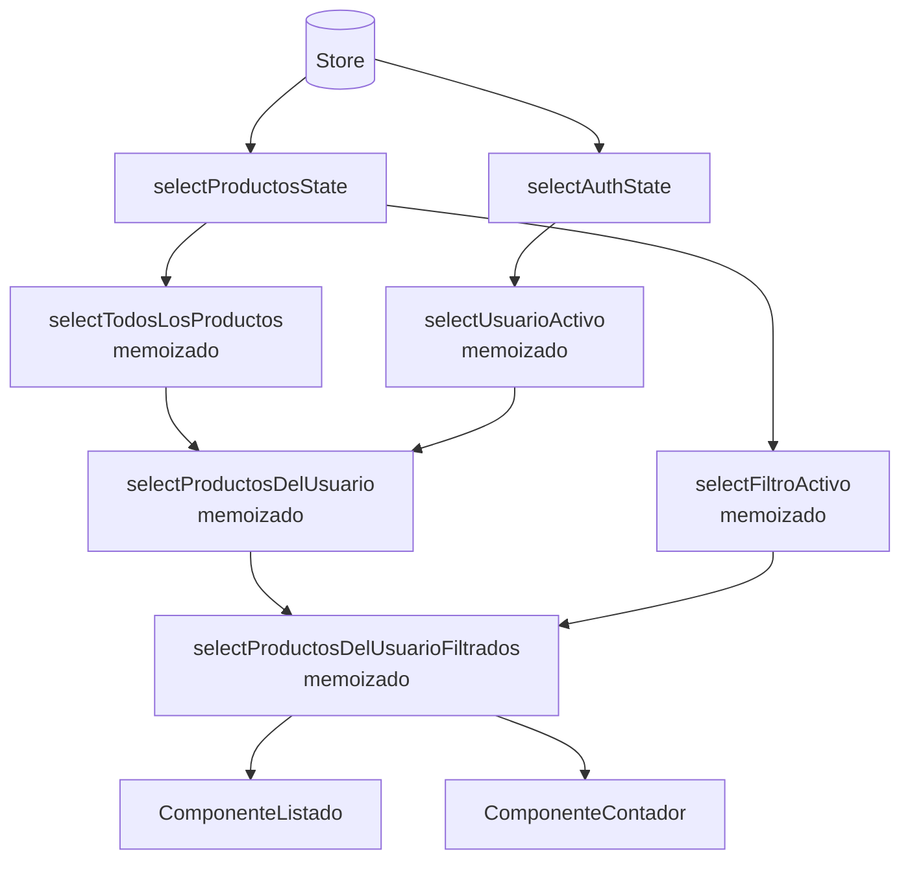

# Capítulo 22 - Parte 2: Selectors compuestos, memoización y createSelector

> **Parte 2 de 4** · Capítulo 22 · PARTE XI - Gestión de Estado con NgRx

Ya sabemos que los selectores se memoizan y se componen. Ahora veamos qué hay detrás de esa memoización, cuándo exactamente recalcula un selector, y cómo manejar los casos más avanzados: selectores con parámetros externos, personalización de la caché y cuándo limpiarla.

## Cómo funciona `defaultMemoize` por dentro

Cada selector creado con `createSelector` usa internamente `defaultMemoize`. Este mecanismo guarda el último conjunto de argumentos y el último resultado. Cuando el selector se invoca nuevamente:

1. Compara los argumentos actuales con los anteriores usando `===`.
2. Si **todos** son iguales por referencia, retorna el resultado cacheado sin llamar a la función proyectora.
3. Si **cualquiera** cambió, ejecuta la función proyectora con los nuevos argumentos y guarda el nuevo resultado.

La caché tiene tamaño 1 por defecto: solo recuerda la última invocación. Esto es suficiente para la mayoría de los casos porque los selectores generalmente se invocan con el estado actual del store.

```typescript
// Este selector recalcula solo si cambia la referencia de `productos`
// o la referencia de `filtro`
export const selectProductosFiltrados = createSelector(
  selectTodosLosProductos,  // input 1
  selectFiltroActivo,        // input 2
  (productos, filtro) => {   // proyectora: solo corre si input1 o input2 cambió
    if (!filtro.trim()) return productos;
    const termino = filtro.toLowerCase();
    return productos.filter((p) =>
      p.nombre.toLowerCase().includes(termino)
    );
  }
);
```

Si el usuario tipea en un campo que no actualiza el store, `selectProductosFiltrados` retorna el mismo array de la vez anterior, sin iterar, sin filtrar, sin crear objetos nuevos.

## Combinar múltiples partes del estado

Un selector puede recibir datos de distintos features del store. Esto es posible porque `createSelector` acepta cualquier selector como input, sin importar de qué feature venga:

```typescript
// src/app/productos/store/productos.selectors.ts
import { createSelector } from '@ngrx/store';
import { selectUsuarioActivo } from '../../auth/store/auth.selectors';
import {
  selectTodosLosProductos,
  selectFiltroActivo,
} from './productos-base.selectors';

// Selector que cruza dos features: productos y autenticación
export const selectProductosDelUsuario = createSelector(
  selectTodosLosProductos,
  selectUsuarioActivo,
  (productos, usuario) => {
    if (!usuario) return [];
    return productos.filter((p) => p.vendedorId === usuario.id);
  }
);

// Tres inputs: lista, filtro y usuario
export const selectProductosDelUsuarioFiltrados = createSelector(
  selectProductosDelUsuario,
  selectFiltroActivo,
  (productos, filtro) => {
    if (!filtro.trim()) return productos;
    const termino = filtro.toLowerCase();
    return productos.filter((p) =>
      p.nombre.toLowerCase().includes(termino)
    );
  }
);
```

Nótese que `selectProductosDelUsuarioFiltrados` usa `selectProductosDelUsuario` como input en lugar de `selectTodosLosProductos`. Los selectores se componen en capas: cambiar la capa inferior automáticamente propaga el cambio hacia arriba, y la memoización de cada capa sigue funcionando independientemente.

## Selectores con parámetros: la factory function

A veces necesitamos un selector parametrizado: "dame el producto con id X". El problema es que los selectores normales no aceptan argumentos externos. La solución es una **factory function**: una función que recibe el parámetro y retorna un selector.

```typescript
// Factory: retorna un selector diferente por cada id
export const selectProductoPorId = (id: number) =>
  createSelector(
    selectTodosLosProductos,
    (productos) => productos.find((p) => p.id === id) ?? null
  );
```

En el componente, lo usamos así:

```typescript
@Component({
  selector: 'app-detalle-producto',
  standalone: true,
  template: `
    @if (producto$ | async; as producto) {
      <h2>{{ producto.nombre }}</h2>
      <p>Precio: {{ producto.precio }}</p>
    }
  `,
})
export class DetalleProductoComponent implements OnInit {
  private readonly store = inject(Store);
  private readonly route = inject(ActivatedRoute);

  producto$!: Observable<Producto | null>;

  ngOnInit(): void {
    const id = Number(this.route.snapshot.paramMap.get('id'));
    this.producto$ = this.store.select(selectProductoPorId(id));
  }
}
```

Cada llamada a `selectProductoPorId(id)` crea un selector nuevo con su propia caché. Si el mismo `id` se usa en múltiples componentes activos simultáneamente, cada uno tiene su propia instancia y su propia memoización.

## El problema de las factories en la misma referencia

Cuando usamos la factory directamente en el template o en un `pipe` sin almacenar el selector, creamos una instancia nueva en cada detección de cambios, perdiendo la memoización:

```typescript
// MAL: crea un selector nuevo en cada detección de cambios
readonly producto$ = this.store.select(selectProductoPorId(this.id));
// Si this.id no cambia pero hay algún cambio de CD, recrea el selector

// BIEN: crear la instancia una sola vez
readonly selectorProducto = selectProductoPorId(this.idFijo);
readonly producto$ = this.store.select(this.selectorProducto);
```

## `createSelectorFactory`: personalizar la memoización

En casos especiales podemos crear nuestro propio mecanismo de memoización. Un ejemplo práctico: si nuestra función proyectora produce arrays y queremos comparar por contenido en lugar de por referencia, podemos usar una comparación más profunda:

```typescript
import { createSelectorFactory, resultMemoize } from '@ngrx/store';

// Comparador personalizado: considera iguales dos arrays con los mismos ids
function mismoContenidoPorId<T extends { id: number }>(
  a: T[],
  b: T[]
): boolean {
  if (a === b) return true;
  if (a.length !== b.length) return false;
  return a.every((item, i) => item.id === b[i].id);
}

const createSelectorConComparacion = createSelectorFactory((proyectora) =>
  resultMemoize(proyectora, mismoContenidoPorId)
);

export const selectProductosOrdenados = createSelectorConComparacion(
  selectProductosFiltrados,
  (productos) => [...productos].sort((a, b) => a.nombre.localeCompare(b.nombre))
);
```

Con esta configuración, `selectProductosOrdenados` no emitirá un nuevo array si el resultado ordenado tiene los mismos productos en el mismo orden, aunque la referencia del array haya cambiado. Esto puede evitar re-renders cuando el reducer crea un nuevo array pero el contenido no cambió significativamente.

## Limpiar la caché con `.release()`

Los selectores creados con `createSelector` exponen un método `.release()` que reinicia la caché interna. Es útil en tests para garantizar que un selector no recuerde valores de pruebas anteriores:

```typescript
// En tests
describe('selectProductosFiltrados', () => {
  afterEach(() => {
    selectProductosFiltrados.release(); // limpia la caché entre tests
  });

  it('filtra correctamente por nombre', () => {
    const resultado = selectProductosFiltrados.projector(
      productosEjemplo,
      'angular'
    );
    expect(resultado).toHaveLength(2);
  });
});
```

En producción, `.release()` rara vez se necesita. La caché de tamaño 1 no crece indefinitely y se reemplaza sola con cada nueva invocación.

## Diagrama de composición y memoización



Cada nodo del grafo tiene su propia caché. Si el usuario activo cambia, solo se recalculan `selectProductosDelUsuario` y `selectProductosDelUsuarioFiltrados`. `selectFiltroActivo` y `selectTodosLosProductos` retornan sus valores cacheados.

## Puntos clave

- `defaultMemoize` usa comparación `===` y guarda el último resultado; la caché tiene tamaño 1 por defecto.
- Los selectores se componen libremente entre features del store; cada capa mantiene su propia memoización independiente.
- Las factory functions `(param) => createSelector(...)` permiten selectores parametrizados; cada llamada crea una instancia separada con su propia caché.
- Al usar factories, almacenar la instancia del selector en una propiedad del componente para no perder la memoización entre detecciones de cambios.
- `createSelectorFactory` permite personalizar el comparador del resultado para casos donde la comparación por referencia no es suficiente.
- `.release()` limpia la caché manualmente; es especialmente útil en suites de tests.

## ¿Qué sigue?

Ahora que dominamos cómo consultar el estado, es momento de aprender cómo manejar operaciones asincrónicas -peticiones HTTP, timers, navegación- con los Effects de NgRx.
