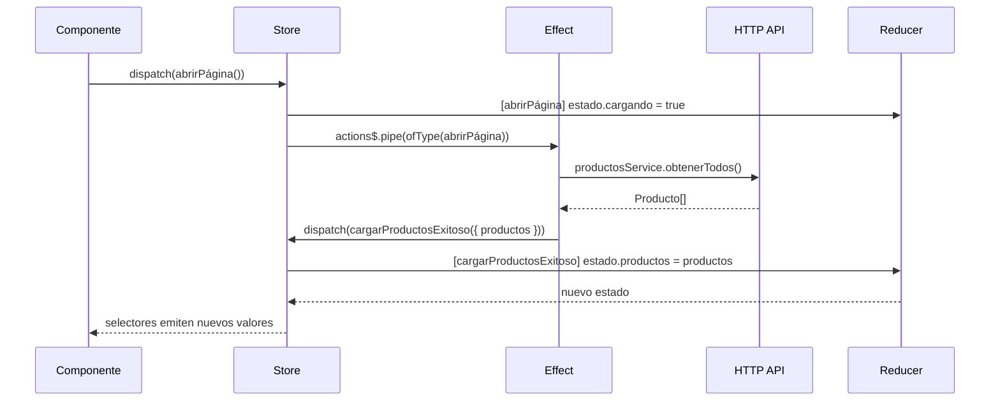

# Capítulo 22 - Parte 3: Effects: manejando efectos secundarios asincrónicos

> **Parte 3 de 4** · Capítulo 22 · PARTE XI - Gestión de Estado con NgRx

Hasta ahora, acciones y reducers viven en un mundo sincrónico y puro. Pero las aplicaciones reales hacen peticiones HTTP, navegan entre rutas, muestran notificaciones y escriben en localStorage. Todas estas operaciones son efectos secundarios -cosas que el reducer jamás debe tocar-. Los Effects son la respuesta de NgRx a ese problema.

## El problema que resuelven los Effects

El reducer debe ser puro: sin llamadas a servicios, sin `setTimeout`, sin nada asincrónico. Entonces, ¿quién llama a la API cuando el usuario pide cargar productos? ¿Quién navega después de un login exitoso?

Los Effects escuchan el stream de acciones, reaccionan a ciertos tipos, ejecutan la operación asincrónica, y despachan nuevas acciones con el resultado. Son el middleware entre las acciones y el mundo exterior.

## Anatomía de un Effect

```typescript
// src/app/productos/store/productos.effects.ts
import { inject } from '@angular/core';
import { Actions, createEffect, ofType } from '@ngrx/effects';
import { switchMap, map, catchError } from 'rxjs/operators';
import { of } from 'rxjs';
import { ProductosService } from '../services/productos.service';
import {
  ProductosPaginaActions,
  ProductosApiActions,
} from './productos.actions';

export class ProductosEffects {
  private readonly actions$ = inject(Actions);
  private readonly productosService = inject(ProductosService);

  cargarProductos$ = createEffect(() =>
    this.actions$.pipe(
      ofType(ProductosPaginaActions.abrirPágina),
      switchMap(() =>
        this.productosService.obtenerTodos().pipe(
          map((productos) =>
            ProductosApiActions.cargarProductosExitoso({ productos })
          ),
          catchError((error: unknown) => {
            const mensaje =
              error instanceof Error ? error.message : 'Error desconocido';
            return of(ProductosApiActions.cargarProductosFallido({ error: mensaje }));
          })
        )
      )
    )
  );
}
```

Analicemos cada pieza:

- **`createEffect(() => ...)`**: la factory function envuelve al efecto. NgRx lo registra, lo suscribe automáticamente y maneja la limpieza al destruir el servicio.
- **`inject(Actions)`**: el stream `Actions` emite cada acción despachada al store, en orden.
- **`ofType(accion)`**: filtra el stream para que solo pasen las acciones del tipo especificado. Acepta múltiples tipos separados por coma.
- **`switchMap`**: se suscribe al observable de la petición HTTP y cancela la anterior si llega una nueva acción antes de que termine. Lo veremos en profundidad en la siguiente parte.
- **`map`**: transforma la respuesta exitosa en una acción de éxito.
- **`catchError`**: captura errores y retorna una acción de fallo. Está adentro del `switchMap` -eso es crítico y lo explicaremos enseguida.

## Registrar los Effects en la aplicación

```typescript
// app.config.ts
import { provideEffects } from '@ngrx/effects';
import { ProductosEffects } from './productos/store/productos.effects';

export const appConfig: ApplicationConfig = {
  providers: [
    provideStore(),
    provideState(productosFeature),
    provideEffects(ProductosEffects),
  ],
};
```

## Effects que no despachan acciones: `{ dispatch: false }`

No todos los effects necesitan despachar una acción de vuelta al store. Para casos como logging, navegación o mostrar notificaciones, usamos `{ dispatch: false }`:

```typescript
import { Router } from '@angular/router';
import { tap } from 'rxjs/operators';

export class ProductosEffects {
  private readonly actions$ = inject(Actions);
  private readonly router = inject(Router);

  navegarAlDetalle$ = createEffect(
    () =>
      this.actions$.pipe(
        ofType(ProductosApiActions.guardarProductoExitoso),
        tap(({ producto }) => {
          this.router.navigate(['/productos', producto.id]);
        })
      ),
    { dispatch: false }
  );

  registrarError$ = createEffect(
    () =>
      this.actions$.pipe(
        ofType(ProductosApiActions.cargarProductosFallido),
        tap(({ error }) => {
          console.error('[ProductosEffect] Error al cargar:', error);
        })
      ),
    { dispatch: false }
  );
}
```

Sin `{ dispatch: false }`, NgRx esperaría que el observable retorne acciones para despachar. Como `tap` no transforma el valor (retorna la acción original que ya fue procesada), se produciría un bucle infinito. El flag `{ dispatch: false }` le dice a NgRx "este effect solo produce efectos secundarios, no despacha nada".

## El flujo completo: action → effect → action → reducer → state



El ciclo es unidireccional: la acción inicia todo, el effect reacciona sin tocar el estado, y el reducer integra el resultado.

## Por qué NUNCA mutar estado en un Effect

Es tentador actualizar el estado directamente dentro de un effect, especialmente si venimos de patrones sin NgRx. Pero hacerlo rompe las garantías del sistema:

```typescript
// MAL: nunca hacer esto
cargarProductos$ = createEffect(
  () =>
    this.actions$.pipe(
      ofType(ProductosPaginaActions.abrirPágina),
      tap(() => {
        // INCORRECTO: mutar estado aquí lo hace invisible para el store
        this.productosService.cache = [];
      })
    ),
  { dispatch: false }
);
```

El store no sabrá que algo cambió, los selectores no emitirán, la UI no se actualizará, y el time-travel debugging dejará de funcionar. La regla es absoluta: **los effects comunican sus resultados exclusivamente despachando acciones**.

## Un effect más completo: eliminar un producto

Veamos un example que maneja la acción de inicio y sus dos posibles desenlaces:

```typescript
eliminarProducto$ = createEffect(() =>
  this.actions$.pipe(
    ofType(ProductosPaginaActions.eliminarProductoSolicitado),
    switchMap(({ id }) =>
      this.productosService.eliminar(id).pipe(
        map(() =>
          ProductosApiActions.eliminarProductoExitoso({ id })
        ),
        catchError((error: unknown) => {
          const mensaje =
            error instanceof Error ? error.message : 'Error al eliminar';
          return of(
            ProductosApiActions.eliminarProductoFallido({ error: mensaje })
          );
        })
      )
    )
  )
);
```

El `catchError` captura cualquier error del `productosService.eliminar()` y lo convierte en una acción que el reducer manejará. La UI puede entonces mostrar un mensaje de error sin necesitar lógica compleja en el componente.

## Puntos clave

- Los Effects son el lugar para todo lo asincrónico o con efectos secundarios: HTTP, navegación, localStorage, logging.
- `createEffect(() => ...)` recibe una factory function; NgRx se encarga de suscribir, gestionar errores no capturados y limpiar al destruir.
- `inject(Actions)` da acceso al stream de todas las acciones; `ofType()` filtra por tipo con TypeScript completo.
- `{ dispatch: false }` es obligatorio cuando el effect no retorna acciones (logging, navegación, notificaciones).
- El `catchError` siempre debe ir **dentro** del operador de aplanamiento (`switchMap`, `concatMap`, etc.), no fuera, para que un error no mate el effect completo.
- Jamás mutar estado dentro de un effect; toda comunicación de resultados se hace despachando acciones.

## ¿Qué sigue?

En la parte final del capítulo veremos en detalle cuándo usar `switchMap`, `concatMap`, `exhaustMap` y `mergeMap`, y dominaremos el patrón correcto de manejo de errores para que los effects nunca mueran inesperadamente.
