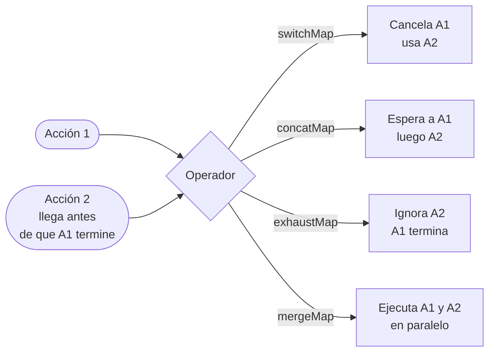

# Capítulo 22 - Parte 4: Effects con operadores RxJS: switchMap, concatMap, error handling

> **Parte 4 de 4** · Capítulo 22 · PARTE XI - Gestión de Estado con NgRx

La parte anterior nos mostró la estructura básica de un effect. Ahora profundizamos en la decisión que más afecta el comportamiento de nuestros effects: qué operador RxJS usamos para aplanar el observable interno. Elegir mal entre `switchMap`, `concatMap`, `exhaustMap` y `mergeMap` puede producir condiciones de carrera, datos corruptos o peticiones duplicadas. Veamos cada uno con su caso de uso real.

## Por qué importa el operador de aplanamiento

Cuando un efecto escucha una acción y hace una petición HTTP, hay un momento en que el observable externo (el stream de acciones) y el observable interno (la petición) coexisten. El operador de aplanamiento decide qué hacer cuando llega una nueva acción antes de que termine la petición anterior:



## `switchMap`: cargar datos (cancela la petición anterior)

Úsalo cuando solo importa el resultado más reciente. Si el usuario navega a una lista, escribe en un buscador o cambia un filtro, cualquier petición anterior ya no es relevante.

```typescript
// src/app/productos/store/productos.effects.ts
cargarProductos$ = createEffect(() =>
  this.actions$.pipe(
    ofType(ProductosPaginaActions.abrirPágina),
    switchMap(() =>
      this.productosService.obtenerTodos().pipe(
        map((productos) =>
          ProductosApiActions.cargarProductosExitoso({ productos })
        ),
        catchError((error: unknown) =>
          of(ProductosApiActions.cargarProductosFallido({
            error: mensajeDeError(error),
          }))
        )
      )
    )
  )
);

buscarProductos$ = createEffect(() =>
  this.actions$.pipe(
    ofType(ProductosPaginaActions.actualizarFiltro),
    switchMap(({ filtro }) =>
      this.productosService.buscar(filtro).pipe(
        map((productos) =>
          ProductosApiActions.cargarProductosExitoso({ productos })
        ),
        catchError((error: unknown) =>
          of(ProductosApiActions.cargarProductosFallido({
            error: mensajeDeError(error),
          }))
        )
      )
    )
  )
);
```

El riesgo de `switchMap`: **nunca usar para operaciones de escritura (POST/PUT/DELETE)**. Si el usuario guarda un formulario dos veces rápido, `switchMap` cancelaría la primera escritura. El servidor podría haber procesado la primera pero nunca saberlo.

## `concatMap`: operaciones que deben ejecutarse en orden

Úsalo cuando el orden importa y no queremos perder ninguna operación. Es como una cola FIFO: la segunda petición espera a que termine la primera.

```typescript
actualizarProducto$ = createEffect(() =>
  this.actions$.pipe(
    ofType(ProductosPaginaActions.actualizarCampoProducto),
    concatMap(({ id, cambios }) =>
      this.productosService.actualizar(id, cambios).pipe(
        map((producto) =>
          ProductosApiActions.actualizarProductoExitoso({ producto })
        ),
        catchError((error: unknown) =>
          of(ProductosApiActions.actualizarProductoFallido({
            error: mensajeDeError(error),
          }))
        )
      )
    )
  )
);
```

Un caso clásico: el usuario edita campos de un formulario y cada cambio dispara una acción de autoguardado. Con `concatMap`, el segundo guardado espera al primero, garantizando que el servidor siempre vea el orden correcto de cambios.

La desventaja: si hay muchas acciones en cola y cada petición tarda, el usuario puede esperar. Para mitigar esto, combinamos `concatMap` con debounce antes del effect, pero eso es tema de optimización avanzada.

## `exhaustMap`: prevenir duplicados (login, guardar formulario)

Úsalo cuando quieres ignorar acciones repetidas mientras ya hay una en curso. Ideal para formularios de login, botones de pago o cualquier operación que no debe ejecutarse dos veces.

```typescript
// src/app/auth/store/auth.effects.ts
iniciarSesion$ = createEffect(() =>
  this.actions$.pipe(
    ofType(AuthPaginaActions.enviarFormularioLogin),
    exhaustMap(({ credenciales }) =>
      this.authService.login(credenciales).pipe(
        map((usuario) =>
          AuthApiActions.loginExitoso({ usuario })
        ),
        catchError((error: unknown) =>
          of(AuthApiActions.loginFallido({
            error: mensajeDeError(error),
          }))
        )
      )
    )
  )
);
```

Si el usuario hace clic en "Ingresar" tres veces seguidas, `exhaustMap` procesa solo el primer clic e ignora los dos restantes hasta que el login termine (con éxito o error). Así evitamos condiciones de carrera y sesiones duplicadas.

## `mergeMap`: operaciones independientes en paralelo

Úsalo cuando cada operación es independiente de las demás y no hay problema en que corran en paralelo. Un ejemplo: marcar múltiples notificaciones como leídas.

```typescript
marcarNotificacionLeida$ = createEffect(() =>
  this.actions$.pipe(
    ofType(NotificacionesPaginaActions.marcarComoLeida),
    mergeMap(({ notificacionId }) =>
      this.notificacionesService.marcarLeida(notificacionId).pipe(
        map(() =>
          NotificacionesApiActions.marcarLeidaExitoso({ notificacionId })
        ),
        catchError((error: unknown) =>
          of(NotificacionesApiActions.marcarLeidaFallido({
            notificacionId,
            error: mensajeDeError(error),
          }))
        )
      )
    )
  )
);
```

Si el usuario marca 5 notificaciones, se lanzan 5 peticiones en paralelo. Si una falla, las demás no se ven afectadas. El riesgo de `mergeMap` es que no hay límite de concurrencia: 100 acciones simultáneas producen 100 peticiones HTTP. En esos casos conviene usar `mergeMap` con un límite (`mergeMap(fn, 3)` para máximo 3 en paralelo).

## El error handling correcto: `catchError` adentro, no afuera

Esta es la regla más importante del manejo de errores en effects. Veamos la diferencia:

```typescript
// MAL: catchError fuera del switchMap - el effect muere con el primer error
cargarProductosMal$ = createEffect(() =>
  this.actions$.pipe(
    ofType(ProductosPaginaActions.abrirPágina),
    switchMap(() => this.productosService.obtenerTodos()),
    map((productos) =>
      ProductosApiActions.cargarProductosExitoso({ productos })
    ),
    catchError((error: unknown) =>           // ← fuera: captura y completa el observable
      of(ProductosApiActions.cargarProductosFallido({
        error: mensajeDeError(error),
      }))
    )
  )
);
// Después del primer error, el stream externo completa y el effect deja de escuchar
```

```typescript
// BIEN: catchError dentro del switchMap - el effect sigue vivo
cargarProductosBien$ = createEffect(() =>
  this.actions$.pipe(
    ofType(ProductosPaginaActions.abrirPágina),
    switchMap(() =>
      this.productosService.obtenerTodos().pipe(    // ← observable interno
        map((productos) =>
          ProductosApiActions.cargarProductosExitoso({ productos })
        ),
        catchError((error: unknown) =>              // ← dentro: solo cierra el interno
          of(ProductosApiActions.cargarProductosFallido({
            error: mensajeDeError(error),
          }))
        )
      )
    )
  )
);
// Si falla, el stream externo (actions$) sigue vivo para la próxima acción
```

Cuando el `catchError` está adentro del `switchMap`, solo completa el observable interno (la petición HTTP). El observable externo (`actions$.pipe(...)`) sigue abierto y reacciona a la siguiente acción de `abrirPágina`. Con el `catchError` afuera, un error cierra el stream completo y el effect queda muerto en silencio.

## Función utilitaria para mensajes de error

En TypeScript strict, el error que llega a `catchError` es de tipo `unknown`. Es buena práctica extraer el mensaje de forma segura:

```typescript
function mensajeDeError(error: unknown): string {
  if (error instanceof Error) return error.message;
  if (typeof error === 'string') return error;
  return 'Ocurrió un error inesperado';
}
```

## Example completo con `switchMap` + `catchError` correcto

Reunamos todo en un effect de producción real:

```typescript
import { inject } from '@angular/core';
import { Actions, createEffect, ofType } from '@ngrx/effects';
import { switchMap, map, catchError, tap } from 'rxjs/operators';
import { of } from 'rxjs';
import { ProductosService } from '../services/productos.service';
import { ProductosPaginaActions, ProductosApiActions } from './productos.actions';

function mensajeDeError(error: unknown): string {
  if (error instanceof Error) return error.message;
  if (typeof error === 'string') return error;
  return 'Ocurrió un error inesperado';
}

export class ProductosEffects {
  private readonly actions$ = inject(Actions);
  private readonly productosService = inject(ProductosService);

  cargarProductos$ = createEffect(() =>
    this.actions$.pipe(
      ofType(ProductosPaginaActions.abrirPágina),
      switchMap(() =>
        this.productosService.obtenerTodos().pipe(
          map((productos) =>
            ProductosApiActions.cargarProductosExitoso({ productos })
          ),
          catchError((error: unknown) => {
            console.error('[ProductosEffect] cargarProductos falló:', error);
            return of(
              ProductosApiActions.cargarProductosFallido({
                error: mensajeDeError(error),
              })
            );
          })
        )
      )
    )
  );

  eliminarProducto$ = createEffect(() =>
    this.actions$.pipe(
      ofType(ProductosPaginaActions.eliminarProductoSolicitado),
      concatMap(({ id }) =>
        this.productosService.eliminar(id).pipe(
          map(() => ProductosApiActions.eliminarProductoExitoso({ id })),
          catchError((error: unknown) =>
            of(
              ProductosApiActions.eliminarProductoFallido({
                error: mensajeDeError(error),
              })
            )
          )
        )
      )
    )
  );
}
```

## Tabla de decisión: qué operador elegir

| Operador | ¿Qué hace con petición anterior? | Cuándo usarlo |
|---|---|---|
| `switchMap` | La cancela | Cargar datos, búsqueda en tiempo real |
| `concatMap` | Espera a que termine | Escrituras secuenciales, autoguardado |
| `exhaustMap` | Ignora la nueva acción | Login, pago, operaciones únicas |
| `mergeMap` | Las ejecuta en paralelo | Operaciones independientes por ítem |

## Puntos clave

- `switchMap` es para lecturas: cancela la petición anterior si llega una nueva acción del mismo tipo.
- `concatMap` es para escrituras secuenciales: garantiza el orden sin perder ninguna operación.
- `exhaustMap` previene duplicados: ignora acciones mientras ya hay una en vuelo; perfecto para login y formularios de pago.
- `mergeMap` ejecuta todo en paralelo: útil cuando las operaciones son verdaderamente independientes entre sí.
- El `catchError` **siempre debe ir dentro** del operador de aplanamiento, no fuera; de lo contrario, el primer error mata el effect en silencio.
- Retornar `of(accionFallido({ error }))` desde el `catchError` garantiza que el reducer maneje el error y la UI informe al usuario.

## ¿Qué sigue?

Con acciones, reducers, selectores y effects dominados, el siguiente capítulo introduce `@ngrx/entity` para manejar colecciones de entidades de forma aún más eficiente, eliminando el código manual de `map`, `filter` y `find` que escribimos hasta ahora.
