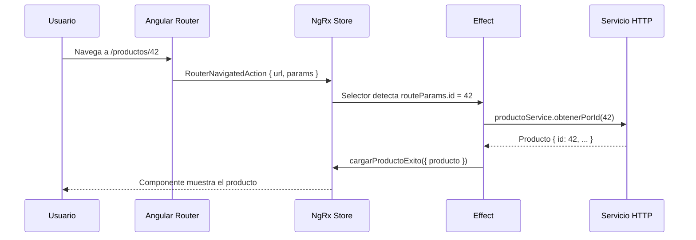

# Capítulo 23 - Parte 2: NgRx Router Store: sincronizando router y store

> **Parte 2 de 4** · Capítulo 23 · PARTE XI - Gestión de Estado con NgRx

---

## ¿Por qué sincronizar el router con el store?

Cuando trabajamos con NgRx, el store se convierte en la única fuente de verdad para el estado de la aplicación. Sin embargo, hay una porción del estado que vive fuera de él por defecto: la URL actual. Esto crea una asimetría incómoda: si queremos que un effect cargue datos basándose en el ID que viene en la URL, necesitamos inyectar `ActivatedRoute` en el componente, extraer el parámetro, y luego disparar la acción. El componente termina siendo un mediador innecesario.

`@ngrx/router-store` resuelve este problema de manera elegante: cada navegación del router de Angular se traduce automáticamente en una acción del store, y los parámetros de ruta quedan disponibles como estado del store, accesibles desde cualquier selector o effect.

El flujo que buscamos es el siguiente:



---

## Instalación y configuración

`@ngrx/router-store` viene incluido en el ecosistema NgRx. Si ya tenemos NgRx instalado, solo necesitamos agregar el proveedor:

```typescript
// src/main.ts
import { bootstrapApplication } from '@angular/platform-browser';
import { provideRouter } from '@angular/router';
import { provideStore } from '@ngrx/store';
import { provideRouterStore, routerReducer } from '@ngrx/router-store';
import { AppComponent } from './app/app.component';
import { rutas } from './app/app.routes';

bootstrapApplication(AppComponent, {
  providers: [
    provideRouter(rutas),
    provideStore({
      router: routerReducer,
    }),
    provideRouterStore(),
  ],
});
```

Dos elementos son indispensables:

1. **`routerReducer`**: el reducer que maneja las acciones del router. Debe registrarse con la clave `router` en el store (es el nombre convencional que esperan los selectores predefinidos).
2. **`provideRouterStore()`**: conecta el router de Angular con el store, interceptando cada evento de navegación.

---

## Qué almacena el Router Store en el state

Una vez configurado, la slice `router` del store tiene esta forma:

```typescript
interface RouterReducerState {
  state: {
    url: string;
    params: Params;       // params de la ruta activa
    queryParams: Params;  // query string (?clave=valor)
    data: Data;           // data estática de la ruta
    fragment: string | null;
  };
  navigationId: number;
}
```

Por ejemplo, si el usuario navega a `/productos/42?modo=edicion`, el estado del router en el store se vería así:

```json
{
  "router": {
    "state": {
      "url": "/productos/42?modo=edicion",
      "params": { "id": "42" },
      "queryParams": { "modo": "edicion" },
      "data": { "titulo": "Detalle de Producto" },
      "fragment": null
    },
    "navigationId": 3
  }
}
```

---

## Selectores predefinidos

`@ngrx/router-store` exporta selectores listos para usar que evitan que tengamos que escribir el acceso manual al estado del router:

```typescript
import {
  selectUrl,
  selectRouteParams,
  selectQueryParams,
  selectRouteData,
  selectCurrentRoute,
} from '@ngrx/router-store';

// En un selector compuesto:
export const selectIdProductoActual = createSelector(
  selectRouteParams,
  (params) => params['id'] as string
);

export const selectModoEdicion = createSelector(
  selectQueryParams,
  (queryParams) => queryParams['modo'] === 'edicion'
);

export const selectTituloRuta = createSelector(
  selectRouteData,
  (data) => (data['titulo'] as string) ?? 'Sin título'
);
```

Estos selectores son particularmente poderosos cuando los combinamos con selectores del dominio para crear selectores compuestos ricos:

```typescript
// src/app/productos/estado/productos.selectors.ts
import { createSelector } from '@ngrx/store';
import { selectRouteParams } from '@ngrx/router-store';
import { selectEntidadesProductos } from './productos.selectors';

export const selectProductoDeRuta = createSelector(
  selectEntidadesProductos,
  selectRouteParams,
  (entidades, params) => {
    const id = params['id'];
    return id ? (entidades[id] ?? null) : null;
  }
);
```

Este selector devuelve automáticamente el producto correcto cada vez que la URL cambia. El componente solo necesita suscribirse y listo.

---

## RouterNavigatedAction como trigger para cargar datos

La acción más útil del router store es `routerNavigatedAction`. Se dispara después de que una navegación se completa exitosamente, y podemos usarla en nuestros effects como trigger:

```typescript
// src/app/productos/estado/productos.effects.ts
import { inject, Injectable } from '@angular/core';
import { Actions, createEffect, ofType } from '@ngrx/effects';
import { Store } from '@ngrx/store';
import { ROUTER_NAVIGATED, routerNavigatedAction } from '@ngrx/router-store';
import { switchMap, map, catchError, withLatestFrom, filter } from 'rxjs/operators';
import { of } from 'rxjs';
import { ProductosService } from '../servicios/productos.service';
import { ProductosActions } from './productos.actions';
import { selectIdProductoActual } from './productos.selectors';

@Injectable()
export class ProductosEffects {
  private readonly acciones$ = inject(Actions);
  private readonly store = inject(Store);
  private readonly productosService = inject(ProductosService);

  cargarProductoAlNavegar$ = createEffect(() =>
    this.acciones$.pipe(
      ofType(routerNavigatedAction),
      withLatestFrom(this.store.select(selectIdProductoActual)),
      filter(([, id]) => id !== null),
      switchMap(([, id]) =>
        this.productosService.obtenerPorId(id!).pipe(
          map((producto) => ProductosActions.cargarProductoExito({ producto })),
          catchError((error: Error) =>
            of(ProductosActions.cargarProductoError({ error: error.message }))
          )
        )
      )
    )
  );
}
```

El patrón `withLatestFrom` + `filter` es clave: nos aseguramos de que solo reaccionamos a navegaciones donde el selector del ID de ruta tiene un valor. Si el usuario navega a `/productos` (sin ID), el filter lo descarta.

---

## Configuración del serializer personalizado

Por defecto, `@ngrx/router-store` serializa el snapshot completo del router, que puede ser un objeto muy grande. Para producción, es recomendable usar un serializer personalizado que solo capture lo que necesitamos:

```typescript
// src/app/core/router-serializer.ts
import { RouterStateSnapshot } from '@angular/router';
import { RouterStateSerializer } from '@ngrx/router-store';

export interface EstadoRutaMinimo {
  url: string;
  params: Record<string, string>;
  queryParams: Record<string, string>;
  data: Record<string, unknown>;
}

export class SerializadorRutaMinimo
  implements RouterStateSerializer<EstadoRutaMinimo>
{
  serialize(routerState: RouterStateSnapshot): EstadoRutaMinimo {
    let ruta = routerState.root;
    while (ruta.firstChild) {
      ruta = ruta.firstChild;
    }

    return {
      url: routerState.url,
      params: ruta.params as Record<string, string>,
      queryParams: routerState.root.queryParams as Record<string, string>,
      data: ruta.data as Record<string, unknown>,
    };
  }
}
```

Lo registramos en el proveedor:

```typescript
// src/main.ts
import { RouterStateSerializer } from '@ngrx/router-store';
import { SerializadorRutaMinimo } from './app/core/router-serializer';

bootstrapApplication(AppComponent, {
  providers: [
    provideRouterStore(),
    {
      provide: RouterStateSerializer,
      useClass: SerializadorRutaMinimo,
    },
  ],
});
```

---

## Usando selectores de ruta en componentes

Con todo configurado, los componentes quedan completamente limpios: no inyectan `ActivatedRoute`, no manejan subscripciones al router. Solo consumen el store:

```typescript
// src/app/productos/componentes/detalle-producto.component.ts
import { Component, inject } from '@angular/core';
import { Store } from '@ngrx/store';
import { AsyncPipe } from '@angular/common';
import { selectProductoDeRuta, selectModoEdicion } from '../estado/productos.selectors';

@Component({
  selector: 'app-detalle-producto',
  standalone: true,
  imports: [AsyncPipe],
  template: `
    @if (producto$ | async; as producto) {
      <h1>{{ producto.nombre }}</h1>
      <p>Precio: ${{ producto.precio }}</p>
      @if (modoEdicion$ | async) {
        <p>Modo edición activo</p>
      }
    } @else {
      <p>Cargando producto...</p>
    }
  `,
})
export class DetalleProductoComponent {
  private readonly store = inject(Store);

  readonly producto$ = this.store.select(selectProductoDeRuta);
  readonly modoEdicion$ = this.store.select(selectModoEdicion);
}
```

El componente no sabe nada de la URL. No sabe si estamos en `/productos/42` o en `/catalogo/42`. El selector abstrae esa relación completamente.

---

## Puntos clave

- `provideRouterStore()` + `routerReducer` integran el router de Angular con el store NgRx, sin configuración adicional obligatoria.
- Cada navegación se convierte en una `routerNavigatedAction` que cualquier effect puede escuchar con `ofType(routerNavigatedAction)`.
- Los selectores `selectUrl`, `selectRouteParams`, `selectQueryParams` y `selectRouteData` exponen los datos de la ruta activa como estado del store.
- El patrón `withLatestFrom` + selector de ruta en un effect elimina la necesidad de inyectar `ActivatedRoute` en componentes o effects.
- Un `RouterStateSerializer` personalizado reduce el tamaño del estado serializado y mejora el rendimiento en producción.

## ¿Qué sigue?

En la siguiente parte conoceremos NgRx DevTools y aprenderemos a usar el time-travel debugging para inspeccionar y reproducir cualquier secuencia de acciones durante el desarrollo.
