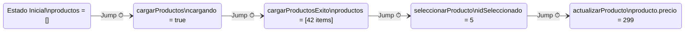

# Capítulo 23 - Parte 3: NgRx DevTools: debugging con time-travel

> **Parte 3 de 4** · Capítulo 23 · PARTE XI - Gestión de Estado con NgRx

---

## La herramienta que cambia la forma de hacer debugging

Antes de NgRx, hacer debugging de una aplicación Angular implicaba colocar `console.log` en componentes, inspeccionar el DOM, o adivinar qué había cambiado en el estado. Con NgRx y las Redux DevTools, esa etapa queda atrás.

Las Redux DevTools nos permiten ver en tiempo real cada acción que se dispara, el estado antes y después de cada una, el diff exacto entre estados, y lo más impresionante: viajar en el tiempo para recrear exactamente cualquier punto del historial de la aplicación. Si un bug ocurre en una secuencia específica de acciones, podemos reproducirlo exactamente sin necesidad de repetir la interacción manualmente.

---

## Instalación en dos pasos

**Paso 1**: Instalar la extensión del navegador. Está disponible para Chrome y Firefox como "Redux DevTools Extension". Una vez instalada, aparece un panel "Redux" en las DevTools del navegador.

**Paso 2**: Registrar el proveedor en la aplicación:

```typescript
// src/main.ts
import { bootstrapApplication } from '@angular/platform-browser';
import { isDevMode } from '@angular/core';
import { provideStore } from '@ngrx/store';
import { provideStoreDevtools } from '@ngrx/store-devtools';
import { AppComponent } from './app/app.component';
import { reducers } from './app/store';

bootstrapApplication(AppComponent, {
  providers: [
    provideStore(reducers),
    provideStoreDevtools({
      maxAge: 25,
      logOnly: !isDevMode(),
      autoPause: true,
      trace: false,
      traceLimit: 75,
      name: 'Mi App Angular',
    }),
  ],
});
```

Analicemos cada opción de configuración:

- **`maxAge: 25`**: cuántas acciones se almacenan en el historial. Un valor mayor consume más memoria.
- **`logOnly: !isDevMode()`**: en producción, la extensión puede conectarse pero solo en modo lectura, sin poder disparar acciones. Esto es crucial por seguridad.
- **`autoPause: true`**: pausa la grabación automáticamente cuando el panel DevTools no está visible, mejorando el rendimiento.
- **`name`**: identifica la instancia del store cuando tenemos múltiples aplicaciones abiertas.

---

## Navegando el panel de Redux DevTools

Una vez configurado, abrimos las DevTools del navegador (F12) y vamos a la pestaña "Redux". Veremos tres paneles principales:

**Panel izquierdo - Historial de acciones**: lista cronológica de todas las acciones disparadas. Cada entrada muestra el tipo de acción y el tiempo transcurrido desde la acción anterior.

**Panel derecho - Inspector de estado**: al seleccionar cualquier acción del historial, podemos ver:

- **Action**: el objeto completo de la acción, incluyendo su `type` y payload.
- **State**: el estado completo del store después de aplicar esa acción.
- **Diff**: las propiedades exactas que cambiaron entre el estado anterior y el actual.

El Diff es especialmente valioso: en lugar de comparar dos objetos grandes, la extensión resalta en verde lo que se agregó, en rojo lo que se eliminó, y en amarillo lo que cambió.

---

## Time-travel: saltando por el historial

El time-travel es la funcionalidad más llamativa. En el panel izquierdo, cada acción tiene un botón "Jump" que nos lleva al estado de la aplicación en ese momento preciso.



Al hacer "Jump" a la acción `cargarProductos`, la UI regresa visualmente al estado de carga: el spinner aparece, la tabla desaparece. Al hacer "Jump" a `cargarProductosExito`, la tabla vuelve a aparecer con sus 42 productos. La interfaz reacciona al estado del store, que es exactamente lo que queremos verificar.

Además del Jump, podemos:

- **Skip**: deshabilitar temporalmente una acción para ver cómo quedaría el estado sin ella.
- **Pin**: fijar el estado en un punto específico para compararlo con el estado actual.

---

## Replay y exportación de estados

Cuando un usuario reporta un bug, la conversación típica es: "hice clic en esto, luego en aquello, luego apareció el error". Con DevTools, podemos pedirle al usuario que exporte el estado y nos lo envíe:

```typescript
// El usuario exporta el estado desde el panel DevTools
// y nos comparte el JSON resultante. Nosotros lo importamos
// en nuestro entorno y reproducimos el bug exactamente.
```

El botón "Export" en el panel DevTools genera un JSON con todo el historial de acciones y estados. El botón "Import" permite cargarlo en cualquier otra instancia de la aplicación. Esto convierte los reportes de bugs vagos en reproducciones exactas.

---

## actionSanitizer y stateSanitizer para datos sensibles

En producción no queremos que las DevTools expongan datos sensibles como tokens de autenticación o información personal. Los sanitizers nos permiten limpiar los datos antes de que lleguen a la extensión:

```typescript
// src/main.ts
import { provideStoreDevtools, ActionSanitizer, StateSanitizer } from '@ngrx/store-devtools';

const limpiarAccion: ActionSanitizer = (accion, id) => {
  if (accion.type === '[Auth] Login Exitoso') {
    return {
      ...accion,
      token: '**REDACTADO**',
      usuario: { ...(accion as { usuario: { email: string } }).usuario, email: '**REDACTADO**' },
    };
  }
  return accion;
};

const limpiarEstado: StateSanitizer = (estado, index) => {
  const estadoTipado = estado as { auth?: { token?: string } };
  if (estadoTipado.auth?.token) {
    return {
      ...estadoTipado,
      auth: {
        ...estadoTipado.auth,
        token: '**REDACTADO**',
      },
    };
  }
  return estado;
};

bootstrapApplication(AppComponent, {
  providers: [
    provideStoreDevtools({
      maxAge: 25,
      logOnly: !isDevMode(),
      actionSanitizer: limpiarAccion,
      stateSanitizer: limpiarEstado,
    }),
  ],
});
```

Los sanitizers se ejecutan antes de que los datos lleguen a la extensión del navegador. Los datos en el store de la aplicación no se ven afectados, solo la visualización en DevTools.

---

## Uso avanzado: acciones bloqueadas y permitidas

Podemos filtrar qué acciones aparecen en el panel para reducir el ruido, especialmente útil en aplicaciones con muchas acciones de router:

```typescript
provideStoreDevtools({
  maxAge: 25,
  logOnly: !isDevMode(),
  // Solo mostrar acciones de productos y pedidos
  predicate: (_state, accion) =>
    accion.type.startsWith('[Productos]') ||
    accion.type.startsWith('[Pedidos]'),
})
```

O alternativamente, usar las listas de bloqueo:

```typescript
provideStoreDevtools({
  maxAge: 25,
  logOnly: !isDevMode(),
  // Excluir acciones ruidosas del router
  actionsBlocklist: [
    '@ngrx/router-store/navigated',
    '@ngrx/router-store/request',
    '@ngrx/router-store/cancel',
  ],
})
```

---

## Integrando DevTools con el flujo de desarrollo

La forma más efectiva de usar DevTools es establecer un flujo de trabajo:

1. **Desarrollar**: disparar acciones normalmente mientras se interactúa con la app.
2. **Verificar**: en DevTools, confirmar que cada acción llega con el payload correcto y que el estado resultante es el esperado.
3. **Depurar**: cuando algo falla, usar el Diff para ver exactamente qué cambió (o no cambió) y en qué acción.
4. **Reproducir**: si el bug es intermitente, exportar el historial, importarlo cuando el bug ocurra, y trabajar con el estado exacto donde el bug se manifestó.

Este flujo convierte el debugging de NgRx en un proceso científico y reproducible, en lugar de una sesión de adivinanzas.

---

## Puntos clave

- `provideStoreDevtools({ logOnly: !isDevMode() })` habilita la integración con Redux DevTools Extension manteniendo producción en modo solo-lectura.
- El panel de DevTools muestra el historial de acciones, el estado en cada punto, y el diff entre estados, eliminando la necesidad de `console.log`.
- El time-travel permite saltar a cualquier punto del historial y ver la UI exactamente como estaba en ese momento.
- La exportación e importación de estados convierte los reportes de bugs en reproducciones exactas y compartibles.
- `actionSanitizer` y `stateSanitizer` ocultan datos sensibles antes de que lleguen a la extensión, sin afectar el store real.

## ¿Qué sigue?

En la última parte del capítulo veremos cómo testear cada pieza del ecosistema NgRx: reducers como funciones puras, effects con `provideMockActions`, y componentes con `MockStore`.
