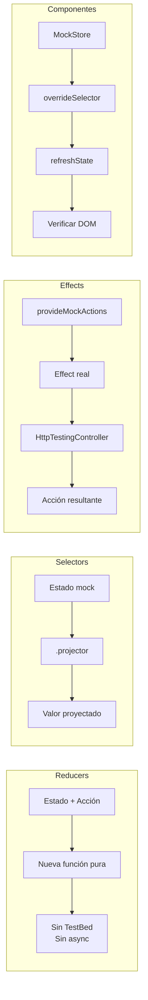

# Capítulo 23 - Parte 4: Testing de NgRx: Actions, Reducers, Effects y Selectors

> **Parte 4 de 4** · Capítulo 23 · PARTE XI - Gestión de Estado con NgRx

---

## La filosofía del testing en NgRx

Una de las ventajas más subestimadas de NgRx es que impone una separación de responsabilidades que hace que cada pieza sea testeable de forma aislada. Los reducers son funciones puras: dado el mismo estado y la misma acción, siempre producen el mismo resultado. Los selectores son funciones de proyección. Los effects son la parte más compleja, pero NgRx provee utilidades específicas para testearlos.

Veamos cada capa con ejemplos concretos.

---

## Testing de reducers: lo más simple

Los reducers son funciones puras, así que no necesitamos `TestBed`. Un test de reducer es básicamente: "dado este estado y esta acción, espero este nuevo estado".

```typescript
// src/app/productos/estado/productos.reducer.spec.ts
import { productosReducer } from './productos.reducer';
import { estadoInicialProductos } from './productos.reducer';
import { ProductosActions } from './productos.actions';
import { Producto } from './productos.state';

describe('ProductosReducer', () => {
  const productoEjemplo: Producto = {
    id: '1',
    nombre: 'Teclado Mecánico',
    precio: 150,
    categoria: 'periféricos',
    stock: 10,
  };

  it('debe retornar el estado inicial cuando no reconoce la acción', () => {
    const accionDesconocida = { type: '[Desconocida] Acción' } as never;
    const resultado = productosReducer(undefined, accionDesconocida);
    expect(resultado).toEqual(estadoInicialProductos);
  });

  it('debe marcar cargando = true al disparar cargarProductos', () => {
    const resultado = productosReducer(
      estadoInicialProductos,
      ProductosActions.cargarProductos()
    );
    expect(resultado.cargando).toBe(true);
    expect(resultado.error).toBeNull();
  });

  it('debe agregar productos al store cuando cargarProductosExito', () => {
    const productos = [productoEjemplo];
    const resultado = productosReducer(
      { ...estadoInicialProductos, cargando: true },
      ProductosActions.cargarProductosExito({ productos })
    );
    expect(resultado.cargando).toBe(false);
    expect(resultado.ids).toContain('1');
    expect(resultado.entities['1']).toEqual(productoEjemplo);
  });

  it('debe registrar el error cuando cargarProductosError', () => {
    const resultado = productosReducer(
      { ...estadoInicialProductos, cargando: true },
      ProductosActions.cargarProductosError({ error: 'Error de red' })
    );
    expect(resultado.cargando).toBe(false);
    expect(resultado.error).toBe('Error de red');
  });
});
```

Sin mocks, sin `TestBed`, sin asincronía. Puro JavaScript funcional.

---

## Testing de selectores: proyecciones sobre estado mock

Los selectores son funciones de proyección. Para testearlos, construimos un estado mock y verificamos el resultado:

```typescript
// src/app/productos/estado/productos.selectors.spec.ts
import {
  selectTodosLosProductos,
  selectProductoActual,
  selectCargando,
} from './productos.selectors';
import { adaptadorProductos } from './productos.reducer';
import { ProductosState, Producto } from './productos.state';

describe('ProductosSelectors', () => {
  const producto1: Producto = {
    id: '1', nombre: 'Mouse', precio: 30, categoria: 'periféricos', stock: 5,
  };
  const producto2: Producto = {
    id: '2', nombre: 'Monitor', precio: 400, categoria: 'pantallas', stock: 2,
  };

  const estadoMock: ProductosState = adaptadorProductos.setAll(
    [producto1, producto2],
    {
      ids: [],
      entities: {},
      cargando: false,
      error: null,
      productoSeleccionadoId: '2',
    }
  );

  const estadoAppMock = { productos: estadoMock };

  it('debe retornar todos los productos ordenados', () => {
    const resultado = selectTodosLosProductos.projector(estadoMock);
    expect(resultado).toHaveLength(2);
  });

  it('debe retornar el producto seleccionado correctamente', () => {
    const resultado = selectProductoActual.projector(
      estadoMock.entities,
      estadoMock.productoSeleccionadoId
    );
    expect(resultado).toEqual(producto2);
  });

  it('debe retornar null si no hay producto seleccionado', () => {
    const resultado = selectProductoActual.projector({}, null);
    expect(resultado).toBeNull();
  });
});
```

El método `.projector()` de los selectores creados con `createSelector` permite pasarle directamente los valores de entrada, sin necesidad de construir el árbol completo del estado.

---

## Testing de effects con provideMockActions

Los effects son la parte más compleja de testear. Necesitamos simular el flujo de acciones (el Observable `Actions`) y verificar qué acciones salen. NgRx provee `provideMockActions` para esto:

```typescript
// src/app/productos/estado/productos.effects.spec.ts
import { TestBed } from '@angular/core/testing';
import {
  HttpClientTestingModule,
  HttpTestingController,
} from '@angular/common/http/testing';
import { provideMockActions } from '@ngrx/effects/testing';
import { Observable, of, throwError } from 'rxjs';
import { Action } from '@ngrx/store';
import { ProductosEffects } from './productos.effects';
import { ProductosService } from '../servicios/productos.service';
import { ProductosActions } from './productos.actions';
import { Producto } from './productos.state';

describe('ProductosEffects', () => {
  let effects: ProductosEffects;
  let acciones$: Observable<Action>;
  let httpMock: HttpTestingController;

  const productoEjemplo: Producto = {
    id: '1', nombre: 'Teclado', precio: 150, categoria: 'periféricos', stock: 10,
  };

  beforeEach(() => {
    TestBed.configureTestingModule({
      imports: [HttpClientTestingModule],
      providers: [
        ProductosEffects,
        ProductosService,
        provideMockActions(() => acciones$),
      ],
    });

    effects = TestBed.inject(ProductosEffects);
    httpMock = TestBed.inject(HttpTestingController);
  });

  afterEach(() => httpMock.verify());

  it('debe disparar cargarProductosExito cuando el servicio responde OK', (done) => {
    acciones$ = of(ProductosActions.cargarProductos());

    effects.cargarProductos$.subscribe((accionResultante) => {
      expect(accionResultante).toEqual(
        ProductosActions.cargarProductosExito({ productos: [productoEjemplo] })
      );
      done();
    });

    const req = httpMock.expectOne('/api/productos');
    req.flush([productoEjemplo]);
  });

  it('debe disparar cargarProductosError cuando el servicio falla', (done) => {
    acciones$ = of(ProductosActions.cargarProductos());

    effects.cargarProductos$.subscribe((accionResultante) => {
      expect(accionResultante).toEqual(
        ProductosActions.cargarProductosError({ error: 'Http failure response for /api/productos: 500 Internal Server Error' })
      );
      done();
    });

    const req = httpMock.expectOne('/api/productos');
    req.flush('Error del servidor', { status: 500, statusText: 'Internal Server Error' });
  });
});
```

`provideMockActions(() => acciones$)` inyecta un Observable que controlamos nosotros. Cada vez que asignamos a `acciones$`, el effect la recibe como si viniera del store real.

---

## Testing de componentes con MockStore

Cuando un componente usa selectores del store, necesitamos un store falso que podamos controlar. `MockStore` de `@ngrx/store/testing` es la solución:

```typescript
// src/app/productos/componentes/lista-productos.component.spec.ts
import { ComponentFixture, TestBed } from '@angular/core/testing';
import { provideMockStore, MockStore } from '@ngrx/store/testing';
import { ListaProductosComponent } from './lista-productos.component';
import {
  selectTodosLosProductos,
  selectCargando,
  selectTotalProductos,
} from '../estado/productos.selectors';
import { ProductosActions } from '../estado/productos.actions';
import { Producto } from '../estado/productos.state';

describe('ListaProductosComponent', () => {
  let fixture: ComponentFixture<ListaProductosComponent>;
  let store: MockStore;

  const productosEjemplo: Producto[] = [
    { id: '1', nombre: 'Mouse', precio: 30, categoria: 'periféricos', stock: 5 },
    { id: '2', nombre: 'Teclado', precio: 150, categoria: 'periféricos', stock: 3 },
  ];

  beforeEach(async () => {
    await TestBed.configureTestingModule({
      imports: [ListaProductosComponent],
      providers: [
        provideMockStore({
          initialState: { productos: { ids: [], entities: {}, cargando: false, error: null } },
        }),
      ],
    }).compileComponents();

    store = TestBed.inject(MockStore);
    fixture = TestBed.createComponent(ListaProductosComponent);
  });

  afterEach(() => store.resetSelectors());

  it('debe mostrar los productos del store', async () => {
    store.overrideSelector(selectTodosLosProductos, productosEjemplo);
    store.overrideSelector(selectCargando, false);
    store.overrideSelector(selectTotalProductos, 2);
    store.refreshState();

    fixture.detectChanges();
    await fixture.whenStable();

    const elemento = fixture.nativeElement as HTMLElement;
    expect(elemento.textContent).toContain('Mouse');
    expect(elemento.textContent).toContain('Teclado');
  });

  it('debe despachar cargarProductos en ngOnInit', () => {
    const dispatchSpy = spyOn(store, 'dispatch');
    fixture.detectChanges();
    expect(dispatchSpy).toHaveBeenCalledWith(ProductosActions.cargarProductos());
  });

  it('debe mostrar estado de carga cuando cargando = true', async () => {
    store.overrideSelector(selectTodosLosProductos, []);
    store.overrideSelector(selectCargando, true);
    store.overrideSelector(selectTotalProductos, 0);
    store.refreshState();

    fixture.detectChanges();
    await fixture.whenStable();

    const elemento = fixture.nativeElement as HTMLElement;
    expect(elemento.textContent).toContain('Cargando');
  });
});
```

Los tres métodos clave de `MockStore`:

- **`overrideSelector(selector, valor)`**: hace que el selector devuelva siempre el valor que le indicamos.
- **`refreshState()`**: emite el nuevo estado para que los componentes suscritos reciban los valores sobreescritos.
- **`resetSelectors()`**: limpia todos los overrides, importante en `afterEach` para evitar contaminación entre tests.

---

## Resumen del enfoque de testing por capa



---

## Puntos clave

- Los reducers son funciones puras y se testean sin `TestBed`: solo estado de entrada, acción, y verificación del estado de salida.
- Los selectores se testean con `.projector()`, que permite pasar directamente los valores de entrada sin construir el estado completo.
- Los effects se testean con `provideMockActions` + `HttpClientTestingModule`, controlando el flujo de acciones y las respuestas HTTP.
- `MockStore` con `overrideSelector` y `refreshState()` permite testear componentes NgRx sin depender del store real ni de effects.
- Llamar `store.resetSelectors()` en `afterEach` es obligatorio para evitar que los overrides contaminen otros tests.

## ¿Qué sigue?

En el siguiente capítulo damos un salto conceptual importante: el Signal Store de NgRx, un paradigma completamente diferente que elimina el boilerplate de actions y reducers usando Signals de Angular como base.
