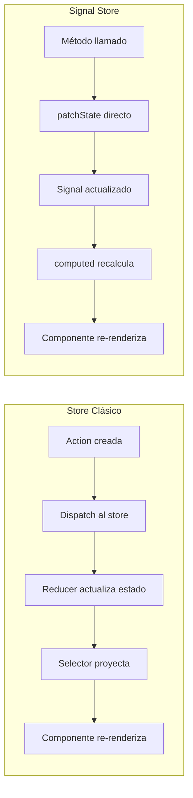

# Capítulo 24 - Parte 1: Introducción al Signal Store: el nuevo paradigma NgRx

> **Parte 1 de 4** · Capítulo 24 · PARTE XI - Gestión de Estado con NgRx

---

## La motivación: demasiado boilerplate para cosas simples

Quien haya trabajado con el NgRx Store clásico conoce bien la sensación: para agregar una funcionalidad nueva, hay que tocar cinco archivos. Primero definimos la acción en `actions.ts`, luego manejamos esa acción en `reducer.ts`, creamos un selector en `selectors.ts`, posiblemente un effect en `effects.ts`, y finalmente usamos todo eso en el componente. Esa estructura es poderosa y tiene sentido para estado global complejo, pero resulta excesiva para el estado de una sola feature.

Con la llegada de los Signals en Angular 16 y su maduración en Angular 17+, el equipo de NgRx encontró una oportunidad de crear algo nuevo: el Signal Store. La idea central es sencilla: ¿qué pasaría si el estado fuera directamente Signals, y las "acciones" fueran simplemente métodos de una clase?

El resultado es `@ngrx/signals`: un sistema de gestión de estado que se siente como escribir un servicio Angular bien organizado, pero con toda la reactividad, componibilidad y convenciones de NgRx.

---

## Instalación

```bash
npm install @ngrx/signals
```

A diferencia del store clásico, el Signal Store no necesita configuración en `bootstrapApplication`. Cada Signal Store se provee como un servicio Angular normal, con la misma inyección de dependencias de siempre.

---

## Nuestro primer Signal Store: ContadorStore

Veamos la diferencia de mentalidad con el ejemplo más simple posible: un contador.

Con el store clásico, necesitaríamos actions (`incrementar`, `decrementar`, `reiniciar`), un reducer con tres `on()`, y selectores para `valor` y `doble`. Con el Signal Store:

```typescript
// src/app/contador/contador.store.ts
import { signalStore, withState, withComputed, withMethods } from '@ngrx/signals';
import { computed } from '@angular/core';
import { patchState } from '@ngrx/signals';

export interface EstadoContador {
  valor: number;
  pasoIncremento: number;
}

const estadoInicial: EstadoContador = {
  valor: 0,
  pasoIncremento: 1,
};

export const ContadorStore = signalStore(
  { providedIn: 'root' },
  withState(estadoInicial),
  withComputed(({ valor, pasoIncremento }) => ({
    doble: computed(() => valor() * 2),
    puedeDecrementar: computed(() => valor() > 0),
    pasoActual: computed(() => `Paso: ${pasoIncremento()}`),
  })),
  withMethods((store) => ({
    incrementar(): void {
      patchState(store, (estado) => ({ valor: estado.valor + estado.pasoIncremento }));
    },
    decrementar(): void {
      patchState(store, (estado) => ({
        valor: Math.max(0, estado.valor - estado.pasoIncremento),
      }));
    },
    reiniciar(): void {
      patchState(store, { valor: 0 });
    },
    cambiarPaso(nuevoPaso: number): void {
      patchState(store, { pasoIncremento: nuevoPaso });
    },
  }))
);
```

Esto es todo. Sin actions separadas, sin reducer, sin selectores en otro archivo. Y sin embargo tenemos estado reactivo, estado derivado (computed) y métodos para mutar el estado.

---

## Diferencias conceptuales clave

Entender las diferencias conceptuales entre ambos paradigmas es fundamental para elegir el correcto y para no confundirlos al usarlos juntos:



En el store clásico, las acciones son mensajes que describen lo que pasó ("un usuario hizo clic en agregar"). El reducer decide cómo cambia el estado. Esta separación es intencional y permite que múltiples reducers y effects reaccionen a la misma acción.

En el Signal Store, el método ya contiene la lógica de cómo cambia el estado. No hay un intermediario. Esto es más simple y más directo, pero sacrifica la capacidad de tener múltiples "observadores" de una misma mutación.

---

## El Signal Store como servicio Angular

El Signal Store es, en esencia, una clase que Angular maneja como cualquier otro servicio. La opción `{ providedIn: 'root' }` hace que sea un singleton de la aplicación, pero también podemos proveerlo en un componente para que tenga el mismo ciclo de vida que él:

```typescript
// Singleton de aplicación
export const ProductosStore = signalStore(
  { providedIn: 'root' },
  withState(estadoInicial),
  // ...
);

// Estado de feature (se destruye con el componente)
@Component({
  selector: 'app-catalogo',
  providers: [CatalogoStore], // <-- provisto aquí, scoped al componente
  template: `...`,
})
export class CatalogoComponent { }
```

Esta flexibilidad es una gran ventaja sobre el store clásico, donde todo el estado vive en un árbol global. Con el Signal Store podemos tener estado verdaderamente local y con gestión automática de memoria.

---

## ¿Cuándo usar Signal Store vs store clásico?

Esta es la pregunta que más nos haremos al adoptarlo. La respuesta honesta es que depende del contexto:

**Prefiere el Signal Store cuando:**
- El estado es específico de una feature y no necesita compartirse globalmente.
- El equipo prefiere menos archivos y menos boilerplate.
- La lógica es mayormente síncrona o con efectos simples.
- Estás construyendo una feature nueva sin integración con state global existente.

**Prefiere el store clásico cuando:**
- El estado se comparte entre múltiples features no relacionadas.
- Necesitas el historial completo de acciones en DevTools para auditoría.
- Ya tienes una base de código grande con store clásico y el costo de migración es alto.
- Necesitas `MockStore` para testing de componentes en un equipo con tests establecidos.

Los dos paradigmas conviven perfectamente en la misma aplicación. No es una decisión binaria.

---

## Estructura de carpetas para Signal Store

La estructura cambia respecto al store clásico porque ya no necesitamos múltiples archivos por feature:

```
src/app/productos/
├── componentes/
│   ├── lista-productos.component.ts
│   └── detalle-producto.component.ts
├── servicios/
│   └── productos.service.ts
├── modelos/
│   └── producto.model.ts
└── productos.store.ts    ← Un solo archivo para todo el estado
```

Esta consolidación es una de las razones por las que el Signal Store resulta más atractivo para features de tamaño mediano.

---

## Usando el store en un componente

La inyección es idéntica a la de cualquier servicio:

```typescript
// src/app/contador/contador.component.ts
import { Component, inject } from '@angular/core';
import { ContadorStore } from './contador.store';

@Component({
  selector: 'app-contador',
  standalone: true,
  template: `
    <div>
      <p>Valor: {{ store.valor() }}</p>
      <p>Doble: {{ store.doble() }}</p>
      <p>{{ store.pasoActual() }}</p>
      <button (click)="store.incrementar()" >+</button>
      <button
        (click)="store.decrementar()"
        [disabled]="!store.puedeDecrementar()"
      >-</button>
      <button (click)="store.reiniciar()">Reiniciar</button>
    </div>
  `,
})
export class ContadorComponent {
  readonly store = inject(ContadorStore);
}
```

Cada propiedad del estado se accede como una función Signal: `store.valor()`. Los computed también se acceden igual: `store.doble()`. Los métodos se llaman directamente: `store.incrementar()`. No hay `dispatch`, no hay `select`, no hay `async pipe` necesario.

---

## Puntos clave

- `@ngrx/signals` introduce el Signal Store como alternativa al store clásico con menos boilerplate y estado basado en Signals de Angular.
- `signalStore()` crea una clase que se comporta como un servicio Angular: se inyecta con `inject()` y puede tener scope de root o de componente.
- No hay actions ni reducers: el estado se muta directamente con `patchState()` dentro de métodos.
- El Signal Store es ideal para estado de feature; el store clásico sigue siendo la mejor opción para estado global compartido entre features no relacionadas.
- Ambos paradigmas conviven en la misma aplicación sin conflicto.

## ¿Qué sigue?

En la siguiente parte profundizamos en los tres building blocks del Signal Store: `withState`, `withComputed` y `withMethods`, construyendo un `ProductosStore` completo con lógica de negocio real.
