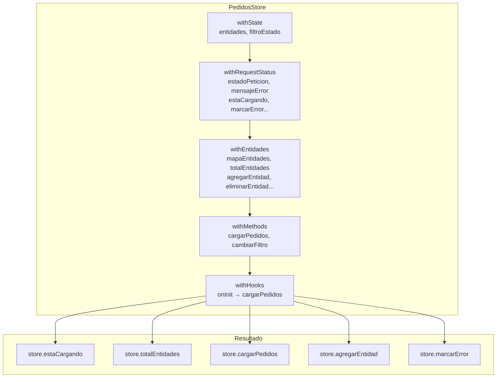

# Capítulo 24 - Parte 3: withHooks y store features personalizadas reutilizables

> **Parte 3 de 4** · Capítulo 24 · PARTE XI - Gestión de Estado con NgRx

---

## El ciclo de vida del store

Los stores no existen en el vacío. Se crean cuando Angular los inyecta por primera vez y se destruyen cuando el contexto de inyección que los contiene se destruye: el módulo raíz para stores con `providedIn: 'root'`, o el componente proveedor para stores con scope local.

`withHooks` nos permite ejecutar lógica en estos momentos del ciclo de vida, exactamente como `ngOnInit` y `ngOnDestroy` en componentes. Esto es particularmente útil para:

- Cargar datos automáticamente cuando el store se inicializa.
- Cancelar subscripciones cuando el store se destruye.
- Sincronizar con localStorage u otras fuentes de persistencia.
- Registrar en servicios de analytics.

```typescript
// src/app/productos/productos.store.ts
import {
  signalStore,
  withState,
  withComputed,
  withMethods,
  withHooks,
  patchState,
} from '@ngrx/signals';
import { computed, inject } from '@angular/core';
import { rxMethod } from '@ngrx/signals/rxjs-interop';
import { pipe, switchMap, tap } from 'rxjs';
import { tapResponse } from '@ngrx/operators';
import { ProductosService } from './servicios/productos.service';
import { EstadoProductos, estadoInicial } from './productos.model';

export const ProductosStore = signalStore(
  withState(estadoInicial),
  withComputed(({ productos, terminoBusqueda }) => ({
    productosFiltrados: computed(() => {
      const termino = terminoBusqueda().toLowerCase();
      return termino
        ? productos().filter((p) => p.nombre.toLowerCase().includes(termino))
        : productos();
    }),
    totalProductos: computed(() => productos().length),
  })),
  withMethods((store, productosService = inject(ProductosService)) => ({
    cargarProductos: rxMethod<void>(
      pipe(
        tap(() => patchState(store, { cargando: true })),
        switchMap(() =>
          productosService.obtenerTodos$().pipe(
            tapResponse({
              next: (productos) =>
                patchState(store, { productos, cargando: false }),
              error: (err: Error) =>
                patchState(store, { error: err.message, cargando: false }),
            })
          )
        )
      )
    ),
  })),
  withHooks({
    onInit(store) {
      // Se ejecuta automáticamente al crear el store
      store.cargarProductos();
    },
    onDestroy(store) {
      // Limpieza antes de destruir el store
      console.log(`Store destruido con ${store.totalProductos()} productos en caché`);
    },
  })
);
```

Con `onInit` en el hook, el componente que usa este store ya no necesita llamar `cargarProductos()` en su `ngOnInit`. La carga ocurre automáticamente, lo cual tiene sentido si el store tiene scope de componente (cada instancia del componente tendrá su propia carga de datos).

---

## Creando store features reutilizables con signalStoreFeature

La verdadera potencia del Signal Store aparece cuando creamos nuestras propias features reutilizables. `signalStoreFeature()` nos permite encapsular patrones comunes y composerlos en cualquier store.

El patrón más común en cualquier aplicación es el manejo del estado de carga de operaciones asíncronas. En lugar de definir `cargando`, `error`, y la lógica asociada en cada store, podemos encapsularlo:

```typescript
// src/app/shared/features/with-request-status.feature.ts
import {
  signalStoreFeature,
  withState,
  withComputed,
  withMethods,
  patchState,
} from '@ngrx/signals';
import { computed } from '@angular/core';

export type EstadoPeticion = 'idle' | 'cargando' | 'cargado' | 'error';

export interface EstadoRequestStatus {
  estadoPeticion: EstadoPeticion;
  mensajeError: string | null;
}

export function withRequestStatus() {
  return signalStoreFeature(
    withState<EstadoRequestStatus>({
      estadoPeticion: 'idle',
      mensajeError: null,
    }),
    withComputed(({ estadoPeticion }) => ({
      estaCargando: computed(() => estadoPeticion() === 'cargando'),
      estaCargado: computed(() => estadoPeticion() === 'cargado'),
      tieneError: computed(() => estadoPeticion() === 'error'),
    })),
    withMethods((store) => ({
      iniciarCarga(): void {
        patchState(store, { estadoPeticion: 'cargando', mensajeError: null });
      },
      marcarCargado(): void {
        patchState(store, { estadoPeticion: 'cargado' });
      },
      marcarError(mensaje: string): void {
        patchState(store, { estadoPeticion: 'error', mensajeError: mensaje });
      },
      reiniciarEstado(): void {
        patchState(store, { estadoPeticion: 'idle', mensajeError: null });
      },
    }))
  );
}
```

Esta feature encapsula el estado de carga completo. Cualquier store puede incluirla con una sola línea.

---

## Feature de entidades CRUD genérica

Podemos ir más lejos y crear una feature genérica para operaciones CRUD sobre colecciones:

```typescript
// src/app/shared/features/with-entidades.feature.ts
import {
  signalStoreFeature,
  withState,
  withComputed,
  withMethods,
  patchState,
  type,
} from '@ngrx/signals';
import { computed } from '@angular/core';

export interface EntidadConId {
  id: string;
}

export function withEntidades<Entidad extends EntidadConId>() {
  return signalStoreFeature(
    { state: type<{ entidades: Entidad[] }>() },
    withComputed(({ entidades }) => ({
      totalEntidades: computed(() => entidades().length),
      mapaEntidades: computed(() =>
        entidades().reduce<Record<string, Entidad>>((mapa, entidad) => {
          mapa[entidad.id] = entidad;
          return mapa;
        }, {})
      ),
      hayEntidades: computed(() => entidades().length > 0),
    })),
    withMethods((store) => ({
      agregarEntidad(entidad: Entidad): void {
        patchState(store, (estado) => ({
          entidades: [...estado.entidades, entidad],
        }));
      },
      actualizarEntidad(id: string, cambios: Partial<Omit<Entidad, 'id'>>): void {
        patchState(store, (estado) => ({
          entidades: estado.entidades.map((e) =>
            e.id === id ? { ...e, ...cambios } : e
          ),
        }));
      },
      eliminarEntidad(id: string): void {
        patchState(store, (estado) => ({
          entidades: estado.entidades.filter((e) => e.id !== id),
        }));
      },
      reemplazarEntidades(entidades: Entidad[]): void {
        patchState(store, { entidades });
      },
    }))
  );
}
```

El helper `type<T>()` de `@ngrx/signals` es crucial aquí. Le dice a TypeScript qué forma debe tener el estado del store que use esta feature. Si el store no tiene la propiedad `entidades: Entidad[]`, TypeScript producirá un error en tiempo de compilación. Esto hace que las features sean type-safe y auto-documentadas.

---

## Composición de features en un store real

Ahora veamos la elegancia de componer estas features:

```typescript
// src/app/pedidos/pedidos.store.ts
import { signalStore, withState, withMethods, withHooks, patchState } from '@ngrx/signals';
import { inject } from '@angular/core';
import { rxMethod } from '@ngrx/signals/rxjs-interop';
import { pipe, switchMap, tap } from 'rxjs';
import { tapResponse } from '@ngrx/operators';
import { withRequestStatus } from '../shared/features/with-request-status.feature';
import { withEntidades } from '../shared/features/with-entidades.feature';
import { PedidosService } from './servicios/pedidos.service';

export interface Pedido extends EntidadConId {
  id: string;
  clienteId: string;
  total: number;
  estado: 'pendiente' | 'procesando' | 'enviado' | 'entregado';
  fecha: Date;
}

export const PedidosStore = signalStore(
  { providedIn: 'root' },
  withState({ entidades: [] as Pedido[], filtroEstado: 'todos' as string }),
  withRequestStatus(),       // ← aporta: estaCargando, marcarError, etc.
  withEntidades<Pedido>(),   // ← aporta: agregarEntidad, actualizarEntidad, etc.
  withMethods((store, pedidosService = inject(PedidosService)) => ({
    cargarPedidos: rxMethod<void>(
      pipe(
        tap(() => store.iniciarCarga()),
        switchMap(() =>
          pedidosService.obtenerTodos$().pipe(
            tapResponse({
              next: (pedidos) => {
                store.reemplazarEntidades(pedidos);
                store.marcarCargado();
              },
              error: (err: Error) => store.marcarError(err.message),
            })
          )
        )
      )
    ),
    cambiarFiltro(estado: string): void {
      patchState(store, { filtroEstado: estado });
    },
  })),
  withHooks({
    onInit: (store) => store.cargarPedidos(),
  })
);
```

El resultado es un store que tiene todas las capacidades de manejo de estado de carga, operaciones CRUD y carga de datos, compuesto de tres líneas. Agregar la feature `withRequestStatus()` a un nuevo store toma un segundo.

---

## Diagrama de composición de features



---

## Consideraciones de tipado con features genéricas

El tipado correcto de las features genéricas requiere atención. El helper `type<T>()` declara una restricción sobre el estado que debe existir en el store que use la feature, pero no lo crea. El estado debe declararse con `withState` antes de incluir la feature:

```typescript
// CORRECTO: withState declara entidades antes que withEntidades lo requiera
signalStore(
  withState({ entidades: [] as Producto[] }),
  withEntidades<Producto>(),  // ✓ TypeScript encuentra entidades en el estado
)

// INCORRECTO: sin withState previo, TypeScript reportará error
signalStore(
  withEntidades<Producto>(),  // ✗ Error: el estado no tiene la propiedad 'entidades'
)
```

Este orden importa y TypeScript lo verifica en tiempo de compilación.

---

## Puntos clave

- `withHooks({ onInit, onDestroy })` permite ejecutar lógica en el ciclo de vida del store, ideal para cargar datos automáticamente y limpiar subscripciones.
- `signalStoreFeature()` crea features reutilizables que encapsulan estado, computed y métodos relacionados en una unidad composable.
- `withRequestStatus()` es el ejemplo canónico de feature reutilizable: encapsula el estado `idle | cargando | cargado | error` y sus métodos de transición.
- El helper `type<T>()` declara restricciones de tipado sobre el estado del store que use la feature, garantizando type-safety en tiempo de compilación.
- La composición de features convierte el Signal Store en un sistema modular donde la funcionalidad se construye sumando piezas especializadas.

## ¿Qué sigue?

En la última parte del capítulo hacemos una comparación lado a lado y construimos una estrategia de migración incremental del store clásico al Signal Store, feature por feature.
