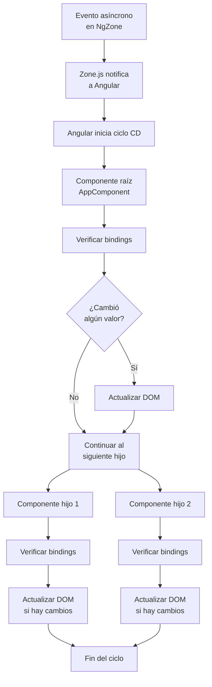

# Capítulo 25 - Parte 1: Cómo funciona Zone.js y el ciclo de Change Detection

> **Parte 1 de 4** · Capítulo 25 · PARTE XII - Optimización y Rendimiento

Angular necesita saber cuándo el estado de la aplicación cambia para actualizar la vista. Este mecanismo se llama Change Detection (CD), y durante años su motor secreto ha sido Zone.js. Entender cómo funcionan juntos es el punto de partida para optimizar cualquier aplicación Angular de tamaño real.

## Qué es Zone.js y cómo parchea el navegador

Zone.js es una librería que "parchea" las APIs asíncronas del navegador: `setTimeout`, `setInterval`, `Promise`, `fetch`, `addEventListener` y muchas más. Lo hace reemplazando las implementaciones nativas con versiones propias que añaden código antes y después de cada llamada. A esto se le llama monkey patching.

Cuando Angular arranca, crea una zona llamada `NgZone`. Cualquier código que se ejecute dentro de esa zona es automáticamente rastreado. Cuando una operación asíncrona dentro de `NgZone` se completa -un clic de botón, una respuesta HTTP, un `setTimeout` que vence- Zone.js notifica a Angular: "algo acaba de terminar, puede que el estado haya cambiado". Angular responde lanzando un ciclo de Change Detection.

```typescript
import { Component, NgZone, inject } from '@angular/core';

@Component({
  selector: 'app-zona',
  standalone: true,
  template: `<p>Contador: {{ contador }}</p>`
})
export class ZonaComponent {
  contador = 0;
  private zona = inject(NgZone);

  iniciarContador(): void {
    // Este setTimeout ESTÁ dentro de NgZone → dispara CD al completarse
    setTimeout(() => {
      this.contador++;
      // Angular actualiza la vista automáticamente
    }, 1000);
  }

  iniciarContadorSilencioso(): void {
    // runOutsideAngular evita que Zone.js dispare CD
    this.zona.runOutsideAngular(() => {
      setTimeout(() => {
        this.contador++;
        // La vista NO se actualiza sola - contamos sin costo de CD
      }, 1000);
    });
  }
}
```

`runOutsideAngular` es la válvula de escape: permite ejecutar código asíncrono sin pagar el costo del ciclo de Change Detection. Es útil para animaciones de alta frecuencia o WebSockets donde queremos controlar manualmente cuándo actualizar la vista.

## Cuándo se dispara el Change Detection

El ciclo de CD se activa después de cualquier evento asíncrono que Zone.js intercepte y que ocurra dentro de `NgZone`. Los tres disparadores más comunes son:

**Eventos del DOM:** clics, inputs de teclado, scroll, focus - cualquier listener registrado con `addEventListener` o con la sintaxis `(evento)` de Angular.

**Operaciones asíncronas completadas:** respuestas de `HttpClient`, resolución de `Promise`, vencimiento de `setTimeout` o `setInterval`.

**Macrotareas y microtareas:** las Promises usan microtareas; `setTimeout` usa macrotareas. Ambas las intercepta Zone.js.

Lo importante es entender que Angular no sabe *qué* cambió. Solo sabe que *algo pudo haber cambiado*. Por eso recorre todo el árbol de componentes en cada ciclo.

## El árbol de componentes y la estrategia Default

Angular organiza los componentes en un árbol. Cuando se dispara el CD con la estrategia `Default` (la que viene por defecto), Angular recorre ese árbol de arriba hacia abajo, desde la raíz, verificando *cada componente*. Para cada componente evalúa si alguno de sus bindings cambió comparando el valor anterior con el actual.

```typescript
import { Component } from '@angular/core';
// ChangeDetectionStrategy por defecto es Default
// No hace falta importarla si no la especificamos
@Component({
  selector: 'app-producto',
  standalone: true,
  template: `<span>{{ producto.nombre }}</span>`
})
export class ProductoComponent {
  // Sin @Input aquí, pero en árbol real recibiría datos del padre
  producto = { nombre: 'Teclado', precio: 79.99 };
}
```

Con `Default`, aunque `producto` no cambie nunca, Angular igual visita este componente en cada ciclo de CD y compara sus bindings. En una aplicación con 50 componentes, eso significa 50 comparaciones por cada clic de botón en cualquier parte de la app.

## Diagrama del ciclo de Change Detection



Este recorrido es exhaustivo y síncrono. Angular completa el árbol completo antes de pintar el siguiente frame. En aplicaciones pequeñas es imperceptible, pero en árboles con cientos de componentes y datos que cambian frecuentemente, el costo acumulado se vuelve notable: caídas de framerate, UI que responde lento, renders innecesarios.

## Por qué esto puede ser costoso

El problema no es que Change Detection sea lento por diseño. Es que con la estrategia `Default` escala mal. Considera una tabla con 500 filas, cada fila con un componente propio. Un clic en cualquier lugar de la app obliga a Angular a visitar los 500 componentes, aunque no haya cambiado ningún dato de la tabla. Multiplica eso por un componente de búsqueda que dispara CD en cada tecla y tienes el escenario clásico de una SPA que "se siente pesada".

La solución no es dejar de usar CD -es usar la herramienta correcta para cada componente. Los capítulos que siguen presentan `OnPush`, `ChangeDetectorRef` y finalmente Zoneless como herramientas progresivas para recuperar el control sobre cuándo y cómo Angular actualiza la vista.

## Puntos clave

- Zone.js parchea las APIs asíncronas del navegador para detectar cuándo "algo pudo cambiar"
- Angular no sabe qué cambió, solo sabe que debe verificar. Con `Default` verifica todo el árbol
- `runOutsideAngular` permite ejecutar código asíncrono sin disparar Change Detection
- El costo de CD escala con la cantidad de componentes, no con la cantidad de datos que cambiaron
- Entender Zone.js es el prerequisito para optimizar correctamente con OnPush o Zoneless

## ¿Qué sigue?

En la Parte 2 vemos cómo la estrategia `OnPush` reduce drásticamente los ciclos de CD innecesarios, y qué reglas exactas determinan cuándo Angular sí actualiza un componente OnPush.
