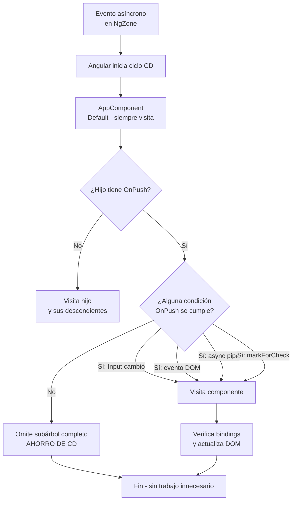

# Capítulo 25 - Parte 2: Estrategia OnPush: cuándo y cómo usarla

> **Parte 2 de 4** · Capítulo 25 · PARTE XII - Optimización y Rendimiento

La estrategia `Default` visita cada componente del árbol en cada ciclo de Change Detection, sin importar si sus datos cambiaron. `OnPush` invierte esa lógica: un componente con esta estrategia le dice a Angular "no me visites a menos que tengas una razón concreta". El resultado es un árbol de detección mucho más selectivo y, por tanto, significativamente más rápido.

## Activar OnPush en el decorador

Activar `OnPush` es una línea de código. Lo que cambia drásticamente es el contrato que el componente establece con Angular: ya no acepta visitas indiscriminadas.

```typescript
import { Component, ChangeDetectionStrategy, Input } from '@angular/core';
import { CurrencyPipe } from '@angular/common';

interface Producto {
  readonly id: number;
  readonly nombre: string;
  readonly precio: number;
}

@Component({
  selector: 'app-tarjeta-producto',
  standalone: true,
  imports: [CurrencyPipe],
  changeDetection: ChangeDetectionStrategy.OnPush, // ← la única línea nueva
  template: `
    <div class="tarjeta">
      <h3>{{ producto.nombre }}</h3>
      <p>{{ producto.precio | currency:'USD' }}</p>
    </div>
  `
})
export class TarjetaProductoComponent {
  @Input({ required: true }) producto!: Producto;
}
```

Nótese que `Producto` está definido con propiedades `readonly`. Esto no es accidental: `OnPush` y la inmutabilidad van de la mano, y conviene expresarlo desde la definición del tipo.

## Las cuatro condiciones que disparan la actualización

Con `OnPush` activo, Angular solo actualiza el componente cuando se cumple alguna de estas cuatro condiciones. Conocerlas de memoria es esencial para trabajar con esta estrategia sin sorpresas.

**Condición 1: la referencia de un `@Input` cambia.** Angular compara la referencia anterior con la nueva usando `===`. Si el objeto es el mismo en memoria aunque sus propiedades internas hayan mutado, Angular considera que no hubo cambio y omite el componente.

**Condición 2: un evento del componente ocurre.** Si el usuario hace clic dentro del componente, presiona una tecla en un `<input>` dentro de él, o cualquier evento del DOM se dispara en su subárbol, Angular marca ese componente para verificación. Solo ese, no todo el árbol.

**Condición 3: el `async` pipe recibe un nuevo valor.** El `async` pipe internamente llama `markForCheck()` cada vez que el Observable o Promise emite. Por eso los componentes `OnPush` que consumen datos via `async pipe` se actualizan sin ningún código extra.

**Condición 4: `markForCheck()` se llama manualmente.** Cuando el cambio proviene de fuera del árbol de Angular -una librería externa, un Worker, una integración con código legacy- podemos marcar manualmente el componente. Lo vemos en detalle en la Parte 3.

## El principio de inmutabilidad como contrato

`OnPush` no funciona con mutación. Ese es el único antipatrón que rompe la estrategia de forma silenciosa: Angular no lanza error, simplemente la vista no se actualiza.

```typescript
import { Component, ChangeDetectionStrategy, signal } from '@angular/core';

interface Filtros {
  readonly categoria: string;
  readonly soloActivos: boolean;
}

@Component({
  selector: 'app-panel-filtros',
  standalone: true,
  changeDetection: ChangeDetectionStrategy.OnPush,
  template: `
    <p>Categoría: {{ filtros().categoria }}</p>
    <button (click)="cambiarCategoria()">Cambiar</button>
  `
})
export class PanelFiltrosComponent {
  // Signal con OnPush: la combinación más robusta en Angular 17+
  filtros = signal<Filtros>({ categoria: 'todos', soloActivos: true });

  cambiarCategoria(): void {
    // CORRECTO: reemplazar el objeto completo - nueva referencia
    this.filtros.set({ categoria: 'electrónica', soloActivos: true });

    // INCORRECTO (nunca hacer esto con OnPush):
    // this.filtros().categoria = 'electrónica'; // mutación → vista no actualiza
  }
}
```

Los Signals (→ ver Capítulo 21) son la pareja natural de `OnPush` porque por diseño siempre producen una nueva referencia al actualizarse. Un Signal nunca muta en lugar de reemplazar.

## Antipatrones que rompen OnPush silenciosamente

El problema más común al adoptar `OnPush` en un equipo es que la vista deja de actualizarse sin que TypeScript avise nada. Estos son los escenarios a vigilar:

```typescript
import { Component, ChangeDetectionStrategy, Input } from '@angular/core';

interface Carrito {
  items: string[]; // ← array sin readonly, peligroso con OnPush
  total: number;
}

@Component({
  selector: 'app-carrito',
  standalone: true,
  changeDetection: ChangeDetectionStrategy.OnPush,
  template: `<p>Items: {{ carrito.items.length }}</p>`
})
export class CarritoComponent {
  @Input({ required: true }) carrito!: Carrito;
}

// En el componente padre - INCORRECTO:
// this.miCarrito.items.push('Nuevo item');
// La referencia de carrito.items no cambió → OnPush no actualiza

// En el componente padre - CORRECTO:
// this.miCarrito = {
//   ...this.miCarrito,
//   items: [...this.miCarrito.items, 'Nuevo item']
// };
// Nueva referencia de miCarrito → OnPush detecta el cambio
```

El spread operator (`...`) y los métodos que devuelven nuevo array (`map`, `filter`, `concat`) son los aliados naturales de `OnPush`. `push`, `splice` y `sort` son sus enemigos porque operan sobre la misma referencia.

## Diagrama: árbol de detección con OnPush



El beneficio de `OnPush` no es solo el componente individual: cuando un componente `OnPush` no necesita actualizarse, Angular omite también todos sus descendientes. Un solo componente `OnPush` en la raíz de una rama puede eliminar docenas de verificaciones innecesarias en cada ciclo.

## Cómo detectar si OnPush está causando problemas

Cuando la vista deja de actualizarse y sospechamos de `OnPush`, la forma más directa de diagnosticarlo es añadir temporalmente `ChangeDetectionStrategy.Default` al componente sospechoso. Si la vista vuelve a funcionar, confirmamos que `OnPush` estaba bloqueando la actualización, y podemos buscar el punto donde se está mutando en lugar de reemplazar.

Una señal de alerta más sutil: si un componente `OnPush` depende de un servicio que expone datos mutable (un array o un objeto que se modifica en lugar de reemplazarse), la vista quedará desincronizada de forma intermitente. La solución es migrar esos datos a Signals o a Observables con `BehaviorSubject`, que siempre emiten una nueva referencia cuando el valor cambia.

## Puntos clave

- `ChangeDetectionStrategy.OnPush` en el decorador convierte al componente en "opt-in" para Change Detection
- Angular solo visita un componente `OnPush` si: su `@Input` cambió de referencia, ocurrió un evento en él, el `async pipe` emitió, o se llamó `markForCheck()`
- La inmutabilidad es el contrato implícito de `OnPush`: reemplazar objetos y arrays, nunca mutarlos
- `push()`, `splice()` y `sort()` sobre arrays existentes rompen `OnPush` silenciosamente
- Los Signals son la pareja ideal de `OnPush` porque siempre producen nuevas referencias

## ¿Qué sigue?

En la Parte 3 vemos `ChangeDetectorRef`: cómo acceder a él con `inject()`, y cuándo usar `markForCheck()`, `detectChanges()` o `detach()` para tomar el control manual completo de la detección.
