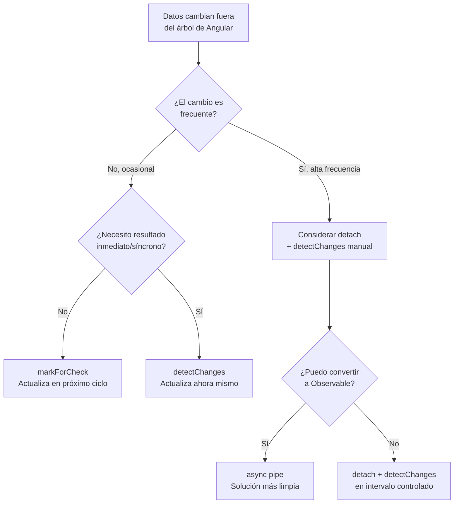

# Capítulo 25 - Parte 3: ChangeDetectorRef: markForCheck, detach y control manual

> **Parte 3 de 4** · Capítulo 25 · PARTE XII - Optimización y Rendimiento

`ChangeDetectorRef` es la interfaz que Angular expone para que un componente se comunique directamente con su propio detector de cambios. Con `OnPush` cubrimos la optimización declarativa: le decimos a Angular cuándo visitar el componente estableciendo reglas. Con `ChangeDetectorRef` cubrimos la optimización imperativa: tomamos el control en tiempo de ejecución. Son herramientas complementarias, y conocer ambas es indispensable para los casos que los datos no llegan por el camino habitual de Angular.

## Acceder a ChangeDetectorRef con inject()

```typescript
import { Component, ChangeDetectionStrategy, ChangeDetectorRef, inject } from '@angular/core';

@Component({
  selector: 'app-ejemplo-cdr',
  standalone: true,
  changeDetection: ChangeDetectionStrategy.OnPush,
  template: `<p>Valor: {{ valorExterno }}</p>`
})
export class EjemploCdrComponent {
  // inject() en el cuerpo de la clase - forma moderna y preferida
  private cdr = inject(ChangeDetectorRef);
  valorExterno = 0;
}
```

`ChangeDetectorRef` no necesita `@Injectable` ni configuración especial: Angular lo reconoce como token especial y resuelve automáticamente la instancia del detector de cambios correspondiente al componente actual. Cada componente tiene el suyo propio.

## markForCheck(): la señal de "visítame en el próximo ciclo"

`markForCheck()` le comunica a Angular que este componente y todos sus ancestros deben ser incluidos en el próximo ciclo de Change Detection, aunque sean `OnPush`. No dispara CD inmediatamente, solo levanta una bandera interna.

```typescript
import {
  Component, ChangeDetectionStrategy, ChangeDetectorRef,
  OnInit, OnDestroy, inject
} from '@angular/core';
import { WebSocketService } from '../services/websocket.service';
import { Subscription } from 'rxjs';

@Component({
  selector: 'app-precio-tiempo-real',
  standalone: true,
  changeDetection: ChangeDetectionStrategy.OnPush,
  template: `<span class="precio">{{ precioActual | number:'1.2-2' }}</span>`
})
export class PrecioTiempoRealComponent implements OnInit, OnDestroy {
  private cdr = inject(ChangeDetectorRef);
  private ws = inject(WebSocketService);
  private suscripcion?: Subscription;
  precioActual = 0;

  ngOnInit(): void {
    this.suscripcion = this.ws.precio$.subscribe(nuevoPrecio => {
      this.precioActual = nuevoPrecio;
      // El cambio viene del WebSocket - fuera del árbol de Angular
      // OnPush no lo detectaría solo → necesitamos markForCheck()
      this.cdr.markForCheck();
    });
  }

  ngOnDestroy(): void {
    this.suscripcion?.unsubscribe();
  }
}
```

Este es el caso clásico de `markForCheck()`: datos que llegan por un canal externo al sistema de eventos de Angular (WebSocket, Worker, librerías nativas, callbacks de terceros). La alternativa más limpia es siempre el `async pipe`, pero cuando la fuente no es un Observable estándar, `markForCheck()` es la solución correcta.

## detectChanges(): forzar detección inmediata y síncrona

A diferencia de `markForCheck()`, que encola la verificación para el próximo ciclo, `detectChanges()` ejecuta el ciclo de Change Detection en ese momento, de forma síncrona, solo para este componente y sus descendientes.

```typescript
import {
  Component, ChangeDetectionStrategy, ChangeDetectorRef,
  inject, AfterViewInit
} from '@angular/core';

declare const BibliotecaLegacy: {
  onDataReady: (callback: (datos: string[]) => void) => void;
};

@Component({
  selector: 'app-integracion-legacy',
  standalone: true,
  changeDetection: ChangeDetectionStrategy.OnPush,
  template: `
    @for (item of elementosExternos; track item) {
      <li>{{ item }}</li>
    }
  `
})
export class IntegracionLegacyComponent implements AfterViewInit {
  private cdr = inject(ChangeDetectorRef);
  elementosExternos: string[] = [];

  ngAfterViewInit(): void {
    // Librería legacy que usa callbacks sin Zone.js ni Observables
    BibliotecaLegacy.onDataReady((datos) => {
      this.elementosExternos = datos;
      // markForCheck no es suficiente si Zone.js no tiene una tarea en curso
      // detectChanges() fuerza el ciclo inmediatamente
      this.cdr.detectChanges();
    });
  }
}
```

Usar `detectChanges()` con frecuencia es una señal de que la integración necesita revisión. Si el callback puede convertirse en un Observable (usando `fromEventPattern` de RxJS, por ejemplo), el `async pipe` eliminaría la necesidad de este llamado manual.

## detach() y reattach(): desconectar completamente del árbol

`detach()` desconecta el componente del árbol de Change Detection de Angular. A partir de ese momento, Angular ni siquiera lo visita durante un ciclo `Default`. El componente deja de actualizarse automáticamente - la responsabilidad de actualizarlo cae completamente en nuestras manos.

```typescript
import {
  Component, ChangeDetectionStrategy, ChangeDetectorRef,
  OnInit, OnDestroy, inject
} from '@angular/core';

@Component({
  selector: 'app-monitor-alta-frecuencia',
  standalone: true,
  changeDetection: ChangeDetectionStrategy.OnPush,
  template: `
    <canvas #lienzo width="400" height="200"></canvas>
    <p>FPS: {{ fps }}</p>
  `
})
export class MonitorAltaFrecuenciaComponent implements OnInit, OnDestroy {
  private cdr = inject(ChangeDetectorRef);
  fps = 0;
  private intervaloId?: ReturnType<typeof setInterval>;

  ngOnInit(): void {
    // Desconectamos completamente del ciclo de CD de Angular
    this.cdr.detach();

    // Controlamos la actualización manualmente cada 500ms
    // en lugar de por cada frame de animación
    this.intervaloId = setInterval(() => {
      this.fps = this.calcularFps();
      // Forzamos un solo render en el intervalo elegido
      this.cdr.detectChanges();
    }, 500);
  }

  ngOnDestroy(): void {
    clearInterval(this.intervaloId);
    // Buena práctica: reconectar antes de destruir
    this.cdr.reattach();
  }

  private calcularFps(): number {
    return Math.round(Math.random() * 60); // lógica real aquí
  }
}
```

`detach()` es la herramienta para componentes que actualizan datos a alta frecuencia -gráficos en tiempo real, telemetría, feeds de trading- donde dejar que Angular controle el ritmo generaría más trabajo del necesario. Con `detach()` el componente decide cuándo renderizar, no Angular.

## ApplicationRef.tick(): el ciclo global manual

Existe una tercera vía, menos común pero útil en pruebas y en integraciones a nivel de aplicación: `ApplicationRef.tick()`, que fuerza un ciclo completo de Change Detection para toda la aplicación.

```typescript
import { ApplicationRef, inject } from '@angular/core';

// Dentro de un servicio o guard
export class SincronizacionService {
  private appRef = inject(ApplicationRef);

  sincronizarDesdeExterno(): void {
    // Actualizar datos...
    // Luego forzar un ciclo completo de CD
    this.appRef.tick();
  }
}
```

`ApplicationRef.tick()` raramente es la solución correcta en producción -su uso más legítimo es en pruebas unitarias donde se quiere controlar exactamente cuándo Angular procesa cambios. En código de producción, preferir `markForCheck()` sobre un componente específico.

## Diagrama: cuándo usar cada método



## Cuándo el control manual es la última opción vs cuándo es la correcta

El control manual de Change Detection es la última opción cuando existe una alternativa basada en Signals o en el `async pipe`. Si podemos reestructurar el flujo de datos para que pase por un Observable o un Signal, esa siempre es la vía preferida: el código queda más declarativo, más fácil de probar y menos propenso a errores por `detach()` olvidados o `detectChanges()` redundantes.

Es la opción correcta cuando la fuente de datos genuinamente no puede adaptarse al modelo de Angular: integraciones con mapas nativos del navegador, canvas de alta frecuencia, bindings a APIs de WebGL, código heredado con callbacks imperativas que no pueden refactorizarse. En esos casos, `ChangeDetectorRef` no es un parche, es exactamente la herramienta diseñada para el trabajo.

## Puntos clave

- `inject(ChangeDetectorRef)` en el cuerpo de la clase obtiene el detector del componente actual
- `markForCheck()` encola el componente para el próximo ciclo de CD; no lo dispara de inmediato
- `detectChanges()` fuerza un ciclo síncrono e inmediato solo para el subárbol del componente
- `detach()` desconecta totalmente el componente; `reattach()` lo reconecta; siempre en pares
- Si la fuente de datos puede convertirse en Observable o Signal, esa es la opción preferida sobre control manual

## ¿Qué sigue?

En la Parte 4 damos el paso más radical: eliminar Zone.js por completo con `provideExperimentalZonelessChangeDetection()` y construir una aplicación Angular que controla su propio ciclo de actualización desde cero.
