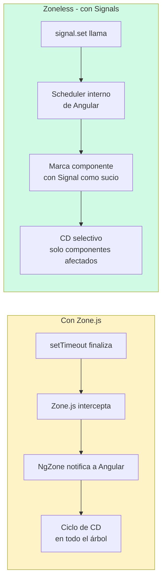

# Capítulo 25 - Parte 4: Zoneless Angular con provideExperimentalZonelessChangeDetection

> **Parte 4 de 4** · Capítulo 25 · PARTE XII - Optimización y Rendimiento

Durante décadas, Zone.js fue la pieza invisible que mantenía la magia de Angular: cualquier cosa asíncrona disparaba automáticamente la detección de cambios. El precio es el monkey-patching de decenas de APIs del navegador, un bundle ligeramente más grande y una capa de indirección que complica el debugging de stacks de error. Angular 18 introduce una alternativa experimental que elimina Zone.js del todo: `provideExperimentalZonelessChangeDetection`. Es experimental, pero estable en producción para equipos que adoptan Signals consistentemente.

## Configurar la aplicación Zoneless

El primer paso es quitar Zone.js del bundle. En `angular.json`, buscamos la sección `polyfills` del proyecto y eliminamos la entrada de `zone.js`:

```json
{
  "projects": {
    "mi-app": {
      "architect": {
        "build": {
          "options": {
            "polyfills": []
          }
        }
      }
    }
  }
}
```

Luego, en `main.ts`, registramos el proveedor Zoneless:

```typescript
import { bootstrapApplication } from '@angular/platform-browser';
import { provideExperimentalZonelessChangeDetection } from '@angular/core';
import { AppComponent } from './app/app.component';

bootstrapApplication(AppComponent, {
  providers: [
    provideExperimentalZonelessChangeDetection()
    // El resto de providers: provideRouter, provideHttpClient, etc.
  ]
}).catch(err => console.error(err));
```

Estos dos cambios son todo lo que Angular necesita para arrancar sin Zone.js. Lo que cambia profundamente es cómo los componentes notifican que su estado cambió.

## Qué deja de funcionar automáticamente

Sin Zone.js, ninguna API asíncrona del navegador notifica a Angular que algo cambió. Un `setTimeout` que modifica una propiedad del componente no produce ninguna actualización de vista, porque nadie intercepta su finalización.

```typescript
import { Component, ChangeDetectionStrategy } from '@angular/core';

@Component({
  selector: 'app-contador',
  standalone: true,
  changeDetection: ChangeDetectionStrategy.OnPush, // obligatorio en Zoneless
  template: `<p>{{ contador }}</p><button (click)="iniciar()">Iniciar</button>`
})
export class ContadorComponent {
  contador = 0;

  iniciar(): void {
    // Sin Zone.js: este setTimeout NO actualiza la vista
    setTimeout(() => {
      this.contador++; // la propiedad cambia, pero Angular no lo sabe
    }, 1000);

    // El clic del botón SÍ disparará CD porque Angular gestiona
    // los event listeners del template internamente, incluso sin Zone.js
  }
}
```

Las APIs que dejan de disparar CD automáticamente incluyen: `setTimeout`, `setInterval`, `Promise.then`, `fetch` (directamente), `addEventListener` fuera del template de Angular y cualquier callback de librería nativa.

## Migrar código async a Signals

La respuesta de Angular al mundo Zoneless es Signals. Un Signal notifica al sistema de reactividad de Angular directamente, sin necesitar que Zone.js observe ninguna API del navegador.

```typescript
import {
  Component, ChangeDetectionStrategy, signal, computed, effect
} from '@angular/core';

@Component({
  selector: 'app-contador-zoneless',
  standalone: true,
  changeDetection: ChangeDetectionStrategy.OnPush,
  template: `
    <p>Contador: {{ contador() }}</p>
    <p>Doble: {{ doble() }}</p>
    <button (click)="iniciar()">Iniciar</button>
  `
})
export class ContadorZonelessComponent {
  // Signal en lugar de propiedad plana - Angular rastreará cambios
  contador = signal(0);

  // computed se recalcula cuando contador() cambia
  doble = computed(() => this.contador() * 2);

  iniciar(): void {
    setTimeout(() => {
      // signal.set() notifica a Angular directamente
      // No necesita Zone.js para disparar la actualización de vista
      this.contador.set(this.contador() + 1);
    }, 1000);
  }
}
```

`signal.set()`, `signal.update()` y `signal.mutate()` (este último deprecado en Angular 18+) notifican al scheduler interno de Angular. En modo Zoneless, Angular comprueba si hay Signals marcados como "sucios" en cada ciclo de animación del navegador -de forma similar a como React lo hace con su Fiber scheduler.

## El async pipe sigue funcionando

Una buena noticia para migraciones graduales: el `async pipe` es completamente compatible con Zoneless. Internamente llama a `markForCheck()` cuando el Observable emite, lo cual es suficiente para que Angular actualice el componente incluso sin Zone.js.

```typescript
import { Component, ChangeDetectionStrategy, inject } from '@angular/core';
import { AsyncPipe } from '@angular/common';
import { Observable } from 'rxjs';
import { ProductosService } from '../services/productos.service';

interface Producto {
  readonly id: number;
  readonly nombre: string;
}

@Component({
  selector: 'app-lista-zoneless',
  standalone: true,
  imports: [AsyncPipe],
  changeDetection: ChangeDetectionStrategy.OnPush,
  template: `
    @for (producto of productos$ | async; track producto.id) {
      <p>{{ producto.nombre }}</p>
    }
  `
})
export class ListaZonelessComponent {
  private productosService = inject(ProductosService);
  // El async pipe llama markForCheck() en cada emisión → funciona en Zoneless
  productos$: Observable<Producto[]> = this.productosService.obtenerTodos();
}
```

## Diagrama: comparación Zone.js vs Zoneless



## Checklist de compatibilidad Zoneless

Antes de migrar una aplicación existente a Zoneless, vale recorrer esta lista:

- **`setTimeout`/`setInterval`** que modifican estado del componente: migrar a `signal.set()` dentro del callback, o usar `rxjs timer()` con `async pipe`.
- **`Promise.then`** que actualiza propiedades: envolver en Signal o convertir a Observable con `from()`.
- **Integraciones con librerías de terceros** que llaman callbacks: añadir `ChangeDetectorRef.markForCheck()` o `detectChanges()` en el callback (→ ver Parte 3).
- **Formularios reactivos**: `FormControl.valueChanges` es un Observable → `async pipe` o Signal derivado con `toSignal()`.
- **`HttpClient`**: siempre Observable → `async pipe` o `toSignal()`. Funciona en Zoneless sin cambios si se usa el `async pipe`.
- **Componentes de terceros (librerías UI)**: verificar que no dependan de Zone.js para actualizar su estado interno.
- **Pruebas unitarias**: `ComponentFixture.detectChanges()` sigue funcionando en Zoneless; `fakeAsync`/`tick` también.

## Estado actual y el futuro sin Zone

En Angular 18 y 19, `provideExperimentalZonelessChangeDetection` estaba marcado como experimental. Angular 20 lo promovió a developer preview y Angular 21 lo graduó a estable, renombrándolo a `provideZonelessChangeDetection()` y eliminando el prefijo `Experimental`.

El futuro de Angular es un scheduler propio basado en Signals, más predecible y más rápido que el modelo basado en Zone.js, comparable en filosofía a cómo funciona Solid.js o el modelo de reactividad fino de Vue 3. Zone.js no desaparecerá de inmediato -el soporte continuará por compatibilidad- pero los equipos que adopten Signals hoy están alineados con la dirección del framework.

## Puntos clave

- Zoneless requiere dos cambios: quitar `zone.js` de `polyfills` en `angular.json` y agregar `provideExperimentalZonelessChangeDetection()` en `bootstrapApplication`
- Sin Zone.js, `setTimeout` y `fetch` no disparan CD automáticamente; los Signals sí lo hacen
- `signal.set()` y `signal.update()` notifican al scheduler de Angular directamente, sin intermediarios
- El `async pipe` es compatible con Zoneless porque internamente llama `markForCheck()`
- En Angular 18-19 es experimental pero funcional; la API estable se espera en Angular 20

## ¿Qué sigue?

En el Capítulo 26 pasamos de optimización de Change Detection a optimización de rendimiento visual: Virtual Scrolling para listas largas, imágenes optimizadas con `NgOptimizedImage` y análisis del bundle para identificar el peso real de nuestra aplicación.
