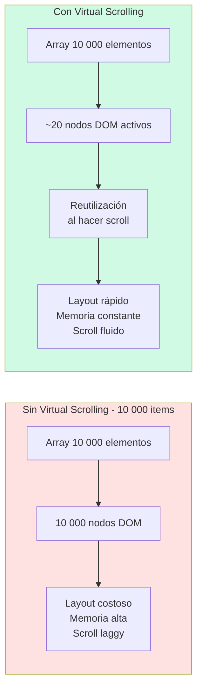

# Capítulo 26 - Parte 1: Virtual Scrolling con CDK: listas de miles de elementos

> **Parte 1 de 4** · Capítulo 26 · PARTE XII - Optimización y Rendimiento

Renderizar una lista de diez mil elementos en el DOM es uno de los problemas de rendimiento más predecibles en aplicaciones de datos. El navegador no tiene límite estricto en la cantidad de nodos que puede crear, pero tiene un límite muy concreto en la cantidad de nodos que puede pintar, recalcular y mantener en memoria a un costo aceptable. Virtual Scrolling resuelve este problema con una idea elegante: en lugar de crear diez mil nodos, creamos solo los que caben en pantalla y los reutilizamos mientras el usuario hace scroll.

## El problema de las listas largas

Cuando Angular renderiza un `@for` con diez mil elementos, crea diez mil nodos del DOM. Aunque el scroll del navegador oculte la mayoría, esos nodos existen, ocupan memoria y participan en los cálculos de layout. En una tabla con columnas de ancho relativo, por ejemplo, el navegador recalcula el layout de toda la tabla en cada resize de ventana. En mobile, donde la memoria es más limitada, listas largas pueden causar que el navegador descarte el tab.

El síntoma más común es el scroll laggy: el usuario arrastra la barra de scroll y la lista no sigue su dedo con fluidez. Esto ocurre porque cada frame de animación el navegador está recalculando la geometría de miles de nodos.

## Instalar y configurar el CDK

El CDK (Component Dev Kit) de Angular incluye el módulo de Virtual Scrolling. Si el proyecto no lo tiene instalado:

```bash
ng add @angular/cdk
# O con npm directamente:
# npm install @angular/cdk
```

Luego importamos `ScrollingModule` en el componente standalone que lo necesite:

```typescript
import { Component, ChangeDetectionStrategy } from '@angular/core';
import { ScrollingModule } from '@angular/cdk/scrolling';

interface Usuario {
  readonly id: number;
  readonly nombre: string;
  readonly email: string;
}

@Component({
  selector: 'app-lista-usuarios',
  standalone: true,
  imports: [ScrollingModule], // ← importar ScrollingModule
  changeDetection: ChangeDetectionStrategy.OnPush,
  template: `
    <cdk-virtual-scroll-viewport itemSize="60" style="height: 500px;">
      <div *cdkVirtualFor="let usuario of usuarios; trackBy: trackPorId"
           class="fila-usuario">
        <strong>{{ usuario.nombre }}</strong>
        <span>{{ usuario.email }}</span>
      </div>
    </cdk-virtual-scroll-viewport>
  `
})
export class ListaUsuariosComponent {
  usuarios: Usuario[] = this.generarUsuarios(10_000);

  trackPorId(_indice: number, usuario: Usuario): number {
    return usuario.id;
  }

  private generarUsuarios(cantidad: number): Usuario[] {
    return Array.from({ length: cantidad }, (_, i) => ({
      id: i + 1,
      nombre: `Usuario ${i + 1}`,
      email: `usuario${i + 1}@ejemplo.com`
    }));
  }
}
```

El viewport renderiza únicamente los elementos visibles más un pequeño buffer arriba y abajo. A medida que el usuario hace scroll, `*cdkVirtualFor` reutiliza los nodos del DOM existentes y actualiza su contenido con los datos del siguiente elemento. El DOM nunca tiene más de veinte o treinta nodos activos, sin importar el tamaño del array.

## itemSize: el parámetro obligatorio

`itemSize` es la altura de cada elemento en píxeles. El CDK la usa para calcular cuántos elementos caben en el viewport y para posicionar los elementos con `transform: translateY()`, de forma que el thumb de la barra de scroll refleje la posición real dentro de la lista completa.

Este es el único requisito limitante del Virtual Scrolling básico: los items deben tener altura fija y uniforme. Si los items varían en altura, necesitamos `AutoSizeVirtualScrollStrategy`, que es más complejo y tiene un costo de rendimiento mayor.

```typescript
import { Component, ChangeDetectionStrategy } from '@angular/core';
import { ScrollingModule } from '@angular/cdk/scrolling';
import { CurrencyPipe } from '@angular/common';

interface Producto {
  readonly id: number;
  readonly nombre: string;
  readonly precio: number;
  readonly categoria: string;
}

@Component({
  selector: 'app-catalogo-virtual',
  standalone: true,
  imports: [ScrollingModule, CurrencyPipe],
  changeDetection: ChangeDetectionStrategy.OnPush,
  styles: [`
    cdk-virtual-scroll-viewport { height: 400px; border: 1px solid #ddd; }
    .fila { height: 50px; display: flex; align-items: center; padding: 0 16px; gap: 16px; }
  `],
  template: `
    <cdk-virtual-scroll-viewport itemSize="50">
      <div *cdkVirtualFor="let producto of productos; trackBy: trackPorId"
           class="fila">
        <span>{{ producto.categoria }}</span>
        <strong>{{ producto.nombre }}</strong>
        <span>{{ producto.precio | currency:'USD' }}</span>
      </div>
    </cdk-virtual-scroll-viewport>
  `
})
export class CatalogoVirtualComponent {
  productos: Producto[] = [];
  trackPorId = (_i: number, p: Producto): number => p.id;
}
```

El height en el style del `cdk-virtual-scroll-viewport` es tan importante como `itemSize`. Sin height definido, el viewport no sabe cuánto espacio tiene disponible y no puede calcular qué elementos renderizar.

## Acceso programático con CdkVirtualScrollViewport

A veces necesitamos controlar el viewport desde código: scroll a un elemento específico, saber qué rango de índices está visible, o reaccionar cuando el rango visible cambia.

```typescript
import {
  Component, ChangeDetectionStrategy, ViewChild,
  AfterViewInit, inject
} from '@angular/core';
import { ScrollingModule, CdkVirtualScrollViewport } from '@angular/cdk/scrolling';

@Component({
  selector: 'app-lista-con-control',
  standalone: true,
  imports: [ScrollingModule],
  changeDetection: ChangeDetectionStrategy.OnPush,
  template: `
    <button (click)="irAlFinal()">Ir al final</button>
    <cdk-virtual-scroll-viewport #viewport itemSize="50" style="height:300px;">
      <div *cdkVirtualFor="let item of elementos">{{ item }}</div>
    </cdk-virtual-scroll-viewport>
  `
})
export class ListaConControlComponent implements AfterViewInit {
  @ViewChild('viewport') viewport!: CdkVirtualScrollViewport;
  elementos = Array.from({ length: 5000 }, (_, i) => `Elemento ${i + 1}`);

  ngAfterViewInit(): void {
    // Escuchar cambios en el rango visible
    this.viewport.renderedRangeStream.subscribe(rango => {
      console.log(`Visible: ${rango.start} - ${rango.end}`);
    });
  }

  irAlFinal(): void {
    // Scroll programático al último elemento
    this.viewport.scrollToIndex(this.elementos.length - 1, 'smooth');
  }
}
```

## Diagrama: Virtual Scrolling vs renderizado completo



## Cuándo vale el trade-off

Virtual Scrolling introduce complejidad: la altura fija es un requisito, el layout puede ser más difícil de estilizar, y algunas funcionalidades como "seleccionar todo" requieren trabajar con el array de datos en lugar de con los nodos del DOM. Vale la pena el trade-off cuando:

- La lista supera los cien elementos con scroll habitual.
- Cada fila tiene componentes con binding complejo (imágenes, pipes de formato, múltiples campos).
- La aplicación debe funcionar con rendimiento aceptable en dispositivos móviles de gama media.
- Los datos se actualizan frecuentemente y el re-render de la lista completa es notoriamente lento.

Para listas de diez a cincuenta elementos, el `@for` estándar con `OnPush` en el componente padre es suficiente y más sencillo de mantener.

## Puntos clave

- Virtual Scrolling renderiza solo los elementos visibles más un buffer, sin importar el tamaño total del array
- `ScrollingModule` de `@angular/cdk/scrolling` provee `cdk-virtual-scroll-viewport` y `*cdkVirtualFor`
- `itemSize` (altura en px por elemento) es obligatorio; sin él el viewport no puede calcular posiciones
- `CdkVirtualScrollViewport` permite scroll programático con `scrollToIndex()` y observar el rango visible
- Vale la pena con listas de más de cien elementos; bajo ese umbral, `@for` con `OnPush` es suficiente

## ¿Qué sigue?

En la Parte 2 optimizamos las imágenes de la aplicación con `NgOptimizedImage`, la directiva de Angular que mejora automáticamente el LCP y previene el Cumulative Layout Shift sin configuración adicional.
