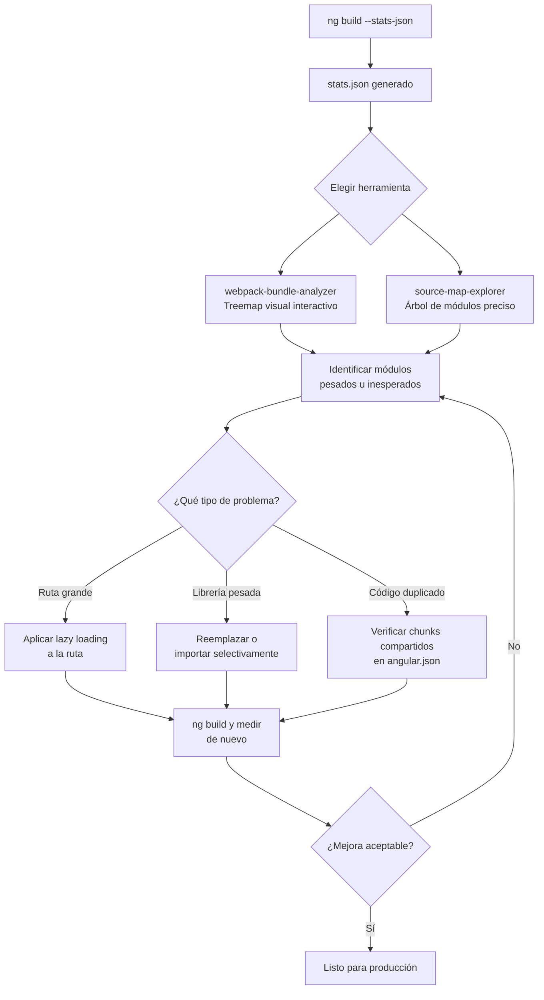

# Capítulo 26 - Parte 3: Bundle analysis con webpack-bundle-analyzer y esbuild

> **Parte 3 de 4** · Capítulo 26 · PARTE XII - Optimización y Rendimiento

No se puede optimizar lo que no se puede ver. El bundle de una aplicación Angular -el conjunto de archivos JavaScript que descarga el usuario- puede crecer silenciosamente a medida que agregamos dependencias. Una librería de utilidades que importamos para una sola función puede traer cien kilobytes de código que nunca ejecutamos. El análisis de bundle hace visible este peso oculto y nos permite tomar decisiones informadas sobre qué conservar, qué reemplazar y qué cargar de forma diferida.

## Generar el archivo de estadísticas

Angular CLI puede exportar un archivo JSON con metadatos detallados sobre cada módulo incluido en el bundle. Este archivo es la entrada para las herramientas de análisis.

```bash
# Angular 17+ con esbuild (builder por defecto)
ng build --stats-json

# El archivo se genera en:
# dist/nombre-del-proyecto/browser/stats.json
```

Con el builder de esbuild (predeterminado desde Angular 17), `--stats-json` genera un formato compatible con las herramientas de análisis, aunque la estructura interna difiere ligeramente del formato original de webpack. Si el proyecto aún usa el builder de webpack (configurado explícitamente), el mismo flag funciona igual.

## Visualizar con webpack-bundle-analyzer

`webpack-bundle-analyzer` toma el archivo de estadísticas y genera un mapa visual interactivo donde cada módulo aparece como un rectángulo cuyo tamaño corresponde a su peso en el bundle. Es la forma más intuitiva de identificar dependencias pesadas.

```bash
# Instalar como dependencia de desarrollo (una sola vez)
npm install --save-dev webpack-bundle-analyzer

# Analizar el stats.json generado
npx webpack-bundle-analyzer dist/mi-app/browser/stats.json
```

Esto abre un navegador con el treemap interactivo. Los rectángulos grandes son el punto de partida de la investigación: hacemos clic en ellos para ver su desglose interno y entender qué partes del módulo contribuyen más al peso total.

Lo que buscamos en el treemap:

```
Señales de alerta típicas:
- moment.js o date-fns completo (cuando solo usamos 2-3 funciones)
- lodash completo (en lugar de lodash-es con tree-shaking)
- rxjs con operadores que no usamos importados vía barrel file
- Una librería de componentes UI que arrastra sus íconos completos
- Polyfills de zona o módulos legacy que ya no necesitamos
```

## source-map-explorer como alternativa

`source-map-explorer` es otra herramienta excelente, especialmente para proyectos que usan esbuild, donde la compatibilidad con `webpack-bundle-analyzer` puede ser parcial. Trabaja directamente con los source maps en lugar del archivo de estadísticas.

```bash
# Construir con source maps habilitados
ng build --source-map

# Analizar todos los chunks de JavaScript
npx source-map-explorer 'dist/mi-app/browser/*.js'

# O analizar un chunk específico sospechoso
npx source-map-explorer dist/mi-app/browser/main-XXXXXXXX.js
```

`source-map-explorer` muestra un árbol de directorios donde cada nodo es un módulo o archivo, ordenado por peso. Es más preciso que `webpack-bundle-analyzer` cuando los source maps están disponibles, porque trabaja con el código compilado real en lugar de con estimaciones del bundler.

## Analizar el output de esbuild directamente

Angular 17+ usa esbuild por defecto, que es entre 10x y 100x más rápido que webpack. Para construir sin hashing y poder inspeccionar los archivos manualmente:

```bash
# Build sin hash en los nombres de archivo - más fácil de referenciar
ng build --output-hashing=none

# El output es legible con:
# dist/mi-app/browser/main.js
# dist/mi-app/browser/chunk-XXXXXXXX.js (chunks lazy)
```

Con `--output-hashing=none` podemos identificar fácilmente cuál chunk corresponde a cada ruta lazy de la aplicación. Un chunk de 500kb para una ruta que el usuario raramente visita es un candidato claro para revisión. La convención es que cada ruta lazy debería pesar menos de 200kb en gzip (aproximadamente 500-600kb sin comprimir).

## Estrategias de reducción de bundle

Una vez identificados los módulos pesados, estas son las estrategias más efectivas:

**Lazy loading de rutas** (→ ver Capítulo 16): el cambio con mayor impacto. Cualquier componente en una ruta que no sea la inicial puede cargarse bajo demanda.

```typescript
import { Routes } from '@angular/router';

export const rutas: Routes = [
  { path: '', loadComponent: () =>
      import('./inicio/inicio.component').then(m => m.InicioComponent) },
  // Este chunk no se descarga hasta que el usuario navega a /admin
  { path: 'admin', loadComponent: () =>
      import('./admin/admin.component').then(m => m.AdminComponent) }
];
```

**Reemplazar librerías pesadas por alternativas ligeras:**

```typescript
// ANTES: date-fns completo - ~75kb minificado
import { format, addDays } from 'date-fns';

// DESPUÉS: solo los módulos necesarios con imports específicos
// date-fns ya es tree-shakeable con imports directos desde sus módulos
import format from 'date-fns/format';
import addDays from 'date-fns/addDays';

// O mejor aún para solo formateo de fechas:
// Intl.DateTimeFormat nativo - 0kb de bundle
const formateador = new Intl.DateTimeFormat('es-MX', {
  year: 'numeric', month: 'long', day: 'numeric'
});
const fechaFormateada = formateador.format(new Date());
```

**Verificar tree-shaking de librerías de componentes:**

```typescript
// INCORRECTO: importar desde barrel file bloquea tree-shaking
// import { MatButtonModule, MatInputModule, MatTableModule } from '@angular/material';

// CORRECTO: importar módulos individuales - solo lo que usamos
import { MatButtonModule } from '@angular/material/button';
import { MatInputModule } from '@angular/material/input';
```

## Diagrama: flujo de análisis y optimización de bundle



## Verificar que los módulos standalone se cargan correctamente

Con la arquitectura standalone de Angular 17+, un error sutil es importar un componente standalone directamente en múltiples componentes de diferentes rutas, en lugar de importarlo solo en el componente de cada ruta. Esto puede incluir el mismo módulo en múltiples chunks lazy.

```bash
# Construir y revisar chunks duplicados
ng build --output-hashing=none --stats-json

# En el treemap: si un módulo aparece en múltiples chunks,
# considerar extraerlo a un chunk compartido via:
# commonChunk: true en angular.json (configuración de webpack)
# esbuild lo hace automáticamente para módulos compartidos
```

Con esbuild, Angular detecta automáticamente los módulos usados por múltiples chunks y los extrae a un chunk compartido, evitando la duplicación. Verificarlo en el análisis es una buena práctica, especialmente en proyectos que migran de una arquitectura basada en NgModule a standalone.

## Puntos clave

- `ng build --stats-json` genera el archivo de estadísticas necesario para las herramientas de análisis
- `webpack-bundle-analyzer` muestra un treemap interactivo; `source-map-explorer` usa source maps para mayor precisión
- Angular 17+ usa esbuild por defecto: construir con `--output-hashing=none` facilita identificar chunks lazy por ruta
- El lazy loading de rutas es la optimización de bundle con mayor impacto en la carga inicial
- Importar módulos específicos en lugar de barrel files es esencial para que tree-shaking funcione correctamente

## ¿Qué sigue?

En la Parte 4 conectamos todo el capítulo con métricas reales: los Core Web Vitals que Google usa para ranking y que definen la experiencia percibida del usuario en nuestra aplicación Angular.
