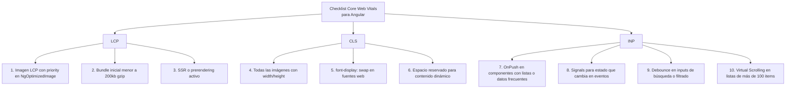

# Capítulo 26 - Parte 4: Core Web Vitals en apps Angular: LCP, CLS e INP

> **Parte 4 de 4** · Capítulo 26 · PARTE XII - Optimización y Rendimiento

Los Core Web Vitals son las métricas que Google usa para medir la experiencia real del usuario: qué tan rápido aparece el contenido principal, qué tan estable es el layout mientras carga y qué tan rápido responde la página a las interacciones. Afectan directamente el ranking en buscadores, pero más importante: afectan directamente si el usuario se queda o se va. Una aplicación Angular con OnPush, Virtual Scrolling e imágenes optimizadas tiene todos los ingredientes para puntuar bien -este capítulo cierra el círculo conectando las optimizaciones anteriores con las métricas que las miden.

## LCP - Largest Contentful Paint

El LCP mide cuánto tiempo tarda en renderizarse el elemento de contenido más grande visible en el viewport inicial. Ese elemento suele ser una imagen hero, una imagen de portada o un bloque de texto prominente. El objetivo es LCP inferior a 2.5 segundos desde la navegación.

Las causas más comunes de LCP lento en aplicaciones Angular son tres. Primero, imágenes sin `priority`: si la imagen LCP no tiene preload, el navegador la descubre tarde (después de parsear HTML, descargar CSS y parsear el HTML inline de Angular) y la descarga empieza con retraso. La solución directa es `NgOptimizedImage` con el atributo `priority` (→ ver Parte 2).

Segundo, JavaScript bloqueante en la carga inicial: si el bundle principal es demasiado grande, el navegador tarda en ejecutarlo y Angular no puede renderizar hasta que el JavaScript se descargue y ejecute. La solución es lazy loading agresivo de rutas y reducción del bundle inicial (→ ver Parte 3).

Tercero, la ausencia de SSR e hidratación: sin Server-Side Rendering, el usuario ve un HTML vacío hasta que Angular descarga, parsea y ejecuta. Con SSR y hidratación (→ ver Capítulo 28), el HTML llega pre-renderizado y el LCP ocurre mucho antes.

```typescript
// Verificar LCP programáticamente con la web-vitals library
import { onLCP } from 'web-vitals';

onLCP(metrica => {
  console.log(`LCP: ${metrica.value}ms`);
  // Enviar a servicio de analytics
  // analytics.enviarMetrica('LCP', metrica.value);
});
```

## CLS - Cumulative Layout Shift

El CLS mide la inestabilidad visual de la página: cuánto se mueve el contenido mientras carga. Un puntaje de 0 significa que nada se mueve; el objetivo es mantenerlo por debajo de 0.1. Un CLS alto ocurre cuando el usuario ya está leyendo o haciendo clic en algo y de repente ese contenido salta porque otra cosa terminó de cargar.

Las causas más frecuentes en Angular son las imágenes sin dimensiones declaradas. Si un `` no tiene `width` y `height`, el navegador no sabe cuánto espacio reservar mientras la imagen descarga. Cuando llega la imagen, empuja hacia abajo todo el contenido que estaba debajo. `NgOptimizedImage` resuelve esto al hacer obligatoria la declaración de dimensiones.

```typescript
import { Component, ChangeDetectionStrategy } from '@angular/core';
import { NgOptimizedImage } from '@angular/common';

@Component({
  selector: 'app-articulo',
  standalone: true,
  imports: [NgOptimizedImage],
  changeDetection: ChangeDetectionStrategy.OnPush,
  styles: [`
    /* Reservar espacio para contenido que carga dinámicamente */
    .bloque-skeleton { min-height: 120px; background: #f3f4f6; }
  `],
  template: `
    <!-- width/height previenen CLS: el navegador reserva 800x450px -->
    

    <!-- Para contenido dinámico: skeleton o min-height previenen saltos -->
    @if (contenidoCargado) {
      <div>{{ texto }}</div>
    } @else {
      <div class="bloque-skeleton"></div>
    }
  `
})
export class ArticuloComponent {
  contenidoCargado = false;
  texto = '';
}
```

Las fuentes web también contribuyen al CLS mediante FOIT (Flash of Invisible Text) y FOUT (Flash of Unstyled Text). La solución es `font-display: swap` en la declaración de la fuente y, si es posible, pre-cargar las fuentes críticas con `<link rel="preload">` en el `<head>`.

## INP - Interaction to Next Paint

INP (Interaction to Next Paint) reemplazó a FID (First Input Delay) como métrica oficial en 2024. Mientras FID medía solo el retardo hasta el primer evento, INP mide la latencia de todas las interacciones del usuario durante toda la sesión: clics, teclado y taps. El objetivo es INP inferior a 200 ms.

En Angular, las causas más comunes de INP alto son los event handlers que hacen trabajo computacional pesado en el hilo principal y los ciclos de Change Detection costosos que bloquean el render de la respuesta visual.

```typescript
import {
  Component, ChangeDetectionStrategy, inject, signal
} from '@angular/core';
import { ProductosService } from '../services/productos.service';

interface Producto {
  readonly id: number;
  readonly nombre: string;
  readonly precio: number;
}

@Component({
  selector: 'app-buscador',
  standalone: true,
  changeDetection: ChangeDetectionStrategy.OnPush, // reduce trabajo de CD
  template: `
    <input type="text" (input)="buscar($event)" placeholder="Buscar..." />
    @for (p of resultados(); track p.id) {
      <div>{{ p.nombre }}</div>
    }
  `
})
export class BuscadorComponent {
  private productosService = inject(ProductosService);
  resultados = signal<Producto[]>([]);

  buscar(evento: Event): void {
    const termino = (evento.target as HTMLInputElement).value;

    // Operaciones costosas en el evento → riesgo de INP alto
    // Si el filtrado es sobre 10 000 elementos, considerar:
    // 1. Debounce con rxjs para no ejecutar en cada tecla
    // 2. Web Worker para el filtrado pesado
    // 3. Paginación del resultado
    const encontrados = this.productosService.filtrar(termino);
    this.resultados.set(encontrados); // Signal → CD selectivo con OnPush
  }
}
```

`OnPush` contribuye directamente al INP porque reduce el trabajo que Angular hace después de cada evento. Si el componente es `OnPush` y usa Signals, Angular solo re-evalúa los bindings afectados por los Signals que cambiaron, en lugar de verificar todo el árbol.

## Herramientas de medición

**Chrome DevTools - Performance panel:** graba una sesión de uso real. Muestra en qué funciones se gasta el tiempo del hilo principal, los layouts y los paints. El "Long Tasks" overlay marca en rojo cualquier tarea que bloquee el hilo por más de 50ms.

**Lighthouse:** disponible en DevTools en la pestaña "Lighthouse". Genera un informe con puntaje de 0 a 100 para Performance, Accessibility, Best Practices y SEO. Incluye los Core Web Vitals con valores medidos en el lab y recomendaciones específicas.

**PageSpeed Insights:** ejecuta Lighthouse en los servidores de Google con datos reales del campo (CrUX - Chrome User Experience Report). Muestra la diferencia entre los datos de lab (condiciones controladas) y los datos de campo (usuarios reales con sus dispositivos y conexiones).

**web-vitals npm package:** la librería oficial de Google para medir Core Web Vitals en producción:

```typescript
import { onCLS, onINP, onLCP } from 'web-vitals';
import { AnalyticsService } from './analytics.service';
import { inject } from '@angular/core';

// En app.component.ts o en un servicio de métricas
export function inicializarMetricas(analytics: AnalyticsService): void {
  onLCP(m => analytics.registrar('LCP', m.value));
  onCLS(m => analytics.registrar('CLS', m.value));
  onINP(m => analytics.registrar('INP', m.value));
}
```

## Checklist de 10 puntos para Angular



Los puntos 1, 4 y 7 son los de mayor impacto y los que más se omiten en proyectos Angular que crecieron antes de que estas herramientas existieran. Si solo se pueden priorizar tres cambios, esos tres mueven la aguja más que cualquier otra optimización.

## Integrar las métricas en el flujo de desarrollo

La forma más efectiva de mantener los Core Web Vitals bajo control es no esperar a que sean un problema en producción. Lighthouse CI permite ejecutar Lighthouse en el pipeline de CI/CD y fallar el build si alguna métrica cae por debajo del umbral definido:

```bash
# Instalar Lighthouse CI
npm install --save-dev @lhci/cli

# En el script de CI:
npx lhci autorun
```

Con un archivo `.lighthouserc.json` que defina los umbrales, cualquier PR que degrade el LCP por encima de 2.5s o el CLS por encima de 0.1 fallará el pipeline antes de llegar a producción. Es la forma de hacer que el rendimiento sea un requisito no funcional verificable automáticamente, no una preocupación que se revisa ocasionalmente.

## Puntos clave

- LCP mide cuánto tarda el elemento más grande en aparecer; objetivo: menos de 2.5s. La causa más común en Angular es la imagen hero sin `priority`
- CLS mide la inestabilidad del layout; objetivo: menos de 0.1. `NgOptimizedImage` con `width`/`height` y skeleton loaders son las soluciones directas
- INP (reemplazó a FID) mide la latencia de todas las interacciones; objetivo: menos de 200ms. `OnPush` y Signals reducen el trabajo de CD después de cada evento
- `web-vitals` permite medir en producción con datos reales; Lighthouse CI permite validar en el pipeline de CI/CD
- Los diez puntos del checklist cubren los escenarios de degradación más comunes en aplicaciones Angular de tamaño real

## ¿Qué sigue?

En el Capítulo 27 exploramos estrategias de caché HTTP, Service Workers con Angular PWA y cómo hacer que la aplicación funcione offline, completando así la imagen del rendimiento percibido desde la red hasta el hilo principal.
