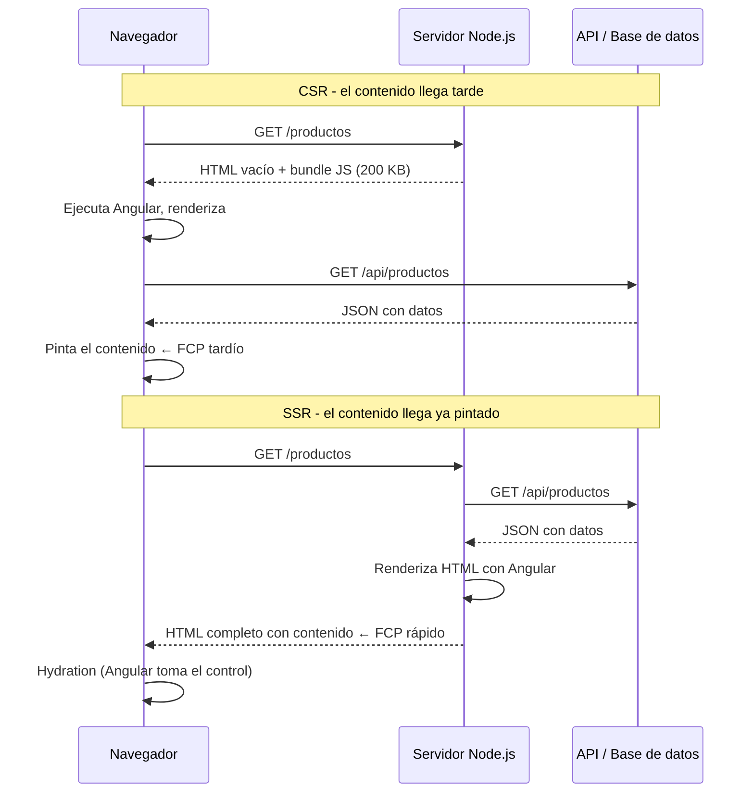

# Capítulo 27 - Parte 1: SSR con @angular/ssr: introducción e instalación

> **Parte 1 de 4** · Capítulo 27 · PARTE XII - Optimización y Rendimiento

Cuando Angular renderiza una aplicación en el navegador, el usuario recibe primero un `index.html` prácticamente vacío -solo el tag `<app-root>`- y luego espera a que JavaScript descargue, evalúe y construya el DOM completo. Ese proceso tiene un costo real: un First Contentful Paint (FCP) lento, bots de buscadores que ven una página vacía, y usuarios en redes lentas que esperan más de lo que deberían. Server-Side Rendering (SSR) existe para resolver exactamente ese problema.

## CSR vs SSR: qué ocurre en cada modelo

En el modelo de Client-Side Rendering (CSR), el servidor solo envía un HTML mínimo más los bundles de JavaScript. El navegador descarga los scripts, Angular arranca, realiza las llamadas a API necesarias y finalmente pinta el contenido visible. Todo ocurre en el cliente.

En SSR, el servidor ejecuta Angular antes de responder. Toma la misma aplicación TypeScript, la corre en Node.js, llama a las APIs que sean necesarias y devuelve al navegador un HTML completo con el contenido ya insertado. El usuario ve contenido real desde el primer byte recibido, aunque Angular todavía no haya arrancado en el cliente.



La diferencia más visible es el tiempo hasta que el usuario puede *ver* algo. Con SSR, ese tiempo se reduce drásticamente porque el HTML llega ya renderizado, independientemente de la velocidad de la conexión o del hardware del dispositivo.

## Cuándo SSR aporta valor real

SSR no es la respuesta correcta para todo proyecto Angular. Veamos los escenarios donde su costo operativo (un servidor Node.js activo) se justifica ampliamente.

**Contenido públicamente indexable:** si tu aplicación tiene páginas de productos, artículos de blog, landings o cualquier contenido que los motores de búsqueda necesitan leer, SSR es casi obligatorio. Los bots de Google pueden ejecutar JavaScript, pero lo hacen con retrasos y restricciones. Un HTML pre-renderizado elimina esa variable por completo.

**Usuarios en conexiones lentas o hardware limitado:** cuando el dispositivo del usuario es lento (teléfonos de gama baja, conexiones 3G), enviar 300 KB de JavaScript para que el navegador los procese antes de mostrar cualquier cosa es una mala experiencia. Con SSR el HTML completo llega primero, el usuario ve el contenido inmediatamente y el JavaScript llega después en segundo plano.

**Métricas de Core Web Vitals:** el LCP (Largest Contentful Paint) y el FCP (First Contentful Paint) mejoran directamente con SSR porque el contenido significativo está en el HTML inicial, no esperando a que JavaScript lo construya.

## Cuándo SSR no es la solución

Hay escenarios donde agregar SSR añade complejidad sin beneficio real. Las aplicaciones detrás de login sin indexación de contenido -un panel de administración, un ERP, una herramienta interna- no necesitan SSR porque no hay bots que las indexen y los usuarios ya están autenticados antes de ver cualquier contenido. El FCP relativo al login page (que sí puede beneficiarse de SSR) no justifica migrar toda la app.

Los dashboards con datos en tiempo real que cambian cada segundo tampoco se benefician: el HTML renderizado en el servidor quedaría obsoleto casi de inmediato. Y las PWAs offline-first construidas con Service Workers tienen su propio mecanismo de caché que ya resuelve el problema de la carga inicial.

## Instalación con ng add @angular/ssr

Angular incluye soporte oficial de SSR desde Angular 17 a través del paquete `@angular/ssr`. Para agregar SSR a un proyecto existente usamos el esquemático oficial:

```bash
ng add @angular/ssr
```

El CLI detecta la configuración del proyecto, instala las dependencias necesarias (`@angular/ssr`, `express`, `@types/express`) y genera varios archivos. Veamos qué crea cada uno.

**`src/app/app.config.server.ts`** - la configuración de la aplicación específica para el entorno servidor. Extiende `app.config.ts` con providers exclusivos de SSR:

```typescript
// src/app/app.config.server.ts
import { mergeApplicationConfig, ApplicationConfig } from '@angular/core';
import { provideServerRendering } from '@angular/platform-server';
import { appConfig } from './app.config';

// Configuración adicional que solo aplica en el servidor
const configServidor: ApplicationConfig = {
  providers: [
    provideServerRendering()
    // Aquí se agregan providers solo para el contexto Node.js
  ]
};

// La configuración final del servidor fusiona la base con la del servidor
export const config = mergeApplicationConfig(appConfig, configServidor);
```

**`server.ts`** - el servidor Express que recibe las peticiones HTTP y delega en Angular el renderizado de cada ruta:

```typescript
// server.ts (generado por ng add @angular/ssr)
import { APP_BASE_HREF } from '@angular/common';
import { CommonEngine } from '@angular/ssr';
import express from 'express';
import { fileURLToPath } from 'node:url';
import { dirname, join, resolve } from 'node:path';
import bootstrap from './src/main.server';

export function app(): express.Express {
  const servidor = express();
  const dirActual = dirname(fileURLToPath(import.meta.url));
  const rutaBrowser = join(dirActual, '../browser');
  const motorComun = new CommonEngine();

  // Servir archivos estáticos del bundle de browser
  servidor.get('**', express.static(rutaBrowser, {
    maxAge: '1y',
    index: false,   // No servir index.html directamente - Angular SSR lo maneja
  }));

  // Para todas las rutas que no sean archivos estáticos, Angular renderiza
  servidor.get('**', (req, res, next) => {
    const { protocolo, originalUrl, baseUrl, headers } = req;
    motorComun.render({
      bootstrap,
      documentFilePath: join(rutaBrowser, 'index.html'),
      url: `${protocolo}://${headers.host}${originalUrl}`,
      publicPath: rutaBrowser,
      providers: [{ provide: APP_BASE_HREF, useValue: baseUrl }],
    })
    .then(html => res.send(html))
    .catch(error => next(error));
  });

  return servidor;
}
```

`CommonEngine` es el motor de Angular SSR. Recibe la función `bootstrap` (el punto de entrada de la app), el `index.html` base, la URL actual y los providers adicionales, y devuelve el HTML renderizado como string.

## Qué modifica en angular.json

El esquemático actualiza `angular.json` para agregar una configuración de build del servidor:

```json
{
  "projects": {
    "mi-app": {
      "architect": {
        "build": {
          "builder": "@angular-devkit/build-angular:application",
          "options": {
            "server": "src/main.server.ts",
            "prerender": false,
            "ssr": {
              "entry": "server.ts"
            }
          }
        }
      }
    }
  }
}
```

La clave `server` apunta al punto de entrada de la aplicación en el servidor (`main.server.ts`, también generado). La clave `ssr.entry` apunta al servidor Express. El builder `@angular-devkit/build-angular:application` (introducido en Angular 17) produce automáticamente dos salidas al ejecutar `ng build`.

## El resultado del build: carpetas browser/ y server/

Al ejecutar `ng build`, Angular produce el artefacto en `dist/mi-app/` con la siguiente estructura:

```
dist/
  mi-app/
    browser/         ← bundle estático para el cliente
      index.html
      main-HASH.js
      polyfills-HASH.js
      assets/
    server/          ← bundle Node.js para SSR
      server.mjs     ← el servidor Express compilado
      chunk-HASH.mjs
```

La carpeta `browser/` contiene exactamente lo mismo que tendría un build CSR: el HTML base y los bundles de JavaScript. La carpeta `server/` contiene el servidor Express y el bundle de Angular para Node.js. Los dos artefactos trabajan juntos: Express sirve los estáticos de `browser/` y usa Angular SSR para renderizar el HTML de cada ruta.

Para probar localmente el resultado del build:

```bash
ng build
node dist/mi-app/server/server.mjs
# El servidor escucha en http://localhost:4000
```

Navegar a `http://localhost:4000/cualquier-ruta` mostrará el HTML completamente renderizado en el servidor. Podemos verificarlo desactivando JavaScript en el navegador: si el contenido sigue visible, SSR está funcionando correctamente.

## Puntos clave

- SSR significa que Node.js ejecuta Angular y devuelve HTML completo antes de que el cliente descargue JavaScript
- SSR aporta valor real en aplicaciones con contenido indexable por SEO, FCP crítico o usuarios con conexiones lentas
- `ng add @angular/ssr` genera `app.config.server.ts`, `server.ts` y `main.server.ts`, y actualiza `angular.json`
- `ng build` produce dos carpetas: `browser/` para el cliente y `server/` para Node.js
- `node dist/mi-app/server/server.mjs` arranca el servidor Express para probar localmente

## ¿Qué sigue?

En la Parte 2 resolvemos el problema más importante del SSR en Angular: cómo evitar que el cliente destruya y re-renderice el DOM que el servidor ya construyó, usando hydration y `TransferState`.
