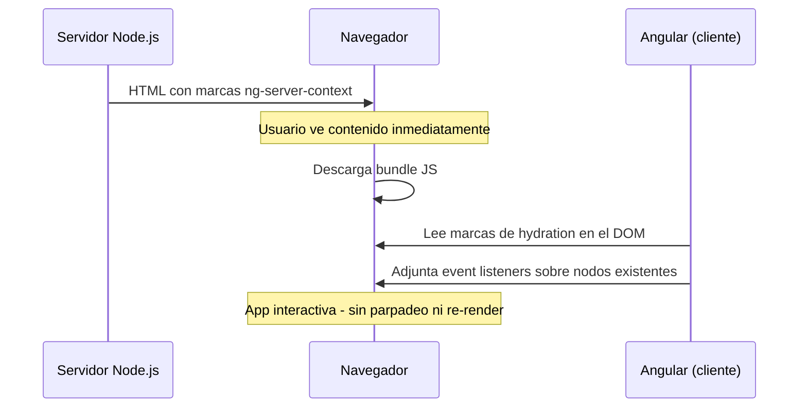

# Capítulo 27 - Parte 2: Hydration e TransferState: del servidor al cliente

> **Parte 2 de 4** · Capítulo 27 · PARTE XII - Optimización y Rendimiento

Instalar SSR y ver el HTML renderizado en el servidor es solo la mitad del trabajo. El problema que aparece inmediatamente después es menos obvio pero igual de importante: cuando Angular arranca en el cliente, destruye el DOM que el servidor construyó y lo vuelve a construir desde cero. El usuario ve el contenido del servidor durante una fracción de segundo y luego observa un flash o parpadeo mientras el cliente rehace todo. Para resolverlo existe la hydration.

## El problema: re-renderizado del cliente

Sin hydration, el flujo después de recibir el HTML del servidor es el siguiente. El navegador pinta el HTML que llegó -el usuario ve contenido real-, luego descarga y ejecuta el bundle de JavaScript, Angular arranca, detecta el `<app-root>` y, como no sabe que ya hay un DOM válido ahí, lo borra y construye uno nuevo. Ese proceso genera un parpadeo visible y, lo que es peor, repite peticiones HTTP que el servidor ya hizo: si el servidor llamó a `/api/productos` para renderizar la lista, el cliente vuelve a llamar a `/api/productos` al inicializarse.

Con hydration, Angular reconoce el DOM existente del servidor y lo *adopta* en lugar de reemplazarlo. Los nodos del DOM ya están en pantalla; Angular solo necesita adjuntarles los event listeners y las referencias internas. El contenido nunca parpadea y el tiempo hasta que la aplicación es interactiva se reduce considerablemente.

## Habilitando provideClientHydration

Para activar la hydration incremental de Angular solo hace falta agregar un provider en `app.config.ts`:

```typescript
// src/app/app.config.ts
import {
  ApplicationConfig,
  provideZoneChangeDetection
} from '@angular/core';
import { provideRouter } from '@angular/router';
import { provideClientHydration } from '@angular/platform-browser';
import { provideHttpClient, withFetch } from '@angular/common/http';
import { rutas } from './app.routes';

export const appConfig: ApplicationConfig = {
  providers: [
    provideZoneChangeDetection({ eventCoalescing: true }),
    provideRouter(rutas),
    // Activa la hydration incremental del DOM del servidor
    provideClientHydration(),
    provideHttpClient(withFetch()),
  ]
};
```

`provideClientHydration()` le indica a Angular que, al arrancar en el cliente, debe comparar el DOM existente con el árbol de componentes en lugar de descartarlo. Angular navega el DOM que llegó del servidor y lo reconcilia nodo a nodo con lo que su motor de renderizado esperaría generar. Si encuentra divergencias (generalmente por código que se comporta diferente en servidor vs cliente), lanza advertencias en la consola en modo desarrollo.

## Cómo funciona la hydration por dentro

Durante el renderizado en el servidor, Angular serializa información sobre la estructura del árbol de componentes y la embebe en el HTML como comentarios especiales y atributos `ng-*`. Cuando el cliente recibe ese HTML y Angular arranca, lee esas marcas, identifica qué nodo del DOM corresponde a cada componente, y adjunta los event listeners directamente sobre los nodos existentes sin reconstruirlos.



Una restricción importante: el DOM del servidor y el DOM que Angular generaría en el cliente deben ser idénticos. Si un componente usa `Math.random()`, `Date.now()`, o accede a APIs del navegador (`window`, `localStorage`) durante el renderizado inicial, el resultado diferirá y la hydration fallará. En la Parte 4 veremos cómo manejar estas diferencias con `isPlatformBrowser`.

## El problema de las dobles peticiones HTTP

Incluso con hydration activada, existe otro problema: el servidor llama a las APIs para obtener los datos que necesita renderizar, y el cliente, al inicializarse, vuelve a llamar a esas mismas APIs porque sus servicios no saben que el servidor ya obtuvo esos datos. El resultado son dos llamadas HTTP idénticas, la segunda completamente innecesaria.

`TransferState` resuelve esto. Es un mecanismo que permite al servidor guardar datos en el HTML, y al cliente leerlos desde ahí en lugar de hacer una nueva petición HTTP.

## TransferState: del servidor al cliente sin petición extra

`TransferState` funciona con claves tipadas. El servidor guarda datos bajo una clave, esos datos se serializan en el HTML como JSON, y el cliente los lee usando la misma clave antes de intentar cualquier petición.

```typescript
// src/app/core/services/productos.service.ts
import { Injectable, inject, PLATFORM_ID } from '@angular/core';
import { HttpClient } from '@angular/common/http';
import { TransferState, makeStateKey } from '@angular/core';
import { isPlatformServer } from '@angular/common';
import { Observable, of } from 'rxjs';
import { tap } from 'rxjs/operators';

export interface Producto {
  id: number;
  nombre: string;
  precio: number;
}

// La clave tipada que identifica estos datos en el estado transferido
const CLAVE_PRODUCTOS = makeStateKey<Producto[]>('lista-productos');

@Injectable({ providedIn: 'root' })
export class ProductosService {
  private http = inject(HttpClient);
  private estado = inject(TransferState);
  private plataformaId = inject(PLATFORM_ID);

  obtenerProductos(): Observable<Producto[]> {
    // Si el cliente ya tiene los datos del servidor, los usa directamente
    const datosGuardados = this.estado.get(CLAVE_PRODUCTOS, null);
    if (datosGuardados) {
      // Limpia el estado para no consumir memoria innecesaria
      this.estado.remove(CLAVE_PRODUCTOS);
      return of(datosGuardados);
    }

    return this.http.get<Producto[]>('/api/productos').pipe(
      tap(productos => {
        // Solo el servidor guarda los datos en el estado
        if (isPlatformServer(this.plataformaId)) {
          this.estado.set(CLAVE_PRODUCTOS, productos);
        }
      })
    );
  }
}
```

Veamos el flujo completo: cuando el servidor ejecuta `obtenerProductos()`, no hay datos en el estado, así que llama a la API, obtiene los productos y los guarda bajo `CLAVE_PRODUCTOS`. Esos datos se serializan en el HTML entre tags `<script type="application/json" id="ng-transfer-state">`. Cuando el cliente ejecuta `obtenerProductos()`, encuentra los datos bajo `CLAVE_PRODUCTOS`, los devuelve directamente con `of(datosGuardados)` y elimina la entrada del estado. La petición HTTP nunca ocurre en el cliente.

## withHttpTransferCache: la forma automática

Para el caso más común -servicios que usan `HttpClient` directamente- Angular ofrece `withHttpTransferCache()`, que automatiza todo el proceso anterior sin necesitar `TransferState` manualmente:

```typescript
// src/app/app.config.ts
import {
  ApplicationConfig,
  provideZoneChangeDetection
} from '@angular/core';
import { provideRouter } from '@angular/router';
import {
  provideClientHydration,
  withHttpTransferCache
} from '@angular/platform-browser';
import { provideHttpClient, withFetch } from '@angular/common/http';
import { rutas } from './app.routes';

export const appConfig: ApplicationConfig = {
  providers: [
    provideZoneChangeDetection({ eventCoalescing: true }),
    provideRouter(rutas),
    // withHttpTransferCache intercepta automáticamente todas las peticiones
    // GET hechas durante el renderizado del servidor y las cachea para el cliente
    provideClientHydration(withHttpTransferCache()),
    provideHttpClient(withFetch()),
  ]
};
```

Con `withHttpTransferCache()`, cualquier petición GET que `HttpClient` realice durante el renderizado en el servidor queda registrada automáticamente en el `TransferState`. Cuando el cliente intenta hacer la misma petición (misma URL, mismos parámetros), el interceptor la intercepta, devuelve los datos del estado y la petición real nunca sale a la red.

La limitación de `withHttpTransferCache()` es que solo aplica a peticiones GET idénticas en URL. Para casos más complejos -datos que dependen del contexto del usuario, peticiones POST, o estados derivados- el `TransferState` manual da más control.

## Ejemplo completo: componente que carga datos una sola vez

Veamos cómo queda un componente que usa `withHttpTransferCache()` de forma transparente:

```typescript
// src/app/features/catalogo/catalogo.component.ts
import { Component, inject, OnInit } from '@angular/core';
import { HttpClient } from '@angular/common/http';
import { AsyncPipe } from '@angular/common';
import { Observable } from 'rxjs';

interface Producto {
  id: number;
  nombre: string;
  precio: number;
}

@Component({
  selector: 'app-catalogo',
  standalone: true,
  imports: [AsyncPipe],
  template: `
    <ul>
      @for (producto of productos$ | async; track producto.id) {
        <li>{{ producto.nombre }} - ${{ producto.precio }}</li>
      }
    </ul>
  `
})
export class CatalogoComponent implements OnInit {
  private http = inject(HttpClient);
  productos$!: Observable<Producto[]>;

  ngOnInit(): void {
    // Esta petición GET ocurre en el servidor durante SSR.
    // Con withHttpTransferCache, en el cliente se devuelven los datos cacheados.
    this.productos$ = this.http.get<Producto[]>('/api/productos');
  }
}
```

El componente no sabe nada de SSR, servidores ni `TransferState`. Llama a `HttpClient` de la manera habitual. `withHttpTransferCache()` se encarga de interceptar la petición en el servidor, guardar el resultado, y en el cliente devolver ese resultado sin tocar la red. Este es el nivel de transparencia que Angular SSR busca: el código de la aplicación no debería saber si se está ejecutando en el servidor o en el cliente para los casos simples.

## Puntos clave

- Sin hydration, Angular descarta y re-renderiza el DOM del servidor desde cero, causando un parpadeo visible
- `provideClientHydration()` activa la hydration incremental: Angular adopta el DOM existente en lugar de reemplazarlo
- `TransferState` con `makeStateKey<T>()` permite transferir datos del servidor al cliente embebidos en el HTML
- `withHttpTransferCache()` automatiza la transferencia de estado para peticiones GET de `HttpClient`, sin código adicional en los servicios
- El DOM del servidor y el del cliente deben ser idénticos; las diferencias de plataforma se manejan con `isPlatformBrowser`

## ¿Qué sigue?

En la Parte 3 exploramos Static Site Generation (SSG), la variante de SSR donde Angular genera el HTML en tiempo de build en lugar de en cada petición, ideal para contenido que no cambia frecuentemente.
