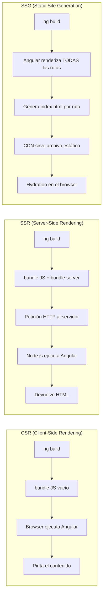
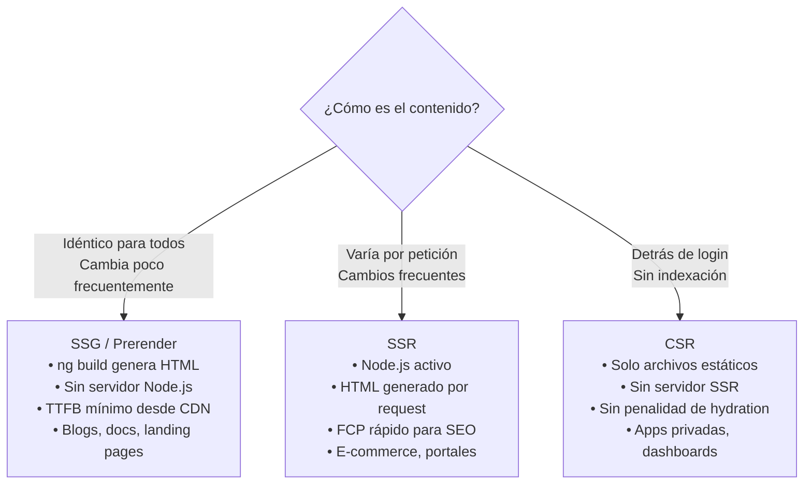

# Capítulo 27 - Parte 3: Static Site Generation (SSG) con prerender

> **Parte 3 de 4** · Capítulo 27 · PARTE XII - Optimización y Rendimiento

SSR con un servidor activo resuelve el problema del renderizado para contenido dinámico, pero no todas las páginas cambian en cada petición. Un artículo de blog, la página de un producto en un catálogo, una landing page o la documentación de una librería tienen el mismo HTML para todos los visitantes durante horas o días. Renderizar esas páginas en cada petición con Node.js es desperdiciar ciclos de CPU. Static Site Generation (SSG) fue hecho para este escenario.

## SSG vs SSR: cuándo el HTML se genera

La diferencia fundamental entre SSR y SSG es *el momento* en que Angular genera el HTML. Con SSR, el servidor ejecuta Angular en cada petición HTTP y construye el HTML al vuelo, lo que implica un servidor Node.js activo 24/7. Con SSG, Angular genera el HTML una sola vez durante el proceso de build. El resultado son archivos `.html` estáticos que cualquier servidor de archivos -un CDN, un bucket de S3, Nginx sin Node.js- puede servir directamente.



La ventaja del SSG es la velocidad de entrega: un CDN puede cachear archivos estáticos en nodos de borde alrededor del mundo y servirlos en milisegundos sin procesar nada. El tiempo al primer byte (TTFB) es prácticamente el de la red física, no el de un servidor procesando. La desventaja es que si el contenido cambia, hay que re-generar y re-desplegar el sitio.

## Cuándo usar SSG

SSG tiene sentido cuando el contenido es relativamente estable entre deploys. Los casos más claros: blogs y artículos (el contenido cambia al publicar, no en cada visita), páginas de documentación, catálogos de productos donde los precios y el inventario se actualizan ocasionalmente, landing pages de marketing y cualquier página que sea idéntica para todos los usuarios.

SSG no es la opción correcta cuando el contenido es personalizado por usuario (el perfil de una cuenta, el historial de pedidos) o cuando cambia en tiempo real (precios de bolsa, resultados deportivos en vivo, dashboards). Para esos casos SSR o CSR son las alternativas apropiadas.

## Configurar prerender en angular.json

Habilitar SSG en Angular 17+ es tan simple como ajustar una opción en `angular.json`:

```json
{
  "projects": {
    "mi-app": {
      "architect": {
        "build": {
          "builder": "@angular-devkit/build-angular:application",
          "options": {
            "server": "src/main.server.ts",
            "prerender": true,
            "ssr": {
              "entry": "server.ts"
            }
          }
        }
      }
    }
  }
}
```

Con `"prerender": true`, durante `ng build` Angular inspecciona el router de la aplicación, detecta todas las rutas estáticas (las que no tienen parámetros dinámicos como `:id`) y genera un `index.html` para cada una. Si tienes rutas `/inicio`, `/nosotros` y `/contacto`, el build produce:

```
dist/mi-app/browser/
  index.html          ← ruta /
  nosotros/
    index.html        ← ruta /nosotros
  contacto/
    index.html        ← ruta /contacto
```

Cada archivo contiene el HTML completamente renderizado con hydration habilitada. Un servidor Nginx o un CDN los sirve directamente sin ningún procesamiento.

## Rutas dinámicas: proveer los IDs

Las rutas que incluyen parámetros dinámicos -`/productos/:id`, `/blog/:slug`- requieren que le digamos a Angular exactamente qué valores existen para esos parámetros, porque no puede inferirlos del router. Hay dos formas de hacerlo.

La primera es listarlos directamente en `angular.json` como un arreglo de URLs concretas:

```json
{
  "prerender": {
    "routesFile": "rutas-prerender.txt"
  }
}
```

Donde `rutas-prerender.txt` contiene una URL por línea:

```
/productos/teclado-mecanico
/productos/monitor-4k
/productos/webcam-hd
/blog/angular-17-novedades
/blog/guia-rxjs
```

La segunda forma, más potente, es generar las rutas de forma programática con una función asíncrona. Para esto se usa el objeto de configuración extendido de `prerender`:

```typescript
// prerender.routes.ts - ejecutado en Node.js durante el build
import { PrerenderFallback, RenderMode, ServerRoute } from '@angular/ssr';

export const rutasServidor: ServerRoute[] = [
  {
    path: '**',
    renderMode: RenderMode.Prerender,
  },
  {
    path: 'productos/:id',
    renderMode: RenderMode.Prerender,
    // Angular llama a esta función durante el build para obtener los IDs
    async getPrerenderParams() {
      // En un caso real, esto consultaría la base de datos o una API
      const respuesta = await fetch('https://api.mitienda.com/productos/ids');
      const ids = await respuesta.json() as string[];
      // Debe devolver un arreglo de objetos con los parámetros de la ruta
      return ids.map(id => ({ id }));
    }
  },
];
```

Esta función se ejecuta en el contexto de Node.js durante el build, así que puede hacer peticiones HTTP, leer archivos, o consultar bases de datos. El resultado es un arreglo de objetos donde cada clave corresponde a un parámetro de la ruta.

## Configurar las rutas del servidor

Angular 17+ introduce el archivo de configuración de rutas del servidor (`app.routes.server.ts`) donde se define cómo renderizar cada ruta. Esto permite mezclar estrategias en la misma aplicación:

```typescript
// src/app/app.routes.server.ts
import { RenderMode, ServerRoute } from '@angular/ssr';

export const rutasServidor: ServerRoute[] = [
  // La ruta raíz y rutas estáticas: prerenderizar en build time
  { path: '', renderMode: RenderMode.Prerender },
  { path: 'nosotros', renderMode: RenderMode.Prerender },
  { path: 'blog/:slug', renderMode: RenderMode.Prerender,
    async getPrerenderParams() {
      const slugs = ['angular-ssr', 'zoneless', 'signals'];
      return slugs.map(slug => ({ slug }));
    }
  },
  // El perfil de usuario es dinámico y personal → SSR en cada petición
  { path: 'perfil', renderMode: RenderMode.Server },
  // El panel de administración no necesita SSR → solo cliente
  { path: 'admin/**', renderMode: RenderMode.Client },
];
```

Y se registra en `app.config.server.ts`:

```typescript
// src/app/app.config.server.ts
import { mergeApplicationConfig, ApplicationConfig } from '@angular/core';
import { provideServerRendering } from '@angular/platform-server';
import { provideServerRoutesConfig } from '@angular/ssr';
import { rutasServidor } from './app.routes.server';
import { appConfig } from './app.config';

const configServidor: ApplicationConfig = {
  providers: [
    provideServerRendering(),
    // Registrar la configuración de rutas del servidor
    provideServerRoutesConfig(rutasServidor),
  ]
};

export const config = mergeApplicationConfig(appConfig, configServidor);
```

## Fallback para rutas no prerenderizadas

Cuando un usuario accede a una URL que no fue prerenderizada -por ejemplo, una ruta dinámica cuyo ID no estaba en la lista del build- Angular necesita saber qué hacer. El modo `PrerenderFallback` define ese comportamiento:

```typescript
import { RenderMode, PrerenderFallback, ServerRoute } from '@angular/ssr';

export const rutasServidor: ServerRoute[] = [
  {
    path: 'productos/:id',
    renderMode: RenderMode.Prerender,
    fallback: PrerenderFallback.Server,
    // Si el :id no está en los prerenderizados, el servidor lo renderiza al vuelo
    async getPrerenderParams() {
      return [{ id: '1' }, { id: '2' }, { id: '3' }];
    }
  },
];
```

`PrerenderFallback.Server` indica que si llega una petición para `/productos/4` (que no fue prerenderizado), Angular la pasa al motor SSR para renderizarla al vuelo, igual que haría con SSR puro. `PrerenderFallback.Client` envía el `index.html` vacío para que sea el cliente quien renderice -útil cuando el servidor solo está disponible durante el build y no en producción.

## Comparativa de las tres estrategias



La realidad de muchos proyectos es que necesitan las tres estrategias al mismo tiempo: la landing pública en SSG, el catálogo de productos en SSR, y el panel del usuario autenticado en CSR. El sistema de `ServerRoute` con `RenderMode` hace exactamente eso posible, ruta a ruta.

## Puntos clave

- SSG genera el HTML en build time; SSR lo genera en cada petición; CSR lo genera en el navegador
- `"prerender": true` en `angular.json` activa SSG para rutas estáticas detectadas automáticamente
- Las rutas dinámicas (`/productos/:id`) requieren `getPrerenderParams()` para proveer los valores posibles
- `PrerenderFallback.Server` permite que las URLs no prerenderizadas sean atendidas por SSR al vuelo
- `app.routes.server.ts` con `RenderMode` permite mezclar CSR, SSR y SSG en la misma aplicación

## ¿Qué sigue?

En la Parte 4 abordamos el desafío más complejo de SSR en aplicaciones reales: la autenticación, donde cookies, tokens de sesión y la ausencia de `localStorage` en el servidor requieren un manejo específico.
