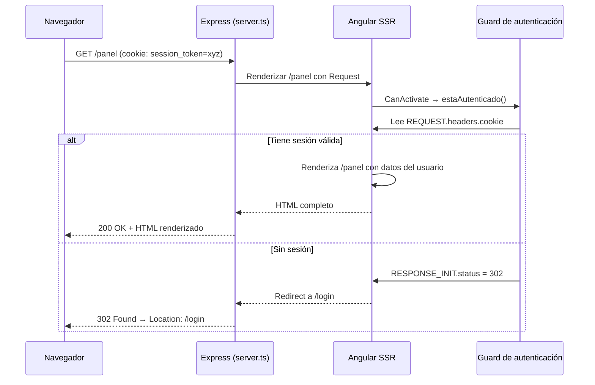

# Capítulo 27 - Parte 4: SSR con autenticación, cookies y APIs privadas

> **Parte 4 de 4** · Capítulo 27 · PARTE XII - Optimización y Rendimiento

La autenticación es el punto donde SSR se vuelve verdaderamente complejo. En el cliente todo es familiar: el token vive en `localStorage`, se lee al iniciar la app, se adjunta a los headers de cada petición. En el servidor Node.js ese mundo no existe. No hay `localStorage`, no hay `sessionStorage`, no hay `window`. Pero sí hay cookies, y las cookies son la pieza central de una estrategia de autenticación SSR correctamente diseñada.

## Por qué localStorage no funciona en el servidor

`localStorage` es una API del navegador. Cuando Angular corre en Node.js durante el renderizado SSR, el objeto `window` no existe y cualquier acceso a `localStorage` lanza un `ReferenceError` en tiempo de ejecución. El mismo problema afecta a `document.cookie`, `navigator`, `window.location` y cualquier API que asuma la existencia de un entorno browser.

La solución no es envolver todo en `try/catch`, sino diseñar los servicios de autenticación para que funcionen correctamente en ambos entornos: leyendo cookies cuando están en el servidor y usando el mecanismo apropiado cuando están en el cliente.

## El token REQUEST de @angular/ssr

`@angular/ssr` expone dos injection tokens especiales que permiten acceder al objeto `Request` y `Response` de Express desde cualquier servicio de Angular:

```typescript
// src/app/core/services/autenticacion.service.ts
import { Injectable, inject, PLATFORM_ID } from '@angular/core';
import { isPlatformBrowser, isPlatformServer } from '@angular/common';
import { REQUEST, RESPONSE_INIT } from '@angular/ssr';

@Injectable({ providedIn: 'root' })
export class AutenticacionService {
  private plataformaId = inject(PLATFORM_ID);
  // REQUEST solo tiene valor en el servidor; en el cliente es null
  private peticion = inject(REQUEST, { optional: true });

  obtenerToken(): string | null {
    if (isPlatformServer(this.plataformaId)) {
      // En el servidor leemos la cookie de la request de Express
      const cookies = this.peticion?.headers.get('cookie') ?? '';
      return this.parsearCookie(cookies, 'session_token');
    }
    // En el cliente el token no lo guardamos en localStorage sino en una cookie
    // que el servidor también puede leer (HttpOnly: false para este caso)
    return this.parsearCookie(document.cookie, 'session_token');
  }

  private parsearCookie(encabezado: string, nombre: string): string | null {
    const coincidencia = encabezado
      .split(';')
      .map(c => c.trim())
      .find(c => c.startsWith(`${nombre}=`));
    return coincidencia ? coincidencia.split('=')[1] : null;
  }
}
```

Dos detalles importantes: `inject(REQUEST, { optional: true })` es obligatorio -en el cliente no existe y sin `optional: true` Angular lanzaría un error al inicializar el servicio en el browser. Y la cookie `session_token` debe ser accesible tanto desde el servidor (en el header `cookie` de la request) como desde el cliente (en `document.cookie`), por lo que no puede ser `HttpOnly` en este caso. Más adelante veremos cuándo sí conviene usar `HttpOnly`.

## isPlatformBrowser e isPlatformServer para código condicional

El patrón más común en servicios que necesitan comportarse diferente según el entorno es la comprobación de plataforma. Angular provee dos funciones de ayuda para este propósito:

```typescript
// src/app/core/services/almacenamiento.service.ts
import { Injectable, inject, PLATFORM_ID } from '@angular/core';
import { isPlatformBrowser } from '@angular/common';

@Injectable({ providedIn: 'root' })
export class AlmacenamientoService {
  private plataformaId = inject(PLATFORM_ID);
  // Cache en memoria para el servidor (vive solo mientras dura el request)
  private memoriaServidor = new Map<string, string>();

  guardar(clave: string, valor: string): void {
    if (isPlatformBrowser(this.plataformaId)) {
      // En el cliente podemos usar localStorage normalmente
      localStorage.setItem(clave, valor);
    } else {
      // En el servidor usamos un Map temporal - solo dura lo que el request
      this.memoriaServidor.set(clave, valor);
    }
  }

  obtener(clave: string): string | null {
    if (isPlatformBrowser(this.plataformaId)) {
      return localStorage.getItem(clave);
    }
    return this.memoriaServidor.get(clave) ?? null;
  }
}
```

Este patrón evita el `ReferenceError` en el servidor y mantiene el código de los componentes limpio: ellos llaman a `AlmacenamientoService` sin saber nada de la plataforma subyacente.

## Cookies HttpOnly: la opción segura para tokens de sesión

Para aplicaciones donde la seguridad es prioritaria, el token de sesión debe vivir en una cookie `HttpOnly`. Estas cookies son invisibles para JavaScript del cliente -lo que las protege de ataques XSS- pero están disponibles en los headers de cada petición HTTP, incluyendo las que llegan al servidor Express durante SSR.

El servidor Express establece la cookie al autenticar:

```typescript
// server.ts - endpoint de login
import express from 'express';

const servidor = express();

servidor.post('/api/login', async (req, res) => {
  const { usuario, contrasena } = req.body as { usuario: string; contrasena: string };
  const token = await autenticarUsuario(usuario, contrasena);

  if (!token) {
    res.status(401).json({ error: 'Credenciales inválidas' });
    return;
  }

  // Cookie HttpOnly: segura (HTTPS), invisible para JS del cliente
  res.cookie('session_token', token, {
    httpOnly: true,   // No accesible desde document.cookie
    secure: true,     // Solo se envía por HTTPS
    sameSite: 'strict',
    maxAge: 86400000  // 24 horas en milisegundos
  });

  res.json({ ok: true });
});
```

Y el servicio de autenticación Angular la lee en el servidor usando `REQUEST`:

```typescript
// src/app/core/services/sesion.service.ts
import { Injectable, inject, PLATFORM_ID } from '@angular/core';
import { isPlatformServer } from '@angular/common';
import { REQUEST } from '@angular/ssr';

@Injectable({ providedIn: 'root' })
export class SesionService {
  private plataformaId = inject(PLATFORM_ID);
  private peticion = inject(REQUEST, { optional: true });

  estaAutenticado(): boolean {
    if (isPlatformServer(this.plataformaId)) {
      // La cookie HttpOnly llega en los headers de la request de Express
      const encabezadoCookies = this.peticion?.headers.get('cookie') ?? '';
      return encabezadoCookies.includes('session_token=');
    }
    // En el cliente no podemos leer la cookie HttpOnly directamente,
    // pero podemos usar una cookie no-HttpOnly separada como indicador de sesión,
    // o mantener el estado de autenticación en un Signal.
    return this.tieneIndicadorSesion();
  }

  private tieneIndicadorSesion(): boolean {
    // Cookie pública (no HttpOnly) que solo indica si hay sesión activa
    return document.cookie.includes('sesion_activa=true');
  }
}
```

## Redirigir al login desde el servidor

Cuando una ruta protegida recibe una petición sin sesión válida, el servidor debe responder con una redirección (HTTP 302) en lugar de renderizar la página protegida. Esto evita exponer contenido privado y mejora la experiencia de usuario al no mostrar un flash de la página antes del redirect.

El guard funcional verifica la sesión y, en el servidor, usa el token `RESPONSE_INIT` para manipular los headers de la respuesta:

```typescript
// src/app/core/guards/autenticacion.guard.ts
import { inject } from '@angular/core';
import { Router, CanActivateFn } from '@angular/router';
import { SesionService } from '../services/sesion.service';
import { PLATFORM_ID } from '@angular/core';
import { isPlatformServer } from '@angular/common';
import { RESPONSE_INIT } from '@angular/ssr';

export const autenticacionGuard: CanActivateFn = () => {
  const sesion = inject(SesionService);
  const router = inject(Router);
  const plataformaId = inject(PLATFORM_ID);
  const respuestaInit = inject(RESPONSE_INIT, { optional: true });

  if (sesion.estaAutenticado()) {
    return true;
  }

  if (isPlatformServer(plataformaId) && respuestaInit) {
    // En el servidor configuramos el status 302 antes de que Angular termine
    respuestaInit.status = 302;
    respuestaInit.headers = { ...respuestaInit.headers, Location: '/login' };
  }

  // Tanto en servidor como en cliente, redirigimos con el router
  return router.createUrlTree(['/login']);
};
```

La diferencia entre el comportamiento servidor y cliente es que en el servidor necesitamos que Express devuelva un 302 real al navegador, no solo que Angular navegue internamente. El token `RESPONSE_INIT` permite modificar los metadatos de la respuesta HTTP que Express va a enviar una vez que Angular termine de renderizar.

## DOCUMENT: el token seguro para acceder al DOM

Cuando un componente o servicio necesita acceder a `document` -para leer cookies, manipular clases del body, o interactuar con el DOM- la forma correcta en SSR es usar el token `DOCUMENT` en lugar de la variable global:

```typescript
// src/app/core/services/tema.service.ts
import { Injectable, inject, PLATFORM_ID } from '@angular/core';
import { DOCUMENT } from '@angular/common';
import { isPlatformBrowser } from '@angular/common';

@Injectable({ providedIn: 'root' })
export class TemaService {
  private documento = inject(DOCUMENT);
  private plataformaId = inject(PLATFORM_ID);

  aplicarTemaOscuro(): void {
    // document está disponible en ambas plataformas a través del token DOCUMENT,
    // pero en el servidor es una implementación simulada (domino/jsdom)
    this.documento.documentElement.classList.add('tema-oscuro');
  }

  leerPreferenciaDeTema(): string {
    if (isPlatformBrowser(this.plataformaId)) {
      // localStorage solo disponible en el cliente
      return localStorage.getItem('tema') ?? 'claro';
    }
    // En el servidor devolvemos el valor por defecto
    return 'claro';
  }
}
```

`DOCUMENT` funciona en ambas plataformas porque en el servidor Angular usa una implementación de DOM compatible (como `@angular/platform-server` con el DOM de Node.js). La variable global `document` lanzaría `ReferenceError` si Node.js no la tiene configurada; el token `DOCUMENT` siempre es seguro.

## Diagrama: flujo de autenticación en SSR



## Puntos clave

- `localStorage` no existe en Node.js; los tokens de sesión en SSR deben vivir en cookies que viajan en los headers HTTP
- `inject(REQUEST, { optional: true })` da acceso a la request de Express desde cualquier servicio Angular; `optional: true` evita errores en el cliente donde no existe
- `isPlatformBrowser(PLATFORM_ID)` e `isPlatformServer(PLATFORM_ID)` son los guardias para código que solo debe ejecutarse en uno de los dos entornos
- Las cookies `HttpOnly` son la opción más segura para tokens de sesión: el servidor las lee, el cliente nunca las ve desde JavaScript
- El token `DOCUMENT` es la alternativa segura a la variable global `document`; el token `RESPONSE_INIT` permite configurar el status HTTP de la respuesta desde un guard o servicio

## ¿Qué sigue?

El Capítulo 28 explora el ecosistema de librerías de UI con Angular Material 3, donde aplicaremos todo lo visto sobre rendimiento y SSR para construir interfaces accesibles y visualmente coherentes con Design Tokens.
