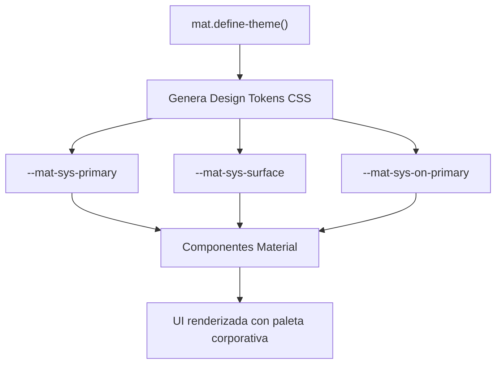

# Capítulo 28 - Parte 1: Instalación y theming con Design Tokens (Material 3)

> **Parte 1 de 4** · Capítulo 28 · PARTE XIII - Librerías Esenciales del Ecosistema

Angular Material es la librería oficial de componentes UI para Angular, construida sobre las especificaciones de diseño de Google. Con la llegada de Material Design 3 (M3), el sistema de theming dejó de ser una capa de SCSS para convertirse en un sistema declarativo basado en Design Tokens¹, lo que permite personalizar la apariencia de toda una aplicación modificando variables CSS en lugar de sobreescribir selectores profundos.

¹ *Design Tokens*: variables con nombre semántico que representan decisiones de diseño (colores, tipografías, espaciados). En CSS se implementan como custom properties (`--sys-primary`, `--sys-surface`, etc.).

## Instalación con ng add

La forma canónica de agregar Angular Material a un proyecto existente es mediante el esquemático oficial, que además de instalar los paquetes configura el tema base y el soporte de animaciones:

```bash
ng add @angular/material
```

El CLI hace tres preguntas: el tema prebuilt a usar, si se deben aplicar los estilos tipográficos globales de Material, y si se incluye el módulo de animaciones. Para proyectos nuevos en Angular 17+ se puede responder interactivamente; para pipelines de CI se pasan flags:

```bash
ng add @angular/material \
  --theme=azure-blue \
  --typography=true \
  --animations=enabled
```

El esquemático modifica `angular.json` para agregar las hojas de estilo del tema seleccionado y actualiza `app.config.ts` con `provideAnimationsAsync()`. También inyecta las importaciones de fuentes de Google en `index.html` cuando se usa la tipografía por defecto.

## Temas prebuilt vs tema personalizado

Angular Material incluye cuatro temas prebuilt listos para usar: `azure-blue`, `rose-red`, `magenta-violet` y `cyan-green`. Todos son temas M3 que mapean automáticamente colores primarios, secundarios, terciarios y de error sobre una paleta de tonos. Se activan referenciando el archivo CSS en `angular.json`:

```json
"styles": [
  "@angular/material/prebuilt-themes/azure-blue.css",
  "src/styles.scss"
]
```

Cuando se necesita una paleta corporativa propia, se crea un tema personalizado en `styles.scss`. Angular Material 3 expone el mixin `mat.theme()` que recibe un mapa de configuración:

```scss
// styles.scss
@use '@angular/material' as mat;

// Incluir el núcleo de Material UNA sola vez
@include mat.core();

// Definir el tema personalizado
$mi-tema: mat.define-theme((
  color: (
    theme-type: light,           // 'light' o 'dark'
    primary: mat.$violet-palette, // paleta base para generar tokens
    tertiary: mat.$orange-palette
  ),
  typography: (
    brand-family: 'Inter, sans-serif',
    plain-family: 'Roboto, sans-serif'
  ),
  density: (
    scale: 0                     // escala de densidad: -3 a 0
  )
));

// Aplicar el tema al elemento raíz
html {
  @include mat.all-component-themes($mi-tema);
}
```

El mixin `mat.all-component-themes()` genera todas las custom properties CSS de M3 bajo el selector que se le indique. La ventaja es que el sistema es completamente tree-shakeable: si solo se usan cinco componentes, se puede sustituir `mat.all-component-themes()` por mixins individuales como `mat.button-theme()`, `mat.input-theme()`, etc., reduciendo el tamaño del CSS generado.

## Design Tokens de Material 3 en CSS

Material 3 genera un conjunto de custom properties CSS que siguen el esquema `--mat-*` y `--sys-*`. Las propiedades `--sys-*` son las de más alto nivel y son las que se deben consumir cuando se quiere acceder a los colores del tema desde CSS propio:

```css
/* Acceder a colores del tema desde componentes propios */
.tarjeta-destacada {
  background-color: var(--mat-sys-primary-container);
  color: var(--mat-sys-on-primary-container);
  border-radius: var(--mat-sys-corner-medium);
}
```

Esto garantiza que si el usuario cambia el tema (por ejemplo, al modo oscuro), el componente propio también actualiza sus colores de forma automática, porque está leyendo tokens del sistema en lugar de valores hardcodeados.

## Soporte automático de `prefers-color-scheme`

Una de las grandes mejoras de M3 es la capacidad de responder automáticamente a la preferencia de esquema de color del sistema operativo. Para activarlo se definen dos temas y se aplican con media queries:

```scss
@use '@angular/material' as mat;

$tema-claro: mat.define-theme((
  color: (theme-type: light, primary: mat.$cyan-palette)
));

$tema-oscuro: mat.define-theme((
  color: (theme-type: dark, primary: mat.$cyan-palette)
));

html {
  @include mat.all-component-themes($tema-claro);

  @media (prefers-color-scheme: dark) {
    @include mat.all-component-colors($tema-oscuro);
    // mat.all-component-colors solo regenera los tokens de color,
    // sin duplicar tipografía ni densidad
  }
}
```

La clave es usar `mat.all-component-colors()` en lugar de `mat.all-component-themes()` dentro de la media query. De este modo se evita duplicar los estilos de tipografía y densidad, que no cambian entre modos claro y oscuro.

## El sistema tipográfico de M3

Material Design 3 define una escala tipográfica con roles semánticos: `display-large`, `headline-medium`, `body-large`, `label-small`, entre otros. Angular Material los expone como custom properties CSS que se pueden aplicar a cualquier elemento:

```scss
// Usar la tipografía del sistema en un elemento propio
.titulo-seccion {
  font: var(--mat-sys-headline-medium);
  letter-spacing: var(--mat-sys-headline-medium-tracking);
}
```

También se puede aplicar cualquier rol tipográfico de M3 con la clase CSS utilitaria `mat-typography`:

```html
<!-- Aplicar estilos tipográficos de M3 directamente en el template -->
<p class="mat-display-large">Título principal</p>
<p class="mat-body-medium">Cuerpo del texto con escala M3</p>
```

El sistema tipográfico asegura consistencia visual sin necesidad de definir tamaños de fuente manualmente en cada componente.

## Diferencias clave con Material 2

El salto de Material 2 a Material 3 implica cambios sustanciales que vale la pena entender antes de comenzar un proyecto nuevo. En M2 el theming se basaba en `mat-define-light-theme()` con paletas definidas en archivos SCSS adicionales; en M3 todo pasa por `mat.define-theme()` con paletas builtin que generan tokens automáticamente a partir de un color semilla usando el algoritmo de Material Color Utilities.

Otra diferencia importante es la densidad de los componentes: en M3 los componentes son ligeramente más grandes y con más espacio en blanco por defecto, siguiendo las guías de accesibilidad táctil. Se puede ajustar con el parámetro `density.scale` del mixin `mat.define-theme()`, donde `0` es el tamaño por defecto y `-3` es el más compacto.

Finalmente, M3 elimina la sobreescritura directa de variables SCSS internas (`$mat-blue`) en favor de los Design Tokens CSS. Cualquier personalización que en M2 requería editar paletas SCSS, en M3 se logra sobreescribiendo custom properties en el selector raíz.



## Puntos clave

- `ng add @angular/material` instala Material y configura el tema base en un solo paso
- `mat.define-theme()` sustituye a las APIs de M2 y genera Design Tokens CSS automáticamente
- Los tokens `--mat-sys-*` permiten integrar colores del tema en componentes propios sin hardcodear valores
- `prefers-color-scheme` se implementa con dos temas SCSS y una media query, usando `mat.all-component-colors()` para el oscuro
- M3 es más grande y más accesible por defecto; el parámetro `density.scale` permite compactarlo

## ¿Qué sigue?

Con el tema configurado, en la Parte 2 construiremos el shell de la aplicación usando los componentes de navegación de Material: toolbar, sidenav y tabs.
