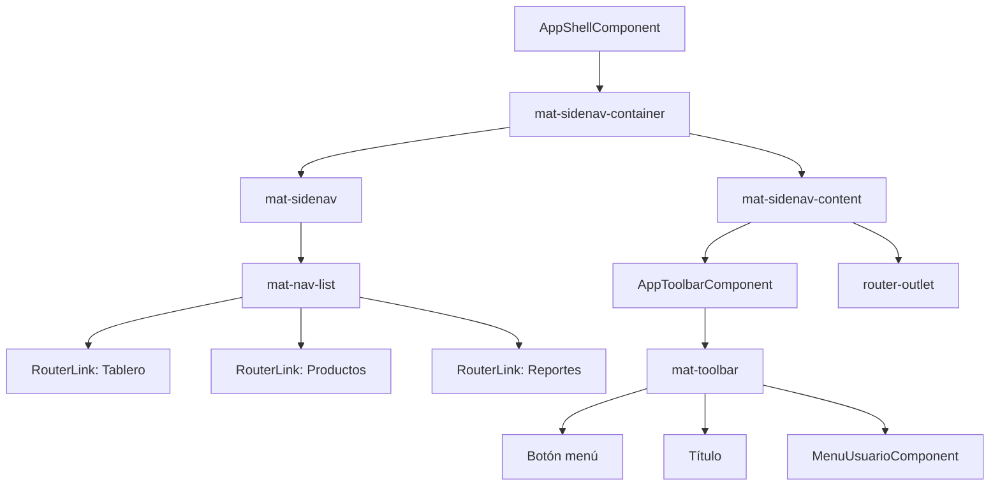

# Capítulo 28 - Parte 2: Componentes de navegación: toolbar, sidenav, tabs, menu

> **Parte 2 de 4** · Capítulo 28 · PARTE XIII - Librerías Esenciales del Ecosistema

La navegación es el esqueleto de cualquier aplicación. Angular Material nos ofrece cuatro piezas que, combinadas, forman el shell clásico que los usuarios ya conocen: una barra superior, un panel lateral, pestañas contextuales y menús jerárquicos. En esta parte construiremos ese shell desde cero, paso a paso, y lo haremos responsivo sin escribir una sola línea de media query manual.

## MatToolbarModule: la barra superior

La toolbar es lo primero que el usuario ve. Su rol es identificar la aplicación, mostrar acciones globales y, en dispositivos móviles, alojar el botón que abre el sidenav.

```typescript
// app.module.ts (standalone bootstrap alternativo en app.config.ts)
import { MatToolbarModule } from '@angular/material/toolbar';
import { MatIconModule }    from '@angular/material/icon';
import { MatButtonModule }  from '@angular/material/button';

@NgModule({
  imports: [MatToolbarModule, MatIconModule, MatButtonModule]
})
export class AppModule {}
```

```html
<!-- shell/toolbar.component.html -->
<mat-toolbar color="primary">
  <button mat-icon-button (click)="toggleSidenav()" aria-label="Abrir menú">
    <mat-icon>menu</mat-icon>
  </button>

  <span class="titulo-app">Mi Aplicación</span>

  <span class="espaciador"></span>

  <button mat-icon-button aria-label="Notificaciones">
    <mat-icon>notifications</mat-icon>
  </button>

  <button mat-icon-button [matMenuTriggerFor]="menuUsuario" aria-label="Cuenta">
    <mat-icon>account_circle</mat-icon>
  </button>
</mat-toolbar>
```

```css
/* toolbar.component.css */
.espaciador { flex: 1 1 auto; }
.titulo-app { font-size: 1.25rem; margin-left: 0.5rem; }
```

El atributo `color="primary"` aplica la paleta primaria del tema activo. También acepta `"accent"` y `"warn"`. Si lo omitimos, la toolbar hereda el color de fondo de la superficie.

## MatSidenavModule: el panel lateral

El sidenav es el componente más complejo del shell. Tiene tres modos de comportamiento que debemos elegir según el ancho de pantalla.

| Modo   | Descripción                                              |
|--------|----------------------------------------------------------|
| `over` | Flota sobre el contenido; requiere backdrop              |
| `push` | Empuja el contenido hacia un lado                        |
| `side` | Se integra al flujo; el contenido se reduce              |

```html
<!-- shell/app-shell.component.html -->
<mat-sidenav-container class="contenedor-shell">

  <mat-sidenav
    #sidenav
    [mode]="modoSidenav()"
    [opened]="sidenavAbierto()"
    (openedChange)="sidenavAbierto.set($event)">

    <mat-nav-list>
      <a mat-list-item routerLink="/tablero" routerLinkActive="activo">
        <mat-icon matListItemIcon>dashboard</mat-icon>
        <span matListItemTitle>Tablero</span>
      </a>
      <a mat-list-item routerLink="/productos" routerLinkActive="activo">
        <mat-icon matListItemIcon>inventory_2</mat-icon>
        <span matListItemTitle>Productos</span>
      </a>
      <a mat-list-item routerLink="/reportes" routerLinkActive="activo">
        <mat-icon matListItemIcon>bar_chart</mat-icon>
        <span matListItemTitle>Reportes</span>
      </a>
    </mat-nav-list>

  </mat-sidenav>

  <mat-sidenav-content>
    <app-toolbar (toggleSidenav)="sidenav.toggle()" />
    <main class="contenido-principal">
      <router-outlet />
    </main>
  </mat-sidenav-content>

</mat-sidenav-container>
```

## Responsivo con BreakpointObserver

En lugar de media queries en CSS, usamos `BreakpointObserver` del CDK para reaccionar a los cambios de tamaño y ajustar el modo y el estado inicial del sidenav:

```typescript
// shell/app-shell.component.ts
import { Component, OnInit, signal, inject } from '@angular/core';
import { BreakpointObserver, Breakpoints }    from '@angular/cdk/layout';
import { takeUntilDestroyed }                 from '@angular/core/rxjs-interop';

@Component({
  selector: 'app-shell',
  templateUrl: './app-shell.component.html',
  styleUrl: './app-shell.component.css'
})
export class AppShellComponent implements OnInit {

  private readonly breakpointObserver = inject(BreakpointObserver);

  modoSidenav   = signal<'over' | 'side'>('side');
  sidenavAbierto = signal<boolean>(true);

  ngOnInit(): void {
    this.breakpointObserver
      .observe([Breakpoints.Handset])
      .pipe(takeUntilDestroyed())
      .subscribe(resultado => {
        if (resultado.matches) {
          this.modoSidenav.set('over');
          this.sidenavAbierto.set(false);
        } else {
          this.modoSidenav.set('side');
          this.sidenavAbierto.set(true);
        }
      });
  }

  toggleSidenav(): void {
    this.sidenavAbierto.update(abierto => !abierto);
  }
}
```

`Breakpoints.Handset` cubre teléfonos en orientación vertical y horizontal. Si necesitamos granularidad, podemos usar `Breakpoints.Small`, `Breakpoints.Medium` o breakpoints personalizados como `'(min-width: 900px)'`.

## MatTabsModule: pestañas contextuales

Los tabs son ideales para dividir una vista en secciones relacionadas sin cambiar de ruta. También podemos usarlos con routing cuando cada tab corresponde a una ruta hija.

```html
<!-- productos/productos.component.html -->
<mat-tab-group
  animationDuration="300ms"
  [selectedIndex]="tabActivo()"
  (selectedIndexChange)="tabActivo.set($event)">

  <mat-tab label="Catálogo">
    <ng-template matTabContent>
      <!-- Carga perezosa: solo se renderiza cuando el tab está activo -->
      <app-catalogo-productos />
    </ng-template>
  </mat-tab>

  <mat-tab label="Inventario">
    <ng-template matTabContent>
      <app-inventario />
    </ng-template>
  </mat-tab>

  <mat-tab [label]="'Pedidos (' + totalPedidos() + ')'">
    <ng-template matTabContent>
      <app-pedidos />
    </ng-template>
  </mat-tab>

</mat-tab-group>
```

`ng-template matTabContent` activa la carga perezosa de cada tab: el contenido solo se instancia cuando el usuario hace clic por primera vez, no al cargar la vista.

## MatMenuModule: menús y submenús

Los menús flotantes son perfectos para acciones secundarias. Angular Material los implementa con `matMenuTriggerFor` y `mat-menu`:

```typescript
// shell/menu-usuario.component.ts
import { Component, output } from '@angular/core';
import { MatMenuModule }     from '@angular/material/menu';
import { MatIconModule }     from '@angular/material/icon';
import { MatButtonModule }   from '@angular/material/button';
import { MatDividerModule }  from '@angular/material/divider';

@Component({
  selector: 'app-menu-usuario',
  standalone: true,
  imports: [MatMenuModule, MatIconModule, MatButtonModule, MatDividerModule],
  template: `
    <button mat-icon-button [matMenuTriggerFor]="menuPrincipal">
      <mat-icon>account_circle</mat-icon>
    </button>

    <mat-menu #menuPrincipal="matMenu">
      <button mat-menu-item [matMenuTriggerFor]="menuConfiguracion">
        <mat-icon>settings</mat-icon>
        <span>Configuración</span>
      </button>
      <button mat-menu-item (click)="cerrarSesion.emit()">
        <mat-icon>logout</mat-icon>
        <span>Cerrar sesión</span>
      </button>
    </mat-menu>

    <mat-menu #menuConfiguracion="matMenu">
      <button mat-menu-item>Perfil</button>
      <button mat-menu-item>Seguridad</button>
      <mat-divider />
      <button mat-menu-item>Preferencias</button>
    </mat-menu>
  `
})
export class MenuUsuarioComponent {
  cerrarSesion = output<void>();
}
```

La relación entre `matMenuTriggerFor` y la referencia de template `#menuConfiguracion="matMenu"` es lo que permite anidar submenús sin límite de profundidad (aunque más de dos niveles suele ser mala UX).

## Diagrama del shell completo



## Puntos clave

- `BreakpointObserver` es la forma idiomática de reaccionar a cambios de tamaño en Angular Material; evita duplicar lógica entre CSS y TypeScript.
- El modo `side` integra el sidenav al flujo del documento; `over` lo superpone con backdrop. Elegir el modo correcto según el viewport mejora significativamente la UX.
- `ng-template matTabContent` habilita la carga perezosa de tabs, mejorando el tiempo de renderizado inicial en vistas con mucho contenido.
- Los submenús se crean anidando referencias de `matMenu` en el atributo `matMenuTriggerFor` de un `mat-menu-item`.
- Los signals de Angular 17+ (`signal()`, `update()`) encajan naturalmente con el estado del sidenav porque son lectura/escritura sincrónica sin necesidad de `BehaviorSubject`.

## ¿Qué sigue?

En la siguiente parte abordaremos los componentes de formulario y tablas, donde `MatTableDataSource` se convierte en el pegamento que une ordenación, paginación y búsqueda en una sola experiencia cohesiva.
