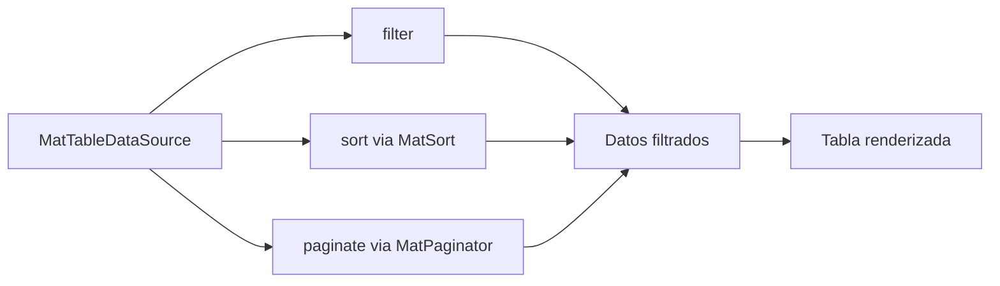

# Capítulo 28 - Parte 3: Formularios y tablas: MatInput, MatSelect, MatTable, MatPaginator

> **Parte 3 de 4** · Capítulo 28 · PARTE XIII - Librerías Esenciales del Ecosistema

Los formularios y las tablas son los componentes que los usuarios tocan con más frecuencia. Un campo mal alineado o una tabla sin paginación destruyen la confianza en el producto. En esta parte construiremos una pantalla de gestión de productos que reúne entrada de datos, selección, autocompletado, tabla con ordenación y paginación; todo conectado con `MatTableDataSource`.

## MatFormFieldModule y MatInputModule

`mat-form-field` es el contenedor que da coherencia visual a todos los controles de formulario de Material. Dentro de él colocamos el control real con la directiva `matInput`:

```typescript
// productos/filtro-productos.component.ts
import { Component, output, signal } from '@angular/core';
import { FormsModule }               from '@angular/forms';
import { MatFormFieldModule }        from '@angular/material/form-field';
import { MatInputModule }            from '@angular/material/input';
import { MatIconModule }             from '@angular/material/icon';

@Component({
  selector: 'app-filtro-productos',
  standalone: true,
  imports: [FormsModule, MatFormFieldModule, MatInputModule, MatIconModule],
  template: `
    <mat-form-field appearance="outline" class="campo-busqueda">
      <mat-label>Buscar producto</mat-label>
      <mat-icon matPrefix>search</mat-icon>
      <input matInput
             [(ngModel)]="textoBusqueda"
             (ngModelChange)="busquedaCambiada.emit($event)"
             placeholder="Nombre o código..." />
      <mat-hint>Ingresá al menos 2 caracteres</mat-hint>
    </mat-form-field>
  `
})
export class FiltroProdutosComponent {
  textoBusqueda = signal<string>('');
  busquedaCambiada = output<string>();
}
```

`appearance` acepta `"outline"` (el más moderno, borde completo), `"fill"` (fondo sombreado) y `"standard"` (solo línea inferior, estilo clásico). `mat-hint` muestra texto de ayuda debajo del campo sin errores. Para errores de validación usamos `<mat-error>` que solo aparece cuando el control está inválido y tocado.

## MatSelectModule: opciones simples y agrupadas

`mat-select` es el reemplazo de Material para el `<select>` nativo, con soporte completo para formularios reactivos y grupos de opciones:

```html
<!-- productos/form-producto.component.html (fragmento) -->
<mat-form-field appearance="outline">
  <mat-label>Categoría</mat-label>
  <mat-select formControlName="categoriaId">

    <mat-option value="">- Sin categoría -</mat-option>

    <mat-optgroup label="Electrónica">
      <mat-option value="cat-001">Computadoras</mat-option>
      <mat-option value="cat-002">Teléfonos</mat-option>
      <mat-option value="cat-003">Accesorios</mat-option>
    </mat-optgroup>

    <mat-optgroup label="Hogar">
      <mat-option value="cat-010">Cocina</mat-option>
      <mat-option value="cat-011">Decoración</mat-option>
    </mat-optgroup>

  </mat-select>
  <mat-error *ngIf="formulario.get('categoriaId')?.hasError('required')">
    La categoría es obligatoria
  </mat-error>
</mat-form-field>
```

## MatAutocompleteModule: filtro en tiempo real

El autocompletado transforma un `matInput` en un campo inteligente que sugiere opciones mientras el usuario escribe:

```typescript
// productos/autocomplete-proveedor.component.ts
import { Component, OnInit, signal, inject } from '@angular/core';
import { FormControl, ReactiveFormsModule }  from '@angular/forms';
import { MatAutocompleteModule }             from '@angular/material/autocomplete';
import { MatFormFieldModule }                from '@angular/material/form-field';
import { MatInputModule }                    from '@angular/material/input';
import { startWith, map }                    from 'rxjs/operators';
import { Observable }                        from 'rxjs';
import { toSignal }                          from '@angular/core/rxjs-interop';

interface Proveedor { id: string; nombre: string; }

@Component({ selector: 'app-autocomplete-proveedor', standalone: true,
  imports: [ReactiveFormsModule, MatAutocompleteModule,
            MatFormFieldModule, MatInputModule],
  template: `
    <mat-form-field appearance="outline">
      <mat-label>Proveedor</mat-label>
      <input matInput [formControl]="controlProveedor"
             [matAutocomplete]="autoProveedor" />
      <mat-autocomplete #autoProveedor="matAutocomplete"
                        [displayWith]="mostrarProveedor">
        @for (prov of proveedoresFiltrados(); track prov.id) {
          <mat-option [value]="prov">{{ prov.nombre }}</mat-option>
        }
      </mat-autocomplete>
    </mat-form-field>
  `
})
export class AutocompleteProveedorComponent implements OnInit {
  controlProveedor = new FormControl<Proveedor | string>('');
  proveedoresFiltrados = signal<Proveedor[]>([]);

  private todos: Proveedor[] = [
    { id: 'p1', nombre: 'Distribuidora ABC' },
    { id: 'p2', nombre: 'Importadora Sur' },
    { id: 'p3', nombre: 'Tech Mayorista' },
  ];

  ngOnInit(): void {
    this.controlProveedor.valueChanges.pipe(
      startWith(''),
      map(valor => typeof valor === 'string' ? valor : valor?.nombre ?? '')
    ).subscribe(texto =>
      this.proveedoresFiltrados.set(
        this.todos.filter(p =>
          p.nombre.toLowerCase().includes(texto.toLowerCase())
        )
      )
    );
  }

  mostrarProveedor(prov: Proveedor | string | null): string {
    return typeof prov === 'object' && prov ? prov.nombre : '';
  }
}
```

## MatTableModule con ordenación

La tabla de Material es declarativa y extremadamente flexible. Veamos la tabla de productos completa:

```typescript
// productos/tabla-productos.component.ts
import { Component, OnInit, ViewChild, inject } from '@angular/core';
import { MatTableModule, MatTableDataSource }   from '@angular/material/table';
import { MatSortModule, MatSort }               from '@angular/material/sort';
import { MatPaginatorModule, MatPaginator }     from '@angular/material/paginator';
import { MatFormFieldModule }                   from '@angular/material/form-field';
import { MatInputModule }                       from '@angular/material/input';
import { ProductoService }                      from './producto.service';

interface Producto {
  id: string; nombre: string; categoria: string;
  precio: number; stock: number;
}

@Component({
  selector: 'app-tabla-productos',
  standalone: true,
  imports: [MatTableModule, MatSortModule, MatPaginatorModule,
            MatFormFieldModule, MatInputModule],
  templateUrl: './tabla-productos.component.html'
})
export class TablaProductosComponent implements OnInit {
  @ViewChild(MatSort)      sort!: MatSort;
  @ViewChild(MatPaginator) paginator!: MatPaginator;

  private readonly productoService = inject(ProductoService);

  columnas = ['nombre', 'categoria', 'precio', 'stock', 'acciones'];
  dataSource = new MatTableDataSource<Producto>([]);

  ngOnInit(): void {
    this.productoService.listar().subscribe(productos => {
      this.dataSource.data = productos;
    });
  }

  ngAfterViewInit(): void {
    this.dataSource.sort      = this.sort;
    this.dataSource.paginator = this.paginator;
  }

  aplicarFiltro(evento: Event): void {
    const texto = (evento.target as HTMLInputElement).value;
    this.dataSource.filter = texto.trim().toLowerCase();
    if (this.dataSource.paginator) {
      this.dataSource.paginator.firstPage();
    }
  }
}
```

```html
<!-- tabla-productos.component.html -->
<mat-form-field appearance="outline">
  <mat-label>Filtrar</mat-label>
  <input matInput (input)="aplicarFiltro($event)" placeholder="Buscar..." />
</mat-form-field>

<table mat-table [dataSource]="dataSource" matSort class="tabla-completa">

  <ng-container matColumnDef="nombre">
    <th mat-header-cell *matHeaderCellDef mat-sort-header>Nombre</th>
    <td mat-cell *matCellDef="let prod">{{ prod.nombre }}</td>
  </ng-container>

  <ng-container matColumnDef="categoria">
    <th mat-header-cell *matHeaderCellDef mat-sort-header>Categoría</th>
    <td mat-cell *matCellDef="let prod">{{ prod.categoria }}</td>
  </ng-container>

  <ng-container matColumnDef="precio">
    <th mat-header-cell *matHeaderCellDef mat-sort-header>Precio</th>
    <td mat-cell *matCellDef="let prod">{{ prod.precio | currency:'ARS' }}</td>
  </ng-container>

  <ng-container matColumnDef="stock">
    <th mat-header-cell *matHeaderCellDef mat-sort-header>Stock</th>
    <td mat-cell *matCellDef="let prod"
        [class.stock-critico]="prod.stock < 5">{{ prod.stock }}</td>
  </ng-container>

  <ng-container matColumnDef="acciones">
    <th mat-header-cell *matHeaderCellDef>Acciones</th>
    <td mat-cell *matCellDef="let prod">
      <button mat-icon-button color="primary" aria-label="Editar">
        <mat-icon>edit</mat-icon>
      </button>
    </td>
  </ng-container>

  <tr mat-header-row *matHeaderRowDef="columnas; sticky: true"></tr>
  <tr mat-row *matRowDef="let fila; columns: columnas;"></tr>

  <tr class="mat-row" *matNoDataRow>
    <td class="mat-cell" [attr.colspan]="columnas.length">
      Sin resultados para el filtro aplicado.
    </td>
  </tr>

</table>

<mat-paginator [pageSizeOptions]="[10, 25, 50]"
               showFirstLastButtons
               aria-label="Seleccionar página">
</mat-paginator>
```

## Cómo trabajan juntos sort, filter y paginator



`MatTableDataSource` aplica internamente las operaciones en este orden: primero filtra, luego ordena, finalmente pagina. Al asignar `dataSource.sort` y `dataSource.paginator` en `ngAfterViewInit`, la clase se suscribe automáticamente a los eventos de ambos componentes. No necesitamos manejar ningún observable manualmente.

## Puntos clave

- `MatTableDataSource` integra filtrado, ordenación y paginación con cero configuración manual; solo hay que asignar las referencias `sort` y `paginator` después de que la vista esté lista.
- La directiva `mat-sort-header` en cada `th` habilita la ordenación de esa columna; el icono de flecha aparece automáticamente.
- `*matNoDataRow` es la fila que se muestra cuando `dataSource.filter` no arroja resultados; imprescindible para buena UX.
- `mat-optgroup` dentro de `mat-select` organiza opciones largas sin abrumar al usuario.
- Al llamar `this.dataSource.paginator.firstPage()` después de cada filtro, devolvemos al usuario a la primera página y evitamos que se quede viendo una página vacía.

## ¿Qué sigue?

En la siguiente parte completamos el capítulo con los overlays: Dialog, SnackBar y BottomSheet, los tres mecanismos de Material para interrumpir al usuario de forma controlada y retornar información al componente que los abrió.
