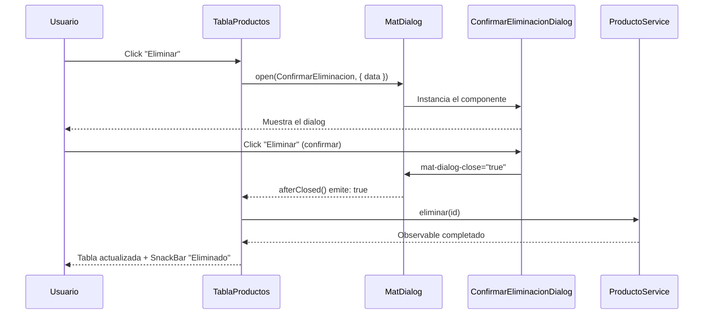

# Capítulo 28 - Parte 4: Overlays: MatDialog, MatSnackBar, MatBottomSheet

> **Parte 4 de 4** · Capítulo 28 · PARTE XIII - Librerías Esenciales del Ecosistema

Los overlays son las piezas que interrumpen al usuario de forma controlada: un dialog para confirmar una acción destructiva, un snackbar para notificar el resultado de una operación, un bottom sheet para ofrecer opciones en dispositivos táctiles. Angular Material los construye sobre el sistema de overlays del CDK, así que son accesibles, animados y programables. Veamos cómo usarlos correctamente.

## MatDialog: abrir, pasar datos y recibir resultado

El flujo de un dialog tiene tres actores: el componente que abre, el servicio `MatDialog` y el componente que se muestra dentro del dialog.

```typescript
// productos/confirmar-eliminacion-dialog.component.ts
import { Component, inject }         from '@angular/core';
import { MAT_DIALOG_DATA, 
         MatDialogRef,
         MatDialogModule }           from '@angular/material/dialog';
import { MatButtonModule }           from '@angular/material/button';

interface DatosConfirmacion {
  nombreProducto: string;
  id: string;
}

@Component({
  selector: 'app-confirmar-eliminacion-dialog',
  standalone: true,
  imports: [MatDialogModule, MatButtonModule],
  template: `
    <h2 mat-dialog-title>Confirmar eliminación</h2>

    <mat-dialog-content>
      <p>¿Estás seguro de que querés eliminar 
         <strong>{{ datos.nombreProducto }}</strong>?
      </p>
      <p class="advertencia">Esta acción no se puede deshacer.</p>
    </mat-dialog-content>

    <mat-dialog-actions align="end">
      <button mat-button [mat-dialog-close]="false">Cancelar</button>
      <button mat-flat-button color="warn" [mat-dialog-close]="true">
        Eliminar
      </button>
    </mat-dialog-actions>
  `
})
export class ConfirmarEliminacionDialogComponent {
  readonly datos = inject<DatosConfirmacion>(MAT_DIALOG_DATA);
  readonly dialogRef = inject(MatDialogRef<ConfirmarEliminacionDialogComponent>);
}
```

Y así lo usamos desde el componente padre:

```typescript
// productos/tabla-productos.component.ts (fragmento)
import { MatDialog }  from '@angular/material/dialog';
import { inject }     from '@angular/core';
import { ConfirmarEliminacionDialogComponent } from './confirmar-eliminacion-dialog.component';

export class TablaProductosComponent {
  private readonly dialog          = inject(MatDialog);
  private readonly productoService = inject(ProductoService);

  eliminarProducto(producto: Producto): void {
    const refDialog = this.dialog.open(ConfirmarEliminacionDialogComponent, {
      width: '420px',
      disableClose: true,
      data: { nombreProducto: producto.nombre, id: producto.id }
    });

    refDialog.afterClosed().subscribe((confirmado: boolean) => {
      if (confirmado) {
        this.productoService.eliminar(producto.id).subscribe(() => {
          this.cargarProductos();
        });
      }
    });
  }
}
```

`disableClose: true` impide que el usuario cierre el dialog con Escape o haciendo clic fuera; útil en formularios que requieren una decisión explícita. `[mat-dialog-close]="false"` vincula el botón de cancelar al cierre del dialog y pasa `false` como resultado. El observable `afterClosed()` emite ese valor cuando el dialog se destruye.

## MatSnackBar: notificaciones rápidas

El snackbar es la notificación menos intrusiva. Aparece brevemente en la parte inferior de la pantalla y desaparece solo:

```typescript
// shared/notificacion.service.ts
import { Injectable, inject }     from '@angular/core';
import { MatSnackBar,
         MatSnackBarConfig }      from '@angular/material/snack-bar';

@Injectable({ providedIn: 'root' })
export class NotificacionService {
  private readonly snackBar = inject(MatSnackBar);

  private readonly configBase: MatSnackBarConfig = {
    duration: 4000,
    horizontalPosition: 'end',
    verticalPosition: 'bottom'
  };

  exito(mensaje: string): void {
    this.snackBar.open(mensaje, 'Cerrar', {
      ...this.configBase,
      panelClass: ['snack-exito']
    });
  }

  error(mensaje: string): void {
    this.snackBar.open(mensaje, 'Reintentar', {
      ...this.configBase,
      duration: 0,          // No se cierra solo, el usuario debe actuar
      panelClass: ['snack-error']
    });
  }

  con(mensaje: string, accion: string): Promise<boolean> {
    const ref = this.snackBar.open(mensaje, accion, this.configBase);
    return ref.onAction().pipe(
      map(() => true)
    ).toPromise() as Promise<boolean>;
  }
}
```

Cuando `duration` es `0`, el snackbar persiste hasta que el usuario interactúe, lo cual tiene sentido para errores que requieren acción.

## MatBottomSheet: acciones en móvil

El bottom sheet sube desde la parte inferior de la pantalla y es ideal en dispositivos táctiles para ofrecer un conjunto de acciones sin un menú flotante:

```typescript
// productos/acciones-producto-sheet.component.ts
import { Component, inject }              from '@angular/core';
import { MAT_BOTTOM_SHEET_DATA,
         MatBottomSheetRef,
         MatBottomSheetModule }           from '@angular/material/bottom-sheet';
import { MatListModule }                  from '@angular/material/list';
import { MatIconModule }                  from '@angular/material/icon';

interface AccionProducto { etiqueta: string; icono: string; valor: string; }

@Component({
  selector: 'app-acciones-producto-sheet',
  standalone: true,
  imports: [MatBottomSheetModule, MatListModule, MatIconModule],
  template: `
    <mat-nav-list>
      @for (accion of datos.acciones; track accion.valor) {
        <a mat-list-item (click)="seleccionar(accion.valor)">
          <mat-icon matListItemIcon>{{ accion.icono }}</mat-icon>
          <span matListItemTitle>{{ accion.etiqueta }}</span>
        </a>
      }
    </mat-nav-list>
  `
})
export class AccionesProductoSheetComponent {
  readonly datos = inject<{ acciones: AccionProducto[] }>(MAT_BOTTOM_SHEET_DATA);
  private readonly sheetRef = inject(MatBottomSheetRef<AccionesProductoSheetComponent>);

  seleccionar(valor: string): void {
    this.sheetRef.dismiss(valor);
  }
}
```

```typescript
// productos/tabla-productos.component.ts (fragmento bottom sheet)
import { MatBottomSheet } from '@angular/material/bottom-sheet';

export class TablaProductosComponent {
  private readonly bottomSheet = inject(MatBottomSheet);

  abrirAcciones(producto: Producto): void {
    const ref = this.bottomSheet.open(AccionesProductoSheetComponent, {
      data: {
        acciones: [
          { etiqueta: 'Editar',    icono: 'edit',    valor: 'editar' },
          { etiqueta: 'Duplicar',  icono: 'copy_all', valor: 'duplicar' },
          { etiqueta: 'Eliminar',  icono: 'delete',  valor: 'eliminar' },
        ]
      }
    });

    ref.afterDismissed().subscribe((accionSeleccionada: string | undefined) => {
      if (accionSeleccionada === 'eliminar') {
        this.eliminarProducto(producto);
      }
    });
  }
}
```

## MatTooltipModule

Los tooltips son la forma más ligera de overlay: aparecen al hacer hover o al recibir foco por teclado, sin necesidad de código TypeScript:

```html
<button mat-icon-button
        matTooltip="Eliminar producto"
        matTooltipPosition="above"
        (click)="eliminarProducto(prod)">
  <mat-icon>delete</mat-icon>
</button>
```

`matTooltipPosition` acepta `'above'`, `'below'`, `'left'` y `'right'`. En dispositivos táctiles el tooltip aparece al mantener presionado el elemento.

## Flujo completo del dialog de confirmación



## Puntos clave

- `MAT_DIALOG_DATA` y `MAT_BOTTOM_SHEET_DATA` son tokens de inyección; usarlos con `inject<T>(TOKEN)` y el tipo genérico correcto evita el uso de `any`.
- `afterClosed()` emite `undefined` si el dialog se cierra con Escape o clic en el backdrop (cuando `disableClose` es `false`). Siempre verificar el valor antes de actuar.
- Centralizar el snackbar en un servicio (`NotificacionService`) evita duplicar configuración y permite cambiar el comportamiento global en un solo lugar.
- `MatBottomSheetRef.dismiss(valor)` es el equivalente de `MatDialogRef.close(valor)`; el valor se recibe en `afterDismissed()`.
- Los tooltips son accesibles por defecto: aparecen en foco por teclado y tienen el rol ARIA correcto.

## ¿Qué sigue?

En el capítulo 29 bajamos un nivel y exploramos el CDK directamente: construiremos overlays a medida con `Overlay` y `Portal`, aprenderemos Drag and Drop para tableros kanban y dominaremos las herramientas de accesibilidad que hacen a nuestros componentes usables por todos.
