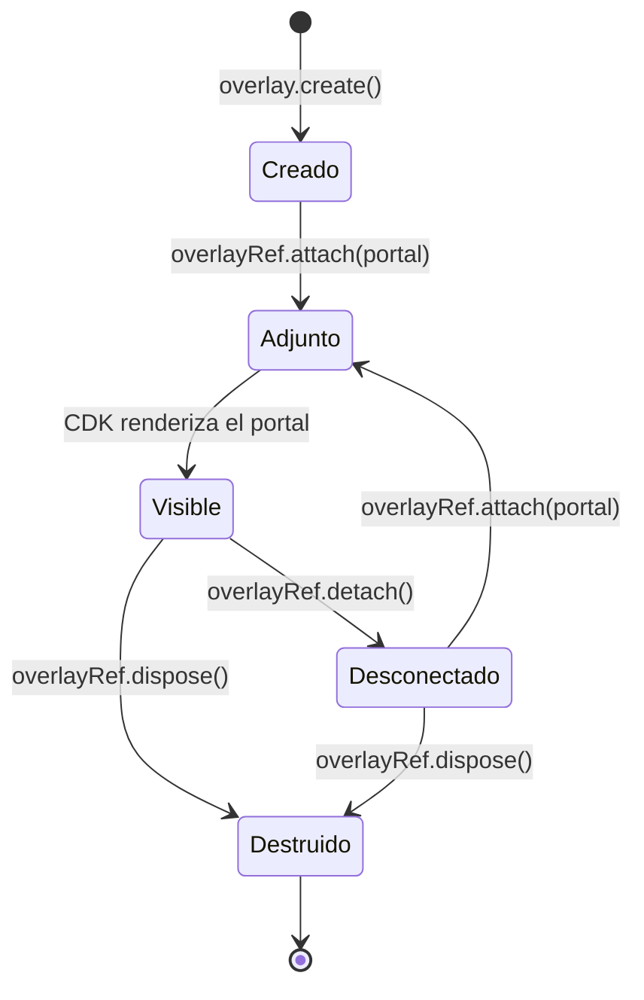

# Capítulo 29 - Parte 1: Overlay y Portal: capas dinámicas de UI

> **Parte 1 de 4** · Capítulo 29 · PARTE XIII - Librerías Esenciales del Ecosistema

Cuando `MatDialog` o `MatMenu` no alcanzan para lo que necesitamos, el CDK nos ofrece el sistema de Overlay y Portal: los bloques de construcción de bajo nivel sobre los que están construidos todos los overlays de Angular Material. Con ellos podemos crear tooltips personalizados, dropdowns a medida o paneles flotantes que se posicionan inteligentemente respecto a cualquier elemento del DOM.

## ¿Qué es un Overlay?

Un overlay es un panel que se renderiza fuera del flujo normal del documento, dentro de un contenedor especial que el CDK inyecta al final del `<body>`. Esto garantiza que nunca quede cortado por un `overflow: hidden` de algún ancestro.

```typescript
// shared/overlay-demo.service.ts
import { Injectable, inject }         from '@angular/core';
import { Overlay, OverlayRef }        from '@angular/cdk/overlay';
import { TemplatePortal }             from '@angular/cdk/portal';

@Injectable({ providedIn: 'root' })
export class OverlayDemoService {
  private readonly overlay = inject(Overlay);
  private refActiva: OverlayRef | null = null;

  crear(estrategia: 'global' | 'conectado'): OverlayRef {
    const posicion = estrategia === 'global'
      ? this.overlay.position().global().centerHorizontally().centerVertically()
      : this.overlay.position().global().top('64px').right('16px');

    const ref = this.overlay.create({
      positionStrategy: posicion,
      scrollStrategy:   this.overlay.scrollStrategies.block(),
      hasBackdrop:      true,
      backdropClass:    'overlay-backdrop-oscuro',
      panelClass:       'overlay-panel-elevado'
    });

    this.refActiva = ref;
    return ref;
  }

  cerrar(): void {
    this.refActiva?.dispose();
    this.refActiva = null;
  }
}
```

`scrollStrategy` determina qué sucede cuando el usuario hace scroll mientras el overlay está abierto. Las opciones son `block()` (bloquea el scroll), `close()` (cierra el overlay), `reposition()` (lo mueve para seguir al elemento ancla) y `noop()` (no hace nada).

## GlobalPositionStrategy vs ConnectedPositionStrategy

La estrategia de posicionamiento es uno de los conceptos más importantes del sistema de Overlay:

```typescript
// Estrategia global: posición fija en la pantalla
const estrategiaGlobal = this.overlay.position()
  .global()
  .centerHorizontally()
  .centerVertically();

// Estrategia conectada: anclada a un elemento del DOM
const estrategiaConectada = this.overlay.position()
  .flexibleConnectedTo(elementoReferencia)
  .withPositions([
    {
      originX:  'start', originY:  'bottom',   // Punto de origen en el ancla
      overlayX: 'start', overlayY: 'top',       // Punto de conexión en el overlay
      offsetY:  4                               // Separación vertical
    },
    {
      // Posición de respaldo: aparece arriba si no hay espacio abajo
      originX:  'start', originY:  'top',
      overlayX: 'start', overlayY: 'bottom',
      offsetY:  -4
    }
  ])
  .withFlexibleDimensions(false)
  .withPush(true);                             // Empuja para no salirse de la pantalla
```

La `ConnectedPositionStrategy` prueba las posiciones en el orden en que las declaramos. Si la primera hace que el overlay se salga del viewport, intenta la siguiente. `withPush(true)` garantiza que si ninguna posición es ideal, el overlay se empuja hacia adentro en lugar de quedar cortado.

## TemplatePortal: insertar un ng-template

Un `Portal` es el contenido que se proyecta dentro del overlay. El más simple es `TemplatePortal`:

```typescript
// shared/tooltip-custom/tooltip-custom.component.ts
import { Component, ViewChild, TemplateRef,
         ElementRef, inject, OnDestroy }    from '@angular/core';
import { Overlay, OverlayRef }             from '@angular/cdk/overlay';
import { TemplatePortal }                  from '@angular/cdk/portal';
import { ViewContainerRef }                from '@angular/core';

@Component({
  selector: 'app-tooltip-custom',
  standalone: true,
  template: `
    <span #ancla (mouseenter)="abrir()" (mouseleave)="cerrar()">
      <ng-content />
    </span>

    <ng-template #contenidoTooltip>
      <div class="tooltip-panel">
        <ng-content select="[slot=tooltip]" />
      </div>
    </ng-template>
  `
})
export class TooltipCustomComponent implements OnDestroy {
  @ViewChild('ancla', { read: ElementRef }) ancla!: ElementRef;
  @ViewChild('contenidoTooltip')           plantilla!: TemplateRef<unknown>;

  private readonly overlay       = inject(Overlay);
  private readonly vcr           = inject(ViewContainerRef);
  private refOverlay: OverlayRef | null = null;

  abrir(): void {
    if (this.refOverlay?.hasAttached()) return;

    const posicion = this.overlay.position()
      .flexibleConnectedTo(this.ancla)
      .withPositions([
        { originX: 'center', originY: 'top',
          overlayX: 'center', overlayY: 'bottom', offsetY: -8 }
      ]);

    this.refOverlay = this.overlay.create({
      positionStrategy: posicion,
      scrollStrategy:   this.overlay.scrollStrategies.reposition()
    });

    const portal = new TemplatePortal(this.plantilla, this.vcr);
    this.refOverlay.attach(portal);
  }

  cerrar(): void {
    this.refOverlay?.detach();
  }

  ngOnDestroy(): void {
    this.refOverlay?.dispose();
  }
}
```

## ComponentPortal: insertar un componente dinámico

Cuando el contenido es más complejo, `ComponentPortal` nos permite renderizar un componente completo dentro del overlay:

```typescript
// shared/notificacion-overlay/notificacion-overlay.service.ts
import { Injectable, inject, Injector }       from '@angular/core';
import { Overlay, OverlayRef }               from '@angular/cdk/overlay';
import { ComponentPortal }                   from '@angular/cdk/portal';
import { NotificacionToastComponent }        from './notificacion-toast.component';

@Injectable({ providedIn: 'root' })
export class NotificacionOverlayService {
  private readonly overlay  = inject(Overlay);
  private readonly injector = inject(Injector);
  private refOverlay: OverlayRef | null = null;

  mostrar(mensaje: string): void {
    const posicion = this.overlay.position()
      .global().bottom('24px').right('24px');

    this.refOverlay = this.overlay.create({
      positionStrategy: posicion,
      scrollStrategy:   this.overlay.scrollStrategies.noop()
    });

    const portal = new ComponentPortal(
      NotificacionToastComponent,
      null,
      this.injector
    );

    const refComponente = this.refOverlay.attach(portal);
    refComponente.instance.mensaje = mensaje;
    refComponente.instance.cerrar.subscribe(() => this.refOverlay?.dispose());
  }
}
```

## Ciclo de vida del Overlay



`detach()` elimina el contenido del overlay pero mantiene el `OverlayRef` listo para reutilizar. `dispose()` destruye el overlay completamente y libera todos los recursos. Para overlays de un solo uso (como notificaciones), `dispose()` directamente. Para overlays que se abren y cierran frecuentemente (como dropdowns), `detach()` y `attach()` es más eficiente.

## Cerrar con backdropClick

Cuando el overlay tiene backdrop, podemos cerrarlo al hacer clic fuera:

```typescript
this.refOverlay = this.overlay.create({
  hasBackdrop: true,
  backdropClass: 'cdk-overlay-transparent-backdrop'
});

// Suscribirse al clic en el backdrop
this.refOverlay.backdropClick().subscribe(() => {
  this.refOverlay?.detach();
});

// También podemos escuchar cuando se presiona Escape
this.refOverlay.keydownEvents().subscribe(evento => {
  if (evento.key === 'Escape') {
    this.refOverlay?.detach();
  }
});
```

## Puntos clave

- El sistema de Overlay del CDK es la base de `MatDialog`, `MatMenu`, `MatSelect` y `MatTooltip`; entenderlo nos da control total sobre cualquier comportamiento de superposición.
- `ConnectedPositionStrategy` acepta múltiples posiciones de respaldo, lo que hace que los dropdowns se adapten automáticamente al espacio disponible en pantalla.
- La diferencia entre `detach()` y `dispose()` es crucial: `detach()` es reversible (permite re-adjuntar), `dispose()` libera todo.
- `ComponentPortal` permite inyectar componentes Angular completos con su propio árbol de inyección, lo cual habilita la comunicación con servicios desde dentro del overlay.
- Siempre llamar `dispose()` en `ngOnDestroy()` para evitar fugas de memoria.

## ¿Qué sigue?

En la siguiente parte exploraremos `DragDropModule`, la herramienta del CDK para construir interfaces arrastrables: listas reordenables, tableros kanban y elementos con handles específicos de arrastre.
