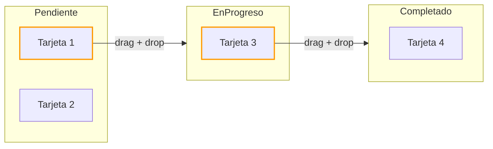

# Capítulo 29 - Parte 2: Drag and Drop con DragDropModule

> **Parte 2 de 4** · Capítulo 29 · PARTE XIII - Librerías Esenciales del Ecosistema

Pocas interacciones dan tanta satisfacción al usuario como poder arrastrar una tarjeta de una columna a otra. El módulo `DragDropModule` del CDK nos permite implementar listas reordenables y tableros kanban con muy poco código, y además expone suficientes puntos de extensión para personalizar animaciones, restricciones y comportamientos de arrastre. Construiremos un tablero kanban completo de tres columnas para ver todas estas capacidades en acción.

## Instalación y configuración

`@angular/cdk/drag-drop` viene incluido con el CDK de Angular. Solo necesitamos importar el módulo:

```typescript
// tablero/tablero.module.ts o en el componente standalone
import { DragDropModule } from '@angular/cdk/drag-drop';

@NgModule({
  imports: [DragDropModule]
})
export class TableroModule {}
```

## cdkDrag y cdkDropList: los fundamentos

El par mínimo es `cdkDrag` en el elemento arrastrable y `cdkDropList` en el contenedor:

```html
<!-- lista-simple/lista-simple.component.html -->
<div cdkDropList
     class="lista-tareas"
     (cdkDropListDropped)="alSoltar($event)">

  @for (tarea of tareas; track tarea.id) {
    <div cdkDrag class="tarjeta-tarea">
      <mat-icon cdkDragHandle class="icono-handle">drag_indicator</mat-icon>
      <span>{{ tarea.titulo }}</span>

      <!-- Placeholder: espacio que se muestra mientras se arrastra -->
      <div *cdkDragPlaceholder class="placeholder-tarea"></div>

      <!-- Preview: apariencia del elemento mientras está siendo arrastrado -->
      <div *cdkDragPreview class="preview-tarea">
        {{ tarea.titulo }}
      </div>
    </div>
  }

</div>
```

```typescript
// lista-simple/lista-simple.component.ts
import { Component, signal }                  from '@angular/core';
import { CdkDragDrop, moveItemInArray,
         DragDropModule }                     from '@angular/cdk/drag-drop';

interface Tarea { id: string; titulo: string; }

@Component({
  selector: 'app-lista-simple',
  standalone: true,
  imports: [DragDropModule],
  templateUrl: './lista-simple.component.html'
})
export class ListaSimpleComponent {
  tareas = signal<Tarea[]>([
    { id: 't1', titulo: 'Diseñar mockups' },
    { id: 't2', titulo: 'Revisar API' },
    { id: 't3', titulo: 'Escribir tests' },
    { id: 't4', titulo: 'Deploy staging' },
  ]);

  alSoltar(evento: CdkDragDrop<Tarea[]>): void {
    // Mutamos el array del signal directamente
    const lista = [...this.tareas()];
    moveItemInArray(lista, evento.previousIndex, evento.currentIndex);
    this.tareas.set(lista);
  }
}
```

`moveItemInArray` mueve un elemento dentro del mismo array de forma inmutable conceptualmente, aunque en la práctica muta el array que le pasamos. Por eso siempre hacemos la copia con spread antes.

## Tablero Kanban: listas conectadas

El verdadero poder aparece cuando conectamos múltiples listas. Cada tarjeta puede arrastrarse entre columnas:

```typescript
// tablero/tablero-kanban.component.ts
import { Component, signal, computed } from '@angular/core';
import { CdkDragDrop, moveItemInArray,
         transferArrayItem, DragDropModule } from '@angular/cdk/drag-drop';
import { MatCardModule }                     from '@angular/material/card';
import { MatIconModule }                     from '@angular/material/icon';
import { MatChipsModule }                    from '@angular/material/chips';

interface Tarjeta {
  id:        string;
  titulo:    string;
  prioridad: 'alta' | 'media' | 'baja';
  asignado:  string;
}

interface Columna {
  id:       string;
  titulo:   string;
  tarjetas: Tarjeta[];
}

@Component({
  selector: 'app-tablero-kanban',
  standalone: true,
  imports: [DragDropModule, MatCardModule, MatIconModule, MatChipsModule],
  templateUrl: './tablero-kanban.component.html'
})
export class TableroKanbanComponent {
  columnas = signal<Columna[]>([
    {
      id: 'pendiente', titulo: 'Pendiente',
      tarjetas: [
        { id: 'c1', titulo: 'Definir arquitectura', prioridad: 'alta',  asignado: 'Ana' },
        { id: 'c2', titulo: 'Setup del proyecto',   prioridad: 'media', asignado: 'Luis' },
      ]
    },
    {
      id: 'en-progreso', titulo: 'En progreso',
      tarjetas: [
        { id: 'c3', titulo: 'Componente Auth', prioridad: 'alta', asignado: 'Ana' },
      ]
    },
    {
      id: 'completado', titulo: 'Completado',
      tarjetas: [
        { id: 'c4', titulo: 'Wireframes', prioridad: 'baja', asignado: 'Carlos' },
      ]
    }
  ]);

  idsColumnas = computed(() => this.columnas().map(col => col.id));

  alSoltar(evento: CdkDragDrop<Tarjeta[]>, indiceColumna: number): void {
    const estado = [...this.columnas()];
    const colOrigen  = estado[evento.previousContainer.data as unknown as number];
    const colDestino = estado[indiceColumna];

    if (evento.previousContainer === evento.container) {
      moveItemInArray(colDestino.tarjetas,
                      evento.previousIndex,
                      evento.currentIndex);
    } else {
      transferArrayItem(
        colOrigen.tarjetas,
        colDestino.tarjetas,
        evento.previousIndex,
        evento.currentIndex
      );
    }

    this.columnas.set(estado);
  }
}
```

```html
<!-- tablero-kanban.component.html -->
<div class="tablero">
  @for (columna of columnas(); track columna.id; let i = $index) {
    <div class="columna">
      <h3 class="columna-titulo">
        {{ columna.titulo }}
        <span class="contador">{{ columna.tarjetas.length }}</span>
      </h3>

      <div cdkDropList
           [id]="columna.id"
           [cdkDropListData]="columna.tarjetas"
           [cdkDropListConnectedTo]="idsColumnas()"
           class="lista-columna"
           (cdkDropListDropped)="alSoltar($event, i)">

        @for (tarjeta of columna.tarjetas; track tarjeta.id) {
          <mat-card cdkDrag class="tarjeta-kanban"
                    [class.prioridad-alta]="tarjeta.prioridad === 'alta'">

            <mat-card-header>
              <mat-card-title>{{ tarjeta.titulo }}</mat-card-title>
              <mat-icon cdkDragHandle class="handle">drag_indicator</mat-icon>
            </mat-card-header>

            <mat-card-content>
              <mat-chip-set>
                <mat-chip [class]="'chip-' + tarjeta.prioridad">
                  {{ tarjeta.prioridad | titlecase }}
                </mat-chip>
              </mat-chip-set>
              <span class="asignado">{{ tarjeta.asignado }}</span>
            </mat-card-content>

            <div *cdkDragPlaceholder class="placeholder-kanban"></div>
          </mat-card>
        }

      </div>
    </div>
  }
</div>
```

`cdkDropListConnectedTo` recibe un array de IDs de listas. Usamos la propiedad computada `idsColumnas()` para que se actualice automáticamente si agregamos o quitamos columnas. `cdkDropListData` nos permite acceder a los datos de la lista de origen en el evento `CdkDragDrop`.

## cdkDragHandle y restricciones de eje

```typescript
// elementos con restricciones específicas
```

```html
<!-- Drag que solo se mueve horizontalmente -->
<div cdkDrag cdkDragLockAxis="x" class="slider-horizontal">
  <mat-icon cdkDragHandle>unfold_more</mat-icon>
  Arrastrar solo en X
</div>

<!-- Drag con límites: no puede salir de su contenedor padre -->
<div class="contenedor-limitado">
  <div cdkDrag [cdkDragBoundary]="'.contenedor-limitado'" class="elemento-limitado">
    Acotado al contenedor
  </div>
</div>
```

`cdkDragLockAxis` acepta `'x'` o `'y'`. `cdkDragBoundary` acepta un selector CSS o una referencia de elemento.

## Diagrama del flujo de drag entre listas



## Eventos del ciclo de arrastre

Además de `cdkDropListDropped`, podemos escuchar todo el ciclo de vida del arrastre:

```html
<div cdkDrag
     (cdkDragStarted)="alIniciarArrastre($event)"
     (cdkDragMoved)="alMover($event)"
     (cdkDragEnded)="alTerminarArrastre($event)">
  Elemento arrastrable
</div>
```

`cdkDragMoved` se dispara en cada movimiento del mouse, así que debemos tener cuidado de no hacer operaciones costosas dentro de él. Para efectos visuales durante el arrastre, es preferible usar las clases CSS que el CDK agrega automáticamente: `cdk-drag-dragging`, `cdk-drop-list-receiving` y `cdk-drop-list-dragging`.

## Puntos clave

- `moveItemInArray` y `transferArrayItem` son las dos funciones utilitarias del CDK para actualizar el estado después de un drop; la primera reordena en la misma lista, la segunda mueve entre listas.
- `cdkDropListConnectedTo` recibe IDs de listas; si los IDs son dinámicos, usar una propiedad `computed()` garantiza que siempre estén actualizados.
- `cdkDragHandle` restringe el área de arrastre a un elemento específico dentro de la tarjeta, evitando que clicks en botones activen el drag accidentalmente.
- `*cdkDragPlaceholder` y `*cdkDragPreview` permiten personalizar completamente la apariencia durante el arrastre sin tocar el CSS del elemento original.
- `cdkDragLockAxis` y `cdkDragBoundary` son las dos restricciones más comunes: eje único y contenedor padre respectivamente.

## ¿Qué sigue?

En la siguiente parte abordaremos el paquete `a11y` del CDK, que nos da las herramientas para hacer que todos estos componentes sean verdaderamente accesibles: trampas de foco, anuncios para lectores de pantalla y monitoreo de la fuente de foco.
