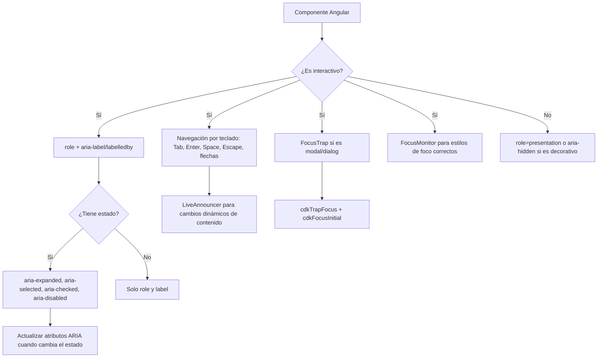

# Capítulo 29 - Parte 3: Accesibilidad con el paquete a11y del CDK

> **Parte 3 de 4** · Capítulo 29 · PARTE XIII - Librerías Esenciales del Ecosistema

La accesibilidad no es una característica opcional ni un checklist que se completa al final del proyecto. Es una decisión de arquitectura que se toma desde el primer componente. El paquete `@angular/cdk/a11y` nos provee las herramientas que Angular Material usa internamente para hacer sus componentes accesibles, y que nosotros podemos usar en nuestros propios componentes personalizados. En esta parte construiremos un dialog completamente accesible que sirva como modelo para cualquier overlay que necesitemos crear.

## A11yModule: qué incluye

```typescript
// shared/accesibilidad.module.ts
import { A11yModule } from '@angular/cdk/a11y';

// A11yModule exporta:
// - CdkTrapFocus (directive)
// - FocusTrap (servicio)
// - LiveAnnouncer (servicio)
// - FocusMonitor (servicio)
// - AriaDescriber (servicio)
// - InteractivityChecker (servicio)
```

No necesitamos importar cada servicio por separado; al importar `A11yModule` en nuestro módulo o componente standalone, todos quedan disponibles para inyección.

## FocusTrap: atrapar el foco en un modal

El problema fundamental de cualquier modal es que el foco del teclado puede escapar hacia elementos detrás del overlay. `cdkTrapFocus` resuelve esto automáticamente:

```html
<!-- dialog-accesible/dialog-accesible.component.html -->
<div
  role="dialog"
  aria-modal="true"
  [attr.aria-labelledby]="'titulo-dialog-' + idDialog"
  [attr.aria-describedby]="'desc-dialog-' + idDialog"
  cdkTrapFocus
  cdkTrapFocusAutoCapture>

  <h2 [id]="'titulo-dialog-' + idDialog">Confirmar eliminación</h2>

  <p [id]="'desc-dialog-' + idDialog">
    Esta acción eliminará permanentemente el registro seleccionado
    y no puede deshacerse.
  </p>

  <div class="acciones-dialog">
    <button type="button" (click)="cancelar()">Cancelar</button>
    <button type="button" (click)="confirmar()" cdkFocusInitial>
      Confirmar
    </button>
  </div>

</div>
```

`cdkTrapFocusAutoCapture` transfiere el foco automáticamente al primer elemento enfocable cuando el dialog aparece. `cdkFocusInitial` marca el elemento que debe recibir el foco inicial, en este caso el botón de confirmar (o cancelar, según la UX deseada).

```typescript
// dialog-accesible/dialog-accesible.component.ts
import { Component, inject, OnInit, OnDestroy } from '@angular/core';
import { A11yModule, LiveAnnouncer }            from '@angular/cdk/a11y';
import { MAT_DIALOG_DATA, MatDialogRef,
         MatDialogModule }                      from '@angular/material/dialog';

interface DatosDialog { nombreElemento: string; }

@Component({
  selector: 'app-dialog-accesible',
  standalone: true,
  imports: [A11yModule, MatDialogModule],
  templateUrl: './dialog-accesible.component.html'
})
export class DialogAccesibleComponent implements OnInit, OnDestroy {
  readonly datos      = inject<DatosDialog>(MAT_DIALOG_DATA);
  readonly dialogRef  = inject(MatDialogRef<DialogAccesibleComponent>);
  private readonly anunciador = inject(LiveAnnouncer);

  readonly idDialog = crypto.randomUUID().slice(0, 8);

  ngOnInit(): void {
    // Anunciamos la apertura para lectores de pantalla
    this.anunciador.announce(
      `Dialog de confirmación abierto. ¿Desea eliminar ${this.datos.nombreElemento}?`,
      'assertive'
    );
  }

  ngOnDestroy(): void {
    this.anunciador.clear();
  }

  cancelar(): void {
    this.dialogRef.close(false);
  }

  confirmar(): void {
    this.anunciador.announce('Elemento eliminado', 'polite');
    this.dialogRef.close(true);
  }
}
```

## LiveAnnouncer: mensajes para lectores de pantalla

`LiveAnnouncer` inyecta un elemento de región ARIA live en el DOM y envía mensajes a través de él. Los lectores de pantalla los leen en voz alta sin mover el foco del usuario:

```typescript
// shared/notificacion.service.ts
import { Injectable, inject }  from '@angular/core';
import { LiveAnnouncer }       from '@angular/cdk/a11y';

@Injectable({ providedIn: 'root' })
export class NotificacionService {
  private readonly anunciador = inject(LiveAnnouncer);

  // 'polite': espera a que el lector de pantalla termine lo que está leyendo
  notificar(mensaje: string): void {
    this.anunciador.announce(mensaje, 'polite');
  }

  // 'assertive': interrumpe inmediatamente (solo para errores críticos)
  alertar(mensaje: string): void {
    this.anunciador.announce(mensaje, 'assertive');
  }

  // Para una tabla que se actualiza tras una búsqueda:
  anunciarResultados(total: number, termino: string): void {
    const msg = total === 0
      ? `No se encontraron resultados para "${termino}"`
      : `${total} resultado${total !== 1 ? 's' : ''} para "${termino}"`;
    this.anunciador.announce(msg, 'polite');
  }
}
```

La diferencia entre `'polite'` y `'assertive'` es crítica: `'assertive'` interrumpe al lector de pantalla inmediatamente, lo cual puede ser muy molesto. Usarlo solo para errores que requieren atención inmediata.

## FocusMonitor: detectar la fuente de foco

`FocusMonitor` nos dice cómo el usuario dio foco a un elemento: por teclado, mouse, touch o programáticamente. Esto nos permite aplicar estilos de foco visibles solo cuando corresponde:

```typescript
// shared/boton-custom/boton-custom.component.ts
import { Component, ElementRef, OnInit, OnDestroy, inject } from '@angular/core';
import { FocusMonitor, FocusOrigin }                        from '@angular/cdk/a11y';

@Component({
  selector: 'app-boton-custom',
  standalone: true,
  template: `
    <button class="mi-boton" [class.foco-teclado]="origenFoco === 'keyboard'">
      <ng-content />
    </button>
  `,
  styles: [`
    .mi-boton:focus { outline: none; }
    .mi-boton.foco-teclado { outline: 3px solid #005fcc; outline-offset: 2px; }
  `]
})
export class BotonCustomComponent implements OnInit, OnDestroy {
  private readonly focusMonitor = inject(FocusMonitor);
  private readonly elementRef   = inject(ElementRef<HTMLElement>);

  origenFoco: FocusOrigin = null;

  ngOnInit(): void {
    this.focusMonitor.monitor(this.elementRef, true).subscribe(origen => {
      this.origenFoco = origen;
    });
  }

  ngOnDestroy(): void {
    this.focusMonitor.stopMonitoring(this.elementRef);
  }
}
```

`FocusOrigin` puede ser `'mouse'`, `'touch'`, `'keyboard'`, `'program'` o `null` (cuando pierde el foco). El segundo parámetro `true` en `monitor()` activa la monitorización de descendientes.

## AriaDescriber: gestión de aria-describedby

`AriaDescriber` simplifica la asociación de elementos con sus descripciones ARIA, manejando automáticamente los IDs y el ciclo de vida:

```typescript
// shared/campo-con-descripcion/campo-con-descripcion.component.ts
import { Component, ElementRef, OnInit,
         OnDestroy, AfterViewInit,
         ViewChild, inject }    from '@angular/core';
import { AriaDescriber }        from '@angular/cdk/a11y';

@Component({
  selector: 'app-campo-descripcion',
  standalone: true,
  template: `
    <input #campoInput type="text" [attr.aria-label]="etiqueta" />
    <span #textoDescripcion class="descripcion-oculta">
      {{ descripcion }}
    </span>
  `
})
export class CampoConDescripcionComponent implements AfterViewInit, OnDestroy {
  @ViewChild('campoInput')       campo!: ElementRef<HTMLInputElement>;
  @ViewChild('textoDescripcion') descripcionEl!: ElementRef<HTMLElement>;

  etiqueta    = 'Nombre de usuario';
  descripcion = 'Solo letras y números. Entre 4 y 20 caracteres.';

  private readonly ariaDescriber = inject(AriaDescriber);

  ngAfterViewInit(): void {
    this.ariaDescriber.describe(this.campo.nativeElement, this.descripcionEl.nativeElement);
  }

  ngOnDestroy(): void {
    this.ariaDescriber.removeDescription(this.campo.nativeElement, this.descripcionEl.nativeElement);
  }
}
```

## Checklist de accesibilidad para componentes Angular



## Dialog accesible: ejemplo integrado

Veamos cómo quedan todas las piezas juntas en el template completo:

```html
<!-- dialog-accesible/dialog-accesible.component.html -->
<div role="dialog"
     aria-modal="true"
     [attr.aria-labelledby]="'titulo-' + idDialog"
     [attr.aria-describedby]="'desc-' + idDialog"
     cdkTrapFocus
     cdkTrapFocusAutoCapture
     class="dialog-contenedor">

  <header class="dialog-header">
    <h2 [id]="'titulo-' + idDialog" class="dialog-titulo">
      Eliminar {{ datos.nombreElemento }}
    </h2>
    <button type="button"
            aria-label="Cerrar dialog"
            (click)="cancelar()"
            (keydown.escape)="cancelar()">
      <span aria-hidden="true">&times;</span>
    </button>
  </header>

  <div class="dialog-cuerpo" [id]="'desc-' + idDialog">
    <p>
      Estás por eliminar <strong>{{ datos.nombreElemento }}</strong>.
      Esta acción es permanente y no puede revertirse.
    </p>
  </div>

  <footer class="dialog-footer">
    <button type="button"
            (click)="cancelar()"
            aria-label="Cancelar y cerrar dialog">
      Cancelar
    </button>
    <button type="button"
            (click)="confirmar()"
            cdkFocusInitial
            aria-describedby="advertencia-eliminacion">
      Eliminar permanentemente
    </button>
    <p id="advertencia-eliminacion" class="sr-only">
      Acción destructiva e irreversible
    </p>
  </footer>

</div>
```

## Puntos clave

- `cdkTrapFocus` con `cdkTrapFocusAutoCapture` son las dos directivas mínimas para hacer un modal accesible por teclado; sin ellas, el usuario Tab puede escapar hacia el contenido detrás del overlay.
- `LiveAnnouncer.announce()` con `'polite'` es la forma correcta de notificar cambios dinámicos (resultados de búsqueda, operaciones completadas) sin interrumpir al lector de pantalla.
- `FocusMonitor` permite mostrar el anillo de foco solo cuando el usuario navega por teclado, eliminando el debate de "quitar o no el outline en CSS".
- Los atributos `aria-labelledby` y `aria-describedby` son más potentes que `aria-label` porque el texto puede contener HTML formateado y actualizarse dinámicamente.
- El patrón `idDialog = crypto.randomUUID()` garantiza IDs únicos si hay múltiples instancias del componente en la página.

## ¿Qué sigue?

En la última parte del capítulo 29 exploraremos las herramientas más estructurales del CDK: `CdkStepperModule` para steppers personalizados sin estilos de Material, `CdkTableModule` para tablas neutras compatibles con Tailwind, y `CdkVirtualScrollViewport` en su forma más pura.
