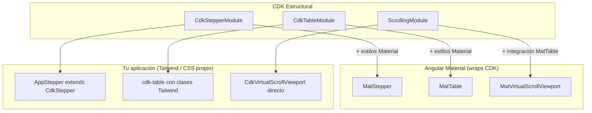

# Capítulo 29 - Parte 4: Stepper, Table y Virtual Scroll del CDK

> **Parte 4 de 4** · Capítulo 29 · PARTE XIII - Librerías Esenciales del Ecosistema

En esta última parte del capítulo exploramos las tres herramientas estructurales del CDK que más se diferencian de sus equivalentes de Angular Material: `CdkStepperModule` para steppers sin estilos impuestos, `CdkTableModule` para tablas neutras, y `CdkVirtualScrollViewport` para renderizar listas de miles de elementos sin sacrificar el rendimiento. El hilo conductor es siempre el mismo: el CDK provee el comportamiento, nosotros ponemos los estilos.

## CdkStepperModule vs MatStepper

La diferencia fundamental entre ambos es de responsabilidad:

- `MatStepper` (`MatStepperModule`) proporciona comportamiento Y estilos de Material Design.
- `CdkStepper` (`CdkStepperModule`) proporciona solo el comportamiento; los estilos son completamente nuestros.

Esto hace que `CdkStepper` sea ideal cuando usamos Tailwind, un sistema de diseño propio o cuando el diseño del producto no sigue Material Design.

```typescript
// onboarding/stepper-base.ts
// Creamos nuestro propio Stepper extendiendo CdkStepper
import { Component, ChangeDetectionStrategy } from '@angular/core';
import { CdkStepper, CdkStepperModule }       from '@angular/cdk/stepper';
import { NgTemplateOutlet }                   from '@angular/common';

@Component({
  selector: 'app-stepper',
  standalone: true,
  imports: [CdkStepperModule, NgTemplateOutlet],
  changeDetection: ChangeDetectionStrategy.OnPush,
  template: `
    <!-- Indicadores de pasos -->
    <nav class="stepper-nav" aria-label="Pasos del proceso">
      @for (paso of steps; track paso.label; let i = $index) {
        <button
          class="indicador-paso"
          [class.activo]="selectedIndex === i"
          [class.completado]="paso.completed"
          [attr.aria-current]="selectedIndex === i ? 'step' : null"
          (click)="selectedIndex = i">
          <span class="numero-paso">{{ i + 1 }}</span>
          <span class="etiqueta-paso">{{ paso.label }}</span>
        </button>
      }
    </nav>

    <!-- Barra de progreso -->
    <div class="barra-progreso" role="progressbar"
         [attr.aria-valuenow]="selectedIndex + 1"
         [attr.aria-valuemax]="steps.length">
      <div class="progreso-relleno"
           [style.width.%]="((selectedIndex + 1) / steps.length) * 100">
      </div>
    </div>

    <!-- Contenido del paso actual -->
    <div class="contenido-paso">
      @if (selected) {
        <ng-container [ngTemplateOutlet]="selected.content" />
      }
    </div>

    <!-- Navegación entre pasos -->
    <div class="controles-paso">
      <button [disabled]="!hasPreviousStep()" (click)="previous()" type="button">
        Anterior
      </button>
      <button [disabled]="!hasNextStep()" (click)="next()" type="button">
        Siguiente
      </button>
    </div>
  `
})
export class AppStepperComponent extends CdkStepper {}
```

Y así usamos nuestro stepper personalizado:

```typescript
// onboarding/onboarding.component.ts
import { Component, signal }        from '@angular/core';
import { CdkStepperModule }         from '@angular/cdk/stepper';
import { ReactiveFormsModule,
         FormBuilder, Validators }  from '@angular/forms';
import { AppStepperComponent }      from './stepper-base';

@Component({
  selector: 'app-onboarding',
  standalone: true,
  imports: [AppStepperComponent, CdkStepperModule, ReactiveFormsModule],
  template: `
    <app-stepper linear>

      <cdk-step label="Cuenta" [completed]="pasoUnoCompleto()">
        <form [formGroup]="formCuenta" class="form-paso">
          <label>
            Nombre de usuario
            <input formControlName="usuario" type="text" />
          </label>
          <label>
            Correo electrónico
            <input formControlName="correo" type="email" />
          </label>
        </form>
      </cdk-step>

      <cdk-step label="Perfil" [completed]="pasoDosCompleto()">
        <form [formGroup]="formPerfil" class="form-paso">
          <label>
            Nombre completo
            <input formControlName="nombre" type="text" />
          </label>
          <label>
            Rol
            <select formControlName="rol">
              <option value="dev">Desarrollador</option>
              <option value="pm">Project Manager</option>
              <option value="design">Diseñador</option>
            </select>
          </label>
        </form>
      </cdk-step>

      <cdk-step label="Confirmar">
        <div class="resumen-onboarding">
          <h3>¡Todo listo!</h3>
          <p>Usuario: <strong>{{ formCuenta.value.usuario }}</strong></p>
          <p>Correo: <strong>{{ formCuenta.value.correo }}</strong></p>
          <p>Nombre: <strong>{{ formPerfil.value.nombre }}</strong></p>
          <button type="button" (click)="finalizar()">Comenzar</button>
        </div>
      </cdk-step>

    </app-stepper>
  `
})
export class OnboardingComponent {
  private readonly fb = new FormBuilder();

  formCuenta = this.fb.group({
    usuario: ['', [Validators.required, Validators.minLength(4)]],
    correo:  ['', [Validators.required, Validators.email]]
  });

  formPerfil = this.fb.group({
    nombre: ['', Validators.required],
    rol:    ['dev', Validators.required]
  });

  pasoUnoCompleto = signal(false);
  pasoDosCompleto = signal(false);

  finalizar(): void {
    // Enviar datos al backend
  }
}
```

## CdkTableModule: tablas neutras

`CdkTableModule` es la base de `MatTable`, pero sin ningún CSS de Material. Ideal cuando usamos Tailwind o un sistema de diseño propio:

```typescript
// reportes/tabla-reporte.component.ts
import { Component, signal }         from '@angular/core';
import { CdkTableModule,
         DataSource }                from '@angular/cdk/table';
import { Observable, of }            from 'rxjs';

interface FilaReporte {
  periodo: string; ingresos: number; egresos: number; resultado: number;
}

class ReporteDataSource extends DataSource<FilaReporte> {
  private readonly datos = signal<FilaReporte[]>([
    { periodo: 'Enero',   ingresos: 150000, egresos: 90000, resultado: 60000  },
    { periodo: 'Febrero', ingresos: 175000, egresos: 95000, resultado: 80000  },
    { periodo: 'Marzo',   ingresos: 130000, egresos: 98000, resultado: 32000  },
  ]);

  connect(): Observable<FilaReporte[]> { return of(this.datos()); }
  disconnect(): void {}
}

@Component({
  selector: 'app-tabla-reporte',
  standalone: true,
  imports: [CdkTableModule],
  template: `
    <table cdk-table [dataSource]="dataSource" class="tabla-reporte">

      <ng-container cdkColumnDef="periodo">
        <th cdk-header-cell *cdkHeaderCellDef>Período</th>
        <td cdk-cell *cdkCellDef="let fila">{{ fila.periodo }}</td>
        <td cdk-footer-cell *cdkFooterCellDef>Total</td>
      </ng-container>

      <ng-container cdkColumnDef="ingresos">
        <th cdk-header-cell *cdkHeaderCellDef>Ingresos</th>
        <td cdk-cell *cdkCellDef="let fila">
          {{ fila.ingresos | currency:'ARS':'symbol':'1.0-0' }}
        </td>
        <td cdk-footer-cell *cdkFooterCellDef>
          {{ totalIngresos() | currency:'ARS':'symbol':'1.0-0' }}
        </td>
      </ng-container>

      <tr cdk-header-row *cdkHeaderRowDef="columnas"></tr>
      <tr cdk-row *cdkRowDef="let fila; columns: columnas;"
          [class.negativo]="fila.resultado < 0"></tr>
      <tr cdk-footer-row *cdkFooterRowDef="columnas"></tr>

    </table>
  `
})
export class TablaReporteComponent {
  columnas    = ['periodo', 'ingresos', 'egresos', 'resultado'];
  dataSource  = new ReporteDataSource();
  totalIngresos = signal(455000);
}
```

La diferencia con `MatTable` es puramente de prefijos: `mat-table` vs `cdk-table`, `matColumnDef` vs `cdkColumnDef`, etc. El comportamiento es idéntico.

## CdkVirtualScrollViewport: scroll virtual puro

El scroll virtual renderiza solo los elementos visibles en pantalla, lo cual permite manejar listas de decenas de miles de elementos sin problemas de rendimiento:

```typescript
// inventario/lista-virtual.component.ts
import { Component, signal, computed } from '@angular/core';
import { ScrollingModule }             from '@angular/cdk/scrolling';

interface ItemInventario {
  id: number; codigo: string; descripcion: string; cantidad: number;
}

@Component({
  selector: 'app-lista-virtual',
  standalone: true,
  imports: [ScrollingModule],
  template: `
    <div class="controles">
      <span>{{ items().length | number }} items en inventario</span>
    </div>

    <cdk-virtual-scroll-viewport
      itemSize="64"
      minBufferPx="320"
      maxBufferPx="640"
      class="viewport-inventario">

      <div *cdkVirtualFor="let item of items();
                           trackBy: trackPorId;
                           templateCacheSize: 20"
           class="fila-item">

        <span class="codigo">{{ item.codigo }}</span>
        <span class="descripcion">{{ item.descripcion }}</span>
        <span class="cantidad"
              [class.critico]="item.cantidad < 10">
          {{ item.cantidad }}
        </span>

      </div>

    </cdk-virtual-scroll-viewport>
  `,
  styles: [`
    .viewport-inventario { height: 600px; width: 100%; }
    .fila-item { height: 64px; display: flex; align-items: center; gap: 1rem; }
  `]
})
export class ListaVirtualComponent {
  items = signal<ItemInventario[]>(
    Array.from({ length: 50_000 }, (_, i) => ({
      id:          i + 1,
      codigo:      `INV-${String(i + 1).padStart(6, '0')}`,
      descripcion: `Producto de ejemplo número ${i + 1}`,
      cantidad:    Math.floor(Math.random() * 200)
    }))
  );

  trackPorId = (_index: number, item: ItemInventario): number => item.id;
}
```

`itemSize` es la altura en píxeles de cada elemento (debe ser constante). `minBufferPx` y `maxBufferPx` controlan cuántos píxeles de elementos renderizados se mantienen fuera del viewport visible como buffer.

## CdkScrollable y ScrollDispatcher

`ScrollDispatcher` permite reaccionar a eventos de scroll de cualquier elemento scrollable registrado con `CdkScrollable`:

```typescript
// layout/scroll-hasta-arriba.component.ts
import { Component, OnInit, signal, inject } from '@angular/core';
import { ScrollDispatcher, CdkScrollable }   from '@angular/cdk/scrolling';
import { takeUntilDestroyed }                from '@angular/core/rxjs-interop';
import { filter }                            from 'rxjs/operators';

@Component({
  selector: 'app-scroll-hasta-arriba',
  standalone: true,
  imports: [CdkScrollable],
  template: `
    <div cdkScrollable class="contenedor-scroll">
      <ng-content />
    </div>

    @if (mostrarBoton()) {
      <button class="btn-scroll-arriba"
              aria-label="Volver al inicio de la página"
              (click)="scrollAlInicio()">
        ↑
      </button>
    }
  `
})
export class ScrollHastaArribaComponent implements OnInit {
  private readonly scrollDispatcher = inject(ScrollDispatcher);
  mostrarBoton = signal(false);

  ngOnInit(): void {
    this.scrollDispatcher.scrolled(100)
      .pipe(
        takeUntilDestroyed(),
        filter(Boolean)
      )
      .subscribe(scrollable => {
        const posicion = scrollable.measureScrollOffset('top');
        this.mostrarBoton.set(posicion > 300);
      });
  }

  scrollAlInicio(): void {
    window.scrollTo({ top: 0, behavior: 'smooth' });
  }
}
```

## Mapa conceptual del CDK estructural



## Puntos clave

- `CdkStepper` requiere que extendamos la clase en un componente propio; no es una directiva que se aplica directamente, sino una clase base que le da comportamiento a nuestro componente.
- `CdkTableModule` es la mejor opción cuando el diseño del proyecto no sigue Material Design; evita sobreescribir estilos de `MatTable` con `!important`.
- `itemSize` en `CdkVirtualScrollViewport` debe ser fijo; para elementos de altura variable usamos la directiva experimental `cdkVirtualForAutosize` (en preview al momento de escribir esto).
- `trackBy` en `*cdkVirtualFor` es obligatorio para el rendimiento; sin él, el CDK no puede identificar qué elementos cambiaron y re-renderiza innecesariamente.
- `ScrollDispatcher.scrolled(auditTime)` acepta un tiempo en ms para limitar la frecuencia de los eventos (throttling interno); `100` ms es un buen valor para la mayoría de los casos.

## ¿Qué sigue?

Con este capítulo completamos el estudio profundo del CDK. En los próximos capítulos nos adentraremos en patrones avanzados de arquitectura: gestión de estado, micro-frontends y estrategias de rendimiento para aplicaciones Angular en producción.
