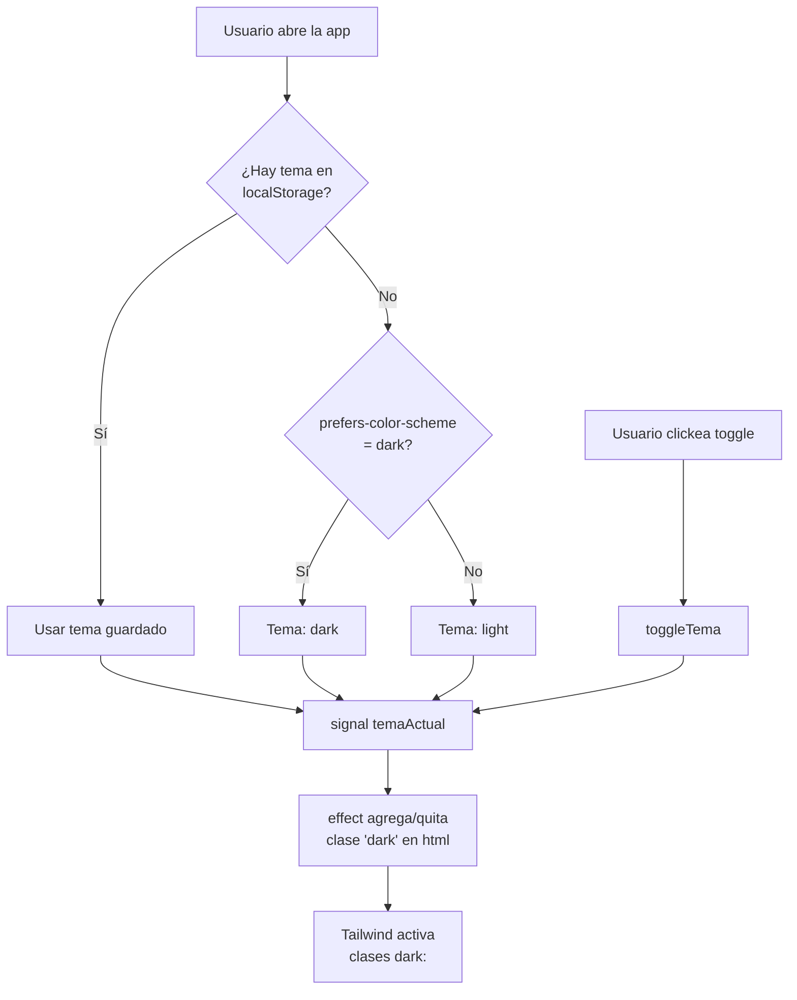

# Capítulo 30 - Parte 3: Responsive Design y Dark Mode con Tailwind

> **Parte 3 de 4** · Capítulo 30 · PARTE XIII - Librerías Esenciales del Ecosistema

Dos de las características más poderosas de Tailwind son su sistema de breakpoints responsive y el soporte nativo para Dark Mode. En esta parte veamos cómo aprovecharlas al máximo en componentes Angular, usando signals para gestionar el tema de forma reactiva.

## El sistema de breakpoints de Tailwind

Tailwind usa un enfoque **mobile-first**: las clases sin prefijo aplican a todos los tamaños de pantalla, y las clases con prefijo aplican desde ese breakpoint en adelante.

```
sm:   640px  y superior
md:   768px  y superior
lg:   1024px y superior
xl:   1280px y superior
2xl:  1536px y superior
```

Esto se lee de izquierda a derecha (de menor a mayor):

```html
<!-- Sin prefijo = base (móvil) -->
<!-- sm: = desde 640px -->
<!-- md: = desde 768px -->
<div class="grid grid-cols-1 sm:grid-cols-2 lg:grid-cols-3 xl:grid-cols-4 gap-4">
  <!-- En móvil: 1 columna -->
  <!-- En tablet: 2 columnas -->
  <!-- En desktop: 3 columnas -->
  <!-- En pantallas grandes: 4 columnas -->
</div>
```

La clave del mobile-first es que **diseñamos primero para el dispositivo más pequeño** y luego agregamos complejidad para pantallas más grandes. Es un cambio de mentalidad que mejora la calidad del diseño responsive.

## Navbar completamente responsivo

Construyamos un navbar que en móvil muestra un menú hamburguesa y en desktop muestra los enlaces horizontalmente:

```typescript
// navbar.component.ts
import { Component, signal } from '@angular/core';
import { RouterLink, RouterLinkActive } from '@angular/router';

interface EnlaceNav {
  etiqueta: string;
  ruta: string;
}

@Component({
  selector: 'app-navbar',
  standalone: true,
  imports: [RouterLink, RouterLinkActive],
  template: `
    <nav class="bg-white dark:bg-gray-900 border-b border-gray-200 dark:border-gray-700">
      <div class="max-w-7xl mx-auto px-4 sm:px-6 lg:px-8">
        <div class="flex items-center justify-between h-16">

          <!-- Logo -->
          <a routerLink="/" class="flex items-center gap-2">
            <span class="text-2xl font-bold text-blue-600 dark:text-blue-400">
              MiApp
            </span>
          </a>

          <!-- Enlaces de escritorio -->
          <div class="hidden md:flex items-center gap-1">
            @for (enlace of enlaces; track enlace.ruta) {
              <a
                [routerLink]="enlace.ruta"
                routerLinkActive="bg-blue-50 dark:bg-blue-900/30 text-blue-600 dark:text-blue-400"
                class="px-3 py-2 rounded-md text-sm font-medium text-gray-700
                       dark:text-gray-200 hover:bg-gray-100 dark:hover:bg-gray-800
                       transition-colors"
              >
                {{ enlace.etiqueta }}
              </a>
            }
          </div>

          <!-- Botón hamburguesa (solo móvil) -->
          <button
            (click)="toggleMenu()"
            class="md:hidden p-2 rounded-md text-gray-500 dark:text-gray-400
                   hover:bg-gray-100 dark:hover:bg-gray-800 transition-colors"
            [attr.aria-expanded]="menuAbierto()"
            aria-label="Abrir menú de navegación"
          >
            @if (menuAbierto()) {
              <span class="block w-6 text-xl">✕</span>
            } @else {
              <span class="block w-6 text-xl">☰</span>
            }
          </button>
        </div>
      </div>

      <!-- Menú móvil desplegable -->
      @if (menuAbierto()) {
        <div class="md:hidden border-t border-gray-200 dark:border-gray-700 px-4 py-2">
          @for (enlace of enlaces; track enlace.ruta) {
            <a
              [routerLink]="enlace.ruta"
              routerLinkActive="text-blue-600 dark:text-blue-400"
              (click)="menuAbierto.set(false)"
              class="block px-3 py-2 rounded-md text-base font-medium
                     text-gray-700 dark:text-gray-200
                     hover:bg-gray-100 dark:hover:bg-gray-800 transition-colors"
            >
              {{ enlace.etiqueta }}
            </a>
          }
        </div>
      }
    </nav>
  `
})
export class NavbarComponent {
  readonly menuAbierto = signal(false);

  readonly enlaces: EnlaceNav[] = [
    { etiqueta: 'Inicio',    ruta: '/' },
    { etiqueta: 'Productos', ruta: '/productos' },
    { etiqueta: 'Nosotros',  ruta: '/nosotros' },
    { etiqueta: 'Contacto',  ruta: '/contacto' },
  ];

  toggleMenu(): void {
    this.menuAbierto.update(abierto => !abierto);
  }
}
```

Notemos las clases `hidden md:flex`: en móvil el contenedor está oculto (`display: none`) y a partir de 768px se muestra como flex. Lo contrario aplica para el botón hamburguesa: `md:hidden` lo muestra en móvil y lo oculta en desktop.

## Dark Mode: estrategia `class`

La configuración más flexible para Dark Mode es la estrategia `class`. Con ella, el modo oscuro se activa cuando el elemento `<html>` tiene la clase `dark`:

```js
// tailwind.config.js
/** @type {import('tailwindcss').Config} */
module.exports = {
  content: ['./src/**/*.{html,ts}'],
  darkMode: 'class', // Activado por clase en <html>
  theme: { extend: {} },
  plugins: [],
}
```

## Servicio de tema con signals

Construyamos un servicio que gestione el tema y lo persista en `localStorage`:

```typescript
// tema.service.ts
import { Injectable, signal, effect } from '@angular/core';

type Tema = 'light' | 'dark';

@Injectable({ providedIn: 'root' })
export class TemaService {
  private readonly CLAVE_STORAGE = 'tema-preferido';

  readonly temaActual = signal<Tema>(this.leerTemaInicial());

  constructor() {
    // Efecto reactivo: actualiza el DOM cuando cambia el signal
    effect(() => {
      const tema = this.temaActual();
      const htmlElement = document.documentElement;

      if (tema === 'dark') {
        htmlElement.classList.add('dark');
      } else {
        htmlElement.classList.remove('dark');
      }

      localStorage.setItem(this.CLAVE_STORAGE, tema);
    });
  }

  toggleTema(): void {
    this.temaActual.update(tema => tema === 'light' ? 'dark' : 'light');
  }

  private leerTemaInicial(): Tema {
    const guardado = localStorage.getItem(this.CLAVE_STORAGE) as Tema | null;
    if (guardado === 'light' || guardado === 'dark') {
      return guardado;
    }
    // Respetar preferencia del sistema operativo
    return window.matchMedia('(prefers-color-scheme: dark)').matches
      ? 'dark'
      : 'light';
  }
}
```

## Botón de toggle de tema

```typescript
// toggle-tema.component.ts
import { Component, inject } from '@angular/core';
import { TemaService } from './tema.service';

@Component({
  selector: 'app-toggle-tema',
  standalone: true,
  template: `
    <button
      (click)="temaService.toggleTema()"
      class="p-2 rounded-full bg-gray-100 dark:bg-gray-800
             text-gray-700 dark:text-gray-200
             hover:bg-gray-200 dark:hover:bg-gray-700
             transition-colors duration-200"
      [attr.aria-label]="temaService.temaActual() === 'light'
        ? 'Activar modo oscuro'
        : 'Activar modo claro'"
    >
      @if (temaService.temaActual() === 'light') {
        <span aria-hidden="true">🌙</span>
      } @else {
        <span aria-hidden="true">☀️</span>
      }
    </button>
  `
})
export class ToggleTemaComponent {
  readonly temaService = inject(TemaService);
}
```

## Clases dark en la práctica

Con la clase `dark` en `<html>`, todas las variantes `dark:` se activan:

```html
<!-- Tarjeta con soporte completo de dark mode -->
<div class="bg-white dark:bg-gray-800 rounded-xl p-6 shadow-sm
            border border-gray-200 dark:border-gray-700">
  <h2 class="text-xl font-semibold text-gray-900 dark:text-white">
    Título de la tarjeta
  </h2>
  <p class="mt-2 text-gray-600 dark:text-gray-300">
    Descripción con buen contraste en ambos temas.
  </p>
  <button class="mt-4 btn-primario dark:bg-blue-500 dark:hover:bg-blue-600">
    Acción principal
  </button>
</div>
```

## Alternativa: `darkMode: 'media'`

Si preferimos que el tema siga automáticamente la preferencia del sistema operativo sin necesidad de un toggle manual:

```js
// tailwind.config.js
module.exports = {
  darkMode: 'media', // Sigue prefers-color-scheme automáticamente
  // ...
}
```

Con esta opción, las clases `dark:` se activan cuando el usuario tiene el sistema en modo oscuro. La desventaja es que el usuario no puede cambiar el tema desde la app. En aplicaciones de producción, la estrategia `class` suele ser más apropiada porque da control al usuario.

## Flujo del sistema de temas



## Puntos clave

- Mobile-first: las clases sin prefijo son el estilo base, los prefijos `sm:` `md:` `lg:` agregan estilos para pantallas más grandes.
- `hidden md:flex` es el patrón para mostrar/ocultar elementos según el breakpoint.
- `darkMode: 'class'` en `tailwind.config.js` permite control manual del tema desde la aplicación.
- El `TemaService` con signals y `effect()` actualiza el DOM reactivamente y persiste la preferencia.
- Leer `prefers-color-scheme` al inicializar respeta la configuración del sistema operativo del usuario.

## ¿Qué sigue?

En la última parte de este capítulo veamos cómo hacer convivir Tailwind con Angular Material sin que ninguno interfiera con el otro.
