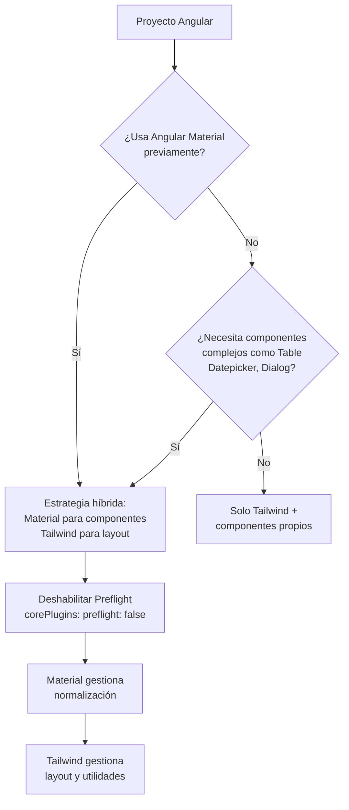

# Capítulo 30 - Parte 4: Tailwind + Angular Material - Convivencia Armoniosa

> **Parte 4 de 4** · Capítulo 30 · PARTE XIII - Librerías Esenciales del Ecosistema

Uno de los escenarios más comunes en proyectos Angular reales es querer combinar Angular Material para componentes complejos (diálogos, tablas, datepickers) con Tailwind para el layout y los componentes simples. El problema es que estas dos librerías, sin configuración adecuada, se pelean entre sí. Veamos por qué ocurre y cómo resolverlo.

## El problema: Preflight de Tailwind

Cuando incluimos `@tailwind base;` en `styles.scss`, Tailwind aplica su CSS de normalización llamado **Preflight**. Este reset elimina los márgenes, rellenos y estilos por defecto del navegador, y también afecta elementos como botones, inputs y encabezados.

Angular Material, por su parte, asume que el navegador tiene ciertos estilos base. Cuando Preflight los elimina, los componentes de Material quedan visualmente rotos: botones sin forma, tipografía desalineada, inputs con comportamiento extraño.

## Solución 1: Deshabilitar Preflight

La solución más directa es decirle a Tailwind que no aplique el reset:

```js
// tailwind.config.js
/** @type {import('tailwindcss').Config} */
module.exports = {
  content: ['./src/**/*.{html,ts}'],
  darkMode: 'class',
  corePlugins: {
    preflight: false, // Deshabilitamos el reset global
  },
  theme: { extend: {} },
  plugins: [],
}
```

Con `preflight: false`, perdemos la normalización de Tailwind, pero Angular Material aplica su propio sistema de normalización a través de `mat-typography` y sus estilos base. En la práctica, la pérdida es mínima porque Material ya gestiona la consistencia visual de sus propios componentes.

Esta es la opción más sencilla y funciona bien en la mayoría de los proyectos.

## Solución 2: Ordenar con `@layer`

Una alternativa más precisa es mantener Preflight pero asegurarnos de que los estilos de Material tengan mayor especificidad. Para esto, envolvemos los estilos de Material en una capa con mayor prioridad:

```scss
/* src/styles.scss */
@tailwind base;
@tailwind components;
@tailwind utilities;

/* Los estilos de Material quedan DESPUÉS de utilities */
/* y por tanto tienen precedencia cuando hay conflictos */
@import '@angular/material/prebuilt-themes/azure-blue.css';
```

Sin embargo, el orden de imports en CSS tiene limitaciones. La solución más robusta combina ambas técnicas: deshabilitar Preflight y usar `@layer` solo para los estilos propios:

```scss
/* src/styles.scss */
@tailwind base;    /* Sin Preflight gracias a corePlugins */
@tailwind components;
@tailwind utilities;

/* Material aplica sus propios estilos base sin conflicto */
@include mat.core();
```

## Cuándo usar Material y cuándo Tailwind

La regla práctica que funciona bien en proyectos reales:

**Usar Angular Material para:**
- Componentes complejos con lógica de estado: `MatDialog`, `MatTable` con sort y paginación, `MatDatepicker`, `MatAutocomplete`
- Componentes con accesibilidad compleja ya implementada: `MatSelect`, `MatSlider`, `MatChips`
- Formularios con validación visual integrada: `MatFormField`, `MatError`

**Usar Tailwind para:**
- Layout: grid, flex, contenedores, espaciado entre secciones
- Tipografía general y colores de fondo de página
- Componentes simples: badges, alertas, avatares, separadores
- Cards y paneles que no necesitan comportamiento especial

```typescript
// ejemplo-hibrido.component.ts
import { Component, inject } from '@angular/core';
import { MatDialog } from '@angular/material/dialog';
import { MatTableModule } from '@angular/material/table';
import { MatButtonModule } from '@angular/material/button';
import { MatChipsModule } from '@angular/material/chips';
import { DetalleProductoDialogComponent } from './detalle-producto-dialog.component';

interface FilaProducto {
  id: number;
  nombre: string;
  categoria: string;
  precio: number;
  estado: 'activo' | 'inactivo';
}

@Component({
  selector: 'app-tabla-productos',
  standalone: true,
  imports: [MatTableModule, MatButtonModule, MatChipsModule],
  template: `
    <!-- Layout con Tailwind -->
    <div class="p-6 max-w-7xl mx-auto">
      <div class="flex items-center justify-between mb-6">
        <h1 class="text-2xl font-bold text-gray-900">Gestión de Productos</h1>
        <!-- Botón de Material para acción principal -->
        <button mat-raised-button color="primary" (click)="abrirCrear()">
          Nuevo Producto
        </button>
      </div>

      <!-- Tabla de Material para datos complejos -->
      <div class="rounded-xl overflow-hidden border border-gray-200 shadow-sm">
        <table mat-table [dataSource]="productos" class="w-full">
          <ng-container matColumnDef="nombre">
            <th mat-header-cell *matHeaderCellDef
                class="!bg-gray-50 !text-gray-600 !font-semibold !text-sm">
              Nombre
            </th>
            <td mat-cell *matCellDef="let fila" class="!text-gray-900">
              {{ fila.nombre }}
            </td>
          </ng-container>

          <ng-container matColumnDef="estado">
            <th mat-header-cell *matHeaderCellDef
                class="!bg-gray-50 !text-gray-600 !font-semibold !text-sm">
              Estado
            </th>
            <td mat-cell *matCellDef="let fila">
              <!-- Badge simple con Tailwind -->
              <span [class]="claseEstado(fila.estado)">
                {{ fila.estado }}
              </span>
            </td>
          </ng-container>

          <tr mat-header-row *matHeaderRowDef="columnas"></tr>
          <tr mat-row *matRowDef="let row; columns: columnas;"
              class="hover:bg-gray-50 cursor-pointer transition-colors"
              (click)="abrirDetalle(row)">
          </tr>
        </table>
      </div>
    </div>
  `
})
export class TablaProductosComponent {
  private readonly dialogo = inject(MatDialog);

  readonly columnas = ['nombre', 'estado'];
  readonly productos: FilaProducto[] = [
    { id: 1, nombre: 'Laptop Pro', categoria: 'Electrónicos', precio: 2500000, estado: 'activo' },
    { id: 2, nombre: 'Mouse Inalámbrico', categoria: 'Accesorios', precio: 85000, estado: 'inactivo' },
  ];

  claseEstado(estado: 'activo' | 'inactivo'): string {
    const base = 'px-2 py-1 rounded-full text-xs font-medium capitalize';
    return estado === 'activo'
      ? `${base} bg-green-100 text-green-800`
      : `${base} bg-gray-100 text-gray-600`;
  }

  abrirDetalle(producto: FilaProducto): void {
    this.dialogo.open(DetalleProductoDialogComponent, {
      data: producto,
      width: '500px',
    });
  }

  abrirCrear(): void {
    this.dialogo.open(DetalleProductoDialogComponent, {
      width: '500px',
    });
  }
}
```

## Tokens de Material como variables en Tailwind

Para mantener consistencia de colores entre Material y Tailwind, podemos exponer las variables CSS que Material define como tokens de Tailwind:

```js
// tailwind.config.js
module.exports = {
  content: ['./src/**/*.{html,ts}'],
  corePlugins: { preflight: false },
  theme: {
    extend: {
      colors: {
        // Reutilizamos los tokens CSS de Material
        'mat-primario':    'var(--mat-sys-primary)',
        'mat-secundario':  'var(--mat-sys-secondary)',
        'mat-superficie':  'var(--mat-sys-surface)',
        'mat-error':       'var(--mat-sys-error)',
        'mat-en-primario': 'var(--mat-sys-on-primary)',
      },
    },
  },
  plugins: [],
}
```

Ahora podemos usar `text-mat-primario` o `bg-mat-superficie` en clases Tailwind y estos respetarán el tema de Material, incluyendo los cambios dinámicos de tema si usamos el sistema de theming de Material 3.

## Cuándo esta estrategia híbrida tiene sentido

Esta combinación es especialmente valiosa en estos escenarios:



Los proyectos que más se benefician son aquellos donde:
1. Ya existe una base de código con Angular Material y queremos modernizar el layout.
2. Necesitamos componentes de datos complejos (tablas, selectores múltiples) pero queremos flexibilidad en el diseño general.
3. El equipo conoce Material para la accesibilidad y no quiere reimplementarla desde cero.

## Puntos clave

- El conflicto principal entre Tailwind y Material es el Preflight (reset CSS de Tailwind) que rompe los estilos base de Material.
- La solución más simple es `corePlugins: { preflight: false }` en `tailwind.config.js`.
- Material para componentes complejos con estado y accesibilidad; Tailwind para layout, espaciado y componentes visuales simples.
- Los tokens CSS de Material 3 (`--mat-sys-primary`) pueden referenciarse desde `tailwind.config.js` para mantener consistencia de colores.
- La estrategia híbrida es ideal cuando ya existe una base de Material en el proyecto o cuando se necesitan componentes de datos complejos.

## ¿Qué sigue?

En el siguiente capítulo cambiamos de tema completamente: empezamos a explorar el mundo del testing en Angular, comenzando por la migración de Karma a Jest y las primeras pruebas unitarias.
