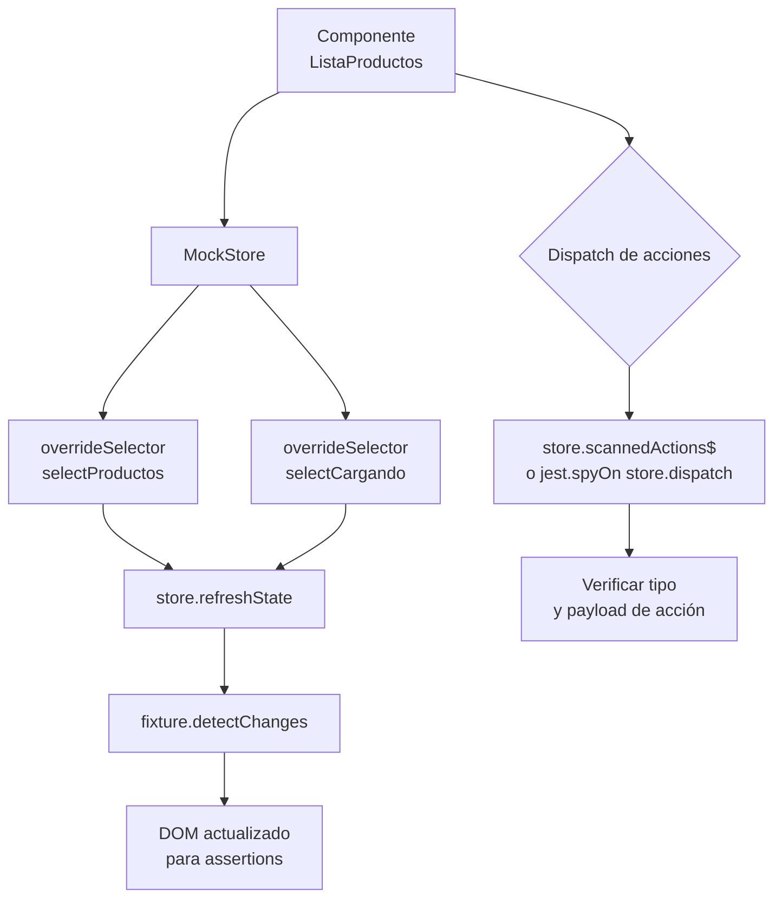

# Capítulo 31 - Parte 3: Testing de Servicios, HTTP y NgRx

> **Parte 3 de 4** · Capítulo 31 · PARTE XIII - Librerías Esenciales del Ecosistema

Testar componentes visuales es importante, pero la lógica de negocio más crítica suele vivir en los servicios. Y si usamos NgRx, el store es el corazón del estado de la aplicación. En esta parte veamos cómo aislar y testar servicios con dependencias de HTTP, y cómo verificar que nuestros componentes interactúan correctamente con el store.

## Testing de un servicio simple

Empecemos por lo más básico: un servicio con lógica pura que no depende de HTTP:

```typescript
// carrito.service.ts
import { Injectable, signal, computed } from '@angular/core';

interface ItemCarrito {
  productoId: number;
  nombre: string;
  precio: number;
  cantidad: number;
}

@Injectable({ providedIn: 'root' })
export class CarritoService {
  private readonly items = signal<ItemCarrito[]>([]);

  readonly totalItems = computed(() =>
    this.items().reduce((acc, item) => acc + item.cantidad, 0)
  );

  readonly totalPrecio = computed(() =>
    this.items().reduce((acc, item) => acc + item.precio * item.cantidad, 0)
  );

  agregar(item: ItemCarrito): void {
    this.items.update(lista => {
      const existente = lista.find(i => i.productoId === item.productoId);
      if (existente) {
        return lista.map(i =>
          i.productoId === item.productoId
            ? { ...i, cantidad: i.cantidad + item.cantidad }
            : i
        );
      }
      return [...lista, item];
    });
  }

  vaciar(): void { this.items.set([]); }
}
```

```typescript
// carrito.service.spec.ts
import { TestBed } from '@angular/core/testing';
import { CarritoService } from './carrito.service';

describe('CarritoService', () => {
  let servicio: CarritoService;

  beforeEach(() => {
    TestBed.configureTestingModule({});
    servicio = TestBed.inject(CarritoService);
  });

  it('debería iniciar con el carrito vacío', () => {
    expect(servicio.totalItems()).toBe(0);
    expect(servicio.totalPrecio()).toBe(0);
  });

  it('debería agregar un item correctamente', () => {
    servicio.agregar({ productoId: 1, nombre: 'Teclado', precio: 150000, cantidad: 2 });
    expect(servicio.totalItems()).toBe(2);
    expect(servicio.totalPrecio()).toBe(300000);
  });

  it('debería acumular cantidad si el producto ya existe', () => {
    const item = { productoId: 1, nombre: 'Teclado', precio: 150000, cantidad: 1 };
    servicio.agregar(item);
    servicio.agregar(item);
    expect(servicio.totalItems()).toBe(2);
  });

  it('debería vaciar el carrito', () => {
    servicio.agregar({ productoId: 1, nombre: 'Mouse', precio: 80000, cantidad: 1 });
    servicio.vaciar();
    expect(servicio.totalItems()).toBe(0);
  });
});
```

## Testing de servicios HTTP con `provideHttpClientTesting()`

A partir de Angular 16+, la forma moderna de testar HTTP es con `provideHttpClientTesting()` en lugar del módulo antiguo `HttpClientTestingModule`:

```typescript
// productos.service.ts
import { Injectable, inject } from '@angular/core';
import { HttpClient, HttpParams } from '@angular/common/http';
import { Observable } from 'rxjs';

interface Producto {
  id: number;
  nombre: string;
  precio: number;
}

interface RespuestaPaginada<T> {
  datos: T[];
  total: number;
  pagina: number;
}

@Injectable({ providedIn: 'root' })
export class ProductosService {
  private readonly http = inject(HttpClient);
  private readonly urlBase = '/api/productos';

  obtenerTodos(pagina = 1, porPagina = 10): Observable<RespuestaPaginada<Producto>> {
    const params = new HttpParams()
      .set('pagina', pagina)
      .set('porPagina', porPagina);
    return this.http.get<RespuestaPaginada<Producto>>(this.urlBase, { params });
  }

  obtenerPorId(id: number): Observable<Producto> {
    return this.http.get<Producto>(`${this.urlBase}/${id}`);
  }

  crear(producto: Omit<Producto, 'id'>): Observable<Producto> {
    return this.http.post<Producto>(this.urlBase, producto);
  }

  eliminar(id: number): Observable<void> {
    return this.http.delete<void>(`${this.urlBase}/${id}`);
  }
}
```

```typescript
// productos.service.spec.ts
import { TestBed } from '@angular/core/testing';
import { provideHttpClient } from '@angular/common/http';
import { provideHttpClientTesting, HttpTestingController } from '@angular/common/http/testing';
import { ProductosService } from './productos.service';

describe('ProductosService', () => {
  let servicio: ProductosService;
  let httpMock: HttpTestingController;

  const productosMock = [
    { id: 1, nombre: 'Laptop', precio: 2500000 },
    { id: 2, nombre: 'Mouse',  precio: 85000 },
  ];

  beforeEach(() => {
    TestBed.configureTestingModule({
      providers: [
        provideHttpClient(),
        provideHttpClientTesting(),
      ],
    });
    servicio = TestBed.inject(ProductosService);
    httpMock = TestBed.inject(HttpTestingController);
  });

  afterEach(() => {
    httpMock.verify(); // Verifica que no haya peticiones pendientes sin atender
  });

  it('debería obtener todos los productos con paginación', () => {
    const respuestaMock = { datos: productosMock, total: 2, pagina: 1 };
    let resultado: typeof respuestaMock | undefined;

    servicio.obtenerTodos(1, 10).subscribe(res => (resultado = res));

    const req = httpMock.expectOne('/api/productos?pagina=1&porPagina=10');
    expect(req.request.method).toBe('GET');
    req.flush(respuestaMock);

    expect(resultado).toEqual(respuestaMock);
  });

  it('debería obtener un producto por ID', () => {
    let resultado: { id: number; nombre: string; precio: number } | undefined;

    servicio.obtenerPorId(1).subscribe(p => (resultado = p));

    const req = httpMock.expectOne('/api/productos/1');
    expect(req.request.method).toBe('GET');
    req.flush(productosMock[0]);

    expect(resultado?.nombre).toBe('Laptop');
  });

  it('debería manejar error 404', () => {
    let errorCapturado: Error | undefined;

    servicio.obtenerPorId(999).subscribe({
      error: err => (errorCapturado = err),
    });

    const req = httpMock.expectOne('/api/productos/999');
    req.flush('No encontrado', { status: 404, statusText: 'Not Found' });

    expect(errorCapturado).toBeDefined();
  });

  it('debería crear un producto con POST', () => {
    const nuevoProducto = { nombre: 'Teclado', precio: 120000 };

    servicio.crear(nuevoProducto).subscribe();

    const req = httpMock.expectOne('/api/productos');
    expect(req.request.method).toBe('POST');
    expect(req.request.body).toEqual(nuevoProducto);
    req.flush({ id: 3, ...nuevoProducto });
  });
});
```

## Testing con MockStore de NgRx

Cuando un componente depende de NgRx, usamos `MockStore` para controlar el estado sin necesitar un store real:

```typescript
// lista-productos.component.spec.ts
import { ComponentFixture, TestBed } from '@angular/core/testing';
import { provideMockStore, MockStore } from '@ngrx/store/testing';
import { screen } from '@testing-library/angular';
import { ListaProductosComponent } from './lista-productos.component';
import { selectProductos, selectCargando } from './productos.selectors';
import { ProductosActions } from './productos.actions';

describe('ListaProductosComponent', () => {
  let store: MockStore;
  let fixture: ComponentFixture<ListaProductosComponent>;

  const productosMock = [
    { id: 1, nombre: 'Laptop', precio: 2500000, enStock: true },
    { id: 2, nombre: 'Mouse',  precio: 85000,   enStock: false },
  ];

  const estadoInicial = {
    productos: {
      lista: [],
      cargando: false,
      error: null,
    },
  };

  beforeEach(async () => {
    await TestBed.configureTestingModule({
      imports: [ListaProductosComponent],
      providers: [
        provideMockStore({ initialState: estadoInicial }),
      ],
    }).compileComponents();

    store = TestBed.inject(MockStore);
    fixture = TestBed.createComponent(ListaProductosComponent);
    fixture.detectChanges();
  });

  afterEach(() => {
    store.resetSelectors();
  });

  it('debería mostrar spinner cuando está cargando', () => {
    store.overrideSelector(selectCargando, true);
    store.refreshState();
    fixture.detectChanges();

    expect(screen.getByRole('progressbar')).toBeTruthy();
  });

  it('debería mostrar la lista de productos cuando carga exitosamente', () => {
    store.overrideSelector(selectProductos, productosMock);
    store.overrideSelector(selectCargando, false);
    store.refreshState();
    fixture.detectChanges();

    expect(screen.getByText('Laptop')).toBeTruthy();
    expect(screen.getByText('Mouse')).toBeTruthy();
  });

  it('debería despachar la acción de cargar al inicializar', () => {
    const accionesEsperadas: string[] = [];
    store.scannedActions$.subscribe(accion => {
      accionesEsperadas.push(accion.type);
    });

    // Re-creamos el componente para capturar ngOnInit
    fixture = TestBed.createComponent(ListaProductosComponent);
    fixture.detectChanges();

    expect(accionesEsperadas).toContain(ProductosActions.cargarProductos.type);
  });

  it('debería despachar eliminar al confirmar', () => {
    const spy = jest.spyOn(store, 'dispatch');
    store.overrideSelector(selectProductos, productosMock);
    store.refreshState();
    fixture.detectChanges();

    const botonEliminar = fixture.nativeElement.querySelector('[data-testid="eliminar-1"]');
    botonEliminar?.click();
    fixture.detectChanges();

    expect(spy).toHaveBeenCalledWith(
      ProductosActions.eliminarProducto({ id: 1 })
    );
  });
});
```

## Diagrama de la estrategia de testing



## Puntos clave

- Para servicios simples, `TestBed.inject(MiServicio)` es suficiente; no necesitamos módulos adicionales.
- `provideHttpClientTesting()` reemplaza a `HttpClientTestingModule` desde Angular 16; ambas APIs coexisten pero la funcional es la preferida.
- `httpMock.verify()` en `afterEach` garantiza que no haya peticiones HTTP sin responder en cada test.
- `MockStore` de `@ngrx/store/testing` permite controlar selectores con `overrideSelector` y `refreshState()`.
- `store.scannedActions$` es un Observable que emite cada acción despachada; ideal para verificar dispatches.

## ¿Qué sigue?

En la última parte del capítulo subimos a un nivel más alto: testing end-to-end con Playwright, donde automatizamos el navegador real para validar flujos completos de usuario.
