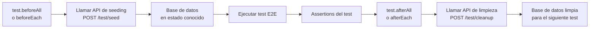

# Capítulo 31 - Parte 4: E2E Testing con Playwright en Proyectos Angular

> **Parte 4 de 4** · Capítulo 31 · PARTE XIII - Librerías Esenciales del Ecosistema

Los tests unitarios y de integración nos dan confianza en que cada pieza funciona correctamente de forma aislada. Pero ¿cómo sabemos que todo el sistema funciona junto desde la perspectiva del usuario real? Ahí entran los tests end-to-end (E2E). Playwright se ha convertido en el estándar moderno para E2E, superando a Cypress y Protractor (ya deprecado) en velocidad, confiabilidad y capacidades. Veamos cómo integrarlo en un proyecto Angular.

## ¿Por qué Playwright?

Playwright ofrece varias ventajas sobre las alternativas:

- **Múltiples navegadores**: Chrome, Firefox y Safari en una sola instalación.
- **Auto-wait**: espera automáticamente a que los elementos estén listos antes de interactuar; no necesitamos `sleep()` ni waits manuales.
- **Modo de depuración visual**: `npx playwright codegen` graba las acciones del usuario y genera el código del test.
- **Paralelo por defecto**: los tests corren en paralelo, reduciendo el tiempo total en CI.
- **Trace viewer**: cuando un test falla en CI, Playwright guarda una grabación completa (video, capturas de pantalla, DOM snapshots) para diagnóstico.

## Instalación

```bash
npm install -D @playwright/test
npx playwright install
```

El segundo comando descarga los binarios de los navegadores (Chromium, Firefox, WebKit). En CI solo instalamos los que usamos:

```bash
npx playwright install chromium
```

## Configuración de `playwright.config.ts`

```typescript
// playwright.config.ts
import { defineConfig, devices } from '@playwright/test';

export default defineConfig({
  testDir: './e2e',
  testMatch: '**/*.e2e.ts',
  fullyParallel: true,
  forbidOnly: !!process.env['CI'],
  retries: process.env['CI'] ? 2 : 0,
  workers: process.env['CI'] ? 1 : undefined,
  reporter: [
    ['html', { outputFolder: 'playwright-report' }],
    ['list'],
  ],
  use: {
    baseURL: 'http://localhost:4200',
    trace: 'on-first-retry',
    screenshot: 'only-on-failure',
    video: 'retain-on-failure',
    locale: 'es-CO',
  },
  projects: [
    {
      name: 'chromium',
      use: { ...devices['Desktop Chrome'] },
    },
    {
      name: 'firefox',
      use: { ...devices['Desktop Firefox'] },
    },
    {
      name: 'móvil-safari',
      use: { ...devices['iPhone 14'] },
    },
  ],
  webServer: {
    command: 'ng serve --configuration=test',
    url: 'http://localhost:4200',
    reuseExistingServer: !process.env['CI'],
    timeout: 120_000,
  },
});
```

La propiedad `webServer` es fundamental: Playwright arranca automáticamente `ng serve` antes de correr los tests y lo cierra al terminar. En CI (`!reuseExistingServer`) siempre arranca uno nuevo; en desarrollo local reutiliza el servidor si ya está corriendo.

Creamos un ambiente de Angular específico para E2E que apunte a un backend de prueba o a mocks:

```typescript
// src/environments/environment.test.ts
export const environment = {
  production: false,
  apiUrl: 'http://localhost:3001/api', // Backend de prueba o mock server
};
```

## Page Object Model (POM): reutilizando selectores

El patrón POM separa la lógica de interacción con la página de la lógica de los assertions. Esto hace que cuando cambia un selector, lo actualizamos en un solo lugar:

```typescript
// e2e/pages/login.page.ts
import { Page, Locator, expect } from '@playwright/test';

export class LoginPage {
  private readonly page: Page;

  // Locators reutilizables
  readonly campoCorreo:    Locator;
  readonly campoContrasena: Locator;
  readonly botonEnviar:    Locator;
  readonly mensajeError:   Locator;
  readonly enlaceRegistro: Locator;

  constructor(page: Page) {
    this.page = page;
    this.campoCorreo     = page.getByLabel('Correo electrónico');
    this.campoContrasena = page.getByLabel('Contraseña');
    this.botonEnviar     = page.getByRole('button', { name: 'Iniciar sesión' });
    this.mensajeError    = page.getByRole('alert');
    this.enlaceRegistro  = page.getByRole('link', { name: /registrarse/i });
  }

  async navegar(): Promise<void> {
    await this.page.goto('/login');
  }

  async completarFormulario(correo: string, contrasena: string): Promise<void> {
    await this.campoCorreo.fill(correo);
    await this.campoContrasena.fill(contrasena);
  }

  async enviar(): Promise<void> {
    await this.botonEnviar.click();
  }

  async iniciarSesion(correo: string, contrasena: string): Promise<void> {
    await this.completarFormulario(correo, contrasena);
    await this.enviar();
  }

  async verificarErrorVisible(textoError: string): Promise<void> {
    await expect(this.mensajeError).toBeVisible();
    await expect(this.mensajeError).toContainText(textoError);
  }
}
```

```typescript
// e2e/pages/dashboard.page.ts
import { Page, Locator, expect } from '@playwright/test';

export class DashboardPage {
  private readonly page: Page;

  readonly encabezado:     Locator;
  readonly menuUsuario:    Locator;
  readonly botonCerrarSesion: Locator;

  constructor(page: Page) {
    this.page = page;
    this.encabezado        = page.getByRole('heading', { name: 'Dashboard' });
    this.menuUsuario       = page.getByTestId('menu-usuario');
    this.botonCerrarSesion = page.getByRole('button', { name: /cerrar sesión/i });
  }

  async verificarCargado(): Promise<void> {
    await expect(this.encabezado).toBeVisible();
    await expect(this.page).toHaveURL('/dashboard');
  }
}
```

## Primer test: flujo de login completo

```typescript
// e2e/auth/login.e2e.ts
import { test, expect } from '@playwright/test';
import { LoginPage } from '../pages/login.page';
import { DashboardPage } from '../pages/dashboard.page';

test.describe('Flujo de autenticación', () => {
  let loginPage: LoginPage;
  let dashboardPage: DashboardPage;

  test.beforeEach(async ({ page }) => {
    loginPage = new LoginPage(page);
    dashboardPage = new DashboardPage(page);
    await loginPage.navegar();
  });

  test('debería mostrar el formulario de login', async ({ page }) => {
    await expect(page.getByRole('heading', { name: 'Iniciar sesión' })).toBeVisible();
    await expect(loginPage.campoCorreo).toBeVisible();
    await expect(loginPage.campoContrasena).toBeVisible();
    await expect(loginPage.botonEnviar).toBeVisible();
  });

  test('debería iniciar sesión con credenciales válidas', async () => {
    await loginPage.iniciarSesion('admin@ejemplo.com', 'clave-segura-2024');
    await dashboardPage.verificarCargado();
  });

  test('debería mostrar error con credenciales inválidas', async () => {
    await loginPage.iniciarSesion('incorrecto@ejemplo.com', 'clave-mal');
    await loginPage.verificarErrorVisible('Credenciales incorrectas');
  });

  test('debería deshabilitar el botón mientras procesa', async ({ page }) => {
    await loginPage.completarFormulario('admin@ejemplo.com', 'clave-segura-2024');
    await loginPage.botonEnviar.click();
    // Playwright auto-espera, pero podemos verificar el estado intermedio
    await expect(loginPage.botonEnviar).toBeDisabled();
    await dashboardPage.verificarCargado();
  });

  test('debería navegar a registro al hacer clic en el enlace', async ({ page }) => {
    await loginPage.enlaceRegistro.click();
    await expect(page).toHaveURL('/registro');
  });
});
```

## Comandos y scripts

```json
// package.json
{
  "scripts": {
    "test:e2e": "playwright test",
    "test:e2e:ui": "playwright test --ui",
    "test:e2e:debug": "playwright test --debug",
    "test:e2e:codegen": "playwright codegen http://localhost:4200",
    "test:e2e:report": "playwright show-report"
  }
}
```

## GitHub Actions CI

```yaml
# .github/workflows/e2e.yml
name: E2E Tests

on:
  push:
    branches: [main, develop]
  pull_request:
    branches: [main]

jobs:
  test-e2e:
    runs-on: ubuntu-latest
    steps:
      - uses: actions/checkout@v4

      - uses: actions/setup-node@v4
        with:
          node-version: '20'
          cache: 'npm'

      - name: Instalar dependencias
        run: npm ci

      - name: Instalar navegadores de Playwright
        run: npx playwright install --with-deps chromium

      - name: Construir app Angular
        run: npm run build -- --configuration=test

      - name: Ejecutar tests E2E
        run: npx playwright test --project=chromium
        env:
          CI: true

      - name: Subir reporte de Playwright
        if: always()
        uses: actions/upload-artifact@v4
        with:
          name: playwright-report
          path: playwright-report/
          retention-days: 30
```

## Estrategia de datos de prueba

Un detalle crítico en E2E es el estado de la base de datos. Veamos el patrón recomendado:



```typescript
// e2e/helpers/datos-prueba.ts
import { APIRequestContext } from '@playwright/test';

export async function crearUsuarioPrueba(
  request: APIRequestContext,
  datos: { correo: string; contrasena: string; rol: string }
): Promise<void> {
  await request.post('/api/test/usuarios', { data: datos });
}

export async function limpiarDatosPrueba(request: APIRequestContext): Promise<void> {
  await request.delete('/api/test/limpiar');
}
```

## Puntos clave

- `playwright.config.ts` con `webServer` arranca automáticamente `ng serve` antes de los tests y lo cierra al terminar.
- El patrón Page Object Model (POM) centraliza los selectores y las interacciones, haciendo los tests más mantenibles.
- Los locators accesibles (`getByRole`, `getByLabel`, `getByText`) son más resilientes a cambios de implementación que los selectores CSS.
- Playwright hace auto-wait por defecto: no necesitamos `sleep()` ni waits manuales para operaciones asíncronas.
- En CI, configurar `retries: 2` reduce los falsos negativos causados por tiempos de respuesta variables.

## ¿Qué sigue?

Con esto cerramos la PARTE XIII del libro. Hemos recorrido la integración de Tailwind CSS en todas sus variantes, la convivencia con Angular Material, y las tres capas del testing moderno en Angular: unitario con Jest, comportamiento con ATL, y E2E con Playwright. El siguiente capítulo explora las estrategias de optimización de performance en Angular, con lazy loading avanzado, defer blocks y profiling con DevTools.
