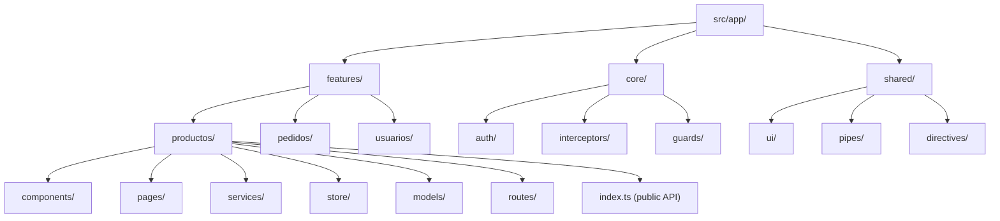

# Capítulo 32 - Parte 1: Arquitectura por features y dominios escalables

> **Parte 1 de 4** · Capítulo 32 · PARTE XIV - Arquitectura y Patrones Avanzados

Cuando un proyecto Angular comienza a crecer, la primera señal de alarma no aparece en el rendimiento ni en los tests. Aparece cuando un desarrollador nuevo abre el proyecto y no sabe dónde buscar el archivo que necesita. La arquitectura por features y dominios resuelve exactamente ese problema: organizar el código de forma que el dominio del negocio sea la guía de orientación, no el tipo técnico del artefacto.

## El problema con la organización por tipo

La organización tradicional que vemos en muchos tutoriales luce así:

```
src/app/
  components/
    producto-lista.component.ts
    pedido-detalle.component.ts
    usuario-perfil.component.ts
  services/
    productos.service.ts
    pedidos.service.ts
    usuarios.service.ts
  models/
    producto.model.ts
    pedido.model.ts
```

Esta estructura parece ordenada al principio. El problema surge cuando el proyecto crece: para entender cómo funciona el módulo de productos, hay que navegar por cuatro carpetas diferentes. Los cambios en un dominio afectan a carpetas mezcladas con otros dominios. El acoplamiento crece de forma invisible.

## La organización por features: el dominio primero

En la arquitectura por features, el criterio de agrupación es el dominio de negocio. Todo lo que pertenece al dominio de "productos" vive junto:

```
src/app/
  features/
    productos/
      components/
        producto-lista.component.ts
        producto-tarjeta.component.ts
      pages/
        productos-page.component.ts
      services/
        productos.service.ts
      store/
        productos.actions.ts
        productos.effects.ts
        productos.reducer.ts
        productos.selectors.ts
      models/
        producto.model.ts
      routes/
        productos.routes.ts
      index.ts
    pedidos/
      components/
      pages/
      services/
      store/
      models/
      routes/
      index.ts
  core/
    auth/
    interceptors/
    guards/
  shared/
    ui/
    pipes/
    directives/
```

Veamos cómo se vería esta estructura en un diagrama:



## Qué incluye cada feature: los modelos

Los modelos son interfaces TypeScript que representan las entidades del dominio. No incluyen lógica de negocio; son contratos de datos:

```typescript
// features/productos/models/producto.model.ts
export interface Producto {
  readonly id: string;
  readonly nombre: string;
  readonly descripcion: string;
  readonly precio: number;
  readonly categoria: CategoriaProducto;
  readonly disponible: boolean;
  readonly imagenUrl: string;
}

export type CategoriaProducto =
  | 'electronica'
  | 'ropa'
  | 'alimentos'
  | 'hogar';

export interface FiltroProductos {
  readonly categoria?: CategoriaProducto;
  readonly precioMinimo?: number;
  readonly precioMaximo?: number;
  readonly soloDisponibles?: boolean;
}
```

## El barrel export: la API pública del feature

El archivo `index.ts` en la raíz de cada feature actúa como una puerta de entrada. Define qué puede ver el mundo exterior y qué es un detalle de implementación interno:

```typescript
// features/productos/index.ts
// API pública del feature de Productos
// Solo exportamos lo que otros features necesitan conocer

export { ProductosPageComponent } from './pages/productos-page.component';
export { ProductosRoutes } from './routes/productos.routes';
export { ProductosFacade } from './services/productos.facade';

// Modelos que otros features pueden necesitar
export type { Producto, CategoriaProducto, FiltroProductos } from './models/producto.model';

// NO exportamos: componentes internos, store interno, servicios de infraestructura
```

Esta decisión es poderosa. Cuando otro módulo necesita interactuar con productos, solo puede hacerlo a través de esta API pública. Si mañana refactorizamos el store interno o renombramos un componente interno, ningún código externo se rompe.

## La separación entre capas

Dentro de cada feature existe una distinción importante entre dos capas:

**Capa de presentación**: componentes, templates, directivas, pipes. Se ocupa de cómo se ve y se interactúa. Depende de la capa de dominio, pero no al revés.

**Capa de dominio**: servicios, modelos, reglas de negocio, store. Define qué hace el sistema independientemente de cómo se muestre.

```typescript
// features/productos/services/productos.service.ts
// CAPA DE DOMINIO: no importa nada de Angular UI
import { Injectable, inject } from '@angular/core';
import { HttpClient } from '@angular/common/http';
import { Observable, map } from 'rxjs';
import { Producto, FiltroProductos } from '../models/producto.model';

@Injectable({ providedIn: 'root' })
export class ProductosService {
  private readonly http = inject(HttpClient);
  private readonly urlBase = '/api/productos';

  obtenerTodos(filtro?: FiltroProductos): Observable<Producto[]> {
    const params = this.construirParams(filtro);
    return this.http.get<Producto[]>(this.urlBase, { params }).pipe(
      map(productos => productos.filter(p => p.disponible || !filtro?.soloDisponibles))
    );
  }

  private construirParams(filtro?: FiltroProductos): Record<string, string> {
    if (!filtro) return {};
    const params: Record<string, string> = {};
    if (filtro.categoria) params['categoria'] = filtro.categoria;
    if (filtro.precioMinimo !== undefined) {
      params['precioMin'] = String(filtro.precioMinimo);
    }
    return params;
  }
}
```

## El rol de `core/` y `shared/`

La carpeta `core/` aloja servicios que deben existir como singletons a nivel de aplicación: autenticación, interceptores HTTP, guards globales, el servicio de logging. Son la infraestructura que sirve a todos los features sin pertenecer a ninguno.

La carpeta `shared/` aloja artefactos reutilizables que no tienen lógica de negocio propia: un componente de botón, un pipe de formato de moneda, una directiva de tooltip. La distinción clave con `core/` es que `shared/` exporta componentes declarativos, mientras que `core/` exporta servicios imperativos.

```typescript
// core/auth/auth.service.ts
import { Injectable, inject, signal } from '@angular/core';
import { Router } from '@angular/router';
import { HttpClient } from '@angular/common/http';

export interface SesionUsuario {
  readonly id: string;
  readonly email: string;
  readonly roles: string[];
  readonly token: string;
}

@Injectable({ providedIn: 'root' })
export class AuthService {
  private readonly http = inject(HttpClient);
  private readonly router = inject(Router);

  readonly sesionActual = signal<SesionUsuario | null>(null);
  readonly estaAutenticado = signal<boolean>(false);

  iniciarSesion(email: string, contrasena: string): void {
    this.http.post<SesionUsuario>('/api/auth/login', { email, contrasena })
      .subscribe(sesion => {
        this.sesionActual.set(sesion);
        this.estaAutenticado.set(true);
        this.router.navigate(['/dashboard']);
      });
  }
}
```

## Las rutas lazy por feature

Cada feature define sus propias rutas. El router de la aplicación simplemente las importa de forma lazy:

```typescript
// app.routes.ts
import { Routes } from '@angular/router';
import { authGuard } from './core/guards/auth.guard';

export const appRoutes: Routes = [
  {
    path: 'productos',
    canActivate: [authGuard],
    loadChildren: () =>
      import('./features/productos').then(m => m.ProductosRoutes)
  },
  {
    path: 'pedidos',
    canActivate: [authGuard],
    loadChildren: () =>
      import('./features/pedidos').then(m => m.PedidosRoutes)
  },
  { path: '', redirectTo: 'productos', pathMatch: 'full' }
];
```

Nótese que importamos desde el barrel `index.ts` del feature, no desde rutas internas. Esa es la API pública en acción.

## Puntos clave

- La organización por features agrupa el código por dominio de negocio, no por tipo técnico, facilitando que cada desarrollador encuentre y modifique código relacionado sin navegar múltiples carpetas.
- El archivo `index.ts` de cada feature actúa como contrato público: define qué es visible desde afuera y protege los detalles de implementación internos.
- La separación entre capa de presentación y capa de dominio dentro de cada feature permite evolucionar la UI sin tocar la lógica de negocio, y viceversa.
- `core/` aloja singletons de infraestructura globales; `shared/` aloja componentes y utilidades sin lógica de negocio propia. Esta distinción evita que `shared/` se convierta en un dumping ground.
- Las rutas lazy por feature, combinadas con los barrel exports, permiten que cada feature sea un chunk independiente en el bundle final.

## ¿Qué sigue?

En la siguiente parte exploraremos cómo dividir los componentes dentro de cada feature usando el patrón Smart/Dumb para maximizar la reutilización y simplificar el testing.
