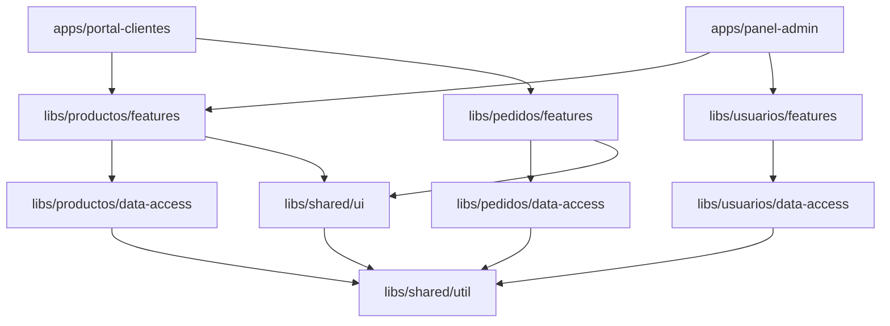

# Capítulo 32 - Parte 4: Nx Workspace: monorepos y arquitectura de librerías

> **Parte 4 de 4** · Capítulo 32 · PARTE XIV - Arquitectura y Patrones Avanzados

La arquitectura por features que vimos en las partes anteriores funciona perfectamente cuando tenemos una sola aplicación. Pero muchas organizaciones tienen múltiples apps: el portal del cliente, el panel de administración, la aplicación mobile web, tal vez una app interna de operaciones. Si cada app tiene su propio repositorio, compartir código se convierte en un ejercicio de publicación de paquetes npm internos, sincronización de versiones y dolor generalizado. Los monorepos con Nx resuelven esto de raíz.

## Por qué monorepo

La promesa del monorepo es concreta: todo el código de la organización vive en un solo repositorio git. Las consecuencias de esta decisión son profundas:

**Compartir código sin fricción**: si la app de administración y el portal del cliente comparten un componente de tabla de datos, ese componente vive en una librería del monorepo. Ambas apps lo importan directamente. No hay que publicar un paquete npm, no hay que sincronizar versiones.

**Un solo CI/CD**: en lugar de configurar pipelines separados para cada repositorio, hay uno solo que entiende el grafo de dependencias completo.

**Cambios atómicos cross-proyecto**: si cambiamos la interfaz `Producto`, y eso afecta a la app de ventas, la app de inventario y tres librerías compartidas, hacemos el cambio en un solo commit. No hay que coordinar PRs en varios repositorios.

**Visibilidad del grafo de dependencias**: Nx construye y actualiza automáticamente el grafo de dependencias entre apps y librerías, lo que permite saber exactamente qué se ve afectado por cualquier cambio.

## Creando el workspace

```bash
npx create-nx-workspace@latest mi-empresa \
  --preset=angular-monorepo \
  --appName=portal-clientes \
  --style=scss \
  --nxCloud=skip
```

La estructura inicial que genera Nx:

```
mi-empresa/
  apps/
    portal-clientes/
      src/
      project.json
  libs/
    (vacío, lo llenamos nosotros)
  nx.json
  tsconfig.base.json
  package.json
```

## Generando librerías con Nx

Las librerías son el corazón del monorepo. Nx tiene generators para crearlas con la configuración correcta desde el primer momento:

```bash
# Librería de feature
nx generate @nx/angular:library features-productos \
  --directory=libs/productos/features \
  --standalone \
  --changeDetection=OnPush

# Librería de UI compartida
nx generate @nx/angular:library ui-componentes \
  --directory=libs/shared/ui \
  --standalone \
  --changeDetection=OnPush

# Librería de modelos/datos
nx generate @nx/angular:library data-access-productos \
  --directory=libs/productos/data-access \
  --standalone
```

La estructura resultante:

```
libs/
  productos/
    features/
      src/
        lib/
          productos-lista/
          producto-detalle/
        index.ts
      project.json
    data-access/
      src/
        lib/
          productos.service.ts
          productos.facade.ts
          +state/
        index.ts
      project.json
  shared/
    ui/
      src/
        lib/
          spinner/
          tabla-datos/
          boton/
        index.ts
      project.json
```

## Tagging y categorías de librerías

Nx usa tags en el archivo `project.json` de cada librería para categorizar su propósito. Establecemos dos dimensiones de tags: tipo y scope.

```json
// libs/productos/features/project.json
{
  "name": "productos-features",
  "tags": ["type:feature", "scope:productos"]
}
```

```json
// libs/productos/data-access/project.json
{
  "name": "productos-data-access",
  "tags": ["type:data-access", "scope:productos"]
}
```

```json
// libs/shared/ui/project.json
{
  "name": "shared-ui",
  "tags": ["type:ui", "scope:shared"]
}
```

Los tipos que típicamente manejamos:

| Tag de tipo | Descripción |
|---|---|
| `type:feature` | Componentes de páginas completas, contienen lógica |
| `type:ui` | Componentes presentacionales reutilizables |
| `type:data-access` | Servicios, facades, store, HTTP |
| `type:util` | Funciones puras, pipes, helpers sin UI |
| `type:model` | Interfaces y tipos TypeScript |

## Reglas de dependencia: el verdadero poder

Las reglas de dependencia son la característica que convierte un monorepo en una arquitectura controlada. Configuramos estas reglas en `.eslintrc.json` usando el plugin de Nx:

```json
// .eslintrc.json (raíz del monorepo)
{
  "rules": {
    "@nx/enforce-module-boundaries": [
      "error",
      {
        "enforceBuildableLibDependencyCheck": true,
        "depConstraints": [
          {
            "sourceTag": "type:feature",
            "onlyDependOn": [
              "type:feature",
              "type:data-access",
              "type:ui",
              "type:util",
              "type:model"
            ]
          },
          {
            "sourceTag": "type:ui",
            "onlyDependOn": ["type:ui", "type:util", "type:model"]
          },
          {
            "sourceTag": "type:data-access",
            "onlyDependOn": [
              "type:data-access",
              "type:util",
              "type:model"
            ]
          },
          {
            "sourceTag": "scope:productos",
            "onlyDependOn": ["scope:productos", "scope:shared"]
          }
        ]
      }
    ]
  }
}
```

Con estas reglas, si alguien en el equipo intenta importar un servicio de `data-access` dentro de una librería de `ui`, ESLint fallará inmediatamente con un error claro. La arquitectura se hace cumplir de forma automática.

## El grafo de dependencias

Visualicemos cómo queda el grafo de dependencias de nuestro monorepo con varias apps y librerías:



El flujo de dependencias siempre va hacia abajo: las apps dependen de features, las features dependen de data-access y ui, todos dependen de util. Ninguna flecha va hacia arriba.

## CI eficiente con `nx affected`

Aquí está la propuesta de valor más tangible de Nx para equipos con CI. En un repositorio tradicional, cada commit corre todos los tests y builds. En Nx, corremos solo lo que cambió:

```bash
# Solo testear lo afectado por los cambios vs main
nx affected:test --base=main

# Solo construir lo afectado
nx affected:build --base=main

# Ver qué proyectos están afectados
nx affected:graph --base=main
```

Si cambiamos el componente `SpinnerComponent` en `libs/shared/ui`, Nx sabe que están afectadas las librerías `productos/features`, `pedidos/features`, y las apps `portal-clientes` y `panel-admin`. Solo correrá los tests y builds de esos proyectos, no de todo el monorepo.

En un monorepo con 50 librerías, esto puede reducir el tiempo de CI de 40 minutos a 8 minutos para cambios cotidianos.

## Importar entre librerías: los path aliases

Nx configura automáticamente path aliases en `tsconfig.base.json` para que los imports entre librerías sean limpios:

```json
// tsconfig.base.json (generado por Nx)
{
  "compilerOptions": {
    "paths": {
      "@mi-empresa/productos/features": [
        "libs/productos/features/src/index.ts"
      ],
      "@mi-empresa/productos/data-access": [
        "libs/productos/data-access/src/index.ts"
      ],
      "@mi-empresa/shared/ui": [
        "libs/shared/ui/src/index.ts"
      ]
    }
  }
}
```

En el código de la app o de otra librería, el import se ve así:

```typescript
// apps/portal-clientes/src/app/app.routes.ts
import { ProductosRoutes } from '@mi-empresa/productos/features';
import { PedidosRoutes } from '@mi-empresa/pedidos/features';
```

No hay rutas relativas con `../../..`. No hay ambigüedad sobre de dónde viene el código.

## Puntos clave

- El monorepo con Nx centraliza todas las apps y librerías de la organización en un solo repositorio, eliminando la fricción de compartir código entre proyectos mediante paquetes npm internos.
- La distinción entre `apps/` (deployables) y `libs/` (librerías reutilizables) es fundamental: las apps orquestan, las librerías implementan.
- Los tags en `project.json` y las reglas en `@nx/enforce-module-boundaries` convierten la arquitectura deseada en una restricción verificada automáticamente en cada pull request.
- `nx affected:test` y `nx affected:build` son la killer feature para CI: solo se procesa lo que cambió, ahorrando decenas de minutos en pipelines grandes.
- Los path aliases configurados por Nx en `tsconfig.base.json` eliminan los imports relativos profundos y hacen el código más legible y refactorable.

## ¿Qué sigue?

En el Capítulo 33 damos el siguiente salto de escala: los micro-frontends, donde no solo compartimos código entre apps, sino que deployamos partes de la aplicación de forma completamente independiente.
