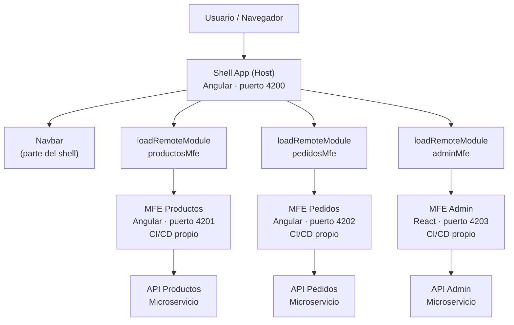

# Capítulo 33 - Parte 1: ¿Qué son los micro-frontends y cuándo usarlos?

> **Parte 1 de 4** · Capítulo 33 · PARTE XIV - Arquitectura y Patrones Avanzados

Hay un momento en la vida de un producto de software cuando el monolito frontend deja de ser manejable. No porque el código sea malo, sino porque el equipo creció, el dominio se complejizó, y diferentes partes del sistema tienen ritmos de cambio completamente distintos. El checkout se actualiza cada semana con nuevas validaciones. El catálogo de productos cambia una vez al mes. El panel de administración lo toca un equipo diferente con sus propios estándares. Ahí es cuando la idea de los micro-frontends empieza a tener sentido.

## La motivación real

Los micro-frontends no son una solución técnica en busca de un problema. Son una respuesta organizacional a un desafío de escala. El libro "Accelerate" y los estudios de State of DevOps muestran consistentemente que los equipos de alto rendimiento tienen control total sobre su pipeline de deploy: pueden llevar cambios a producción de forma independiente, sin coordinación con otros equipos.

En una arquitectura tradicional de frontend monolítico, si el equipo de pedidos quiere deployar una nueva funcionalidad, necesita coordinar el release con el equipo de productos y el equipo de usuarios. Un solo repositorio, un solo pipeline, un solo bundle. Los micro-frontends rompen esa dependencia.

## Definición formal

Un micro-frontend es una parte de una aplicación web que:

1. Pertenece a un dominio de negocio específico.
2. Es desarrollada, testeada y deployada de forma independiente por un equipo autónomo.
3. Tiene su propio pipeline de CI/CD.
4. Se integra en runtime (no en build time) con otras partes de la aplicación.

La distinción entre integración en build time y runtime es crucial. Un monorepo con Nx comparte código en build time: cuando se construye el bundle final, todo el código está junto. Los micro-frontends se integran en runtime: el shell carga las partes remotas cuando el usuario las necesita, y esas partes viven en servidores completamente separados.

## Los patrones de composición

Existen varias formas de componer micro-frontends. Cada uno con sus trade-offs:

**Integración server-side (Edge Side Includes / Server-Side Includes)**

El servidor ensambla el HTML antes de enviarlo al cliente. El shell hace un SSI a cada fragmento de MFE:

```html
<!-- El servidor reemplaza esto antes de enviar al cliente -->
<esi:include src="https://productos.mi-empresa.com/fragmento-destacados" />
<esi:include src="https://pedidos.mi-empresa.com/fragmento-resumen" />
```

Ventaja: excelente para SEO, sin JavaScript necesario para la composición inicial. Desventaja: requiere infraestructura de servidor específica (Nginx, Varnish, Fastly), complejidad en las transiciones de página.

**Integración client-side con iframes**

La forma más aislada de integración. Cada MFE vive en su propio iframe:

```html
<iframe src="https://productos.mi-empresa.com/lista" 
        sandbox="allow-scripts allow-same-origin">
</iframe>
```

Ventaja: aislamiento total de CSS y JavaScript. Desventaja: experiencia de usuario degradada (scroll, tamaño, comunicación entre frames).

**Integración client-side con Web Components**

El MFE se expone como un Custom Element del navegador:

```html
<!-- El MFE de productos registra este custom element -->
<productos-lista filtro="electronica" max-items="10"></productos-lista>
```

Ventaja: estándar web, funciona con cualquier framework. Desventaja: complejidad para compartir estado, funcionalidades avanzadas de Angular (routing) no encajan naturalmente.

**Module Federation (Webpack/Native)**

El patrón más popular para Angular. Los bundles JavaScript se cargan dinámicamente en runtime compartiendo dependencias. Es el foco de las siguientes partes de este capítulo.

## Arquitectura de referencia con MFE



El Shell es la aplicación host: maneja el routing de alto nivel, la autenticación, la navbar global y el layout. Cada MFE es una aplicación Angular completa que expone sus módulos o componentes para que el Shell los cargue en runtime.

## Los problemas reales que encontrarás

Adoptar micro-frontends no es gratis. Estos son los problemas reales que debemos anticipar:

**Compartir dependencias sin duplicar**: si el Shell usa Angular 17.3 y el MFE de Productos también, no queremos que el usuario descargue dos copias de Angular. Module Federation resuelve esto con el concepto de `shared` dependencies, pero requiere coordinación de versiones entre equipos.

**Routing global coherente**: el Shell maneja el routing de alto nivel (`/productos`, `/pedidos`). Pero dentro de `/productos`, el MFE de Productos quiere manejar su propio sub-routing (`/productos/lista`, `/productos/detalle/123`). Coordinar esto sin colisiones requiere acuerdos explícitos.

**Autenticación distribuida**: el usuario se autentica en el Shell, pero el MFE de Pedidos necesita el token para llamar a su API. ¿Cómo pasa el Shell ese token al MFE sin exponer información de seguridad? Veremos esto en detalle en la Parte 4.

**Styling consistente**: si cada MFE elige su propia paleta de colores y sistema de design, la aplicación resultante parece un collage. La solución suele ser un design system compartido (como librería de Web Components o CSS custom properties/variables globales cargadas por el Shell).

**Testing end-to-end**: con múltiples apps corriendo en puertos diferentes, los tests e2e se vuelven más complejos de orquestar. Herramientas como Cypress y Playwright pueden manejarlo, pero requieren configuración adicional.

## Cuándo NO usar micro-frontends

Esta es la pregunta más importante que debemos hacernos honestamente antes de adoptar MFE. Los micro-frontends agregan complejidad real. Si esa complejidad no está justificada por beneficios concretos, estamos sobre-ingeniando.

**No usar MFE cuando**:

- El equipo tiene menos de 8-10 personas. Con pocos desarrolladores, la coordinación que ahorran los MFE es menor que la complejidad que agregan.
- La aplicación tiene un dominio poco diferenciado. Si todas las partes del sistema cambian al mismo ritmo y por el mismo equipo, no hay beneficio en la autonomía de deploy.
- El presupuesto de infraestructura es limitado. Cada MFE necesita su propio pipeline, su propio hosting, su propio dominio. Son costos reales.
- El equipo no tiene experiencia previa con el patrón. El costo de aprendizaje inicial es alto; adoptarlo en un proyecto con deadline ajustado es arriesgado.
- La aplicación tiene requisitos fuertes de SEO y no hay experiencia con SSR en un contexto de MFE.

Una heurística práctica: si el overhead de coordinar un deploy entre dos equipos es menor de 30 minutos por semana, los micro-frontends probablemente no justifican su costo.

## Puntos clave

- Los micro-frontends son una respuesta organizacional a problemas de escala: permiten que equipos autónomos desarrollen, testeen y deployuen partes del frontend de forma independiente.
- La diferencia clave con un monorepo es que la integración ocurre en runtime, no en build time: cada MFE vive en su propio servidor con su propio bundle.
- Los patrones de composición van desde server-side includes (SSI) hasta Module Federation del lado del cliente, cada uno con trade-offs distintos en complejidad, rendimiento y experiencia de usuario.
- Los problemas reales de MFE (versioning de dependencias, routing global, autenticación distribuida, styling consistente) requieren soluciones explícitas antes de adoptar el patrón.
- Equipos pequeños, dominios poco diferenciados y presupuesto de infraestructura limitado son señales claras de que los MFE añadirán más complejidad de la que resuelven.

## ¿Qué sigue?

En la siguiente parte veremos cómo implementar Module Federation con Webpack en Angular, el enfoque más maduro y ampliamente adoptado para integrar micro-frontends en aplicaciones Angular existentes.
