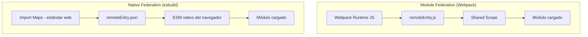

# Capítulo 33 - Parte 3: Native Federation: Module Federation sin Webpack

> **Parte 3 de 4** · Capítulo 33 · PARTE XIV - Arquitectura y Patrones Avanzados

La llegada de esbuild como bundler predeterminado en Angular 17 creó una tensión interesante: Module Federation, la tecnología dominante para micro-frontends, estaba diseñada exclusivamente para Webpack. Native Federation nació para resolver exactamente ese problema: ofrecer la misma capacidad de compartir módulos en runtime, pero sin depender de Webpack.

## El problema con Module Federation clásico en Angular 17+

Cuando Angular migró su pipeline de construcción a esbuild, los equipos que ya usaban `@angular-architects/module-federation` se encontraron ante una disyuntiva incómoda. Para mantener Module Federation tenían que forzar el uso del builder basado en Webpack, renunciando a las mejoras de velocidad que ofrece esbuild -builds hasta cinco veces más rápidos en proyectos medianos.

Native Federation, también desarrollada por el equipo de Manfred Steyer en `@angular-architects`, resuelve esto utilizando Import Maps del estándar web en lugar de la magia de runtime de Webpack. La diferencia conceptual es importante: Module Federation parchea el sistema de módulos de JavaScript en runtime; Native Federation genera Import Maps estáticos que el navegador resuelve nativamente, sin código intermediario adicional.

## Instalación y configuración

Para un proyecto host (shell) que consumirá micro-frontends remotos:

```bash
ng add @angular-architects/native-federation --project=shell --port=4200 --type=dynamic-host
```

Para un remote (micro-frontend que expone módulos):

```bash
ng add @angular-architects/native-federation --project=productos-mfe --port=4201 --type=remote
```

Esto genera el archivo `federation.config.js` en la raíz de cada proyecto. El del remote luce así:

```javascript
// federation.config.js del remote
const { withNativeFederation, shareAll } =
  require('@angular-architects/native-federation/config');

module.exports = withNativeFederation({
  name: 'productosMfe',
  exposes: {
    // Clave: alias que el host usará; Valor: archivo fuente
    './ProductosComponent': './src/app/productos/productos.component.ts',
  },
  shared: {
    // Compartir deps Angular como singleton para evitar duplicados en runtime
    ...shareAll({ singleton: true, strictVersion: true, requiredVersion: 'auto' }),
  },
  skip: ['rxjs/ajax', 'zone.js/testing'],
});
```

El host necesita un manifiesto que indique dónde están los remotes en cada entorno:

```json
{
  "productosMfe": "http://localhost:4201/remoteEntry.json"
}
```

En producción este archivo puede generarse dinámicamente o cambiarse por entorno sin recompilar el host.

## Inicialización en main.ts

La diferencia más notable con Module Federation clásico está en el punto de entrada. Native Federation requiere inicializarse antes del bootstrap de Angular para que los Import Maps queden registrados antes de que el módulo de Angular intente resolver sus dependencias:

```typescript
// main.ts
import { initFederation } from '@angular-architects/native-federation';

initFederation('/assets/federation.manifest.json')
  .catch(err => console.error('Error inicializando Native Federation:', err))
  .then(() => import('./bootstrap'))
  .catch(err => console.error('Error en bootstrap de Angular:', err));
```

```typescript
// bootstrap.ts - separado para respetar el orden de carga
import { bootstrapApplication } from '@angular/platform-browser';
import { appConfig } from './app/app.config';
import { AppComponent } from './app/app.component';

bootstrapApplication(AppComponent, appConfig).catch(console.error);
```

Esta separación en dos archivos es necesaria porque los Import Maps deben registrarse antes de cualquier `import` de módulos ES.

## Consumir un remote en las rutas

Con los remotes registrados, cargarlos en el router del host es idéntico a un lazy load normal:

```typescript
// app.routes.ts del host
import { loadRemoteModule } from '@angular-architects/native-federation';
import { Routes } from '@angular/router';

export const rutas: Routes = [
  {
    path: 'productos',
    loadComponent: () =>
      // 'productosMfe' debe coincidir con la clave en federation.manifest.json
      loadRemoteModule('productosMfe', './ProductosComponent')
        .then(m => m.ProductosComponent),
  },
  { path: '', redirectTo: 'productos', pathMatch: 'full' },
];
```

El navegador descarga `remoteEntry.json` del remote, registra sus Import Maps, y resuelve el módulo vía ESM nativo. No hay runtime de Webpack de por medio.

## Comparación con Module Federation clásico



| Característica | Module Federation | Native Federation |
|---|---|---|
| Bundler requerido | Solo Webpack | esbuild, Vite, Webpack |
| Velocidad de build | Lenta | Muy rápida |
| Runtime extra en browser | Webpack runtime (~50 KB) | 0 KB (Import Maps nativos) |
| Madurez | Alta (3+ años) | Media (2023–2024) |
| Configuración | `webpack.config.js` complejo | `federation.config.js` simple |
| Angular 17+ sin forzar Webpack | No | Sí |

**Elige Native Federation** si tu proyecto usa Angular 17+ con esbuild y valoras la velocidad de build. **Mantén Module Federation clásico** si ya tienes una implementación funcionando en producción o necesitas soporte avanzado con frameworks no-Angular en el mismo ecosistema.

## Puntos clave

- Native Federation usa Import Maps del estándar web, no el runtime de Webpack
- `ng add @angular-architects/native-federation` configura host y remotes compatibles con esbuild
- `initFederation(manifiesto)` debe ejecutarse en `main.ts` antes del bootstrap de Angular
- `loadRemoteModule(remoteName, exposedPath)` carga módulos remotos en el router igual que un lazy load
- El manifiesto JSON permite cambiar URLs de remotes por entorno sin recompilar el host

## ¿Qué sigue?

En la Parte 4 exploramos cómo los micro-frontends se comunican entre sí usando Custom Events del DOM, BroadcastChannel y el patrón de shell service compartido.
