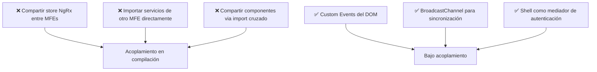
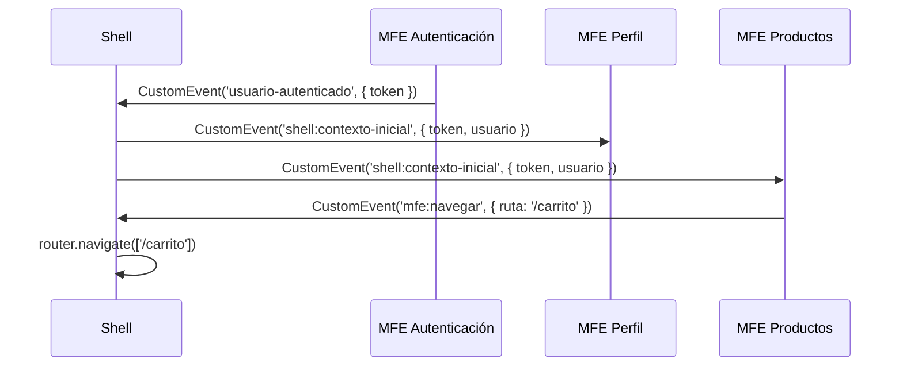

# Capítulo 33 - Parte 4: Comunicación entre micro-frontends: eventos y estado compartido

> **Parte 4 de 4** · Capítulo 33 · PARTE XIV - Arquitectura y Patrones Avanzados

Uno de los desafíos más subestimados de los micro-frontends es la comunicación. Es tentador crear un store global compartido o exportar servicios entre MFEs, pero eso destruye el aislamiento que justifica toda la arquitectura. La clave está en elegir el mecanismo correcto según el tipo de información que necesita cruzar fronteras.

## El principio fundamental: bajo acoplamiento

Cada micro-frontend debe poder desplegarse, testearse y desarrollarse de forma independiente. Si el MFE de `productos` necesita importar un servicio del MFE de `carrito`, hemos creado un acoplamiento en tiempo de compilación que invalida los beneficios de la arquitectura. La comunicación entre MFEs debe ser siempre a través de contratos implícitos, no importaciones directas.

Existen tres mecanismos idiomáticos para la comunicación, cada uno adecuado para un escenario distinto.

## Custom Events del DOM

Los Custom Events son la forma más simple y estándar de comunicación. Cualquier parte de la página puede emitir un evento y cualquier otra parte puede escucharlo, sin que ninguna conozca a la otra:

```typescript
// En el MFE de autenticación - emitir evento al hacer login
export class AuthService {
  emitirUsuarioAutenticado(usuario: Usuario): void {
    const evento = new CustomEvent<Usuario>('usuario-autenticado', {
      detail: usuario,
      bubbles: true,   // sube por el árbol del DOM
      composed: true,  // atraviesa Shadow DOM si aplica
    });
    window.dispatchEvent(evento);
  }
}
```

```typescript
// En el MFE de perfil - escuchar el evento
export class PerfilComponent implements OnInit, OnDestroy {
  private manejador = (e: Event) => {
    const evento = e as CustomEvent<Usuario>;
    this.usuario.set(evento.detail);
  };

  ngOnInit(): void {
    window.addEventListener('usuario-autenticado', this.manejador);
  }

  ngOnDestroy(): void {
    // Siempre limpiar para evitar memory leaks
    window.removeEventListener('usuario-autenticado', this.manejador);
  }

  usuario = signal<Usuario | null>(null);
}
```

Los Custom Events son perfectos para notificaciones unidireccionales: "algo ocurrió". No son adecuados para solicitar datos o estado acumulativo.

## BroadcastChannel API

Cuando necesitas comunicación entre pestañas, iframes o workers del mismo origen, `BroadcastChannel` es la herramienta nativa del browser:

```typescript
// canal-compartido.ts - constante compartida entre MFEs (puede estar en el shell)
export const CANAL_TEMA = new BroadcastChannel('tema-aplicacion');

// En el MFE de configuración - emitir cambio de tema
export class ConfiguracionService {
  cambiarTema(tema: 'claro' | 'oscuro'): void {
    CANAL_TEMA.postMessage({ tipo: 'cambio-tema', valor: tema });
    // Aplicar también localmente
    document.documentElement.classList.toggle('dark', tema === 'oscuro');
  }
}
```

```typescript
// En cualquier otro MFE - recibir el cambio
export class TemaService implements OnDestroy {
  private canal = new BroadcastChannel('tema-aplicacion');

  constructor() {
    this.canal.onmessage = (evento) => {
      if (evento.data.tipo === 'cambio-tema') {
        document.documentElement.classList.toggle('dark', evento.data.valor === 'oscuro');
      }
    };
  }

  ngOnDestroy(): void {
    this.canal.close(); // importante: liberar el canal
  }
}
```

## Shell service: autenticación distribuida

El caso más común de estado compartido en micro-frontends es la autenticación. El patrón recomendado es que el shell sea el único responsable de autenticar y luego distribuir el token a cada MFE:

```typescript
// En el shell - al cargar cada MFE, pasarle el contexto inicial
export class ShellComponent implements OnInit {
  private authService = inject(AuthService);

  ngOnInit(): void {
    // Cuando el router activa un MFE, emitir el contexto de sesión
    const tokenActual = this.authService.obtenerToken();
    if (tokenActual) {
      window.dispatchEvent(
        new CustomEvent('shell:contexto-inicial', {
          detail: { token: tokenActual, usuario: this.authService.usuario() },
        })
      );
    }

    // Escuchar solicitudes de token de MFEs recién cargados
    window.addEventListener('mfe:solicitar-token', () => {
      window.dispatchEvent(
        new CustomEvent('shell:token-disponible', {
          detail: { token: this.authService.obtenerToken() },
        })
      );
    });
  }
}
```

```typescript
// En cada MFE - solicitar el token al iniciar
export class MfeAuthBootstrap implements OnInit {
  ngOnInit(): void {
    window.dispatchEvent(new CustomEvent('mfe:solicitar-token'));
    window.addEventListener('shell:token-disponible', (e: Event) => {
      const { token } = (e as CustomEvent).detail;
      // Usar el token en el HttpClient del MFE
      inject(TokenService).establecer(token);
    }, { once: true }); // escuchar solo una vez
  }
}
```

## Qué NO compartir entre MFEs

El aislamiento tiene valor solo si se respeta. Estas prácticas destruyen la independencia:



- **No compartir el store NgRx**: cada MFE tiene su propio estado. Si necesitan sincronizarse, usen eventos.
- **No importar servicios de otro MFE**: si un tipo o servicio necesita estar en dos MFEs, extráelo a una librería compartida neutral.
- **No compartir rutas de navegación directamente**: el shell es el único dueño del router global. Los MFEs pueden emitir un evento pidiendo navegar a una ruta.

## Diagrama de comunicación completo



## Puntos clave

- La comunicación entre MFEs debe ser siempre mediante contratos implícitos, nunca importaciones directas
- Custom Events del DOM son el mecanismo más simple para notificaciones unidireccionales
- `BroadcastChannel` sincroniza estado entre pestañas, iframes y workers del mismo origen
- El shell es el único responsable de la autenticación; los MFEs solicitan el token, no lo generan
- No compartir stores, servicios ni componentes entre MFEs: extraerlos a librerías neutrales si es necesario

## ¿Qué sigue?

En el Capítulo 34 abordamos la internacionalización: primero con `@angular/localize` para builds multi-idioma, luego con Transloco para cambio de idioma en runtime sin recargar la página.
