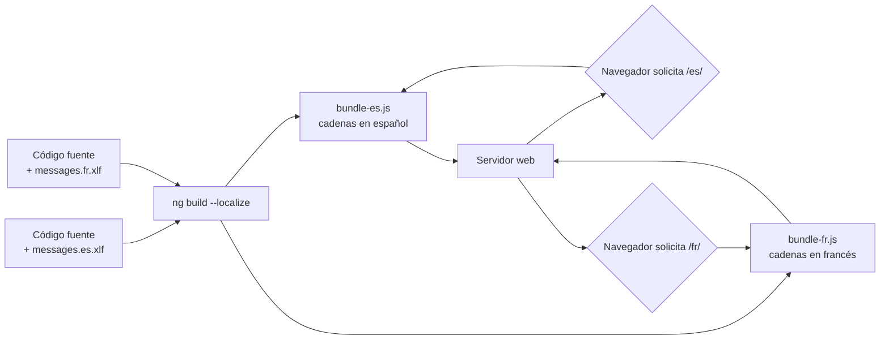

# Capítulo 34 - Parte 1: i18n nativo con @angular/localize

> **Parte 1 de 4** · Capítulo 34 · PARTE XIV - Arquitectura y Patrones Avanzados

La internacionalización -i18n- es uno de esos temas que parece sencillo hasta que el proyecto crece y el equipo empieza a pedir que la app funcione en francés, árabe o japonés. Angular incluye soporte nativo a través de `@angular/localize`, una solución robusta basada en compilación que garantiza que cada idioma produzca un bundle optimizado y completamente independiente. Veamos cómo funciona de punta a punta.

## Instalación y configuración inicial

El primer paso es agregar el paquete al proyecto. Angular CLI lo registra automáticamente:

```bash
ng add @angular/localize
```

Este comando modifica `polyfills.ts` (o `angular.json` en proyectos más recientes) para importar `@angular/localize/init`. También actualiza `tsconfig.app.json` para incluir los tipos necesarios. Tras ejecutarlo, el proyecto ya está listo para marcar texto traducible.

## Marcar texto en templates HTML

El mecanismo central del i18n nativo es el atributo `i18n`. Lo añadimos directamente sobre cualquier elemento del template cuyo contenido textual queramos traducir:

```html
<!-- productos.component.html -->
<h1 i18n>Catálogo de productos</h1>

<p i18n>
  Encuentra aquí todos los artículos disponibles para tu región.
</p>

<button i18n>Agregar al carrito</button>
```

Cuando ejecutamos la extracción, Angular lee estos atributos y genera un archivo XLIFF con cada cadena lista para ser enviada al traductor.

### Contexto e ID estable

El formato completo del atributo `i18n` acepta una descripción y un ID único separados por `@@`:

```html
<!-- La descripción ayuda al traductor a entender el contexto -->
<!-- El ID estable (@@ prefix) evita que el ID cambie si el texto cambia -->

<h2 i18n="Título de la sección de bienvenida@@bienvenida-titulo">
  Bienvenido a nuestra tienda
</h2>

<span i18n="Etiqueta del precio con descuento@@precio-descuento">
  Precio especial
</span>

<p i18n="Mensaje de error cuando no hay stock@@producto-sin-stock">
  Este producto no está disponible en este momento.
</p>
```

Sin el ID `@@`, Angular genera un hash basado en el contenido. Si el texto cambia aunque sea una coma, el ID cambia y se pierden las traducciones existentes. Usar `@@id-estable` es una buena práctica obligatoria en proyectos serios.

### Atributos traducibles

Para traducir atributos HTML (no solo contenido), usamos la variante `i18n-nombreAtributo`:

```html


<input
  type="search"
  i18n-placeholder="Placeholder del buscador@@buscador-placeholder"
  placeholder="Buscar productos..."
/>
```

## `$localize` en TypeScript

Muchas veces necesitamos texto traducible fuera de los templates: en servicios, en mensajes de error o en notificaciones. Para eso usamos la función etiquetada `$localize`:

```typescript
// notificaciones.service.ts
import { Injectable } from '@angular/core';

@Injectable({ providedIn: 'root' })
export class NotificacionesService {
  obtenerMensajeBienvenida(nombreUsuario: string): string {
    return $localize`Bienvenido, ${nombreUsuario}:nombreUsuario:.
      Tu sesión está activa.`;
  }

  obtenerErrorGenerico(): string {
    // Con ID estable usando :@@id: después del texto
    return $localize`:Mensaje de error genérico@@error-generico:
      Ocurrió un error inesperado. Intenta nuevamente.`;
  }
}
```

La sintaxis de interpolación usa `${variable}:nombrePlaceholder:` para que el archivo XLIFF incluya el nombre del placeholder, lo que ayuda enormemente a los traductores a entender qué va en ese lugar.

## Extracción de mensajes

Una vez marcadas todas las cadenas, extraemos el archivo de mensajes base:

```bash
ng extract-i18n --output-path src/locale
```

Esto genera `src/locale/messages.xlf` con formato XLIFF 1.2 por defecto. También podemos usar XLIFF 2 o XMB:

```bash
ng extract-i18n --format=xlf2 --output-path src/locale
```

El archivo resultante se ve así:

```xml
<!-- src/locale/messages.xlf -->
<trans-unit id="bienvenida-titulo" datatype="html">
  <source>Bienvenido a nuestra tienda</source>
  <context-group purpose="location">
    <context context-type="sourcefile">
      src/app/inicio/inicio.component.html
    </context>
    <context context-type="linenumber">5</context>
  </context-group>
  <note priority="1" from="description">
    Título de la sección de bienvenida
  </note>
</trans-unit>
```

## Crear y editar archivos de traducción

Copiamos `messages.xlf` por cada idioma objetivo y añadimos el elemento `<target>`:

```xml
<!-- src/locale/messages.es.xlf -->
<trans-unit id="bienvenida-titulo" datatype="html">
  <source>Bienvenido a nuestra tienda</source>
  <target state="translated">
    Bienvenido a nuestra tienda
  </target>
</trans-unit>

<!-- src/locale/messages.fr.xlf -->
<trans-unit id="bienvenida-titulo" datatype="html">
  <source>Bienvenido a nuestra tienda</source>
  <target state="translated">
    Bienvenue dans notre boutique
  </target>
</trans-unit>
```

En proyectos grandes es común usar herramientas especializadas como Phrase, Lokalise o Transifex que leen y escriben XLIFF directamente.

## Configurar `angular.json` para múltiples locales

Registramos cada locale en la configuración del proyecto:

```json
// angular.json (fragmento relevante)
{
  "projects": {
    "mi-app": {
      "i18n": {
        "sourceLocale": "en-US",
        "locales": {
          "es": {
            "translation": "src/locale/messages.es.xlf",
            "baseHref": "/es/"
          },
          "fr": {
            "translation": "src/locale/messages.fr.xlf",
            "baseHref": "/fr/"
          }
        }
      },
      "architect": {
        "build": {
          "configurations": {
            "production": {
              "localize": true
            }
          }
        }
      }
    }
  }
}
```

## Construir todos los locales

Con la configuración lista, un solo comando genera un build optimizado por idioma:

```bash
ng build --configuration=production
```

La salida queda en carpetas separadas:

```
dist/mi-app/
  browser/
    en-US/   ← build en inglés
    es/      ← build en español
    fr/      ← build en francés
```

Cada carpeta contiene un bundle completamente independiente con las cadenas ya incrustadas. No hay ningún overhead en runtime: las traducciones viven en el código JavaScript compilado.

## Servir por subdominio o subfolder

La estrategia más común es usar el `baseHref` configurado y servir desde un servidor web o CDN:

```nginx
# nginx.conf - subfolder por idioma
server {
  listen 80;

  location /es/ {
    root /var/www/mi-app/browser;
    try_files $uri $uri/ /es/index.html;
  }

  location /fr/ {
    root /var/www/mi-app/browser;
    try_files $uri $uri/ /fr/index.html;
  }

  # Redirigir raíz según Accept-Language
  location = / {
    return 302 /es/;
  }
}
```

Para subdominios (`es.miapp.com`, `fr.miapp.com`), el deploy de cada carpeta va al subdominio correspondiente. Es una decisión de infraestructura, no de Angular.

## La limitación principal: rebuild por idioma

El enfoque nativo de Angular es compile-time: las traducciones se "hornean" en el bundle. Esto significa que para cambiar el idioma o agregar uno nuevo, **se necesita un nuevo build completo**. No existe un selector de idioma en runtime que cambie las cadenas sin recargar la página y servir el bundle correcto.



Esta arquitectura tiene ventajas claras: cero overhead en runtime, bundles perfectamente optimizados, y soporte completo de SSR por locale. Pero si el proyecto necesita cambio de idioma sin recarga de página, la solución es Transloco (lo vemos en la siguiente parte).

## Puntos clave

- `ng add @angular/localize` prepara el proyecto y modifica `tsconfig.app.json` automáticamente.
- Usar `i18n="descripción@@id-estable"` en cada cadena evita perder traducciones cuando el texto fuente cambia.
- `$localize` permite marcar cadenas en TypeScript con la misma semántica que los templates.
- `ng extract-i18n` genera el archivo XLIFF base; copiamos y traducimos por cada idioma.
- `ng build --configuration=production` con `"localize": true` genera un bundle independiente por idioma: máximo rendimiento, cero runtime overhead.

## ¿Qué sigue?

En la siguiente parte conoceremos Transloco, la biblioteca que resuelve el caso de uso que el i18n nativo no cubre: cambio de idioma en runtime sin rebuilds ni recargas de página.
