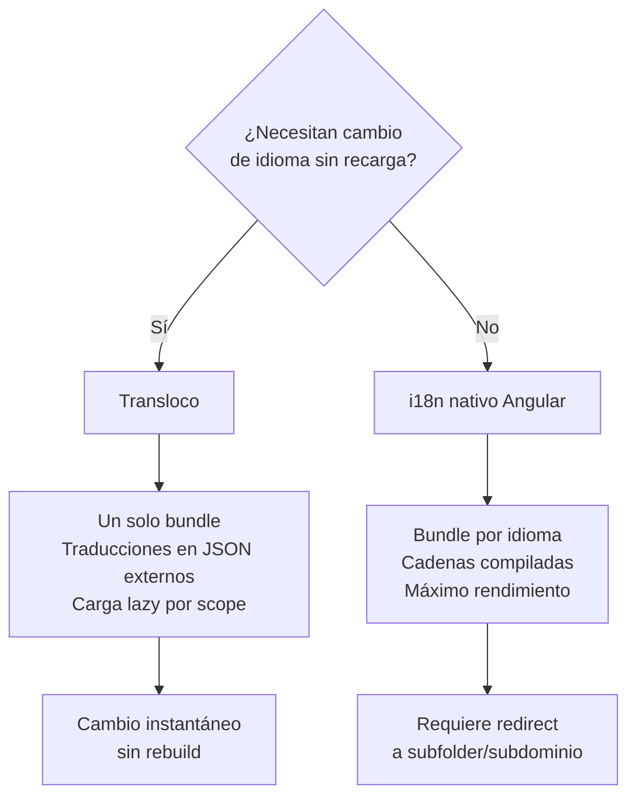

# Capítulo 34 - Parte 2: Transloco: la alternativa moderna para i18n en runtime

> **Parte 2 de 4** · Capítulo 34 · PARTE XIV - Arquitectura y Patrones Avanzados

El i18n nativo de Angular es excelente cuando la arquitectura permite un bundle por idioma servido desde rutas separadas. Pero muchos proyectos necesitan algo diferente: un selector de idioma en la misma página, sin recargas, sin redirecciones. Para eso existe Transloco, la biblioteca de internacionalización más madura del ecosistema Angular, con soporte de primera clase para signals, standalone components y lazy loading de traducciones.

## Instalación

```bash
npm install @jsverse/transloco
```

A diferencia de otras bibliotecas, Transloco no tiene un schematic obligatorio. La configuración es explícita y completamente tipada.

## Crear el loader HTTP

Transloco carga las traducciones de forma lazy desde archivos JSON. El loader es una clase que implementa `TranslocoLoader`:

```typescript
// transloco-loader.ts
import { inject, Injectable } from '@angular/core';
import { HttpClient } from '@angular/common/http';
import { Translation, TranslocoLoader } from '@jsverse/transloco';
import { Observable } from 'rxjs';

@Injectable({ providedIn: 'root' })
export class TranslocoHttpLoader implements TranslocoLoader {
  private readonly http = inject(HttpClient);

  getTranslation(lang: string): Observable<Translation> {
    return this.http.get<Translation>(`/assets/i18n/${lang}.json`);
  }
}
```

## Configuración en `app.config.ts`

Registramos Transloco con `provideTransloco` en la configuración raíz de la aplicación:

```typescript
// app.config.ts
import { ApplicationConfig } from '@angular/core';
import { provideRouter } from '@angular/router';
import { provideHttpClient } from '@angular/common/http';
import { provideTransloco } from '@jsverse/transloco';
import { TranslocoHttpLoader } from './transloco-loader';

export const appConfig: ApplicationConfig = {
  providers: [
    provideRouter([/* rutas */]),
    provideHttpClient(),
    provideTransloco({
      config: {
        availableLangs: ['es', 'en', 'pt'],
        defaultLang: 'es',
        reRenderOnLangChange: true,
        prodMode: true,
        missingHandler: {
          logMissingKey: true,
          useFallbackTranslation: true,
        },
      },
      loader: TranslocoHttpLoader,
    }),
  ],
};
```

`reRenderOnLangChange: true` es la clave de la magia: cuando el idioma cambia, todos los componentes que usan Transloco se re-renderizan automáticamente con las nuevas traducciones, sin recargar la página.

## Archivos JSON de traducción

Creamos un archivo por idioma en `src/assets/i18n/`:

```json
// src/assets/i18n/es.json
{
  "inicio": {
    "titulo": "Catálogo de productos",
    "subtitulo": "Encuentra lo que necesitas",
    "bienvenida": "Bienvenido, {{ nombre }}"
  },
  "productos": {
    "agregar": "Agregar al carrito",
    "sinStock": "Sin disponibilidad",
    "precio": "Precio: {{ monto }}",
    "contador": {
      "uno": "{{ count }} artículo",
      "otros": "{{ count }} artículos"
    }
  },
  "errores": {
    "generico": "Ocurrió un error inesperado",
    "conexion": "Sin conexión a internet"
  }
}
```

```json
// src/assets/i18n/en.json
{
  "inicio": {
    "titulo": "Product Catalog",
    "subtitulo": "Find what you need",
    "bienvenida": "Welcome, {{ nombre }}"
  },
  "productos": {
    "agregar": "Add to cart",
    "sinStock": "Out of stock",
    "precio": "Price: {{ monto }}",
    "contador": {
      "uno": "{{ count }} item",
      "otros": "{{ count }} items"
    }
  },
  "errores": {
    "generico": "An unexpected error occurred",
    "conexion": "No internet connection"
  }
}
```

## El pipe `transloco` en templates

Para la mayoría de los casos, el pipe es la forma más directa y reactiva de usar Transloco:

```typescript
// inicio.component.ts
import { Component } from '@angular/core';
import { TranslocoModule } from '@jsverse/transloco';

@Component({
  selector: 'app-inicio',
  standalone: true,
  imports: [TranslocoModule],
  template: `
    <main>
      <h1>{{ 'inicio.titulo' | transloco }}</h1>
      <p>{{ 'inicio.subtitulo' | transloco }}</p>

      <!-- Con parámetros de interpolación -->
      <p>{{ 'inicio.bienvenida' | transloco: { nombre: nombreUsuario } }}</p>

      <!-- Usando la directiva structural para acceso tipado -->
      <ng-container *transloco="let t">
        <h2>{{ t('productos.agregar') }}</h2>
        <span>{{ t('productos.precio', { monto: '$ 1.500' }) }}</span>
      </ng-container>
    </main>
  `,
})
export class InicioComponent {
  readonly nombreUsuario = 'Ana';
}
```

La directiva `*transloco="let t"` es especialmente útil cuando necesitamos acceder a múltiples claves en una sección del template, porque evita repetir el pipe y centraliza el scope de traducción.

## `TranslocoService` en TypeScript

Para usar traducciones en servicios, guards o lógica de componentes, inyectamos `TranslocoService`:

```typescript
// notificaciones.service.ts
import { inject, Injectable } from '@angular/core';
import { TranslocoService } from '@jsverse/transloco';

@Injectable({ providedIn: 'root' })
export class NotificacionesService {
  private readonly transloco = inject(TranslocoService);

  obtenerMensajeError(tipo: 'generico' | 'conexion'): string {
    return this.transloco.translate(`errores.${tipo}`);
  }

  obtenerContador(cantidad: number): string {
    const clave = cantidad === 1
      ? 'productos.contador.uno'
      : 'productos.contador.otros';
    return this.transloco.translate(clave, { count: cantidad });
  }
}
```

## Cambio de idioma en runtime

Esta es la diferencia fundamental con el i18n nativo. Un simple selector de idioma funciona así:

```typescript
// selector-idioma.component.ts
import { Component, inject } from '@angular/core';
import { TranslocoService, TranslocoModule } from '@jsverse/transloco';

interface Idioma {
  codigo: string;
  etiqueta: string;
  bandera: string;
}

@Component({
  selector: 'app-selector-idioma',
  standalone: true,
  imports: [TranslocoModule],
  template: `
    <nav aria-label="Selección de idioma">
      @for (idioma of idiomas; track idioma.codigo) {
        <button
          [class.activo]="idioma.codigo === idiomaActual"
          (click)="cambiarIdioma(idioma.codigo)"
          [attr.aria-current]="idioma.codigo === idiomaActual ? 'true' : null"
        >
          <span aria-hidden="true">{{ idioma.bandera }}</span>
          {{ idioma.etiqueta }}
        </button>
      }
    </nav>
  `,
})
export class SelectorIdiomaComponent {
  private readonly transloco = inject(TranslocoService);

  readonly idiomas: Idioma[] = [
    { codigo: 'es', etiqueta: 'Español', bandera: '🇪🇸' },
    { codigo: 'en', etiqueta: 'English', bandera: '🇺🇸' },
    { codigo: 'pt', etiqueta: 'Português', bandera: '🇧🇷' },
  ];

  get idiomaActual(): string {
    return this.transloco.getActiveLang();
  }

  cambiarIdioma(codigo: string): void {
    this.transloco.setActiveLang(codigo);
    // Persiste la preferencia del usuario
    localStorage.setItem('idioma-preferido', codigo);
  }
}
```

`setActiveLang` dispara la carga lazy del archivo JSON correspondiente (si no estaba cargado), y al completarse, todos los componentes con `reRenderOnLangChange: true` se actualizan automáticamente.

## Lazy loading de traducciones por ruta

En aplicaciones grandes, no queremos cargar todas las traducciones de todos los módulos al inicio. Transloco permite cargar solo las traducciones que necesita cada sección:

```typescript
// productos/productos.routes.ts
import { Routes } from '@angular/router';
import { provideTranslocoScope } from '@jsverse/transloco';

export const productosRoutes: Routes = [
  {
    path: '',
    providers: [
      provideTranslocoScope({
        scope: 'productos',
        alias: 'p',
      }),
    ],
    loadComponent: () =>
      import('./lista-productos.component').then(
        (m) => m.ListaProductosComponent
      ),
  },
];
```

Los archivos de traducción con scope viven en subcarpetas:

```
assets/i18n/
  es.json              ← traducciones globales
  en.json
  productos/
    es.json            ← traducciones del módulo productos
    en.json
```

En el componente, accedemos al scope con el prefijo o alias:

```typescript
// lista-productos.component.ts
import { Component } from '@angular/core';
import { TranslocoModule } from '@jsverse/transloco';

@Component({
  selector: 'app-lista-productos',
  standalone: true,
  imports: [TranslocoModule],
  template: `
    <ng-container *transloco="let t; scope: 'productos'; read: 'productos'">
      <h1>{{ t('titulo') }}</h1>
      <p>{{ t('descripcion') }}</p>
    </ng-container>
  `,
})
export class ListaProductosComponent {}
```

## Comparación con i18n nativo



La elección depende de los requisitos del proyecto. Transloco es la opción correcta cuando el usuario debe poder cambiar el idioma en sesión, cuando las traducciones cambian con frecuencia (sin querer rebuilds), o cuando se trabaja con un CMS que gestiona los JSON de traducciones en tiempo real.

## Puntos clave

- `provideTransloco` con `reRenderOnLangChange: true` habilita el cambio de idioma en runtime sin recargar la página.
- Los archivos JSON en `assets/i18n/` son la fuente de verdad; el `TranslocoHttpLoader` los carga bajo demanda.
- El pipe `| transloco` y la directiva `*transloco="let t"` son las dos formas de acceder a traducciones en templates.
- `inject(TranslocoService).setActiveLang('en')` cambia el idioma globalmente y dispara re-render automático.
- `provideTranslocoScope` permite lazy loading de traducciones por feature, reduciendo el payload inicial de la app.

## ¿Qué sigue?

Con i18n resuelto, pasamos a otro pilar de las aplicaciones profesionales: la accesibilidad, donde veremos cómo construir interfaces que funcionen para todos los usuarios, independientemente de sus capacidades.
