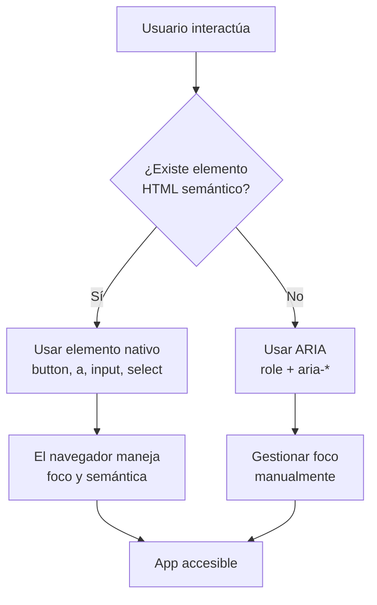

# Capítulo 34 - Parte 3: Accesibilidad (a11y): semántica, roles ARIA y Angular

> **Parte 3 de 4** · Capítulo 34 · PARTE XIV - Arquitectura y Patrones Avanzados

La accesibilidad es uno de esos temas que suele quedar para "después" en los proyectos y que rara vez llega ese después. Pero construir interfaces accesibles no es un lujo ni un extra: es una obligación ética, legal y, sorprendentemente, también técnica. Una app accesible es una app mejor para todos. Veamos por qué importa y cómo implementarla correctamente en Angular.

## Por qué la accesibilidad importa

El argumento más inmediato es el humano: aproximadamente el 15% de la población mundial vive con alguna discapacidad, según la Organización Mundial de la Salud. Eso incluye personas con discapacidad visual que usan lectores de pantalla como NVDA o VoiceOver, personas con movilidad reducida que navegan solo con teclado, personas con discapacidad auditiva para quienes el contenido de video sin subtítulos es inaccesible, y personas con dislexia o problemas cognitivos que se benefician de interfaces claras y bien estructuradas.

El argumento legal también pesa. La Ley de Americanos con Discapacidades (ADA) en Estados Unidos, la EN 301 549 en Europa, y regulaciones equivalentes en América Latina aplican a servicios digitales. Empresas como Domino's, Netflix y Target han enfrentado demandas millonarias por webs inaccesibles. El estándar de referencia internacional es WCAG 2.1 nivel AA.

El argumento técnico: una app semántica y accesible tiene mejor SEO (los motores de búsqueda leen el DOM de forma similar a un lector de pantalla), mejor rendimiento percibido, y código más mantenible.

## HTML semántico: la base de todo

Antes de pensar en ARIA, hay que pensar en HTML semántico. La regla de oro es: **usar el elemento HTML correcto para cada propósito**. Angular renderiza HTML, así que las mismas reglas aplican.

```typescript
// layout.component.ts
import { Component } from '@angular/core';
import { RouterOutlet, RouterLink, RouterLinkActive } from '@angular/router';

@Component({
  selector: 'app-layout',
  standalone: true,
  imports: [RouterOutlet, RouterLink, RouterLinkActive],
  template: `
    <header>
      <a routerLink="/" aria-label="Ir a la página de inicio">
        
      </a>
      <nav aria-label="Navegación principal">
        <ul>
          <li>
            <a routerLink="/productos" routerLinkActive="activo"
               [routerLinkActiveOptions]="{ exact: false }">
              Productos
            </a>
          </li>
          <li>
            <a routerLink="/contacto" routerLinkActive="activo">
              Contacto
            </a>
          </li>
        </ul>
      </nav>
    </header>

    <main id="contenido-principal" tabindex="-1">
      <router-outlet />
    </main>

    <footer>
      <p>© 2024 Mi empresa</p>
    </footer>
  `,
})
export class LayoutComponent {}
```

Puntos importantes del ejemplo:
- `<header>`, `<nav>`, `<main>`, `<footer>` son landmarks que los lectores de pantalla anuncian automáticamente.
- El `<main>` tiene `id` y `tabindex="-1"` para recibir foco programático (lo usaremos al navegar entre rutas).
- Los `<a>` se usan para navegación y los `<button>` para acciones (nunca `<div>` con `onclick`).
- `routerLinkActive="activo"` añade una clase CSS que podemos usar para indicar la página actual.

## Roles ARIA: cuando el HTML semántico no alcanza

ARIA (Accessible Rich Internet Applications) es un conjunto de atributos que añaden semántica a elementos que el HTML nativo no puede expresar por sí solo. La regla de ARIA es: **usarlo solo cuando el HTML semántico no es suficiente**.

```typescript
// alerta.component.ts
import { Component, Input } from '@angular/core';
import { CommonModule } from '@angular/common';

type TipoAlerta = 'info' | 'exito' | 'advertencia' | 'error';

@Component({
  selector: 'app-alerta',
  standalone: true,
  imports: [CommonModule],
  template: `
    <!-- role="alert" hace que el lector de pantalla anuncie el contenido
         automáticamente cuando aparece en el DOM -->
    <div
      [class]="'alerta alerta--' + tipo"
      role="alert"
      aria-live="assertive"
    >
      <span class="alerta__icono" aria-hidden="true">
        {{ iconoPorTipo[tipo] }}
      </span>
      <p class="alerta__mensaje">{{ mensaje }}</p>
    </div>
  `,
})
export class AlertaComponent {
  @Input({ required: true }) mensaje!: string;
  @Input() tipo: TipoAlerta = 'info';

  readonly iconoPorTipo: Record<TipoAlerta, string> = {
    info: 'ℹ',
    exito: '✓',
    advertencia: '⚠',
    error: '✕',
  };
}
```

### `aria-live` para anuncios dinámicos

`aria-live` le dice al lector de pantalla que un área del DOM puede cambiar y que debe anunciar esos cambios:

```typescript
// estado-carga.component.ts
import { Component, Input } from '@angular/core';

@Component({
  selector: 'app-estado-carga',
  standalone: true,
  template: `
    <!-- aria-live="polite" espera a que el usuario termine de leer
         antes de anunciar. Usar "assertive" solo para errores críticos -->
    <div aria-live="polite" aria-atomic="true" class="sr-only">
      @if (cargando) {
        Cargando contenido, por favor espere...
      } @else if (mensaje) {
        {{ mensaje }}
      }
    </div>

    @if (cargando) {
      <div class="spinner" aria-hidden="true"></div>
    }
  `,
})
export class EstadoCargaComponent {
  @Input() cargando = false;
  @Input() mensaje = '';
}
```

La clase `.sr-only` (screen reader only) usa CSS para ocultar el elemento visualmente pero mantenerlo accesible para lectores de pantalla:

```css
.sr-only {
  position: absolute;
  width: 1px;
  height: 1px;
  padding: 0;
  margin: -1px;
  overflow: hidden;
  clip: rect(0, 0, 0, 0);
  white-space: nowrap;
  border: 0;
}
```

## `aria-label`, `aria-labelledby` y `aria-describedby`

Estos tres atributos sirven para nombrar elementos. Saber cuándo usar cada uno es fundamental:

```typescript
// formulario-busqueda.component.ts
import { Component } from '@angular/core';
import { ReactiveFormsModule, FormControl } from '@angular/forms';

@Component({
  selector: 'app-formulario-busqueda',
  standalone: true,
  imports: [ReactiveFormsModule],
  template: `
    <form role="search" (ngSubmit)="buscar()">

      <!-- aria-label: nombre directo cuando no hay label visible -->
      <button
        type="button"
        aria-label="Abrir filtros de búsqueda"
        (click)="abrirFiltros()"
      >
        <span aria-hidden="true">⚙</span>
      </button>

      <!-- aria-labelledby: referencia a un elemento existente como label -->
      <section aria-labelledby="titulo-resultados">
        <h2 id="titulo-resultados">Resultados de búsqueda</h2>
        <!-- El lector anuncia esta sección como "Resultados de búsqueda" -->
      </section>

      <!-- aria-describedby: información adicional, no el nombre principal -->
      <div>
        <label for="campo-busqueda">Buscar productos</label>
        <input
          id="campo-busqueda"
          type="search"
          [formControl]="terminoBusqueda"
          aria-describedby="ayuda-busqueda"
          [attr.aria-invalid]="terminoBusqueda.invalid && terminoBusqueda.touched"
        />
        <span id="ayuda-busqueda" class="texto-ayuda">
          Escribe al menos 3 caracteres. Ejemplo: "zapatilla deportiva"
        </span>
      </div>
    </form>
  `,
})
export class FormularioBusquedaComponent {
  readonly terminoBusqueda = new FormControl('');

  buscar(): void { /* implementación */ }
  abrirFiltros(): void { /* implementación */ }
}
```

## Gestión del foco en SPAs

Las Single Page Applications tienen un problema especial: cuando el usuario navega entre rutas, el contenido cambia pero el foco del teclado no se mueve. Para un usuario que navega con teclado o lector de pantalla, la página "no cambió". La solución es mover el foco al contenido principal después de cada navegación:

```typescript
// foco.service.ts
import { inject, Injectable } from '@angular/core';
import { Router, NavigationEnd } from '@angular/router';
import { filter } from 'rxjs/operators';

@Injectable({ providedIn: 'root' })
export class FocoService {
  private readonly router = inject(Router);

  inicializar(): void {
    this.router.events
      .pipe(filter((evento) => evento instanceof NavigationEnd))
      .subscribe(() => {
        // Pequeño timeout para que el componente nuevo se renderice
        setTimeout(() => this.moverFocoAlContenidoPrincipal(), 100);
      });
  }

  private moverFocoAlContenidoPrincipal(): void {
    const contenidoPrincipal = document.getElementById('contenido-principal');
    if (contenidoPrincipal) {
      contenidoPrincipal.focus();
      // Anunciar el nuevo título de página al lector de pantalla
      document.title = this.obtenerTituloPagina();
    }
  }

  private obtenerTituloPagina(): string {
    const titulo = document.querySelector('h1')?.textContent ?? 'Página sin título';
    return `${titulo} - Mi aplicación`;
  }
}
```

```typescript
// app.component.ts
import { Component, inject, OnInit } from '@angular/core';
import { RouterOutlet } from '@angular/router';
import { FocoService } from './foco.service';

@Component({
  selector: 'app-root',
  standalone: true,
  imports: [RouterOutlet],
  template: `<router-outlet />`,
})
export class AppComponent implements OnInit {
  private readonly focoService = inject(FocoService);

  ngOnInit(): void {
    this.focoService.inicializar();
  }
}
```

## `aria-expanded` para elementos que muestran/ocultan contenido

```typescript
// menu-desplegable.component.ts
import { Component, signal } from '@angular/core';

@Component({
  selector: 'app-menu-desplegable',
  standalone: true,
  template: `
    <div class="menu-contenedor">
      <button
        [attr.aria-expanded]="abierto()"
        aria-controls="menu-lista"
        (click)="alternar()"
      >
        Opciones
        <span aria-hidden="true">{{ abierto() ? '▲' : '▼' }}</span>
      </button>

      <ul
        id="menu-lista"
        [attr.aria-hidden]="!abierto()"
        [class.visible]="abierto()"
        role="menu"
      >
        <li role="menuitem">
          <button (click)="seleccionar('perfil')">Mi perfil</button>
        </li>
        <li role="menuitem">
          <button (click)="seleccionar('configuracion')">Configuración</button>
        </li>
        <li role="menuitem">
          <button (click)="seleccionar('salir')">Cerrar sesión</button>
        </li>
      </ul>
    </div>
  `,
})
export class MenuDesplegableComponent {
  readonly abierto = signal(false);

  alternar(): void {
    this.abierto.update((valor) => !valor);
  }

  seleccionar(opcion: string): void {
    console.log('Opción seleccionada:', opcion);
    this.abierto.set(false);
  }
}
```



## Puntos clave

- El 15% de la población tiene alguna discapacidad; la accesibilidad es obligación legal en muchos países y mejora el SEO.
- HTML semántico (`<button>`, `<nav>`, `<main>`, `<header>`) es la primera línea de defensa; ARIA complementa cuando el HTML no alcanza.
- `aria-live="polite"` anuncia cambios dinámicos sin interrumpir al usuario; `"assertive"` solo para errores críticos.
- `aria-label` nombra elementos sin texto visible; `aria-labelledby` referencia un elemento existente; `aria-describedby` agrega descripción adicional.
- En SPAs, mover el foco al `<main>` después de cada navegación es obligatorio para usuarios de teclado y lectores de pantalla.

## ¿Qué sigue?

En la siguiente parte profundizamos en patrones ARIA avanzados (diálogos, comboboxes, tabs) y en cómo automatizar la auditoría de accesibilidad con `axe-core` integrado en los tests.
