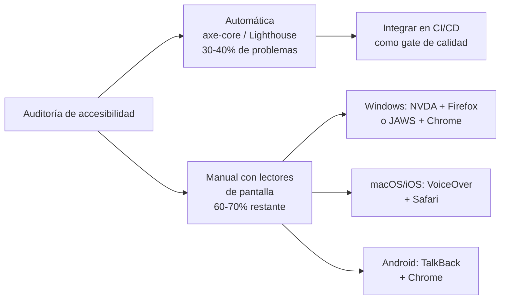

# Capítulo 34 - Parte 4: Patrones ARIA avanzados y auditoría de accesibilidad

> **Parte 4 de 4** · Capítulo 34 · PARTE XIV - Arquitectura y Patrones Avanzados

En la parte anterior establecimos la base: HTML semántico, roles ARIA fundamentales y gestión de foco en navegaciones. Ahora profundizamos en los patrones más complejos que todo equipo enfrenta tarde o temprano: diálogos modales, comboboxes con autocompletado y sistemas de tabs. Además, aprenderemos a automatizar la detección de regresiones de accesibilidad con `axe-core` en nuestros tests.

## Dialog accesible

El diálogo modal es el componente donde más errores de accesibilidad se cometen. Un modal mal implementado "atrapa" el foco en el contenido de atrás, no anuncia su aparición y no restaura el foco al cerrarse. El CDK de Angular nos da `FocusTrap` para resolver la parte del foco:

```typescript
// dialog.component.ts
import {
  Component, Input, Output, EventEmitter, ElementRef,
  ViewChild, OnChanges, SimpleChanges, inject, AfterViewInit,
} from '@angular/core';
import { A11yModule, FocusTrap, FocusTrapFactory } from '@angular/cdk/a11y';

@Component({
  selector: 'app-dialog',
  standalone: true,
  imports: [A11yModule],
  template: `
    @if (abierto) {
      <!-- Overlay que bloquea el contenido de atrás -->
      <div
        class="dialog-overlay"
        (click)="cerrarAlHacerClickEnOverlay($event)"
        aria-hidden="true"
      ></div>

      <div
        #dialogRef
        role="dialog"
        aria-modal="true"
        [attr.aria-labelledby]="'dialog-titulo-' + id"
        [attr.aria-describedby]="'dialog-desc-' + id"
        class="dialog"
        (keydown.escape)="cerrar()"
      >
        <h2 [id]="'dialog-titulo-' + id">{{ titulo }}</h2>
        <div [id]="'dialog-desc-' + id" class="dialog__contenido">
          <ng-content />
        </div>
        <div class="dialog__acciones">
          <button (click)="cerrar()" class="btn btn--secundario">
            Cancelar
          </button>
          <button (click)="confirmar()" class="btn btn--primario">
            Confirmar
          </button>
        </div>
      </div>
    }
  `,
})
export class DialogComponent implements OnChanges, AfterViewInit {
  @Input({ required: true }) titulo!: string;
  @Input({ required: true }) id!: string;
  @Input() abierto = false;
  @Output() readonly cerrado = new EventEmitter<void>();
  @Output() readonly confirmado = new EventEmitter<void>();

  @ViewChild('dialogRef') private readonly dialogRef!: ElementRef<HTMLDivElement>;

  private readonly focusTrapFactory = inject(FocusTrapFactory);
  private focusTrap: FocusTrap | null = null;
  private elementoOrigen: HTMLElement | null = null;

  ngAfterViewInit(): void {
    // Se ejecuta después de cada cambio de vista
  }

  ngOnChanges(cambios: SimpleChanges): void {
    if (cambios['abierto']) {
      if (this.abierto) {
        this.elementoOrigen = document.activeElement as HTMLElement;
        // El timeout permite que el DOM se renderice antes de activar el trap
        setTimeout(() => this.activarTrap(), 0);
      } else {
        this.desactivarTrap();
        this.elementoOrigen?.focus();
      }
    }
  }

  private activarTrap(): void {
    if (this.dialogRef?.nativeElement) {
      this.focusTrap = this.focusTrapFactory.create(this.dialogRef.nativeElement);
      this.focusTrap.focusInitialElementWhenReady();
    }
  }

  private desactivarTrap(): void {
    this.focusTrap?.destroy();
    this.focusTrap = null;
  }

  cerrar(): void {
    this.cerrado.emit();
  }

  confirmar(): void {
    this.confirmado.emit();
  }

  cerrarAlHacerClickEnOverlay(evento: MouseEvent): void {
    if (evento.target === evento.currentTarget) {
      this.cerrar();
    }
  }
}
```

Los tres pilares del dialog accesible son: `role="dialog"` + `aria-modal="true"` + `aria-labelledby` apuntando al título, FocusTrap que mantiene el foco dentro del modal mientras está abierto, y restaurar el foco al elemento origen cuando se cierra.

## Combobox accesible con autocompletado

```typescript
// combobox.component.ts
import {
  Component, Input, Output, EventEmitter,
  signal, computed, HostListener,
} from '@angular/core';

interface Opcion {
  valor: string;
  etiqueta: string;
}

@Component({
  selector: 'app-combobox',
  standalone: true,
  template: `
    <div class="combobox-contenedor">
      <label [for]="id">{{ etiqueta }}</label>

      <div class="combobox-wrapper">
        <input
          [id]="id"
          type="text"
          role="combobox"
          [attr.aria-expanded]="abierto()"
          aria-autocomplete="list"
          [attr.aria-controls]="id + '-listbox'"
          [attr.aria-activedescendant]="opcionActivaId()"
          [value]="textoBusqueda()"
          (input)="alEscribir($event)"
          (keydown)="manejarTeclado($event)"
          autocomplete="off"
        />

        <ul
          [id]="id + '-listbox'"
          role="listbox"
          [attr.aria-label]="'Opciones para ' + etiqueta"
          [class.visible]="abierto()"
        >
          @for (opcion of opcionesFiltradas(); track opcion.valor; let i = $index) {
            <li
              [id]="id + '-opcion-' + i"
              role="option"
              [attr.aria-selected]="indiceActivo() === i"
              [class.activo]="indiceActivo() === i"
              (click)="seleccionar(opcion)"
              (mouseenter)="indiceActivo.set(i)"
            >
              {{ opcion.etiqueta }}
            </li>
          }
          @if (opcionesFiltradas().length === 0) {
            <li role="option" aria-disabled="true">
              Sin resultados para "{{ textoBusqueda() }}"
            </li>
          }
        </ul>
      </div>
    </div>
  `,
})
export class ComboboxComponent {
  @Input({ required: true }) id!: string;
  @Input({ required: true }) etiqueta!: string;
  @Input() opciones: Opcion[] = [];
  @Output() readonly seleccionado = new EventEmitter<Opcion>();

  readonly textoBusqueda = signal('');
  readonly abierto = signal(false);
  readonly indiceActivo = signal(-1);

  readonly opcionesFiltradas = computed(() =>
    this.opciones.filter((o) =>
      o.etiqueta.toLowerCase().includes(this.textoBusqueda().toLowerCase())
    )
  );

  readonly opcionActivaId = computed(() => {
    const indice = this.indiceActivo();
    return indice >= 0 ? `${this.id}-opcion-${indice}` : null;
  });

  alEscribir(evento: Event): void {
    const texto = (evento.target as HTMLInputElement).value;
    this.textoBusqueda.set(texto);
    this.abierto.set(true);
    this.indiceActivo.set(-1);
  }

  manejarTeclado(evento: KeyboardEvent): void {
    const total = this.opcionesFiltradas().length;
    switch (evento.key) {
      case 'ArrowDown':
        evento.preventDefault();
        this.abierto.set(true);
        this.indiceActivo.update((i) => Math.min(i + 1, total - 1));
        break;
      case 'ArrowUp':
        evento.preventDefault();
        this.indiceActivo.update((i) => Math.max(i - 1, -1));
        break;
      case 'Enter':
        if (this.indiceActivo() >= 0) {
          this.seleccionar(this.opcionesFiltradas()[this.indiceActivo()]);
        }
        break;
      case 'Escape':
        this.abierto.set(false);
        break;
    }
  }

  seleccionar(opcion: Opcion): void {
    this.textoBusqueda.set(opcion.etiqueta);
    this.abierto.set(false);
    this.seleccionado.emit(opcion);
  }

  @HostListener('document:click')
  cerrarAlHacerClickFuera(): void {
    this.abierto.set(false);
  }
}
```

## Tabs accesibles con navegación por teclado

```typescript
// tabs.component.ts
import { Component, Input, signal } from '@angular/core';

interface Tab {
  id: string;
  etiqueta: string;
  contenido: string;
}

@Component({
  selector: 'app-tabs',
  standalone: true,
  template: `
    <div class="tabs">
      <div role="tablist" [attr.aria-label]="etiquetaGrupo">
        @for (tab of tabs; track tab.id; let i = $index) {
          <button
            [id]="'tab-' + tab.id"
            role="tab"
            [attr.aria-selected]="tabActivoIndice() === i"
            [attr.aria-controls]="'panel-' + tab.id"
            [tabindex]="tabActivoIndice() === i ? 0 : -1"
            (click)="activarTab(i)"
            (keydown)="manejarTecladoTab($event, i)"
          >
            {{ tab.etiqueta }}
          </button>
        }
      </div>

      @for (tab of tabs; track tab.id; let i = $index) {
        <div
          [id]="'panel-' + tab.id"
          role="tabpanel"
          [attr.aria-labelledby]="'tab-' + tab.id"
          [hidden]="tabActivoIndice() !== i"
          tabindex="0"
        >
          {{ tab.contenido }}
        </div>
      }
    </div>
  `,
})
export class TabsComponent {
  @Input({ required: true }) tabs: Tab[] = [];
  @Input() etiquetaGrupo = 'Pestañas de contenido';

  readonly tabActivoIndice = signal(0);

  activarTab(indice: number): void {
    this.tabActivoIndice.set(indice);
  }

  manejarTecladoTab(evento: KeyboardEvent, indiceActual: number): void {
    const total = this.tabs.length;
    let nuevoIndice: number | null = null;

    if (evento.key === 'ArrowRight') {
      nuevoIndice = (indiceActual + 1) % total;
    } else if (evento.key === 'ArrowLeft') {
      nuevoIndice = (indiceActual - 1 + total) % total;
    } else if (evento.key === 'Home') {
      nuevoIndice = 0;
    } else if (evento.key === 'End') {
      nuevoIndice = total - 1;
    }

    if (nuevoIndice !== null) {
      evento.preventDefault();
      this.activarTab(nuevoIndice);
      // Mover foco al tab activado
      const tabElements = document.querySelectorAll('[role="tab"]');
      (tabElements[nuevoIndice] as HTMLElement)?.focus();
    }
  }
}
```

La navegación con flechas entre tabs es parte del patrón ARIA oficial: `ArrowRight`/`ArrowLeft` para moverse, `Home`/`End` para ir al primero o último, y `tabindex="-1"` en tabs no activos para que solo el tab activo esté en el flujo de tabulación.

## Integrar `axe-core` para auditoría automática

La herramienta más importante para detectar problemas de accesibilidad de forma automática es `axe-core`. Integrémosla con Jest:

```bash
npm install -D axe-core jest-axe @types/jest-axe
```

```typescript
// dialog.component.spec.ts
import { ComponentFixture, TestBed } from '@angular/core/testing';
import { axe, toHaveNoViolations } from 'jest-axe';
import { DialogComponent } from './dialog.component';
import { A11yModule } from '@angular/cdk/a11y';

expect.extend(toHaveNoViolations);

describe('DialogComponent - Accesibilidad', () => {
  let fixture: ComponentFixture<DialogComponent>;
  let componente: DialogComponent;

  beforeEach(async () => {
    await TestBed.configureTestingModule({
      imports: [DialogComponent, A11yModule],
    }).compileComponents();

    fixture = TestBed.createComponent(DialogComponent);
    componente = fixture.componentInstance;
    componente.titulo = 'Confirmar acción';
    componente.id = 'dialog-test';
    componente.abierto = true;
    fixture.detectChanges();
  });

  it('no debe tener violaciones de accesibilidad cuando está abierto', async () => {
    const resultados = await axe(fixture.nativeElement);
    expect(resultados).toHaveNoViolations();
  });

  it('debe tener role="dialog" y aria-modal="true"', () => {
    const dialog = fixture.nativeElement.querySelector('[role="dialog"]');
    expect(dialog).toBeTruthy();
    expect(dialog.getAttribute('aria-modal')).toBe('true');
  });

  it('debe tener aria-labelledby apuntando al título', () => {
    const dialog = fixture.nativeElement.querySelector('[role="dialog"]');
    const tituloId = dialog.getAttribute('aria-labelledby');
    const titulo = fixture.nativeElement.querySelector(`#${tituloId}`);
    expect(titulo?.textContent?.trim()).toBe('Confirmar acción');
  });
});
```

## Lighthouse en CI para auditoría continua

Podemos integrar Lighthouse en el pipeline de CI para detectar regresiones:

```yaml
# .github/workflows/a11y-audit.yml
- name: Auditoría de accesibilidad con Lighthouse
  run: |
    npx lighthouse http://localhost:4200 \
      --only-categories=accessibility \
      --min-score=0.9 \
      --output=json \
      --output-path=lighthouse-report.json
```

Un score menor a 0.9 (90/100) rompe el build, manteniendo un umbral mínimo de calidad.

## Herramientas de testing manual

La auditoría automática encuentra el 30-40% de los problemas. El resto requiere pruebas manuales:



Para testear manualmente con NVDA en Windows: instalar NVDA (gratuito desde nvaccess.org), abrir la app en Firefox, navegar solo con Tab, Shift+Tab y las flechas, verificar que cada elemento interactivo se anuncia correctamente y que el flujo tiene sentido sin ver la pantalla.

Con VoiceOver en macOS: activar con Cmd+F5, navegar con VO+Flecha o Tab, usar el Rotor (VO+U) para ver los landmarks, headings y links de la página.

## Puntos clave

- Un dialog accesible requiere `role="dialog"` + `aria-modal` + `aria-labelledby`, FocusTrap activo mientras está abierto, y restauración del foco al elemento origen al cerrarse.
- En comboboxes, `aria-expanded`, `aria-autocomplete` y `aria-activedescendant` son los tres atributos que conectan el input con la lista de opciones para los lectores de pantalla.
- Los tabs requieren navegación con flechas (no Tab) entre las pestañas del `tablist`, usando `tabindex="-1"` en tabs inactivos.
- `jest-axe` con `expect(await axe(container)).toHaveNoViolations()` detecta automáticamente violaciones WCAG en los tests unitarios.
- La auditoría automática cubre el 30-40% de los problemas; el resto requiere testing manual con NVDA, VoiceOver o TalkBack.

## ¿Qué sigue?

Con i18n y accesibilidad dominados, el capítulo siguiente aborda los últimos pilares para llevar la app a producción: configuración de entornos, CI/CD y dockerización.
