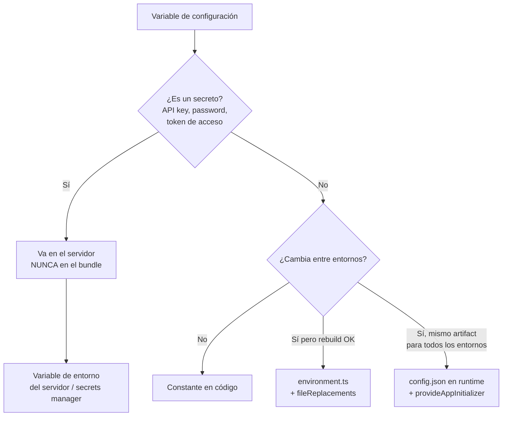

# Capítulo 35 - Parte 1: Configuración de entornos: environment.ts y variables de entorno

> **Parte 1 de 4** · Capítulo 35 · PARTE XIV - Arquitectura y Patrones Avanzados

Toda aplicación real necesita comportarse de forma diferente según dónde se ejecuta: en desarrollo apuntamos a una API local, en staging a una API de pruebas, y en producción a los servidores reales. Angular ofrece varias estrategias para gestionar esta variabilidad. Veamos cuándo usar cada una y cómo evitar el error más común: meter secretos en el bundle del cliente.

## El enfoque clásico: `environment.ts`

Angular CLI genera por defecto dos archivos de entorno en `src/environments/`:

```typescript
// src/environments/environment.ts - para desarrollo
export const environment = {
  produccion: false,
  apiUrl: 'http://localhost:3000/api',
  sentryDsn: '',
  logLevel: 'debug',
};
```

```typescript
// src/environments/environment.prod.ts - para producción
export const environment = {
  produccion: true,
  apiUrl: 'https://api.miapp.com',
  sentryDsn: 'https://abc123@sentry.io/456',
  logLevel: 'error',
};
```

El mecanismo que hace funcionar esto es `fileReplacements` en `angular.json`. Al construir con `--configuration=production`, Angular CLI reemplaza `environment.ts` por `environment.prod.ts` antes de compilar:

```json
// angular.json (fragmento)
{
  "configurations": {
    "production": {
      "fileReplacements": [
        {
          "replace": "src/environments/environment.ts",
          "with": "src/environments/environment.prod.ts"
        }
      ]
    },
    "staging": {
      "fileReplacements": [
        {
          "replace": "src/environments/environment.ts",
          "with": "src/environments/environment.staging.ts"
        }
      ]
    }
  }
}
```

Para usar el environment en cualquier parte del código, lo importamos directamente:

```typescript
// api.service.ts
import { inject, Injectable } from '@angular/core';
import { HttpClient } from '@angular/common/http';
import { Observable } from 'rxjs';
import { environment } from '../environments/environment';

@Injectable({ providedIn: 'root' })
export class ApiService {
  private readonly http = inject(HttpClient);
  private readonly baseUrl = environment.apiUrl;

  obtenerProductos(): Observable<unknown[]> {
    return this.http.get<unknown[]>(`${this.baseUrl}/productos`);
  }
}
```

### La limitación fundamental

El problema crítico de este enfoque es que los valores se **hornean en el bundle** durante el build. No es posible cambiar la `apiUrl` después de compilar sin hacer un nuevo build. En un pipeline CI/CD típico donde el mismo artefacto (imagen Docker, bundle S3) se despliega primero en staging y luego en producción, este modelo no funciona.

Además, si alguien guarda una API key o secreto en el environment y hace commit del archivo, ese secreto queda en el repositorio. Y aunque no esté en git, igual termina en el bundle JavaScript que cualquier usuario puede leer en DevTools.

## La alternativa avanzada: configuración en runtime

El patrón profesional es cargar la configuración desde un endpoint HTTP al arrancar la aplicación, antes de que se inicialice cualquier componente.

Primero, definimos una interfaz tipada para la configuración:

```typescript
// app-config.model.ts
export interface AppConfig {
  apiUrl: string;
  sentryDsn: string;
  logLevel: 'debug' | 'info' | 'warn' | 'error';
  featureFlags: {
    nuevoDashboard: boolean;
    chatBeta: boolean;
  };
}
```

Creamos un `InjectionToken` para inyectarla en cualquier parte del árbol de dependencias:

```typescript
// app-config.token.ts
import { InjectionToken } from '@angular/core';
import { AppConfig } from './app-config.model';

export const APP_CONFIG = new InjectionToken<AppConfig>('APP_CONFIG');
```

El servicio que carga la configuración desde el servidor:

```typescript
// config.service.ts
import { inject, Injectable } from '@angular/core';
import { HttpClient } from '@angular/common/http';
import { firstValueFrom } from 'rxjs';
import { AppConfig } from './app-config.model';

@Injectable({ providedIn: 'root' })
export class ConfigService {
  private readonly http = inject(HttpClient);
  private config: AppConfig | null = null;

  async cargar(): Promise<void> {
    // El servidor devuelve /assets/config.json con la config del entorno
    // Este archivo NO va en git; el servidor lo sirve dinámicamente
    this.config = await firstValueFrom(
      this.http.get<AppConfig>('/assets/config.json')
    );
  }

  obtener(): AppConfig {
    if (!this.config) {
      throw new Error(
        'ConfigService.cargar() debe llamarse antes de obtener la config'
      );
    }
    return this.config;
  }
}
```

## `provideAppInitializer`: el gancho perfecto

Angular 17+ introduce `provideAppInitializer` como reemplazo moderno de `APP_INITIALIZER`. Úsalo en `app.config.ts`:

```typescript
// app.config.ts
import { ApplicationConfig, provideAppInitializer, inject } from '@angular/core';
import { provideRouter } from '@angular/router';
import { provideHttpClient } from '@angular/common/http';
import { ConfigService } from './config.service';
import { APP_CONFIG } from './app-config.token';
import { appRoutes } from './app.routes';

export const appConfig: ApplicationConfig = {
  providers: [
    provideRouter(appRoutes),
    provideHttpClient(),
    // Carga la configuración ANTES de que se inicie la app
    provideAppInitializer(() => inject(ConfigService).cargar()),
    // Una vez cargada, la exponemos como token inyectable
    {
      provide: APP_CONFIG,
      useFactory: () => inject(ConfigService).obtener(),
      deps: [ConfigService],
    },
  ],
};
```

Ahora cualquier servicio puede inyectar la config directamente:

```typescript
// api.service.ts
import { inject, Injectable } from '@angular/core';
import { HttpClient } from '@angular/common/http';
import { APP_CONFIG } from './app-config.token';

@Injectable({ providedIn: 'root' })
export class ApiService {
  private readonly http = inject(HttpClient);
  private readonly config = inject(APP_CONFIG);

  obtenerProductos() {
    return this.http.get(`${this.config.apiUrl}/productos`);
  }
}
```

## Variables de entorno en CI/CD con build-time injection

Cuando queremos inyectar variables en el momento del build (sin un servidor de configuración), esbuild ofrece `--define`:

```bash
# En el pipeline de CI/CD
ng build --configuration=production \
  --define='process.env.API_URL="https://api.miapp.com"' \
  --define='process.env.SENTRY_DSN="https://abc@sentry.io/123"'
```

En el código TypeScript, declaramos esas variables globales:

```typescript
// global.d.ts
declare const process: {
  env: {
    API_URL: string;
    SENTRY_DSN: string;
  };
};
```

```typescript
// environment.ts (generado dinámicamente o con defaults)
export const environment = {
  produccion: true,
  apiUrl: process.env['API_URL'] ?? 'http://localhost:3000',
  sentryDsn: process.env['SENTRY_DSN'] ?? '',
};
```

## Regla de oro: nunca secretos en el bundle del cliente



El cliente es inherentemente público. Todo lo que está en el bundle JavaScript puede ser visto por cualquier persona con DevTools. Las API keys de servicios externos (Stripe, AWS, Google Maps con restricciones de dominio son la excepción) deben vivir en el servidor y exponerse al cliente solo a través de endpoints autenticados.

## Estrategia recomendada por caso de uso

Para una URL de API que cambia por entorno y se despliega como artifact único: usar `config.json` en runtime con `provideAppInitializer`. Para flags de feature que cambian con frecuencia: usar un servicio de feature flags (LaunchDarkly, Unleash, o un endpoint propio) cargado en `provideAppInitializer`. Para configuración estática que no cambia entre builds del mismo entorno: `environment.ts` con `fileReplacements` es perfectamente válido. Para secretos: nunca en el cliente, punto.

## Puntos clave

- `fileReplacements` en `angular.json` intercambia `environment.ts` por su variante de producción al hacer build, pero los valores quedan fijos en el bundle.
- `provideAppInitializer(() => inject(ConfigService).cargar())` carga la configuración desde un endpoint HTTP antes de inicializar la app, permitiendo el mismo artifact en múltiples entornos.
- `InjectionToken<AppConfig>` con `APP_CONFIG` permite inyectar la configuración de forma tipada en cualquier servicio sin acoplar al `ConfigService`.
- Las variables del cliente son públicas: API keys, passwords y tokens de acceso **nunca** deben ir en el bundle JavaScript.
- esbuild `--define` permite inyectar valores en build-time desde el pipeline de CI/CD sin archivos de environment en el repositorio.

## ¿Qué sigue?

Con la configuración de entornos clara, construiremos el pipeline de CI/CD completo con GitHub Actions: build, tests, linting y deploy automático a distintas plataformas.
